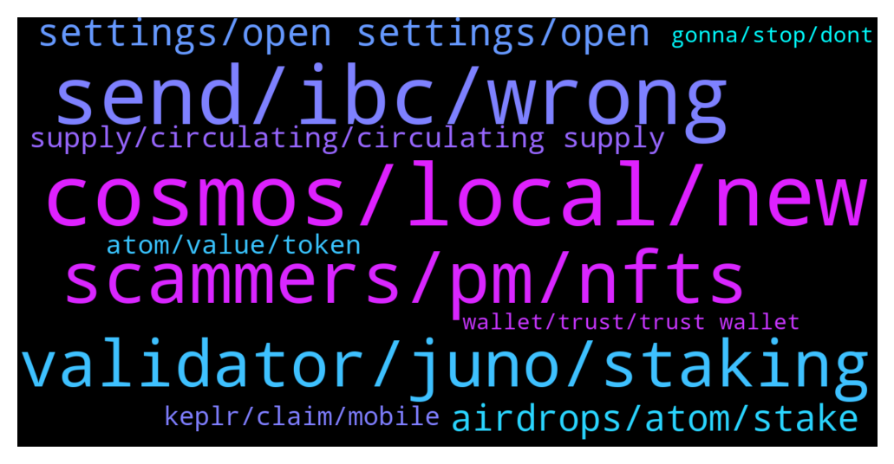

# **@cosmosproject**
 ## Analysis for **2022-02-05** - **2022-02-06**.

---

## 📊 **Basic Stats**

**n_messages_sent**: 354

---

---

## 🔝 **Top keywords and related messages**

1. **cosmos, local, new**

    @SuperDupont44 --- *Hi Guys, Newbie coming from Dotsama to cruise a bit and take information on Cosmos 😎* **--->** [TG Discussion](https://t.me/cosmosproject/486151)

    @cakiecakes --- *I would have installed it if not for the persistent issues.* **--->** [TG Discussion](https://t.me/cosmosproject/486236)

    @JaxYeo --- *Is Jea Kwon still head of developer of cosmos?* **--->** [TG Discussion](https://t.me/cosmosproject/486706)

    @Adrian --- *I am new here...I'm having trouble buying cosmos with my ethereum  Pls I need honest guide not scammers 🙏* **--->** [TG Discussion](https://t.me/cosmosproject/486166)

    @v_vacant --- *anyone update cosmostation v1.5.36 (iOS) and instantly crash ?* **--->** [TG Discussion](https://t.me/cosmosproject/486597)

    @AtomDragon --- *Agree. The epitome of a cosmonaut* **--->** [TG Discussion](https://t.me/cosmosproject/486047)

2. **send, ibc, wrong**

    @CosmonautaEspacial --- *Hey guys, somebody knows if in cosmos network can happen to send tx to wrong chain or wrong address or something similar and loss the coins forever? I don't mean to send to somebody wrong and he keep and use them, I mean to get unaccessible forever because sending or doing something wrong (for sure if I loss my words or type wrong seeds and can't restore can happen I loss them forever, but I mean doing failure in tx)* **--->** [TG Discussion](https://t.me/cosmosproject/486103)

    @Cordtus --- *I've seen a really messed up ibc transfer that should never have  even been possible to attempt and it still got returned lol. It always comes back. The system works.. Eventually :)* **--->** [TG Discussion](https://t.me/cosmosproject/486533)

    @Gustavo --- *Hi, I sent coins using a IBC transfer, already did this many times, I am no newbie to Cosmos. But one of the txs I made today, it was successful, but the final part of the tx log ("IBC Progress") is missing, and the coins did not show up in the recipient wallet. Already an hour has passed, is this delay normal? I have never experienced a delay like this. Thanks for the attention* **--->** [TG Discussion](https://t.me/cosmosproject/486528)

    @Cordtus --- *It can happen. It will return though. I've had it take 2 days once even...* **--->** [TG Discussion](https://t.me/cosmosproject/486529)

    @Galadrin --- *if you send to the wrong address and nobody have the keys, they are lost yes* **--->** [TG Discussion](https://t.me/cosmosproject/486104)

    @CosmonautaEspacial --- *Are you sure about? I mean, type something wrong and send to wrong address is almost impossible or even impossible* **--->** [TG Discussion](https://t.me/cosmosproject/486106)

3. **scammers, pm, nfts**

    @Mcrpty --- *We've got a hive scammers in here. Several have already reached out to me claiming to be admins. Admins will NEVER PM FIRST* **--->** [TG Discussion](https://t.me/cosmosproject/486093)

    @NikoDMT --- *If anyone is currently working on bringing NFTs to the cosmos ecosystem - here's what NOT to do. Also in case anyone is interested in seeing how much of a scam/joke/mockery OpenSea's NFT marketplace is - feel free to explore  https://moxie.org/2022/01/07/web3-first-impressions.html* **--->** [TG Discussion](https://t.me/cosmosproject/486184)

    @G --- *I use Crypto.con but they only give 5%. Do those mentioned above give more?* **--->** [TG Discussion](https://t.me/cosmosproject/485870)

    @CosmonautaEspacial --- *Scammers, everything what you do will come back to you, if you do good for somebody, will come back to you, if you do wrong things maybe you steal to somebody but that money will be the worst thing what happens to you if you look in long-term, the ego just want to have more in easy way, but everything will come back to you, be good person if you want to live feeling peace and life will be brightfull, is unacceptable ask something serious and get 3 or 4 scammers messages. Like if the money will bring you the happiness... What a stupid thinking...* **--->** [TG Discussion](https://t.me/cosmosproject/486115)

    @DAD_DEFI --- *Hi daniela. Is likecoin legit chain? Just asking for my wallets security. 🙂* **--->** [TG Discussion](https://t.me/cosmosproject/486078)

    @Adrian --- *I'm not interested in any claim, I just want to safe some funds in crypto please🙏* **--->** [TG Discussion](https://t.me/cosmosproject/486189)

4. **validator, juno, staking**

    @seny --- *that was so vague. You need to create demand on a token to increase value. I get the idea of staking driving demand but what makes people want to stake? Wats first movers advantage? Whats various use cases?* **--->** [TG Discussion](https://t.me/cosmosproject/486856)

    @ggwashinton1 --- *So...JUNO is 30 bucks......staking is 117% apr. This means if you have 1000 juno , you now have a 30k salary?* **--->** [TG Discussion](https://t.me/cosmosproject/486626)

    @ggwashinton1 --- *You will probably like Juno then* **--->** [TG Discussion](https://t.me/cosmosproject/486159)

    @SuperDupont44 --- *Quick question, do I need to connect Kepler wallet to Junoswap to see APR on the pools ? There are all to 0% when browsing the app without wallet connection...* **--->** [TG Discussion](https://t.me/cosmosproject/486428)

    @rosanne_89 --- *you'll have more options on the DEXes through keplr. not specifically staking related :)  Just make sure not to pick an exchange validator, one that takes some commission, ideally outside the top 10* **--->** [TG Discussion](https://t.me/cosmosproject/486457)

    @ZoltanAtom --- *Hi there,yes it’s the same. Also Please join Juno community;  https://t.me/JunoNetwork* **--->** [TG Discussion](https://t.me/cosmosproject/486251)

5. **settings, open settings, open**

    @NikoDMT --- *Open settings - go to security - select groups set to: my contacts  Open settings - go to data and storage -turn of automatic media download for all options including media and gifs Open settings - go to privacy and security - phone number set to: nobody  Open settings - go to privacy and security - phone calls set to: nobody* **--->** [TG Discussion](https://t.me/cosmosproject/486193)

    @Adrian --- *I dont have my brother around...please how can I go about with this. I don't want to be victimized by these fools 🙏* **--->** [TG Discussion](https://t.me/cosmosproject/486186)

    @AtomJazz --- *Block him and change your settings so people will be unable to call you* **--->** [TG Discussion](https://t.me/cosmosproject/486182)

    @Adrian --- *I was only able to turn off calls...the others got too complicated for me...lolz* **--->** [TG Discussion](https://t.me/cosmosproject/486205)

    @Eric --- *Just block and report them all* **--->** [TG Discussion](https://t.me/cosmosproject/486208)

    @NikoDMT --- *You're just setting the settings up such that either nobody or only your direct contacts can interact with you and the rest can fuck off, which from what I gather is exactly what you want* **--->** [TG Discussion](https://t.me/cosmosproject/486207)

6. **airdrops, atom, stake**

    @MadlyGo0d --- *in order to participate in airdrops i need only to stake atom?* **--->** [TG Discussion](https://t.me/cosmosproject/486701)

    @Mcrpty --- *Please what is the minimum amount of atom I need to stake in order to be eligible for airdrops? Thanks* **--->** [TG Discussion](https://t.me/cosmosproject/486080)

    @Babyy123 --- *Pls what's the minimum atom to stake to be eligible for airdrops? 🙏* **--->** [TG Discussion](https://t.me/cosmosproject/486780)

    @OBAMEZE --- *How many atom do I need to stake to be getting airdrop?* **--->** [TG Discussion](https://t.me/cosmosproject/486328)

    @dnzvlkn --- *Ok next question for atom staters how can we learn that there is an airdrop for atom stakes... Do you share here or just medium... Is there a platform for that? How will we know that there is an airdrop* **--->** [TG Discussion](https://t.me/cosmosproject/486666)

    @jarhead_0352 --- *Keep them there. Staking atom is a prime criteria for airdrops.* **--->** [TG Discussion](https://t.me/cosmosproject/485888)

7. **supply, circulating, circulating supply**

    @Dream --- *I wanna figure out if the increase of Circulating supply is sudden. Therefore, I gotta find the chart to see the trend. If the circulating supply is increased crazily suddenly, it's too scary* **--->** [TG Discussion](https://t.me/cosmosproject/486732)

    @AtomJazz --- *You can draw it yourself. Going from 255M in 2019 to 287M now in 2022. There were no magic unlockings, only controlled inflation* **--->** [TG Discussion](https://t.me/cosmosproject/486756)

    @TicoJohnny --- *Yep, based on max supply* and initial supply and demand* **--->** [TG Discussion](https://t.me/cosmosproject/486027)

    @Dream --- *the circulating supply issue hasn't solved ... any expert here? any data to show the change of circulating supply ?* **--->** [TG Discussion](https://t.me/cosmosproject/486787)

    @Dream --- *any correct chart of supply for reference? it's so scary after looking this chart@@* **--->** [TG Discussion](https://t.me/cosmosproject/486726)

    @nanedn --- *Sorry, I was referring myself to that chart* **--->** [TG Discussion](https://t.me/cosmosproject/486053)

8. **atom, value, token**

    @JayusJay --- *Binance can't seem to handle withdrawal of atoms quickly. Is it just me or is someone also experiencing this?* **--->** [TG Discussion](https://t.me/cosmosproject/485905)

    @Dream --- *I am a die-hard fans of atom but recently i saw that scary change, which is like FED :(* **--->** [TG Discussion](https://t.me/cosmosproject/486742)

    @cakiecakes --- *I'm a big picture guy so if any of those new projects do well, ATOM will do well.* **--->** [TG Discussion](https://t.me/cosmosproject/486239)

    @Arafat --- *Good morning  Can anyone please tell me that ATOM are mining??* **--->** [TG Discussion](https://t.me/cosmosproject/486625)

    @Dream --- *hey, anyone knows why the supply of atom suddenly rose for 26.5% on* **--->** [TG Discussion](https://t.me/cosmosproject/486722)

    @AtomJazz --- *Value comes from growing network effect and from ability of the ATOM stakeholders to take the advantage of the first mover advantage and incorporate that value into various usecases* **--->** [TG Discussion](https://t.me/cosmosproject/486847)

9. **keplr, claim, mobile**

    @GW --- *How do you claim on Keplr? Sorry for the silly question.* **--->** [TG Discussion](https://t.me/cosmosproject/485896)

    @jarhead_0352 --- *No. I claim every Friday night on keplr* **--->** [TG Discussion](https://t.me/cosmosproject/485895)

    @AtomJazz --- *You just need to connect your Keplr wallet to https://app.nomic.io/ There's no transferring anything* **--->** [TG Discussion](https://t.me/cosmosproject/486282)

    @Maximus --- *I've already told them, only keplr hasn't said it yet, thank you. This should not be solved until it is updated.* **--->** [TG Discussion](https://t.me/cosmosproject/486010)

    @ggwashinton1 --- *Or just withdraw it directly to keplr terra address* **--->** [TG Discussion](https://t.me/cosmosproject/485975)

    @TicoJohnny --- *On Keplr PC? You open the app, select your token and press claim.* **--->** [TG Discussion](https://t.me/cosmosproject/485899)

10. **wallet, trust, trust wallet**

    @Adrian --- *Trust wallet and metamask I think* **--->** [TG Discussion](https://t.me/cosmosproject/486194)

    @Matt_Blocks_United --- *Trust wallet is simple to use, but you'll need to use Keplr to claim your airdrops. @CHRISKOIN* **--->** [TG Discussion](https://t.me/cosmosproject/486266)

    @Eric --- *What Wallet are you connected to ?* **--->** [TG Discussion](https://t.me/cosmosproject/486190)

    @prash2226 --- *Which wallet is best for cosmos staking to get airdrops?* **--->** [TG Discussion](https://t.me/cosmosproject/486155)

    @Matt_Blocks_United --- *Trust wallet is buggy. It really is best to use a Cosmos-native wallet, like Keplr. It's no problem though. You can simply import your seed phrase into Keplr. Then you'll use Keplr to manage your Cosmos tokens and you can keep using Trust wallet to manage your other tokens.  It's especially important to use Keplr if you want to claim airdrops.  Here's our tutorial that shows how to import Exodus, Atomic and Trust wallets into Keplr: https://blocksunited.com/import-exodus-wallet-into-keplr/* **--->** [TG Discussion](https://t.me/cosmosproject/486403)

    @TicoJohnny --- *I don’t actually have much experience with keystore on Irisnet, can I recommend that you ask in the Irisnet channel?  If you have your key store file, you should be able to import it into Rainbow wallet using this guide: https://medium.com/irisnet-blog/much-safer-keystore-import-export-function-is-added-to-rainbow-v2-4-5e8d9e0723cc* **--->** [TG Discussion](https://t.me/cosmosproject/486008)

