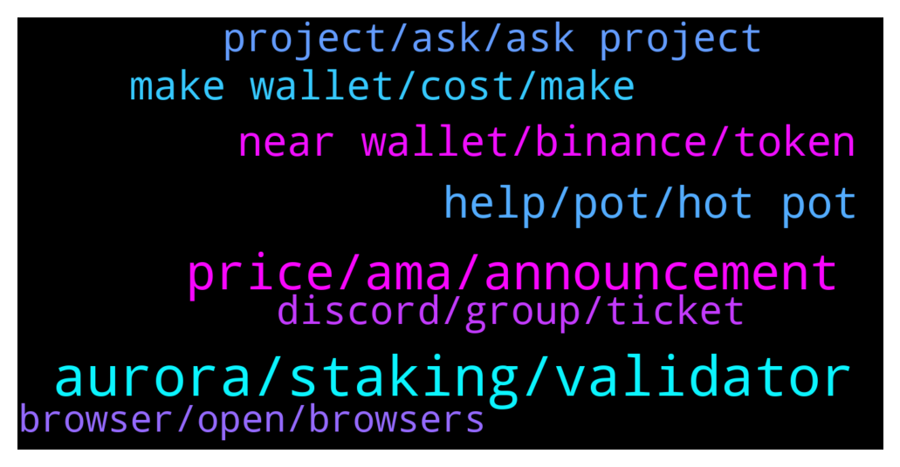

# **@cryptonear**
 ## Analysis for **2022-02-05** - **2022-02-06**.

---

## 📊 **Basic Stats**

**n_messages_sent**: 372

---

---

## 🔝 **Top keywords and related messages**

1. **aurora, staking, validator**

    @c_hinmay --- *How to get staking rewards in aurora?* **--->** [TG Discussion](https://t.me/cryptonear/326896)

    @leoma98 --- *Thrilled to announce that Meta Pool, is expanding into Aurora! 🚀  https://twitter.com/meta_pool/status/1489805919760392196* **--->** [TG Discussion](https://t.me/cryptonear/326626)

    @avshevchenko --- *Hey, everyone. Aurora has an emergency update. Please read this thread: https://twitter.com/AlexAuroraDev/status/1490353255817302016* **--->** [TG Discussion](https://t.me/cryptonear/327595)

    @NearFritz --- *No worries we are here to be helpful, all the best.  And I will recommend you to take a look on Metapool.app 🤘 It is the best way of doing staking from my point of view of course* **--->** [TG Discussion](https://t.me/cryptonear/326545)

    @oppzsmoKe --- *Do I add this to the farm or I have to select pools first* **--->** [TG Discussion](https://t.me/cryptonear/327453)

    @ieatapple --- *does this means i can use my StNear to farm for Aurora token? I was on the verge of putting it with Ref Finance.* **--->** [TG Discussion](https://t.me/cryptonear/326644)

2. **price, ama, announcement**

    @larry_lang --- *Ah my bad 14-20 Feb , sorry about that@@* **--->** [TG Discussion](https://t.me/cryptonear/327503)

    @NearFritz --- *It should take like 1 second to be confirmed 🤟* **--->** [TG Discussion](https://t.me/cryptonear/327081)

    @Lalangbuccu06 --- *Hello Admin. When will Rewards going to be distributed for Cheddar ama?* **--->** [TG Discussion](https://t.me/cryptonear/327364)

    @Postpuncher --- *do we have a major recent news on near?* **--->** [TG Discussion](https://t.me/cryptonear/326889)

    @Vampire20011380 --- *Do we have an editor here?* **--->** [TG Discussion](https://t.me/cryptonear/327116)

    @trustme45 --- *Can anyone share the release schedule of coinlist buyers* **--->** [TG Discussion](https://t.me/cryptonear/327295)

3. **help, pot, hot pot**

    @larry_lang --- *Building my own frozen fortress lol=]]]* **--->** [TG Discussion](https://t.me/cryptonear/327486)

    @larry_lang --- *hehe my plan it's to shut in and make some hot pot to eat for the meal=)) nothings suit a cold day better than a hot pot=))* **--->** [TG Discussion](https://t.me/cryptonear/327216)

    @larry_lang --- *The heater doesn help much tbh=]]]* **--->** [TG Discussion](https://t.me/cryptonear/327490)

    @butola_ravi --- *Same sir although it's Sunny day today* **--->** [TG Discussion](https://t.me/cryptonear/327213)

    @rahulgoel007 --- *Just came for my duty ✌️* **--->** [TG Discussion](https://t.me/cryptonear/326752)

    @bailey_12 --- *GM guys, hope you are having a great weekend!!!* **--->** [TG Discussion](https://t.me/cryptonear/326593)

4. **near wallet, binance, token**

    @AbuZakariya09 --- *Hi can anyone help.  NEAR Wallet  Can I move some hapi tokens from CEX to near wallet or I need to do some bridging.  Thanks in advance* **--->** [TG Discussion](https://t.me/cryptonear/326911)

    @bailey_12 --- *I recommend to use KuCoin, OkCoin or crypto(dot)com to transfer your Near* **--->** [TG Discussion](https://t.me/cryptonear/326962)

    @cuiking --- *How can I swap to usd in near wallet* **--->** [TG Discussion](https://t.me/cryptonear/326445)

    @shillerpack --- *I can't locate mint button in my near wallet* **--->** [TG Discussion](https://t.me/cryptonear/326702)

    @OlaitanOla --- *I can't send my near coins out* **--->** [TG Discussion](https://t.me/cryptonear/326507)

    @richiebuka --- *This two account are of same phrases but the first account was used to activate wallet and can't send out the $near token in the wallet out* **--->** [TG Discussion](https://t.me/cryptonear/326529)

5. **make wallet, cost, make**

    @Parsa_x0 --- *Is this cost deposited in the team wallet or is it burned or what?* **--->** [TG Discussion](https://t.me/cryptonear/327194)

    @Parsa_x0 --- *I have an important question, when we deposit 0.1 Near to make a wallet, is this amount of money to make a wallet?  And it will not be displayed in the wallet?* **--->** [TG Discussion](https://t.me/cryptonear/327181)

    @Parsa_x0 --- *Hi, I had a question, do we have to deposit 0.1 Near to make a wallet?* **--->** [TG Discussion](https://t.me/cryptonear/327057)

    @Parsa_x0 --- *However, I thought this would also benefit the team because it is a great wallet, but it does not seem to benefit the team.* **--->** [TG Discussion](https://t.me/cryptonear/327197)

    @Parsa_x0 --- *We know the benefits of making a wallet are simple letters instead of a few words, that's right, I want to know if this is the cost of making a wallet?   And it is deposited in the Near box?* **--->** [TG Discussion](https://t.me/cryptonear/327182)

    @Successdigit --- *What is the cost for customize wallet address?* **--->** [TG Discussion](https://t.me/cryptonear/326769)

6. **project, ask, ask project**

    @larry_lang --- *this guy Ghazian got some gold token and were asking for the source of it, so i just sent him the annoucement of that project* **--->** [TG Discussion](https://t.me/cryptonear/327318)

    @larry_lang --- *u can look up for it in this link. https://coinlist.co/near* **--->** [TG Discussion](https://t.me/cryptonear/327298)

    @larry_lang --- *hmm can u ask the project directly about it?* **--->** [TG Discussion](https://t.me/cryptonear/327279)

    @larry_lang --- *Since from what im seeing the account related to your work as well* **--->** [TG Discussion](https://t.me/cryptonear/327303)

    @larry_lang --- *well then i think @bailey_12 would have more detail about this since he is working on reddit platform* **--->** [TG Discussion](https://t.me/cryptonear/327376)

    @susugandul --- *I'm interested, I've participated and I fully support this project* **--->** [TG Discussion](https://t.me/cryptonear/327246)

7. **discord, group, ticket**

    @GeorgePro1 --- *Metapool has no telegram join their discord and ask all your questions they will be glad to help   https://discord.gg/H36tqQbX* **--->** [TG Discussion](https://t.me/cryptonear/326658)

    @Ghazian --- *It's hard to get into their Discord* **--->** [TG Discussion](https://t.me/cryptonear/327415)

    @larry_lang --- *https://discord.gg/SBRVK5zT can u try again on the discord server?* **--->** [TG Discussion](https://t.me/cryptonear/327414)

    @larry_lang --- *or go to the discord and send them to others wwho need it* **--->** [TG Discussion](https://t.me/cryptonear/327393)

    @NearFritz --- *You can open a ticket on discord, #custom-ticket channel* **--->** [TG Discussion](https://t.me/cryptonear/327126)

    @NearFritz --- *You can go to jobs channel on discord and even open web sandbox too* **--->** [TG Discussion](https://t.me/cryptonear/327118)

