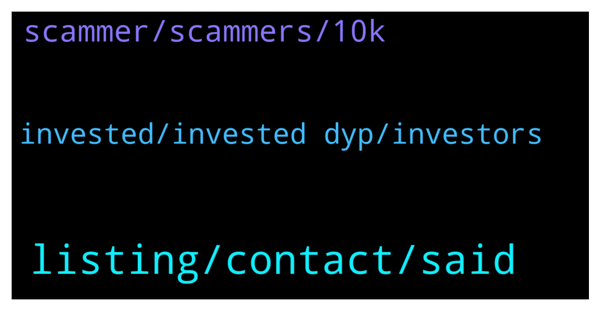

# **@dypfinance**
 ## Analysis for **2022-02-05** - **2022-02-06**.

---

## 📊 **Basic Stats**

**n_messages_sent**: 70

---

---

## 🔝 **Top keywords and related messages**

1. **listing, contact, said**

    @Vl_investor --- *Hi Dhoni, would like to see new information from the team on the progress of the project in the coming days in accordance with the roadmap, everyone wants to see the information, many are nervous, I know, but nevertheless we stay with you and always believe and support the team.* **--->** [TG Discussion](https://t.me/dypfinance/245052)

    @cyryp --- *Hi DYP tim i have a question. have you contact with the Tier one exchangs about listing or only submit acounts and havent any contact.?* **--->** [TG Discussion](https://t.me/dypfinance/244946)

    @alvindrajw --- *Can we exoect tier 1 exchnage listing in February?* **--->** [TG Discussion](https://t.me/dypfinance/245066)

    @Caesar | heroesofnft --- *Hello.... how do I participate in IDO pls?* **--->** [TG Discussion](https://t.me/dypfinance/244997)

    @iamJubi --- *No scheduled mint date yet. Please stay tuned it will be announced. Subscribe to the Ann channel https://t.me/dypannouncements* **--->** [TG Discussion](https://t.me/dypfinance/244902)

    @DhoniMSD516 --- *You can find them here https://dyp.finance/about 😀* **--->** [TG Discussion](https://t.me/dypfinance/244932)

2. **scammer, scammers, 10k**

    @DhoniMSD516 --- *In my initial days I got such messages too, once I almost fallen for prey 😅* **--->** [TG Discussion](https://t.me/dypfinance/244778)

    @shinigamikami --- *Yeah, have never fallen for such but mine was an elaborate hack where my pc was hacked and my keystore file was stolen back in 2017* **--->** [TG Discussion](https://t.me/dypfinance/244791)

    @prokarps --- *Good result= members aware many scammers contacting. except if many still stupid Bad result= he lossen $10k really hurt 😢* **--->** [TG Discussion](https://t.me/dypfinance/244775)

    @shinigamikami --- *Leme explain what happened to you.  A scammer contacted you acting as team then sent you a link where you inputed your wallet details, the scammer then stole your money. It wasn’t team but a scammer acting as team* **--->** [TG Discussion](https://t.me/dypfinance/244772)

    @DhoniMSD516 --- *Mate 10K$ or 1K$ it is same we team are not responsible falling for scammers, we are very sorry but we cannot help in this scenarios. We will for sure refund if there is fault on our products and it costed investors some loss, tbh we did this many times before, we refunded gas costs for many for their faults of failed transaction too. I personally helped some for some gas etc.  Scammers are everywhere that is why we keep on saying and running bot message* **--->** [TG Discussion](https://t.me/dypfinance/244769)

    @shinigamikami --- *Easy mate, losing money can make one act crazy. He just needs proper explanation and to learn* **--->** [TG Discussion](https://t.me/dypfinance/244763)

3. **invested, invested dyp, investors**

    @DhoniMSD516 --- *Hey there are no VC invested in DYP, we have multiple partners though* **--->** [TG Discussion](https://t.me/dypfinance/244930)

    @DhoniMSD516 --- *Hey a governance proposal can be made by investors anytime and if vote to burn wins DYP will be burned* **--->** [TG Discussion](https://t.me/dypfinance/245081)

    @hosimo --- *Hi, is there any DYP burning plan ?* **--->** [TG Discussion](https://t.me/dypfinance/245080)

    @Ali pajoo --- *Hi can I have the name of investing company that invested in dyp if there is any?* **--->** [TG Discussion](https://t.me/dypfinance/244927)

    @MJMuppet_JayJay --- *Heman, the Rolex give away is still open right?* **--->** [TG Discussion](https://t.me/dypfinance/244987)

    @hemanrock --- *DYP has launched in December 2020 dyp.finance  https://www.coingecko.com/en/coins/defi-yield-protocol* **--->** [TG Discussion](https://t.me/dypfinance/244998)

