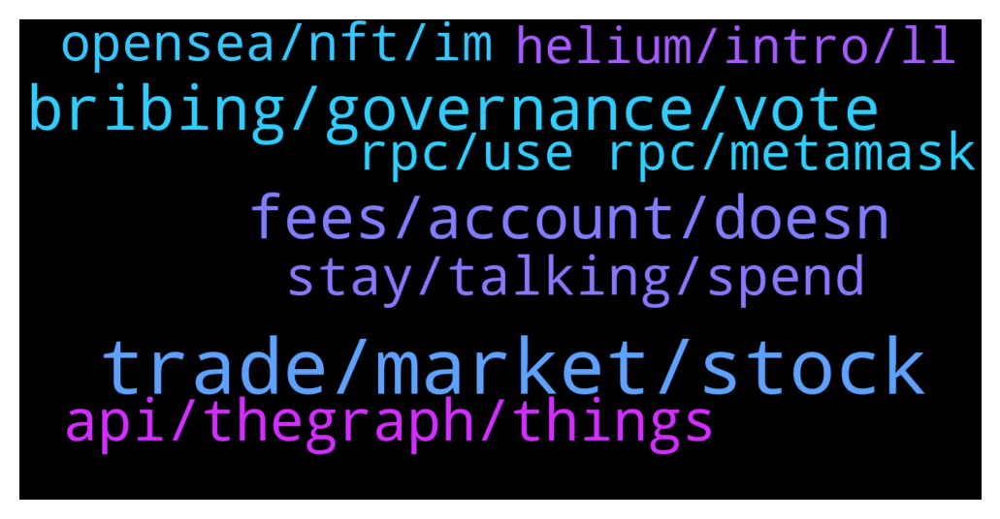

# **@lobsters_chat**
 ## Analysis for **2022-02-05** - **2022-02-06**.

---

## 📊 **Basic Stats**

**n_messages_sent**: 186

---

---

## 🔝 **Top keywords and related messages**

1. **trade, market, stock**

    @samd0000 --- *But there’s lots of after hours stock movement that’s only available for certain big institutional investors right now* **--->** [TG Discussion](https://t.me/lobsters_chat/323232)

    @AAA --- *AH trading is available to anyone with a brokerage account, eg through IB. Main reason preventing protocols from creating a 247 stock market is obv regulation, cos derivatives on securities fall under CFTC remit 100%, and spot under SEC.* **--->** [TG Discussion](https://t.me/lobsters_chat/323261)

    @samd0000 --- *Not sure what you mean through IB - I work at an investment bank and I definitely can’t trade after hours lol* **--->** [TG Discussion](https://t.me/lobsters_chat/323263)

    @investsam --- *for anyone interested in defi option vaults, we recently did a research piece showcasing the backtested PNL of these strategies: https://twitter.com/samchepal/status/1489640321352814593* **--->** [TG Discussion](https://t.me/lobsters_chat/323227)

    @samd0000 --- *I feel like it’s such an obvious thing that would get tons of volume from institutional investors* **--->** [TG Discussion](https://t.me/lobsters_chat/323229)

    @samd0000 --- *Is there any protocol that allows for 24/7 equity trading?* **--->** [TG Discussion](https://t.me/lobsters_chat/323228)

2. **bribing, governance, vote**

    @samkazemian --- *That's really awesome and interesting. What do you think about this though? There will likely be ways to not just borrow against gov tokens on Euler but just straight up get paid to vote a certain way https://www.bribe.xyz/* **--->** [TG Discussion](https://t.me/lobsters_chat/323209)

    @euler_mab --- *Ordinary lending protocols kind of are bribing protocols for governance tokens. Vitalik had a good post about this a while ago. Protected collateral on Euler is the only real option governance token holders have if they want to borrow against their tokens.* **--->** [TG Discussion](https://t.me/lobsters_chat/323212)

    @samkazemian --- *People think the bribes are just for veTokens but technically that's not true, someone like these guys just need to build the bribing system for the normal non-veTokens* **--->** [TG Discussion](https://t.me/lobsters_chat/323210)

    @xmons --- *This is just a snapshot vote and not an on-chain gov proposal tho rite?* **--->** [TG Discussion](https://t.me/lobsters_chat/323302)

    @Cryptoaq --- *How can be profitable with the funding rates?* **--->** [TG Discussion](https://t.me/lobsters_chat/323415)

    @Figu3 --- *Governance lending is all about reducing frictions to enter the game and make the process more conflictual.* **--->** [TG Discussion](https://t.me/lobsters_chat/323226)

3. **fees, account, doesn**

    @vPEPO --- *Current week performance doesn't account for fees, only the projected yield does* **--->** [TG Discussion](https://t.me/lobsters_chat/323497)

    @galaxar --- *The website at least claims to take the fees are taken into account.* **--->** [TG Discussion](https://t.me/lobsters_chat/323492)

    @galaxar --- *Their headline APYs are also before fees (unlike with ribbon/yearn), which is pretty dishonest tbh* **--->** [TG Discussion](https://t.me/lobsters_chat/323488)

    @galaxar --- *@juliankoh maybe have the annualised mngmt fees and performance fees included more explicitly in the equation?* **--->** [TG Discussion](https://t.me/lobsters_chat/323499)

    @galaxar --- *I guess the fees are baked into "Curr. Week’s Performance"* **--->** [TG Discussion](https://t.me/lobsters_chat/323496)

    @admiralape --- *So they are using pool assets amounts to determine exchange ratio pretty much just like uni router but I guess without the curve? (Because checking dai/eth exchange ratio would differ depending on the amount you check against, but then if you wanted to borrow X eth against your dai, at lower X you’d get more eth per dai than at higher which makes no sense on a lending-borrowing service). I hope they time average these pool readouts or it will be flashloaned into oblivion. Quite surprised they already provide it as a public service api.* **--->** [TG Discussion](https://t.me/lobsters_chat/323457)

4. **api, thegraph, things**

    @paurosello --- *anyone has a good alternative to TheGraph to create API? My dream scenario would be something similar to Dune but having a JSON API* **--->** [TG Discussion](https://t.me/lobsters_chat/323332)

    @sonicblend --- *There are some Graph competitors like Covalent, but at this point in time they are less decentralised or not focused on custom data (subgraphs) and indexes. Or are focused on offering more of an API to query basic things like token balances - like Moralis with Ivan Von Tech's ugly mug all over it, or UnMarshal.* **--->** [TG Discussion](https://t.me/lobsters_chat/323189)

    @jpwjs --- *Aside from network effect, why does the graph seemingly have a moat around querying the blockchain?   I can see the value and efficiency in a standardized service to add to the dev stack... but I guess what I am really asking is this:  Is it that much more painful or difficult for a project to have their own API?* **--->** [TG Discussion](https://t.me/lobsters_chat/323181)

    @coine_r --- *I suppose it depends on the type of end user you're referring to. If it's clicking buttons, you don't need TheGraph (nor do you need to pay AWS anything)* **--->** [TG Discussion](https://t.me/lobsters_chat/323195)

    @jpwjs --- *fo sho...   Im trying to think of this from an end users perspective... Running some custom script Vs being able to hit a subgraph... seems like theGraph is a much more sleek offering* **--->** [TG Discussion](https://t.me/lobsters_chat/323194)

    @batduck73 --- *I tried Covalent and it is way worse than TheGraph. In fact I didn’t find any TheGraph competitors, except StreamingFast.  But StreamingFast is even less reliable.* **--->** [TG Discussion](https://t.me/lobsters_chat/323190)

5. **stay, talking, spend**

    @Sunny --- *Cobie was talking about how ppl in his life were talking about not meeting rent and ppl in his phone not being sure if they needed a waterfall in their coming space houses to keep the O2 pure from plants* **--->** [TG Discussion](https://t.me/lobsters_chat/323466)

    @Sunny --- *Gotta be more disciplined and stay grounded in reality at times* **--->** [TG Discussion](https://t.me/lobsters_chat/323461)

    @duckdegen --- *Indeed, today i dug down that rabbit hole, and thanks to all you i figured it out. Invaluable.* **--->** [TG Discussion](https://t.me/lobsters_chat/323417)

    @duckdegen --- *I agree with that. Still learning new things every day!* **--->** [TG Discussion](https://t.me/lobsters_chat/323407)

    @alexn911 --- *Very nice read.  Retweet by Benn Eifert confirms the quality of research :-)!* **--->** [TG Discussion](https://t.me/lobsters_chat/323266)

    @samd0000 --- *I feel like I’m missing a lot of context here* **--->** [TG Discussion](https://t.me/lobsters_chat/323245)

6. **opensea, nft, im**

    @xmons --- *Yeah nfts usually don't use opensea as their metadata uri unless they were minted on opensea* **--->** [TG Discussion](https://t.me/lobsters_chat/323419)

    @SpikeSpiege1 --- *1 issue is like with infura, opensea is a single point of failure since nfts draw data from their api I believe. But gives them a big monopoly. Right now all looksrare volume is wash trading for rewards* **--->** [TG Discussion](https://t.me/lobsters_chat/323416)

    @egs5000 --- *for me im hyped about owning part of the revenue from the marketplace so i have been using it to list stuff and look every time i buy and sell, but there is a network effect obviously, im not going to buy a worse nft just because its on looksrare, collections still have bigger selection on opensea in pretty much all cases* **--->** [TG Discussion](https://t.me/lobsters_chat/323401)

    @michael_p3711 --- *Why not? opensea is often down regardless of looks emission right?* **--->** [TG Discussion](https://t.me/lobsters_chat/323394)

    @trgnbn --- *I saw the experiment of that guy making a NFT being shown as different (different metadata I assume) depending on what you'd yes to look at it. It was looking different from OS, form Rarible and from a wallet. In one of his latest blog post (can't find the link back sorry) he was saying that OS blocked the API calls (and delisted?) for that specific NFT and doing so the NFT was blocked everywhere.* **--->** [TG Discussion](https://t.me/lobsters_chat/323420)

    @egs5000 --- *agreed, i think its possible and i personally have been listing stuff there and looking there every time, its just the entrenched habits, opensea will need to start offering more though* **--->** [TG Discussion](https://t.me/lobsters_chat/323395)

7. **rpc, use rpc, metamask**

    @farm42 --- *Use this RPC if u r observing problems in Ethereum:  https://t.me/lobsters_chat/323348* **--->** [TG Discussion](https://t.me/lobsters_chat/323373)

    @Wuffle --- *yea Infura RPC seems to be down* **--->** [TG Discussion](https://t.me/lobsters_chat/323339)

    @juju1234534 --- *If you’re too inexperienced to navigate (barely) advanced Metamask functionality, don’t make general infrastructure comments here (which do require broad, nuanced knowledge). There are enough serious decentralization bottlenecks in this space atm, no need to throw in invalid/misleading ones.* **--->** [TG Discussion](https://t.me/lobsters_chat/323396)

    @pjsm1508 --- *oh ok, can i just use another RPC? if so, is there a list somewhere?* **--->** [TG Discussion](https://t.me/lobsters_chat/323340)

    @PKD325 --- *Do u meed POKT to use this RPC?* **--->** [TG Discussion](https://t.me/lobsters_chat/323385)

    @justsomedeveloper --- *imho if we talk about retail, no frame would be ideal. client cycles rpcs under the hood until it finds a working one and uses it. “pro mode” or whatever let’s you add custom ones.* **--->** [TG Discussion](https://t.me/lobsters_chat/323435)

