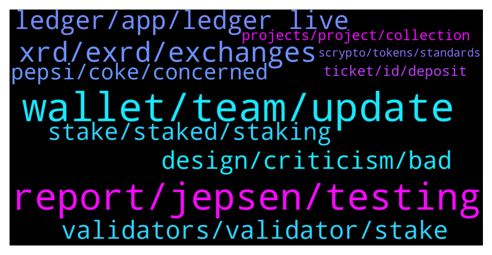

# **@radix_dlt**
 ## Analysis for **2022-02-05** - **2022-02-06**.

---

## 📊 **Basic Stats**

**n_messages_sent**: 457

---

---

## 🔝 **Top keywords and related messages**

1. **wallet, team, update**

    @. --- *Thanks.  https://github.com/radixdlt/node-runner  I got the link from this page on Github, FYI if admin wants to update this.* **--->** [TG Discussion](https://t.me/radix_dlt/351522)

    @Heisenberg --- *Why is the wallet still slow (I'm on the latest version), clicking on different tabs sometimes has a few seconds delay, typing in code or message inside a textbox sometimes has a few seconds delay.* **--->** [TG Discussion](https://t.me/radix_dlt/351329)

    @KUserM --- *Hey friends, can someone tell me why in some transaction messages there is the note “<Failed to interpret message>“? Maybe because of a missing update of the Radix Wallet? Thank you!* **--->** [TG Discussion](https://t.me/radix_dlt/351211)

    @saeglopur10 --- *Link it up to the Olympia wallet* **--->** [TG Discussion](https://t.me/radix_dlt/351887)

    @yr12345678 --- *Yes. Long story short: messages were encoded incorrectly with the old wallet and that's fixed now with the new API and wallet, but that also means your old wallet won't be able to correctly interpret new messages* **--->** [TG Discussion](https://t.me/radix_dlt/351212)

    @Ajdhughjgc --- *Regarding the latest update of remembering the  last used account to be shown after the wallet is opened, The wallet does remember the last account and gets it selected after opening, however, the shown balances upon opening the wallet are always of the first account regardless of the remembered one* **--->** [TG Discussion](https://t.me/radix_dlt/351637)

2. **report, jepsen, testing**

    @Tom --- *Also I do not understand why this report is made public, and not only used internally to fix the problems, anybody know the reason?* **--->** [TG Discussion](https://t.me/radix_dlt/351523)

    @Jacob_XRD --- *We were actually given the option not to publish when the report was commissioned, we chose to publish to maintain transparency with the community.* **--->** [TG Discussion](https://t.me/radix_dlt/351526)

    @Stuart_RadixPool --- *Jepsen Radix report on front page of Hacker News - https://news.ycombinator.com/item?id=30221187* **--->** [TG Discussion](https://t.me/radix_dlt/351510)

    @Jacob_XRD --- *Yeah its understandable to feel like that, you're not the only one. But we really believe it's important to be open with the community. If there were still security issues we would not have released it. For us the findings are important and appreciated, we wanted any issues were found and it's why we commissioned such a thorough report. Jepsen are famous for their thoroughness, which is why we chose them!* **--->** [TG Discussion](https://t.me/radix_dlt/351540)

    @No_Goats_No_Glory --- *It take balls to choose Jepsen. Especially in this early stage* **--->** [TG Discussion](https://t.me/radix_dlt/351546)

    @Avaunt --- *There's an ongoing investigation with this.  https://status.radixdlt.com/* **--->** [TG Discussion](https://t.me/radix_dlt/351361)

3. **xrd, exrd, exchanges**

    @propeterly --- *That CMC does not only need the new API, but to properly list XRD they also need it to be on at least 3 exchanges. As far as I know.* **--->** [TG Discussion](https://t.me/radix_dlt/351170)

    @aus87 --- *because our api that will be more universal with respect to exchanges listing xrd was just finished.* **--->** [TG Discussion](https://t.me/radix_dlt/351177)

    @Hokhla --- *Recently we expect another exchange?  I mean CEX* **--->** [TG Discussion](https://t.me/radix_dlt/351203)

    @Radstakes --- *Hi Dexter, if you are just planning to hold then eXRD is fine.  It has the same value as XRD as they are swappable 1:1.  However if you'd like to stake and earn emissions, then XRD is what you want.  If you have a Ledger Nano S or Nano X you can also hold your XRD there for optimal security* **--->** [TG Discussion](https://t.me/radix_dlt/351916)

    @Null_v0id --- *Ok… we REALLY need XRD on exchanges. I’m not talking price, I am just talking percentage.   Coins Bounce 50% with good volume.. XRD just isn’t out there 😢* **--->** [TG Discussion](https://t.me/radix_dlt/351654)

    @Shebeaa --- *7 months since main net launch, 0 listings. What is wrong with xrd?* **--->** [TG Discussion](https://t.me/radix_dlt/351895)

4. **ledger, app, ledger live**

    @s4f4r1 --- *Hey. Can I update my ledger if I’m still using radix sideloaded app* **--->** [TG Discussion](https://t.me/radix_dlt/351665)

    @RMK1990 --- *Question: I have sideloaded xrd application on my ledger nano S.  Do I need to Uninstall it and re-download the application from ledger live? Or just keep it as it is?  It's working normally with no issues. Just asking out of curiosity.* **--->** [TG Discussion](https://t.me/radix_dlt/351931)

    @s4f4r1 --- *I’m using a ledger with the radix app side loaded. Is it safe to update ledger live and the  ledgers firmware?* **--->** [TG Discussion](https://t.me/radix_dlt/351674)

    @diGlitterati --- *Could it be related to my ledger, where I sideloaded?* **--->** [TG Discussion](https://t.me/radix_dlt/351857)

    @TyPo1 --- *In the ledger Nano x, do we still have to turn contract data or something like that* **--->** [TG Discussion](https://t.me/radix_dlt/351937)

    @eMulah --- *Ledger live has mobile android app, I do connect my ledger nano s to the smartphone with otg cable.* **--->** [TG Discussion](https://t.me/radix_dlt/351186)

5. **validators, validator, stake**

    @ZeroPointThree --- *Hey Nate. Our validator is fairly new but we’ve been tracking Radix for a long time (I’ve personally have been following the project since 2018). Our validator node is on the latest node software and we have thorough, active monitoring to keep on top of the health of the node. Additionally, we have a backup node ready to be swapped in immediately  should our primary validator node fail. I’m the owner of the validator and personally have 14+ years of IT infrastructure and software development experience.  I’ve started working with solidity in 2015, but over time have switched looking for better ledger technology (which is why I support Radix now)… so I’m pretty familiar with decentralized ledgers and installing/maintaining nodes.  I have backup team members ready to take the helm if needed. Basically, we lie awake at night thinking of ways the validator could fail so that we can prevent that and have our delegators and Raddish.io prosper together.* **--->** [TG Discussion](https://t.me/radix_dlt/351769)

    @h0ll0wstick --- *talking about colors, it has come to my attention that there is no incentives beside shadowing the top 2 validators in the validator list. My suggestion was to use a colored grid pattern to let people know that they can stake with validators < 50 as much that with the > 50 by applying a set of colors from orange to green. The validator page is a bit bland of decentralisation promotion or very impartial which i might suggest was made on purpose and it s fair enough, thus I could imagine that color patterns are very efficient way to communicate cognitive directions towards a more evenly spread delegating  stake in the network without damaging the position of radix towards the validators. My other suggestion is why not starting the validator page from 100 to 1 instead? I am trying to find sensible ways for people to integrate good decentralisation practices.* **--->** [TG Discussion](https://t.me/radix_dlt/351946)

    @DukiMKD --- *Why are my radix stakes at a pending stake with validators* **--->** [TG Discussion](https://t.me/radix_dlt/351702)

    @NotBen --- *Capping stake just incentivizes running multiple validators* **--->** [TG Discussion](https://t.me/radix_dlt/351731)

    @ashley_tele --- *There’s 100 validators pre xi’an then no limit after, I don’t know how they will handle that jump* **--->** [TG Discussion](https://t.me/radix_dlt/351722)

    @RadixStaker --- *Your outage has cost my validators alone 24000 lost rewards due to the impact of a top 10 validator not measuring up and causing the network to slow for 48 hours.  Can you advise the community what monitoring you have in place to alert of outages? The mistake you allude to having been made should have caused your node to fail immediately... if your systems were accessible to make the mistake then they would have been available to fix it if discovered immediately. Sounds to me like you have no monitoring in place or your monitoring is ineffective. What are you doing to rectify that? Please provide the validator address of your backup node so we can verify your claim of having a backup? I am personally doubtful.* **--->** [TG Discussion](https://t.me/radix_dlt/351948)

6. **design, criticism, bad**

    @chrisijoyah --- *I get that, but is the design really that bad, it conveys the message for now at least. They could spend the next 6 months updating their branding but it might not bring as much value as 6 months of development for working towards Bablyon. The redesign can always come after.* **--->** [TG Discussion](https://t.me/radix_dlt/351442)

    @guibs --- *I don't have enough talent, it's not my job, I just notice that design isn't serious, pay a real designer* **--->** [TG Discussion](https://t.me/radix_dlt/351418)

    @guibs --- *you don't have to be Picasso to see that the design is bad* **--->** [TG Discussion](https://t.me/radix_dlt/351422)

    @guibs --- *there is still a level of incompetence in design...* **--->** [TG Discussion](https://t.me/radix_dlt/351411)

    @chrisijoyah --- *It's not really constructive criticism though, it seems like you personally don't like the design, Design can be very subjective.* **--->** [TG Discussion](https://t.me/radix_dlt/351426)

    @chrisijoyah --- *Lol and Im all about clean minimal design too, ya'll seen the Adept landing page 😏* **--->** [TG Discussion](https://t.me/radix_dlt/351445)

7. **stake, staked, staking**

    @CrypViskosity --- *Dear Radix Community, We have posted a Downtime Repost on our website for those of you who are interested in further details. Additionally, we have just created a Google Document for all of those who were delegators to Viskosity Staking during the down time and would like to receive a portion of the 10,000 XRD that has been allocated from our own wallet to be distributed to the people who were staked. If you choose not to participate because of your status as a “whale” then your generosity is appreciated and it will provide a larger compensation for some of the other delegators. There is a link to the document in the Downtime Report on our website but we will also provide it below. Please copy and paste it into your browser. https://docs.google.com/forms/d/e/1FAIpQLSe8DAC0ZlbfhiYa3m5-i7HwZdb_YawvnlHdXuUEIqKyTd2DvQ/viewform?usp=sf_link  This  link will be valid for the next 7 days (until 2/13/2022) so we can get the compensation to those affected as soon as possible. We will also continue to post this message for the next 7 days to alert as many people as we can. Thank you as always for the feedback from the Radix Community. -Viskosity Staking* **--->** [TG Discussion](https://t.me/radix_dlt/351945)

    @Radstakes --- *I would advise staking on nodes with less than 2% stake to improve decentralisation. Choose a few with high uptime. Also check out this post for some pointers: https://radixtalk.com/t/how-do-i-choose-which-validators-to-delegate-stake-to/140?u=faraz* **--->** [TG Discussion](https://t.me/radix_dlt/351683)

    @ManishMalhotra29 --- *Is there Any min number  of radix to stake* **--->** [TG Discussion](https://t.me/radix_dlt/351761)

    @Natethegreat762 --- *So how much stake is needed to pause it or double spend?* **--->** [TG Discussion](https://t.me/radix_dlt/351718)

    @Natethegreat762 --- *Thanks how will staking be once staking happens?* **--->** [TG Discussion](https://t.me/radix_dlt/351686)

    @Natethegreat762 --- *I'm looking to stake, is there any recommendations? The one mentioned earlier is good?* **--->** [TG Discussion](https://t.me/radix_dlt/351679)

8. **pepsi, coke, concerned**

    @Cpt_Charles --- *Pepsi ain't coke, that's comparing apples to pears 😮* **--->** [TG Discussion](https://t.me/radix_dlt/351470)

    @chrisijoyah --- *When you guys go to the supermarket, which brand of coke do you buy, Coca Cola, Pepsi ... 👀?* **--->** [TG Discussion](https://t.me/radix_dlt/351464)

    @guibs --- *Colors you should never pair together Colors that are close to each other on the color wheel. Pairs to avoid are green/blue, red/pink, brown/black, and purple/plum.* **--->** [TG Discussion](https://t.me/radix_dlt/351501)

    @aus87 --- *heres a shinier logo for guibs :)* **--->** [TG Discussion](https://t.me/radix_dlt/351485)

    @krypt0n1ght --- *👆this is the way to do it* **--->** [TG Discussion](https://t.me/radix_dlt/351500)

    @aus87 --- *when you are picking the spot to eat the best cheeseburger in town, are you concerned with what kind of floor tile they have in the building?  I am more concerned with the ingredients and how it tastes lol* **--->** [TG Discussion](https://t.me/radix_dlt/351409)

9. **projects, project, collection**

    @BlAzAk --- *This is a (not) small message to express my displeasure.  As you know, I have been developing tools used by the community for a few years now. GetRadix for those who knew it, airdrop scripts (DogeCube, DIX, etc...), some community projects (backend) and my own projects like XIDAR (token creator, wallet) and Radix Collection (NFTs, collection) .  All these projects only go in one direction: to promote the use of the network. The perfect example is Radix Collection which lets you earn badges based on your activity on the network. With absolutely NOTHING to gain for us. We were counting on donations made to the project with the Backer badge to recover some money (transaction fees and token creation are not free for us either). But that was, with the exception of friends, very disappointing. I remind you that everything is on the ledger, we have NO database.  So we released our NFT collection playing a role in our game. There are sales but not with the same enthusiasm as some new projects. A little disappointing I admit.  We are currently developing an NFT and token marketplace (cross projects) as well as a browser and mobile wallet. No worries, it will be deployed soon.  Regarding XIDAR, our node is among the best performers on the network thanks to Kesswitz and we take 0% fees. That doesn't stop people from staking at ALLNODES... disappointing.  Here are some projects created with the XIDAR token creator: DIX, XSEED, SAMUSKY, HOARD, ELICOIN, DREAMIX, ENTERTHERADTRIX (ALL), NATTYRADISHES, RADLABS, RADAPE, RATIX, MAFIA, RADTHINGS, RADIXVILLE, ROOTMATERIALS, RADICALPENGUINS, ROIDBOIZ, DAPPERDASHUNDS, RADSTAKES A total of 122 tokens that have been created. We only take 150 XRD in fees on each token. So we earned 18k XRD. How much have these projects generated?  We think we are invested in the community but our patience has some limits. Enriching others does not interest us. And since the official team doesn't seem to want to pay attention to the ONLY project really using their network (Radix Collection), we decided to increase the creator token fee to 2100XRD per creation. From tomorrow 00:00 (Paris).  Also, on March 1, Radix Collection will no longer be free. It will be necessary to have "Backed" 100XRD minimum or to have purchased at least 1 NFT. Of course people who already have the Backer badge will remain registered. The marketplace will be usable ONLY by people registered on RadixCollection.* **--->** [TG Discussion](https://t.me/radix_dlt/351664)

    @h0ll0wstick --- *yes however from wat i understood cedric wasn t really motivated by a business model pov but rather by this: We think we are invested in the community but our patience has some limits. Enriching others does not interest us. And since the official team doesn't seem to want to pay attention to the ONLY project really using their network.* **--->** [TG Discussion](https://t.me/radix_dlt/351917)

    @tesslerc --- *It's also a great business model. Early price is low to create interest in the tech, after people see it's useful and needed you raise fees.  Super common.* **--->** [TG Discussion](https://t.me/radix_dlt/351913)

    @RMK1990 --- *You should be glad to be involved with a transparent team.  More companies should follow suit, instead of claiming every thing is fine and having monthly multi million $$ exploits.* **--->** [TG Discussion](https://t.me/radix_dlt/351533)

    @Adam_XRD --- *To add some colour here, we love the stuff people are doing on Radix. Our entire focus is to give builders what they need to make amazing things for users - especially with Scrypto and Babylon.   There is however a really important line between paying attention and promoting. Promoting and/or endorsing is something we're extremely cautious about doing, as we strongly feel we should remain impartial, unless there is a network level reason to guide people (e.g how we suggest people don't stake to nodes with over a certain % of total stake).   We have at times referenced things people are building in the Radix report (or on individuals personal twitter accounts). This is a fine balancing act, as even in those times we have had critique that we haven't promoted project X but we did promote project Y.   Open to hearing ideas from the community on how we could do this better, while remaining impartial and fair?* **--->** [TG Discussion](https://t.me/radix_dlt/351944)

    @Simon --- *Why are there so many comments like this? I worry that there is already far too much interest in exchanges/price/advertising than development in the radix community* **--->** [TG Discussion](https://t.me/radix_dlt/351878)

10. **ticket, id, deposit**

    @chublay --- *whats the difference between deposit address and deposit id* **--->** [TG Discussion](https://t.me/radix_dlt/351285)

    @aj4269 --- *Yes, you can create a ticket and this will be the most likely reply.* **--->** [TG Discussion](https://t.me/radix_dlt/351278)

    @chublay --- *you need to make a ticket too?* **--->** [TG Discussion](https://t.me/radix_dlt/351296)

    @aj4269 --- *You'll find the id in the blockchain explorer* **--->** [TG Discussion](https://t.me/radix_dlt/351291)

    @Jacob_XRD --- *Sir that would almost certainly be a breach of labour laws.* **--->** [TG Discussion](https://t.me/radix_dlt/351400)

    @Davor --- *Yes, I went through customer support and it creates a ticket I believe* **--->** [TG Discussion](https://t.me/radix_dlt/351297)

