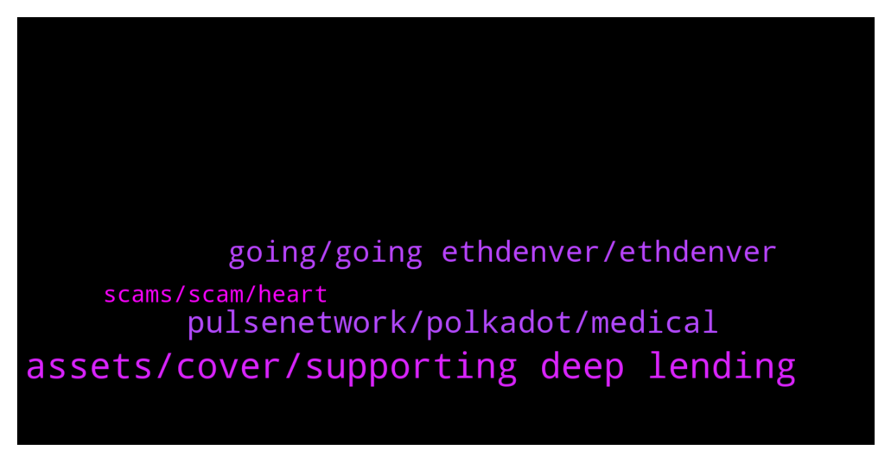

# **@shitpool**
 ## Analysis for **2022-02-05** - **2022-02-06**.

---

## 📊 **Basic Stats**

**n_messages_sent**: 112

---

---

## 🔝 **Top keywords and related messages**

1. **assets, cover, supporting deep lending**

    @wojackdegreate --- *You can’t liquidate Justin he has too much assets* **--->** [TG Discussion](https://t.me/shitpool/723319)

    @wojackdegreate --- *His collateral rate is 5 to 8%, and he has minimum 800m usdt + other assets that could cover* **--->** [TG Discussion](https://t.me/shitpool/723331)

    @ptsolorid --- *So 2omb 3omb legitimised by harry yeh making real gainz over the last 36 hours..* **--->** [TG Discussion](https://t.me/shitpool/723329)

    @wojackdegreate --- *He has a wallet right now with almost a billion usdt, then you add in the other assets lmao.. 😂* **--->** [TG Discussion](https://t.me/shitpool/723321)

    @OxZilla --- *Technically someone could liquidate his position by jacking up the price of comp before he can raise his health rating* **--->** [TG Discussion](https://t.me/shitpool/723310)

    @OxZilla --- *Terrrrrrrrible practice to supporting deep enough lending liquidity to pull that off* **--->** [TG Discussion](https://t.me/shitpool/723304)

2. **pulsenetwork, polkadot, medical**

    @Jumper87 --- *Well then the Goodnews is that Pulsenetwork would soon have an IDO. Glad it's gonna be the first healthcare project on Polkadot ecosystem.* **--->** [TG Discussion](https://t.me/shitpool/723338)

    @R0mster --- *Record breaking green dot wall though.* **--->** [TG Discussion](https://t.me/shitpool/723504)

    @Jumper87 --- *Nope it's not a shit coin, Pulsenetwork is aiming to deliver the most advanced medical care to individuals around the globe. DYOR* **--->** [TG Discussion](https://t.me/shitpool/723422)

    @Jumper87 --- *Pulsenetwork is not pulsechain my bro* **--->** [TG Discussion](https://t.me/shitpool/723425)

    @Jumper87 --- *Yeah but they really not Pulsenetwork had actually developed an healthcare app that possibly gonna access any medical information about the current infection rate.* **--->** [TG Discussion](https://t.me/shitpool/723431)

    @Jumper87 --- *Pulsenetwork is building on the Polkadot ecosystem.* **--->** [TG Discussion](https://t.me/shitpool/723423)

3. **going, going ethdenver, ethdenver**

    @DeathspellOm --- *Waiting for it to move lol* **--->** [TG Discussion](https://t.me/shitpool/723372)

    @BearishWhale --- *if it matters, it will come around.. if not. RIP your bag* **--->** [TG Discussion](https://t.me/shitpool/723465)

    @Horselorde --- *“Y u tag me I no admin here”* **--->** [TG Discussion](https://t.me/shitpool/723406)

    @Horselorde --- *No one wants to buy your merch dude* **--->** [TG Discussion](https://t.me/shitpool/723402)

    @XuvIsKing --- *Looks great to me, I only wish it was a pillow instead of a shirt* **--->** [TG Discussion](https://t.me/shitpool/723401)

    @yesbutalsono --- *I was debating going to EthDenver, maybe next year* **--->** [TG Discussion](https://t.me/shitpool/723411)

4. **scams, scam, heart**

    @BearishWhale --- *Stop shillin obvious scams. Go and listen Viagra Spam King aka Richard Heart on Whalepool ytube* **--->** [TG Discussion](https://t.me/shitpool/723342)

    @DeathspellOm --- *Do people still fall on those scams?* **--->** [TG Discussion](https://t.me/shitpool/723344)

    @BearishWhale --- *not sure if its same scam or not* **--->** [TG Discussion](https://t.me/shitpool/723436)

    @BearishWhale --- *whoever got PulseChain "interviews/promos" are the same scammers as Richard Heart is. Be aware of those mdrfckers* **--->** [TG Discussion](https://t.me/shitpool/723429)

    @Jumper87 --- *Bro this is no fucking scam, try doing some research before conclusion.* **--->** [TG Discussion](https://t.me/shitpool/723416)

    @gonubie --- *is it all scams to you?* **--->** [TG Discussion](https://t.me/shitpool/723446)

