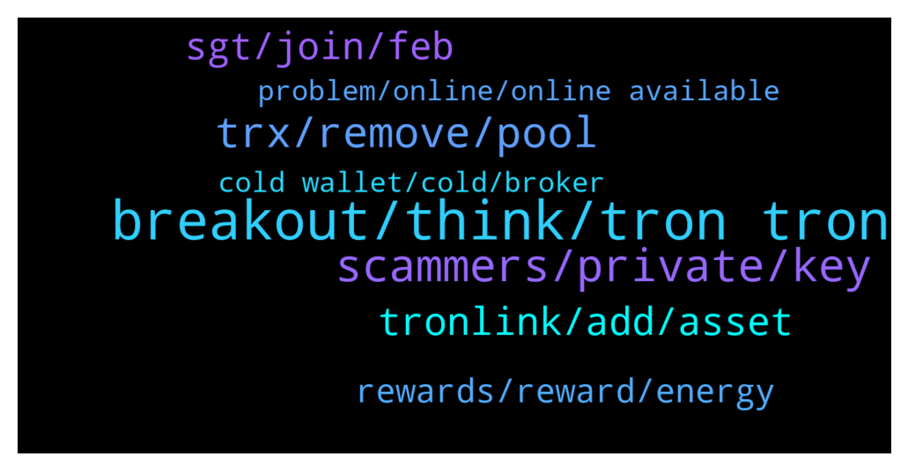

# **@tronnetworkEN**
 ## Analysis for **2022-02-05** - **2022-02-06**.

---

## 📊 **Basic Stats**

**n_messages_sent**: 180

---

---

## 🔝 **Top keywords and related messages**

1. **breakout, think, tron tron**

    @LloydMo --- *I actually thought hodlers of tron got apenft. When you hold more than 100trx* **--->** [TG Discussion](https://t.me/tronnetworkEN/3872870)

    @aledvdntht --- *Do you know how to extract tron ​​with mobile* **--->** [TG Discussion](https://t.me/tronnetworkEN/3872554)

    @rencos2 --- *waiting for the real breakout for BTT - the price action are now normally, but there should be a moment that we are going to see the real breakout, then i mean a breakout above 0,003+ to 0,005+ or more. as mainnet 2.0 coming and owner of tron doing some things - its interesting until 22-02-2022* **--->** [TG Discussion](https://t.me/tronnetworkEN/3872705)

    @clexidra --- *Hello mates, I am not new to crypto but new to Tron here... is it normal a 99% price impact, while swapping from TRX to Tronpad? 😆 What happened?* **--->** [TG Discussion](https://t.me/tronnetworkEN/3872706)

    @GhostUnderYourBed --- *Can any tron dev tell what's the top feature they are working on now?* **--->** [TG Discussion](https://t.me/tronnetworkEN/3874584)

    @Olenagh --- *I wonder 😀. How could he be expecting an airdrop for holding tron* **--->** [TG Discussion](https://t.me/tronnetworkEN/3872893)

2. **scammers, private, key**

    @agentpiki --- *Did you  1. Invest in unknown / suspicious investment?  2. Click on a telegram airdrop link?  3. Provide mnemonic / private key in any form including in google form?  4. Talk to strangers who posed as admins?  5. Swapped currency in fraudulent platform and signed unknown smart contract?  6. Clicked on suspicious link?  Answer* **--->** [TG Discussion](https://t.me/tronnetworkEN/3872694)

    @MilNoslen --- *You were already helped and given the answer. You fail to understand crypto and decentralization. Only YOU are responsible for your assets and money.* **--->** [TG Discussion](https://t.me/tronnetworkEN/3871734)

    @Moneyversac --- *No you are not. I have helped about 70 people with that already, altough they didn't even see them in their wallet until I told them how.* **--->** [TG Discussion](https://t.me/tronnetworkEN/3873778)

    @aledvdntht --- *He told me that in order to secure my wallet, I needed a password, so I did not know that he was a scammer What should I do?* **--->** [TG Discussion](https://t.me/tronnetworkEN/3872708)

    @agentpiki --- *#Tip:  1. ONLY SCAMMERS will message first.  2. BLOCK USER + REPORT SPAM immediately!  3. IF YOU BLOCK ALL PRIVATE MESSAGES, no one will get scammed.  Pls cooperate! Thanks!* **--->** [TG Discussion](https://t.me/tronnetworkEN/3874750)

    @Landi --- *Its not possible in anyway? Pay some fee to the support? Is a lot of money that move in this Crypto Platform and sometimes we need help for stupid mistakes? Please help me???* **--->** [TG Discussion](https://t.me/tronnetworkEN/3871731)

3. **trx, remove, pool**

    @Woodyj123 --- *@admin please I’m having issues in swapping my coin, I want to get Trx but I can’t swap, I’m trying to figure out the issue* **--->** [TG Discussion](https://t.me/tronnetworkEN/3872800)

    @Hhh --- *Which coin is S-NFT-TRX?  How can I turn is to TRX please?* **--->** [TG Discussion](https://t.me/tronnetworkEN/3872215)

    @benipoku --- *My bad Carlos, i wanted to say TRX trading related.  Cuz I wanna freeze my TRX for others, but I know advertising q not allowed here  Thanks!* **--->** [TG Discussion](https://t.me/tronnetworkEN/3873101)

    @crypto_chicky --- *Hi all! Where is the step by step guide on migrating my trx tokens. I know, i am super late but just found an old wallet. Many thx for help!* **--->** [TG Discussion](https://t.me/tronnetworkEN/3873769)

    @agentpiki --- *Not normal. It means the pool has not enough supply for swap order.  For tronpad, trt V1 sunswap.* **--->** [TG Discussion](https://t.me/tronnetworkEN/3872709)

    @aledvdntht --- *Excuse me, what do I need to do to transfer 30 tron to the Volt Trust for a fee?* **--->** [TG Discussion](https://t.me/tronnetworkEN/3872585)

4. **tronlink, add, asset**

    @MilNoslen --- *Add the contract address of whatever token you're trying to see* **--->** [TG Discussion](https://t.me/tronnetworkEN/3873641)

    @Fynb1 --- *Hello can anyone help please…. I sent TRC20 to my tronlink wallet and I can’t see it it’s been 7hrs* **--->** [TG Discussion](https://t.me/tronnetworkEN/3873569)

    @Fynb1 --- *I did but I don’t see it* **--->** [TG Discussion](https://t.me/tronnetworkEN/3873639)

    @MilNoslen --- *It's whatever token you're trying to add. Look it up in Tronscan.org and make sure it's the right one* **--->** [TG Discussion](https://t.me/tronnetworkEN/3873648)

    @Fynb1 --- *So I sent USDt Trc20 to my tronlink wallet on iOS but I checked and added asset but I didn’t see my usdt* **--->** [TG Discussion](https://t.me/tronnetworkEN/3873660)

    @Moneyversac --- *Click the plus sign and search after the name* **--->** [TG Discussion](https://t.me/tronnetworkEN/3873661)

5. **sgt, join, feb**

    @MilNoslen --- *Watched you like 4-5 times trying to join* **--->** [TG Discussion](https://t.me/tronnetworkEN/3872185)

    @xPommepote --- *I like this new way of ban 👍🏻* **--->** [TG Discussion](https://t.me/tronnetworkEN/3873396)

    @PiterSpain --- *🙌Calling all #TRONICS :  🥳Join and Vote for Justin Sun for a chance to win Luxury Swag Gifts! 🎁We will choose ten lucky winners!  ✅Share your voting screenshot in the comment section below ⏰Feb 4th (SGT) - Feb 14th (SGT)  https://www.votingdao.io/vote  Read more: https://twitter.com/trondao/status/1489425322692907009* **--->** [TG Discussion](https://t.me/tronnetworkEN/3874560)

    @simon866 --- *Looks like the MD boys are back in town 😂* **--->** [TG Discussion](https://t.me/tronnetworkEN/3874772)

    @aledvdntht --- *I wish I could get some money😔😔* **--->** [TG Discussion](https://t.me/tronnetworkEN/3872716)

    @aledvdntht --- *Please tell me what to do 😭😭* **--->** [TG Discussion](https://t.me/tronnetworkEN/3872678)

6. **rewards, reward, energy**

    @alpha0247 --- *I have staked for about 2 years now and I have plenty bandwidth and energy. Apart from using it to make transactions fees.  Can I use it to do anything else ? Like selling or borrowing it out* **--->** [TG Discussion](https://t.me/tronnetworkEN/3874645)

    @O_oDonnell --- *I thought you can mine and get reward* **--->** [TG Discussion](https://t.me/tronnetworkEN/3873997)

    @simon866 --- *Hi @benipoku you can rent out your energy to other users here 👍  https://www.tokengoodies.com/* **--->** [TG Discussion](https://t.me/tronnetworkEN/3873127)

    @Carlos_TRX --- *You can stake and get rewards but no mining mate 👍🏻* **--->** [TG Discussion](https://t.me/tronnetworkEN/3874351)

    @IamEatman --- *did voting rewards % for super reps go down in the past 12 months? checking out tokengoodies right now and rewards seem so little compared to before* **--->** [TG Discussion](https://t.me/tronnetworkEN/3873300)

    @Davet09 --- *Please if I stake 1077.71 Trx would I get a reward ?* **--->** [TG Discussion](https://t.me/tronnetworkEN/3873677)

7. **problem, online, online available**

    @sTONe --- *I was 2 days agou with a problem and today I remembered I have another one* **--->** [TG Discussion](https://t.me/tronnetworkEN/3873356)

    @markbenolim --- *Hi all, I ran into a problem, who is online and available now ?* **--->** [TG Discussion](https://t.me/tronnetworkEN/3874086)

    @MilNoslen --- *So then explain your problem in detail* **--->** [TG Discussion](https://t.me/tronnetworkEN/3874100)

    @MilNoslen --- *What’s the problem, you asked before but didnt follow up. Gonna assume you’re a bot* **--->** [TG Discussion](https://t.me/tronnetworkEN/3874095)

    @ramenin --- *Have we resolve your issue sir* **--->** [TG Discussion](https://t.me/tronnetworkEN/3872160)

    @vivian --- *Hi what is the problem please* **--->** [TG Discussion](https://t.me/tronnetworkEN/3871873)

8. **cold wallet, cold, broker**

    @TEX_the_soldier --- *No, I want to create cold wallet on second phone* **--->** [TG Discussion](https://t.me/tronnetworkEN/3873586)

    @Moneyversac --- *It has ERC20 deposit so it has too* **--->** [TG Discussion](https://t.me/tronnetworkEN/3873847)

    @Fynb1 --- *It’s not an exchange or wallet it’s just a regular broker account* **--->** [TG Discussion](https://t.me/tronnetworkEN/3873720)

    @simon866 --- *That would be a apenft promo and probably have to check with the Trust wallet team* **--->** [TG Discussion](https://t.me/tronnetworkEN/3872871)

    @MilNoslen --- *Just download the right one and make your own wallet* **--->** [TG Discussion](https://t.me/tronnetworkEN/3872280)

    @Fynb1 --- *From my forex broker back office* **--->** [TG Discussion](https://t.me/tronnetworkEN/3873699)

