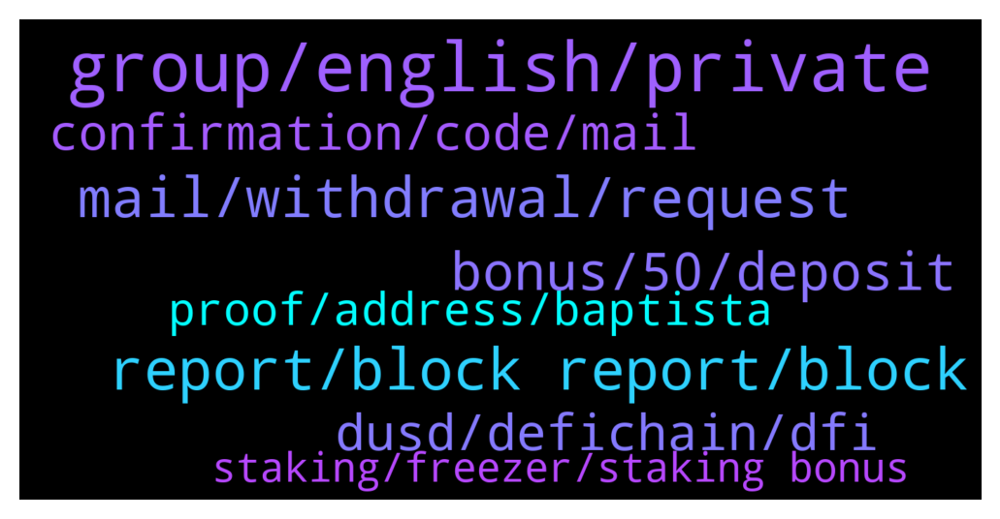

# **@CakeDeFi_EN**
 ## Analysis for **2022-02-06** - **2022-02-07**.

---

## 📊 **Basic Stats**

**n_messages_sent**: 575

---

---

## 🔝 **Top keywords and related messages**

1. **group, english, private**

    @swordfishk --- *ahhahahahha   look i didn't think of that :D* **--->** [TG Discussion](https://t.me/CakeDeFi_EN/174257)

    @KathleenBella1 --- *Hello 👋  I'M new here is there any sub group for Germany 🇩🇪  or anyone from Germany here 🤨* **--->** [TG Discussion](https://t.me/CakeDeFi_EN/173122)

    @mm_phoenix --- *this is a english chat ❤️* **--->** [TG Discussion](https://t.me/CakeDeFi_EN/173594)

    @eren_abi --- *are you the one who private messaged* **--->** [TG Discussion](https://t.me/CakeDeFi_EN/173912)

    @MehmetnuriDilek --- *Az önce geliyodu şuan gelmiyor hep banami denk gelir ya 😄😄* **--->** [TG Discussion](https://t.me/CakeDeFi_EN/173593)

    @DmgBautista --- *Hi! Sorry but this is an english speaking channel please 🙂* **--->** [TG Discussion](https://t.me/CakeDeFi_EN/174027)

2. **report, block report, block**

    @Social --- *Or it was some one else impersonating your profile? I got a DM from Fabio's profile and I blocked right away.* **--->** [TG Discussion](https://t.me/CakeDeFi_EN/173318)

    @iGhostPro --- *not even the time to ask here about the group that privately tried to lure me into fake accounts* **--->** [TG Discussion](https://t.me/CakeDeFi_EN/174148)

    @DmgBautista --- *Any scammers or fake accounts are easy to detect. They will all without exception tell you, sooner or later, to click a link, to give your access data, seed words, and so on. Under such red flag, just block and report. Just to be sure, in case any massage you receive is unsolicited, block and report! Better safe than sorry 👍* **--->** [TG Discussion](https://t.me/CakeDeFi_EN/174159)

    @Mohd --- *Admin this platform has many scarmers. You talk of not coming in DM people keep coming. And they use moderator names* **--->** [TG Discussion](https://t.me/CakeDeFi_EN/173548)

    @Brandon --- *Ok, you should work on the amount of scammers in here I am getting flooded with email requests Mehmet is definitely a scammer* **--->** [TG Discussion](https://t.me/CakeDeFi_EN/173741)

    @Jan --- *Yup got some scammers lurking around.* **--->** [TG Discussion](https://t.me/CakeDeFi_EN/173714)

3. **mail, withdrawal, request**

    @imohitss --- *@fabioandreatta  hello sir email withdrawal request not coming* **--->** [TG Discussion](https://t.me/CakeDeFi_EN/173621)

    @DmgBautista --- *Ahh ok. No problem :) hope it answered the question and sorry if you may need to perform your withdrawal again in case the email takes more than 30 minutes due to the current delay 🙂* **--->** [TG Discussion](https://t.me/CakeDeFi_EN/173890)

    @yucelbinboy --- *Hello, I do not receive an e-mail to confirm the withdrawal process. Could you help* **--->** [TG Discussion](https://t.me/CakeDeFi_EN/173606)

    @Kadirx882 --- *Is there an e-mail problem? No e-mail from the withdrawal process ?* **--->** [TG Discussion](https://t.me/CakeDeFi_EN/173780)

    @umutttay --- *Hi. I cannot receive mail from the system. It says that a confirmation e-mail has been sent for the withdrawal request, but it does not come. is there a problem?* **--->** [TG Discussion](https://t.me/CakeDeFi_EN/173587)

    @i0267 --- *i got confirmation mails and the last mail is canceled mail but i did not do this. and I did the withdrawal again.* **--->** [TG Discussion](https://t.me/CakeDeFi_EN/173823)

4. **bonus, 50, deposit**

    @zachgax --- *No, you need to put in $50 in one deposit. So if you miss the first time, the second time you must put in >$50. If you want the bonus.* **--->** [TG Discussion](https://t.me/CakeDeFi_EN/173895)

    @zachgax --- *Your bonus is not lost forever. You if you didn’t put in the full $50 on the first time, you can put in $50 the second time.* **--->** [TG Discussion](https://t.me/CakeDeFi_EN/173874)

    @LucaJacket --- *My friend did everything correctly because she received the whole bonus (welcome + 8 DFI extra)* **--->** [TG Discussion](https://t.me/CakeDeFi_EN/173254)

    @x_user_x1 --- *ok no problem . i aske if tou can change the reffereal program because most people didnt check the fee and lost their bonus forever so for me is better if bonus is cumulative so the total amount of yours deposit >50$ not just for the first deposit* **--->** [TG Discussion](https://t.me/CakeDeFi_EN/173864)

    @GRIF --- *can I participate in first deposit bonus? my account has created october 2021* **--->** [TG Discussion](https://t.me/CakeDeFi_EN/174214)

    @swordfishk --- *If we do this, will the reward come to our account?* **--->** [TG Discussion](https://t.me/CakeDeFi_EN/174239)

5. **dusd, defichain, dfi**

    @bryanchong32 --- *How can i obtain dUSD then? For dUSDT i know i can transfer from other waller to defichain and wrap it become dUSDT. But how about dUSD?* **--->** [TG Discussion](https://t.me/CakeDeFi_EN/174279)

    @bryanchong32 --- *Dumb question here - whats the difference between dUSD and dUSDT?* **--->** [TG Discussion](https://t.me/CakeDeFi_EN/174269)

    @Kassius84 --- *dUSD is decentralized $US stablecoin on the DeFiChain Blockchain, backed with cryptocurrencies like BTC, DFI, USDT, USDC. dUSDT are wrapped USDT (Tether) on the DeFiChain Blockchain* **--->** [TG Discussion](https://t.me/CakeDeFi_EN/174275)

    @Dan031165 --- *Can the DUSD-Dfi price drop below 1$* **--->** [TG Discussion](https://t.me/CakeDeFi_EN/173441)

    @HeliumMarcos --- *How do I exchange DUSD for BCH through Cake-Defi?* **--->** [TG Discussion](https://t.me/CakeDeFi_EN/173154)

    @bryanchong32 --- *Gotcha. Is it correct to say USDT is the stable usd on ethereum network and dUSD is the stable usd on defichain network* **--->** [TG Discussion](https://t.me/CakeDeFi_EN/174286)

6. **confirmation, code, mail**

    @xleb_exe --- *I tried to register, but I need to confirm the mail, but the message does not come to the mail, it has already been going on for 6 hours* **--->** [TG Discussion](https://t.me/CakeDeFi_EN/174219)

    @tanerakkoyun --- *I already did that. Thank you so much. I will be very happy if you also solve the e-mail verification problem.* **--->** [TG Discussion](https://t.me/CakeDeFi_EN/174083)

    @sinavkk --- *Hi, my friend has a confirmation email issue.* **--->** [TG Discussion](https://t.me/CakeDeFi_EN/173668)

    @xleb_exe --- *hi, I don't receive an email with a confirmation code* **--->** [TG Discussion](https://t.me/CakeDeFi_EN/173947)

    @eren_abi --- *hello, I have approved the transfer from my account. I was told that a confirmation message will be sent to gmail, but no confirmation message has come.* **--->** [TG Discussion](https://t.me/CakeDeFi_EN/173882)

    @tanerakkoyun --- *I just registered, but the 4-digit code did not come to my mail. Is there any problem?* **--->** [TG Discussion](https://t.me/CakeDeFi_EN/174008)

7. **proof, address, baptista**

    @DmgBautista --- *I would say no, several official documents start usually by the surname first instead of the name. That should not be a reason for refusal. Now D. Baptista yes, cpuld be a reason for refusal.* **--->** [TG Discussion](https://t.me/CakeDeFi_EN/174072)

    @efe --- *Is the electricity bill accepted by the name of someone in my family?* **--->** [TG Discussion](https://t.me/CakeDeFi_EN/173838)

    @Gods_king2 --- *Please and wrong spelling in address of living on my I'd will my verification be rejected?* **--->** [TG Discussion](https://t.me/CakeDeFi_EN/174069)

    @Mohd --- *Am new here. If proof of address is not in my names what should I do. Admin here please here me on that.* **--->** [TG Discussion](https://t.me/CakeDeFi_EN/173536)

    @Gods_king2 --- *Does name rearrangement matters in kyc cause I have name rearrangement in proof of address and that of I'd?  Eg Daniel Baptista and Baptista Daniel are they same,?* **--->** [TG Discussion](https://t.me/CakeDeFi_EN/174067)

    @zachgax --- *You can use the same wifi, the same computer or even the same phone. As long as your brother meets the kyc criteria as a real individual, has his own government ID/passport, has his own bills with his name and address. Then it should work.   I have referred Cake to members of my family as well, it works.* **--->** [TG Discussion](https://t.me/CakeDeFi_EN/173483)

