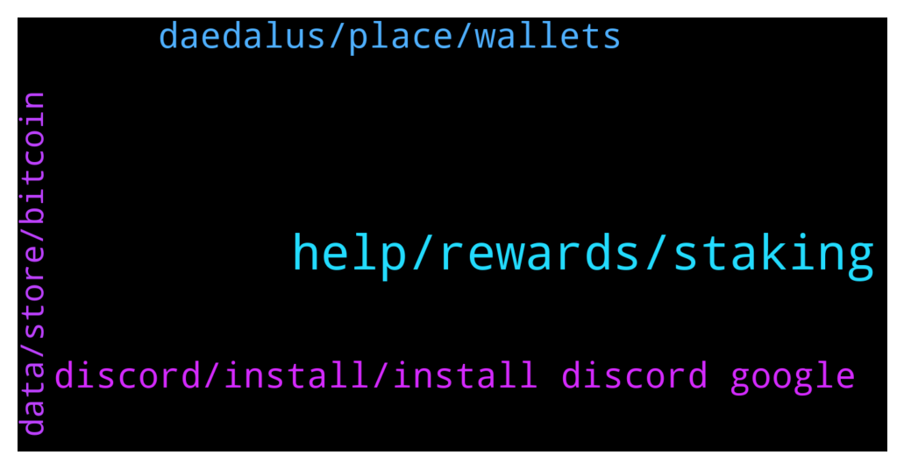

# **@Cardano**
 ## Analysis for **2022-02-06** - **2022-02-07**.

---

## 📊 **Basic Stats**

**n_messages_sent**: 62

---

---

## 🔝 **Top keywords and related messages**

1. **help, rewards, staking**

    @Corey --- *Can someone please help me with an urgent matter?  I don’t often post to groups, so not sure if it’s appropriate in this group, but I had a bug/glitch while staking using Yoroi, and I need help desperately.  If it’s okay, I’ll post what happened and if anyone can help it would be greatly appreciated.* **--->** [TG Discussion](https://t.me/Cardano/779194)

    @Ervin --- *Hello guys. newbie question. Why is it that in Binance, they give 7.5%APY for delegators. However, based on cardano.org, the current delegation rewards is at 4.6%. Why the difference?* **--->** [TG Discussion](https://t.me/Cardano/779182)

    @Zyroxa --- *But i dont really recommand doing that as you dont own the keys if you store your funds on a exchange.* **--->** [TG Discussion](https://t.me/Cardano/779185)

    @CesarVapor --- *Guys which wallet do you recommend? I'm fed up that Yoroi can't be used in most DeX* **--->** [TG Discussion](https://t.me/Cardano/779122)

    @apex_pool_spo --- *it is a full node wallet...* **--->** [TG Discussion](https://t.me/Cardano/778896)

    @Corey --- *But when staking, should my ADA not remain in my wallet?  Whey did it get sent to Pegasus and not delegated?  Maybe I’m confused.* **--->** [TG Discussion](https://t.me/Cardano/779199)

2. **discord, install, install discord google**

    @Corey --- *Do you have a link to the discord chat by any chance?  Or can I just search Cardano?  Sorry, I don’t use discord.  Thanks in advance.* **--->** [TG Discussion](https://t.me/Cardano/778950)

    @Barbedouce --- *send me the url of cardanoscan tx in pm if u want.* **--->** [TG Discussion](https://t.me/Cardano/779203)

    @Zyroxa --- *Nope sorry i dont know yet.* **--->** [TG Discussion](https://t.me/Cardano/779167)

    @AnimaValeska --- *if unsure, hop on their discord and ask the community. they answer that question every five minutes. (no passive aggressiveness intended, it's just reality.^^ a slight bit exaggerated probably tho.)* **--->** [TG Discussion](https://t.me/Cardano/779160)

    @Mahoney1 --- *Just install discord and find them through google. Don’t think they have a telegram group. ;)* **--->** [TG Discussion](https://t.me/Cardano/778951)

    @Mahoney1 --- *Is there a way to check how congested the network is now?* **--->** [TG Discussion](https://t.me/Cardano/778944)

3. **daedalus, place, wallets**

    @P --- *I have missed a lot as l wasn’t monitoring since quite a while, does ADA have to be in deadalus wallet? I keep it in crypto.com, if some could give me some info would be appreciated. Thanks* **--->** [TG Discussion](https://t.me/Cardano/779306)

    @cryptorules81 --- *For med Daedalus 4.8 is loading slower then before, now doing a procedure on startup called "validating blocks" which takes a long time. Anyone else expereince slower startup than 4.7?* **--->** [TG Discussion](https://t.me/Cardano/779258)

    @MelloBrains --- *Is congestion that bad now a days?? Haven't traded ada for a while and just sending my ada is constantly pending.. about 3 out of my 7 transactions never went through...* **--->** [TG Discussion](https://t.me/Cardano/779382)

    @glitch04 --- *that changes each epoch and doesn't remain static, because of the random block selection each epoch* **--->** [TG Discussion](https://t.me/Cardano/779323)

    @LibertySpring --- *Hi, There are many wallets you can keep ADA in. Daedalus is the official, but you can also use other wallets such as yoroi, nami, ccvault and others which may be better suited to your needs. It is better from a decentralisation perspective for ADA holders to take their ADA off exchange and stake them in a wallet, so the exchanges don’t have centralised control of the network. Hope this helps.* **--->** [TG Discussion](https://t.me/Cardano/779368)

    @Daniel_0123456789 --- *Hi everyone. I have a problem with Daedalus. Is this the right place or is there a dedicate place?* **--->** [TG Discussion](https://t.me/Cardano/779434)

4. **data, store, bitcoin**

    @MrBigK1776 --- *If you held a small amount since then, you'd be considered almost a whale now* **--->** [TG Discussion](https://t.me/Cardano/778975)

    @slimjim1333 --- *Holy crap, I’ll be almost 26 by then….* **--->** [TG Discussion](https://t.me/Cardano/778974)

    @MrBigK1776 --- *If you hold at least past 2040 or so. Which is still a really great investment, by the way.* **--->** [TG Discussion](https://t.me/Cardano/778971)

    @MrBigK1776 --- *Bitcoin was less than $5 at some point, and $25 worth of Bitcoin in 2012 would buy you a couple Teslas now. Just saying* **--->** [TG Discussion](https://t.me/Cardano/778968)

    @Morpheus369 --- *Is it better to store data on-chain or to use decentralized storage like IPFS? Where would you store important data that should last for thousands of years and can't be altered or destroyed?* **--->** [TG Discussion](https://t.me/Cardano/778902)

