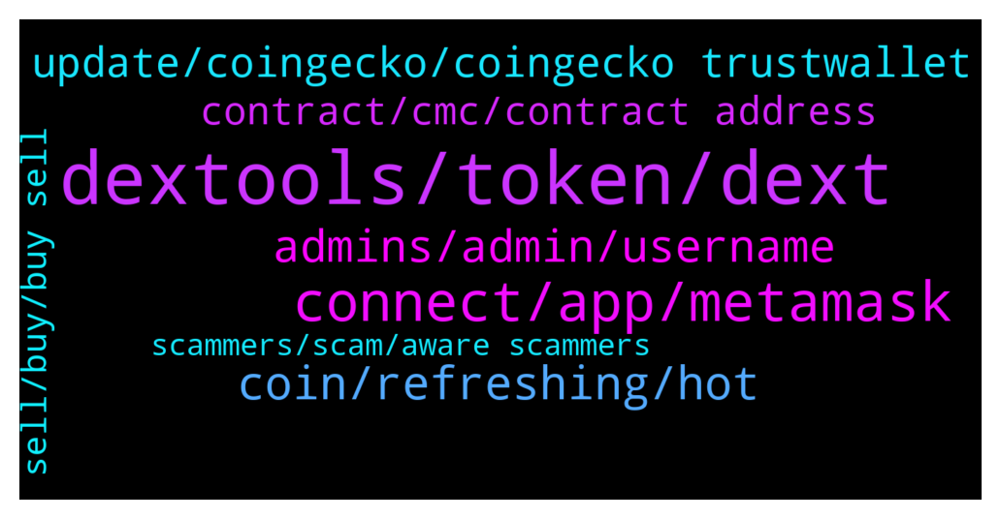

# **@DEXToolsCommunity**
 ## Analysis for **2022-02-05** - **2022-02-07**.

---

## 📊 **Basic Stats**

**n_messages_sent**: 250

---

---

## 🔝 **Top keywords and related messages**

1. **dextools, token, dext**

    @Edmund --- *Hi my token is listed on CMC, but the info on dextool is still zero, How do i validate my token* **--->** [TG Discussion](https://t.me/DEXToolsCommunity/332315)

    @MademoiselleDL --- *Yes, but is there a limit to it on Dextools ?* **--->** [TG Discussion](https://t.me/DEXToolsCommunity/331162)

    @Mark_Fowler --- *Hi ... I just recently added my token to Dextools ... Where it shows contract details it says that the token is not verified, I dont understand this as it is verified on bscscan ... please help* **--->** [TG Discussion](https://t.me/DEXToolsCommunity/332207)

    @stanes --- *It's not how it works: We index all the pairs present on the DEXs we support. Once again: there is no listing process. We give some tools to users to downvote a pair if they think it's a scam. When you are interacting with some DEXs, you have to be extremely careful, most of the coins are scams or will anyway be valueless in the future.  Always DYOR, apeing any token without knowing anything about it is throwing your money away.* **--->** [TG Discussion](https://t.me/DEXToolsCommunity/331144)

    @farhad13345 --- *Hi. How can I find URI for a token in dextools* **--->** [TG Discussion](https://t.me/DEXToolsCommunity/332514)

    @realstevesmith2 --- *Witcherdoge wtdoge is active for trading but dextools still shows it indexing. Can an admin report it to support. Contract is 0x45ac1100ee8F4c12d980A61dD5916FfCF15Ad7Aa thanks* **--->** [TG Discussion](https://t.me/DEXToolsCommunity/332330)

2. **connect, app, metamask**

    @stanes --- *We don't have a mobile native app for the moment.* **--->** [TG Discussion](https://t.me/DEXToolsCommunity/332525)

    @FredericDEXT --- *Check that you have the correct network selected at metamask* **--->** [TG Discussion](https://t.me/DEXToolsCommunity/331361)

    @FredericDEXT --- *It's a webapp so work in all devices* **--->** [TG Discussion](https://t.me/DEXToolsCommunity/332308)

    @realstevesmith2 --- *Ok  I've got the correct network selected. I've got metamask up and never see a connect permission pop up when I click connect wallet.* **--->** [TG Discussion](https://t.me/DEXToolsCommunity/331364)

    @stanes --- *Issue has been forwarded to the devs, they will fix it asap. Thanks for reporting it 👍* **--->** [TG Discussion](https://t.me/DEXToolsCommunity/332283)

    @JoeyDieleman --- *Try to first connect one time directly, via app.velox.global* **--->** [TG Discussion](https://t.me/DEXToolsCommunity/331367)

3. **coin, refreshing, hot**

    @E --- *how can it be that such a coin is still online??? I've tried everything I can't sell ? how can it be that this coin is also in the trends that is unbelievable???* **--->** [TG Discussion](https://t.me/DEXToolsCommunity/331138)

    @kiss98 --- *Is it possible that the trading is so hot that it stops refreshing the market? Because just a few minutes after resuming, it stopped refreshing again. thanks team  dogeking* **--->** [TG Discussion](https://t.me/DEXToolsCommunity/332583)

    @kiss98 --- *Hello, dogeking has stopped the market refresh again. Please check it. Thank you    0x641ec142e67ab213539815f67e4276975c2f8d50    dogeking* **--->** [TG Discussion](https://t.me/DEXToolsCommunity/332580)

    @E --- *can you please help me ? I bought a coin called bird and I can't sell it anymore can you please help me?* **--->** [TG Discussion](https://t.me/DEXToolsCommunity/331133)

    @FredericDEXT --- *No it's not, if it was a general issue all pairs would stop* **--->** [TG Discussion](https://t.me/DEXToolsCommunity/332584)

    @kiss98 --- *No, it's still not good. Refresh the transaction once and stop* **--->** [TG Discussion](https://t.me/DEXToolsCommunity/332591)

4. **admins, admin, username**

    @SweetMonkeyLove --- *lol fake admin in my dms instantly haha* **--->** [TG Discussion](https://t.me/DEXToolsCommunity/331998)

    @gumbercules --- *And remember that admins won't DM first* **--->** [TG Discussion](https://t.me/DEXToolsCommunity/332301)

    @crypto0o0o0o --- *always telling me have to be an admin, I am the owner of the group* **--->** [TG Discussion](https://t.me/DEXToolsCommunity/331069)

    @Mark_Fowler --- *Well you have 2 people in here that have approached me claiming to be admins ... at least they had a fast response  ... one asked for a deposit to help me ... really?* **--->** [TG Discussion](https://t.me/DEXToolsCommunity/332215)

    @JoeyDieleman --- *Perfect, yup be aware admins never dm first* **--->** [TG Discussion](https://t.me/DEXToolsCommunity/332081)

    @JoeyDieleman --- *Also remember admins never dm first or ask for money!* **--->** [TG Discussion](https://t.me/DEXToolsCommunity/332070)

5. **update, coingecko, coingecko trustwallet**

    @stanes --- *They maybe have one but if their social info are not yet updated we can't show them.* **--->** [TG Discussion](https://t.me/DEXToolsCommunity/331934)

    @JoeyDieleman --- *Update social info:  etherscan.io or bscscan.com or coingecko.com  Update logo:  CoinGecko or TrustWallet* **--->** [TG Discussion](https://t.me/DEXToolsCommunity/331101)

    @YELEN --- *Who should I contact to add avatars and supplementary information？* **--->** [TG Discussion](https://t.me/DEXToolsCommunity/331480)

    @NeuesGold --- *GUYS CAN YOU HELP!!!  we've just launched our token and there is a glitch!!!  Red banner at the top of the token page stating "one of the team have sold" This is false as you can see on ether scan.. please help!!!!   0x266f5846ab204b4ce95685705f7795ce029f5195* **--->** [TG Discussion](https://t.me/DEXToolsCommunity/331332)

    @stanes --- *Hi, unfortunately ftmscan doesn't includes social info in their api for the moment. Please update your info on Coingecko.* **--->** [TG Discussion](https://t.me/DEXToolsCommunity/332549)

    @stanes --- *Then to update social Information for your token, please update etherscan.io or bscscan.com or coingecko.com  We pull info from there.    For the logo please update coinGecko or TrustWallet.* **--->** [TG Discussion](https://t.me/DEXToolsCommunity/331806)

6. **contract, cmc, contract address**

    @napascual --- *oh ok that depends on cmc api but we'll check. Please dm me the pair url 🙏* **--->** [TG Discussion](https://t.me/DEXToolsCommunity/331847)

    @stanes --- *You mean URL?  Search with the contract address.* **--->** [TG Discussion](https://t.me/DEXToolsCommunity/332515)

    @stanes --- *Please DM me the tx link.* **--->** [TG Discussion](https://t.me/DEXToolsCommunity/332198)

    @stanes --- *I will ping the devs about it. I can see you already gave us both contract addresses. We also need a link to the official announcement of the swap.* **--->** [TG Discussion](https://t.me/DEXToolsCommunity/331953)

    @JoeyDieleman --- *You can DM me the link to the channel if you want, I could check it in the logs* **--->** [TG Discussion](https://t.me/DEXToolsCommunity/331076)

    @JoeyDieleman --- *You can DM me the CMC link if you want so I can verify* **--->** [TG Discussion](https://t.me/DEXToolsCommunity/331088)

7. **sell, buy, buy sell**

    @SuperLuckyInvestor --- *Hi, can im pls ask we need to buy 1000 dext token in order to set limit for bot trading? its will automatic buy and sell for me?* **--->** [TG Discussion](https://t.me/DEXToolsCommunity/332110)

    @♡𝚉𝙰𝙷𝚁𝙰♡ --- *You can easily buy and sell with a free plan??* **--->** [TG Discussion](https://t.me/DEXToolsCommunity/331093)

    @♡𝚉𝙰𝙷𝚁𝙰♡ --- *If we do not pay 100 dex, we can easily buy and sell in all platforms?* **--->** [TG Discussion](https://t.me/DEXToolsCommunity/331090)

    @♡𝚉𝙰𝙷𝚁𝙰♡ --- *If we do not have a trading robot, we can easily buy and sell?* **--->** [TG Discussion](https://t.me/DEXToolsCommunity/331080)

    @Yanuel_la_xx --- *How I sell Disney metaverse I just bought and I can’t sell back omg 😱* **--->** [TG Discussion](https://t.me/DEXToolsCommunity/332427)

    @stanes --- *Yes you will be able to set limit orders and the bot will automatically buy/sell once the price reaches the limit.* **--->** [TG Discussion](https://t.me/DEXToolsCommunity/332135)

