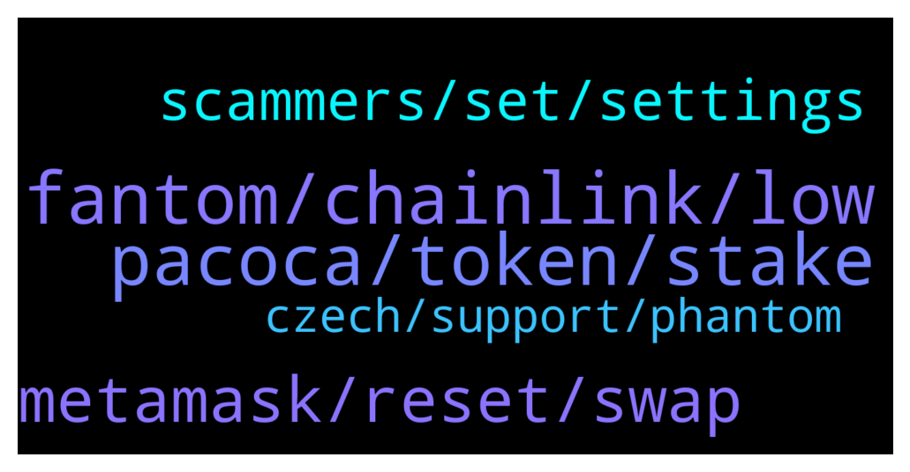

# **@Fantom_English**
 ## Analysis for **2022-02-06** - **2022-02-07**.

---

## 📊 **Basic Stats**

**n_messages_sent**: 115

---

---

## 🔝 **Top keywords and related messages**

1. **fantom, chainlink, low**

    @FANTOM'S FURY🔥 --- *Its a shame you delete such good contant about fantom* **--->** [TG Discussion](https://t.me/Fantom_English/648669)

    @Jay --- *I'm really kicking myself that l didnt buy more Fantom at the beginning,* **--->** [TG Discussion](https://t.me/Fantom_English/648514)

    @RunOn_Empty --- *I haven't staked any yet what is a good site to stake my fantom on ?* **--->** [TG Discussion](https://t.me/Fantom_English/648475)

    @Janevietani --- *felix is a CEX made by Harry ( TOMB owner )* **--->** [TG Discussion](https://t.me/Fantom_English/648604)

    @dash1294 --- *Hi guys can someone enlighten me pls? Is tomb and other coins like that sucking value out of fantom in your opinion? It was a big appeal to me when investing that fully diluted of ftm is so low. But if they succeed it won’t be the case right?* **--->** [TG Discussion](https://t.me/Fantom_English/647892)

    @slickrick6 --- *Fantom on TG  Official: t.me/Fantom_English Announcements (official) : t.me/fantomfoundation Trading: t.me/FantomTrading French (Française): t.me/FantomFR Chinese (中文): https://t.me/FantomChinese Russian (русский): http://t.me/Fantom_Russian Vietnam : https://t.me/FantomVietnamGroup Turkey : https://t.me/Fantomir1  Fantom on DIscord: chat.fantom.network  Fantom on Twitter: twitter.com/fantomfdn* **--->** [TG Discussion](https://t.me/Fantom_English/647904)

2. **pacoca, token, stake**

    @LeoneMR --- *whats FTM contract on FTM network* **--->** [TG Discussion](https://t.me/Fantom_English/648381)

    @gmazza1989 --- *is this the real ftm on bsc? 0xad29abb318791d579433d831ed122afeaf29dcfe* **--->** [TG Discussion](https://t.me/Fantom_English/648021)

    @Simon --- *Anybody know if there is a dutch ftm channel?* **--->** [TG Discussion](https://t.me/Fantom_English/648165)

    @collinyeo --- *is it possible to bridge LINK token from BSC to FTM?* **--->** [TG Discussion](https://t.me/Fantom_English/648093)

    @chiquito82 --- *hey guys, where to get the best apy for single side staking of ftm?* **--->** [TG Discussion](https://t.me/Fantom_English/648730)

    @Mcjig --- *there is no ftm contract on ftm because its the native token* **--->** [TG Discussion](https://t.me/Fantom_English/648409)

3. **metamask, reset, swap**

    @alessandro_HH --- *Hello can somebody Explain me How to use spooky with MetaMask? I just set up the net and i can See the ftm But when i try it out MetaMask ask me for eth app* **--->** [TG Discussion](https://t.me/Fantom_English/648768)

    @GodfatherMigael --- *I am Trying to swap a token with the ticker RAIN* **--->** [TG Discussion](https://t.me/Fantom_English/648504)

    @to_much_crypto --- *i am using spooky swap and nothing is going through* **--->** [TG Discussion](https://t.me/Fantom_English/648368)

    @rico_007k --- *hi, i'm trying to swap on paraswap but I get this error : "It looks like there is an issue with the RPC linked to your wallet" any idea? on FTM bc of course* **--->** [TG Discussion](https://t.me/Fantom_English/647973)

    @Mcjig --- *i dont have issue with transactions using the suggested gas* **--->** [TG Discussion](https://t.me/Fantom_English/648414)

    @Mcjig --- *make sure your using a good rpc* **--->** [TG Discussion](https://t.me/Fantom_English/648411)

4. **scammers, set, settings**

    @to_much_crypto --- *your group has loads thnaks for the info but bait them out and removing them would be smart as you have so many i am tellling you you are riddelled* **--->** [TG Discussion](https://t.me/Fantom_English/648421)

    @Mcjig --- *unless you have a better way to stop scammers. then im all ears* **--->** [TG Discussion](https://t.me/Fantom_English/648423)

    @to_much_crypto --- *literally 12 scammers have messaged me, in the past 15 mins* **--->** [TG Discussion](https://t.me/Fantom_English/648376)

    @to_much_crypto --- *because you have more scammers than any other chat i have been in on tleegram* **--->** [TG Discussion](https://t.me/Fantom_English/648375)

    @to_much_crypto --- *i hope you guys are active on phising this for scammers* **--->** [TG Discussion](https://t.me/Fantom_English/648374)

    @Mcjig --- *the only detterent to scammers is for people to educate themselves on how to protect their money and quit giving scammers their money* **--->** [TG Discussion](https://t.me/Fantom_English/648365)

5. **czech, support, phantom**

    @Simon --- *I get a lot of DMs from OFFICIAL support🤣* **--->** [TG Discussion](https://t.me/Fantom_English/648185)

    @dzej --- *Hello, we are creating a large project at Phantom in the Czech Republic and we need special support, preferably in the Czech language. I saw that the members of your team are also colleagues from the Czech Republic. E.g. Pavel Spacil, Jakub Stepanik or Jiri Malek etc. Can I ask you to contact them? thank you very much, greetings Jiri Hanečka, Czech Rep. mail: info@bubler.cz* **--->** [TG Discussion](https://t.me/Fantom_English/648085)

    @slickrick6 --- *You can post that in other groups* **--->** [TG Discussion](https://t.me/Fantom_English/648671)

    @y_bob --- *Sent you a DM @Johnnyfantom 🙂* **--->** [TG Discussion](https://t.me/Fantom_English/648207)

    @Johnnyfantom --- *It's not official. Admins will never DM you first* **--->** [TG Discussion](https://t.me/Fantom_English/648188)

    @Dan --- *Dont ask me that here. Post in my dms.* **--->** [TG Discussion](https://t.me/Fantom_English/647946)

