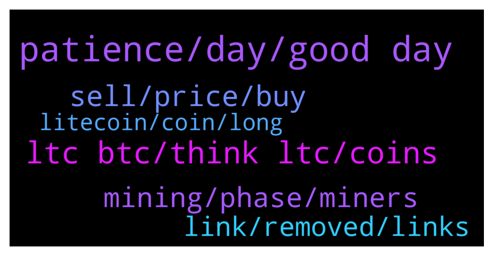

# **@Litecoin**
 ## Analysis for **2022-02-06** - **2022-02-07**.

---

## 📊 **Basic Stats**

**n_messages_sent**: 170

---

---

## 🔝 **Top keywords and related messages**

1. **patience, day, good day**

    @RabbitL0v3r --- *Good morning.  Oh wow a bunch of people who have no clue what they're talking about...must be Saturday!* **--->** [TG Discussion](https://t.me/Litecoin/2058176)

    @johnst7 --- *No prob officer 👮. Have a good day* **--->** [TG Discussion](https://t.me/Litecoin/2058672)

    @iamnikola1 --- *Text me in a few days.Ok* **--->** [TG Discussion](https://t.me/Litecoin/2058264)

    @johnst7 --- *Anyway have a good day to everyones* **--->** [TG Discussion](https://t.me/Litecoin/2058666)

    @Si Ting --- *Knowledge makes humble, ignorance makes proud.* **--->** [TG Discussion](https://t.me/Litecoin/2058355)

    @moonsie --- *I have been patience for so long that "being patience like a moonsie" should replace "the patience of a prophet"* **--->** [TG Discussion](https://t.me/Litecoin/2058452)

2. **ltc btc, think ltc, coins**

    @SBH --- *The true meaning of crypto is not price speculation. LTC delivers on the core values of crypto.* **--->** [TG Discussion](https://t.me/Litecoin/2058173)

    @PPatches --- *What do you guys use to store and/or buy ltc?* **--->** [TG Discussion](https://t.me/Litecoin/2058277)

    @Congressional_Liason --- *Less enough for people to choose coins like LTC, BTC, XLM, etc. A convenience fee people are willing to pay. In addition, cash can be inserted.  The same applies to many products.  Beer is much more expensive in a bar than at a grocer. Food is cheaper through farmers than the grocer.  There is a strong demand for LTC, BTC, XLM, Doge for these to be convenient.   This is a soft launch, and I expect other coins to be added; the consumer demands the shape of the market.* **--->** [TG Discussion](https://t.me/Litecoin/2058552)

    @RabbitL0v3r --- *Doesn't have to anything and 5ltc is very smoll* **--->** [TG Discussion](https://t.me/Litecoin/2058329)

    @Ben --- *If they know it’s definitely boosting the market, why don’t they just postpone the process and get more LTC while they can?* **--->** [TG Discussion](https://t.me/Litecoin/2058563)

    @Musashi_Kansai --- *True to a degree, but still a valuable metric with a coin like LTC (not VC created and controlled). Sorry, but the day of the miner in his bedroom is over for LTC as it is a maturing technology. We have entered the next paradigm.* **--->** [TG Discussion](https://t.me/Litecoin/2058708)

3. **sell, price, buy**

    @kevinvik --- *Already set selling at 731 guys* **--->** [TG Discussion](https://t.me/Litecoin/2058181)

    @BennyBennyBlanco --- *I’ll have a medium cheese burger and Fries please. Thank you* **--->** [TG Discussion](https://t.me/Litecoin/2058512)

    @cecilia726 --- *Buy below the cost line, sell above the profit line* **--->** [TG Discussion](https://t.me/Litecoin/2058754)

    @kevinvik --- *And why should you advice this if you're so sure it will get to 1028? Just give the advice to take profit at 1028, no?  😂🔮* **--->** [TG Discussion](https://t.me/Litecoin/2058171)

    @onecryptochick --- *take some profits at 731 is wise 🙌* **--->** [TG Discussion](https://t.me/Litecoin/2058182)

    @Musashi_Kansai --- *I almost did. It didn't make sense over buying the dip though.* **--->** [TG Discussion](https://t.me/Litecoin/2058719)

4. **mining, phase, miners**

    @Musashi_Kansai --- *Decentralization is not only about mining, but also who holds the coin...me for example. People in Nigeria, Cuba, South America...etc. Technologies go through paradigm shifts, and that is good.* **--->** [TG Discussion](https://t.me/Litecoin/2058689)

    @zwiezdan --- *So, nobody cares because LTC will probabely not be mined with GPUs again? And nobody cares because LTC mining is largely centralised with ASICs?* **--->** [TG Discussion](https://t.me/Litecoin/2058680)

    @RabbitL0v3r --- *But the distribution of hodlers is more concentrated than usd* **--->** [TG Discussion](https://t.me/Litecoin/2058694)

    @RabbitL0v3r --- *"Its centralized but dont worry with time it gonna be decentralized"* **--->** [TG Discussion](https://t.me/Litecoin/2058703)

    @RabbitL0v3r --- *So its about what? Hodlers? Miners? Lol* **--->** [TG Discussion](https://t.me/Litecoin/2058696)

    @Musashi_Kansai --- *Yes, but the miners don't have the ability to increase the end supply. USD is everywhere due to centralized pressure from the US government.* **--->** [TG Discussion](https://t.me/Litecoin/2058695)

5. **link, removed, links**

    @coblee --- *None that I'm in, so no* **--->** [TG Discussion](https://t.me/Litecoin/2058439)

    @SirMix --- *Dude I'm only giving you advice. I don't moderate this channel.  Paste links all you want... all that can happen is that you get banned from here. Go for it* **--->** [TG Discussion](https://t.me/Litecoin/2058673)

    @SirMix --- *Contact me to get link... smells like scam* **--->** [TG Discussion](https://t.me/Litecoin/2058660)

    @SirMix --- *Ok... I get it. Still you should probably clear it with moderator before just pasting links* **--->** [TG Discussion](https://t.me/Litecoin/2058671)

    @johnst7 --- *There is nothing free, they just have to retweet and follow and I prefer to organize giveaways instead of paying for fake audience.* **--->** [TG Discussion](https://t.me/Litecoin/2058658)

    @johnst7 --- *Hi, I'm offering 0.25 LTC for free on my Twitter. You still have 6 hours for entering. There is only one participant at the moment 😅. Contact me if you wanna get the link.* **--->** [TG Discussion](https://t.me/Litecoin/2058648)

6. **litecoin, coin, long**

    @ForDaTek --- *$1500 is an easy target for litecoin.* **--->** [TG Discussion](https://t.me/Litecoin/2058606)

    @nekyamara --- *We have many Litecoin hodlers who are loyal as well.   They have been waiting for so long.* **--->** [TG Discussion](https://t.me/Litecoin/2058622)

    @moonsie --- *Probably the only coin creator who is not scamming and has delivered on pushing his creation forward* **--->** [TG Discussion](https://t.me/Litecoin/2058446)

    @ForDaTek --- *That is why it’s an easy target. Only because it’s a long time coming. We just need hodlers here that are as loyal as Dogecoin and shiba hodlers and let the coin do 10x plus gains and hold and not just sell at small gains.* **--->** [TG Discussion](https://t.me/Litecoin/2058617)

    @nekyamara --- *Honestly i expected Litecoin to have crossed $1500 by now because its been long i knew this coin.* **--->** [TG Discussion](https://t.me/Litecoin/2058612)

    @iamnikola1 --- *something strange is happening.  BITCOIN has to crash one more time* **--->** [TG Discussion](https://t.me/Litecoin/2058259)

