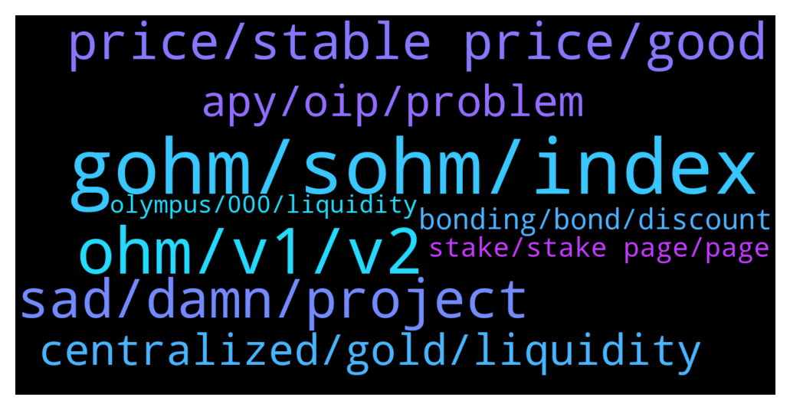

# **@OlympusTG**
 ## Analysis for **2022-02-06** - **2022-02-07**.

---

## 📊 **Basic Stats**

**n_messages_sent**: 401

---

---

## 🔝 **Top keywords and related messages**

1. **gohm, sohm, index**

    @Flower --- *sOHM is best if you like seeing your units grow and you enjoy paying high transaction fees. gOHM is better if you hate high transaction fees, you like adding to your investment in smaller amounts (which is made possible by the penny fees from Matic and Avalanche) and you have a governance vote.* **--->** [TG Discussion](https://t.me/OlympusTG/180749)

    @Ap0l1o --- *I would say gOhm on any non eth chain, but it depends on your personal preference* **--->** [TG Discussion](https://t.me/OlympusTG/180887)

    @Jonathan --- *With NFT and gaming for OHM.... will those sticking with gOHM need to prepare their behinds?* **--->** [TG Discussion](https://t.me/OlympusTG/180810)

    @nfwaple --- *If you want to use avax, swap your dai to avax, then withdraw to metamask, use traderjoe to swap avax to gohm* **--->** [TG Discussion](https://t.me/OlympusTG/181315)

    @stacyd82d --- *Coin gecko shows gohm jumped from $5.2k to $7.2k over the past hour.* **--->** [TG Discussion](https://t.me/OlympusTG/180868)

    @nfwaple --- *If you want to use the eth mainnet, get eth from binance then withdraw eth* **--->** [TG Discussion](https://t.me/OlympusTG/181314)

2. **ohm, v1, v2**

    @Neba --- *Good. That's exactly what we want people demanding more ohm to stake with limited supply.* **--->** [TG Discussion](https://t.me/OlympusTG/180712)

    @nfwaple --- *if you haven't staked, best to sell your v1 OHM to minimise your loss, then get v2 OHM* **--->** [TG Discussion](https://t.me/OlympusTG/181060)

    @nfwaple --- *you can migrate OHM v1 and still get more v2* **--->** [TG Discussion](https://t.me/OlympusTG/181096)

    @theMagicUnicorn --- *so its 7 ohm v1 : 7 ohm v2?  i was thinking you could just swap your v1 ohm inside mm to something like eth or dai, etc and then just swap that for ohmv 2, so you get the value and thus more ohm v2* **--->** [TG Discussion](https://t.me/OlympusTG/181105)

    @theMagicUnicorn --- *actually it may even be possible to do a direct swap from ohmv1 to ohmv2 within mm, you could initiate a swap and see what it shows you, if you get more ohmv2s...* **--->** [TG Discussion](https://t.me/OlympusTG/181116)

    @will108 --- *ok, suffered the heaviest loses in ohm, trying to find solace* **--->** [TG Discussion](https://t.me/OlympusTG/181217)

3. **sad, damn, project**

    @SinisterCyclops --- *I'm sorry my mind is dirty. I saw a sexual joke in that* **--->** [TG Discussion](https://t.me/OlympusTG/180774)

    @Ap0l1o --- *Feel free to look at his tweets, I don’t plan to do that :)* **--->** [TG Discussion](https://t.me/OlympusTG/180881)

    @nfwaple --- *it's too good to be true* **--->** [TG Discussion](https://t.me/OlympusTG/180845)

    @nfwaple --- *god damn I just couldn't find that meme I had to make it* **--->** [TG Discussion](https://t.me/OlympusTG/180785)

    @Host_Matt --- *sorry mr frank martin didn't mean to  be rude she says to call her asap* **--->** [TG Discussion](https://t.me/OlympusTG/180633)

    @SinisterCyclops --- *I was falling asleep at work lol* **--->** [TG Discussion](https://t.me/OlympusTG/180794)

4. **price, stable price, good**

    @Colonelgaddafi --- *Ok I need the price to go UP. Everyday I wake up, price isn't good. I check phone price is down. I want price to go UP.* **--->** [TG Discussion](https://t.me/OlympusTG/181009)

    @Neba --- *Which is bad for price recovery* **--->** [TG Discussion](https://t.me/OlympusTG/180684)

    @FattHamster --- *The price is very stable 👍* **--->** [TG Discussion](https://t.me/OlympusTG/181277)

    @chillwill749 --- *800% on stable price is a bad thing? Better put it in a savings account then* **--->** [TG Discussion](https://t.me/OlympusTG/181219)

    @nfwaple --- *imagine getting more tokens when the price doesn't change* **--->** [TG Discussion](https://t.me/OlympusTG/181209)

    @nfwaple --- *inflationary token having stable price is good price* **--->** [TG Discussion](https://t.me/OlympusTG/181208)

5. **centralized, gold, liquidity**

    @Host_Matt --- *Gold is more centralize than we think imo (could be wrong)* **--->** [TG Discussion](https://t.me/OlympusTG/180903)

    @o_nexus_o --- *More centralized, with safeguards = more efficient* **--->** [TG Discussion](https://t.me/OlympusTG/180481)

    @Host_Matt --- *its to make something the functions well* **--->** [TG Discussion](https://t.me/OlympusTG/180715)

    @Nostress04 --- *Yes, one always needs to diversify.. :)* **--->** [TG Discussion](https://t.me/OlympusTG/181260)

    @nfwaple --- *the purpose is to have deep liquidity* **--->** [TG Discussion](https://t.me/OlympusTG/180706)

    @t_dit --- *Is that a pair and is there enough liquidity their* **--->** [TG Discussion](https://t.me/OlympusTG/180952)

6. **apy, oip, problem**

    @timon_k --- *Ohm is lagging behind massively. I wonder why. For me personally the apy is to low to buy more. So perhaps that is the same for many more..* **--->** [TG Discussion](https://t.me/OlympusTG/181254)

    @timon_k --- *Apy wasn't a problem when I entered lol. I'm not selling my investment.. but for new money I'm looking at other projects ( non dao)* **--->** [TG Discussion](https://t.me/OlympusTG/181259)

    @cdp279 --- *If apy is a problem then you don’t get ohm. And secondly. How is a 800% apy a problem. Please go find a better apy (excluding other scammy forks)* **--->** [TG Discussion](https://t.me/OlympusTG/181256)

    @AwfulFather --- *Couple of months ago I check the APY  was like 7000% now it’s at like 800%something….. is it going down steadily or what happened?* **--->** [TG Discussion](https://t.me/OlympusTG/180666)

    @longfoongllf --- *An OIP was proposed and passed back then. It was proposed to reduce the APY to lower level if I’m not mistaken at the time was set at 1k%. So the APY will only get back up to 5k% if another proposal passes in the future* **--->** [TG Discussion](https://t.me/OlympusTG/181345)

    @Kyaw --- *thanks so, you mean, I can hope maximum APY for my stacking is 1000%. Right?* **--->** [TG Discussion](https://t.me/OlympusTG/181347)

7. **bonding, bond, discount**

    @Neba --- *Correct, the call hear is not to eliminate bonding but to discourage it when price is falling.* **--->** [TG Discussion](https://t.me/OlympusTG/180719)

    @nfwaple --- *bonding is important for the treasury* **--->** [TG Discussion](https://t.me/OlympusTG/180690)

    @Host_Matt --- *neba if people dont get a discount for bonding why would people bond when they can buy ohm and stake* **--->** [TG Discussion](https://t.me/OlympusTG/180704)

    @nfwaple --- *saying no bond = price goes up just does not make sense, even without bond the token is still inflationary through staking* **--->** [TG Discussion](https://t.me/OlympusTG/180702)

    @nfwaple --- *it is the trade off, why else would someone bonds* **--->** [TG Discussion](https://t.me/OlympusTG/180709)

    @nfwaple --- *it is not unlimited bonding at that ROI* **--->** [TG Discussion](https://t.me/OlympusTG/180687)

8. **stake, stake page, page**

    @Sinazargh --- *I staked ohm but For 3 months, no interest will be deposited in my wallet* **--->** [TG Discussion](https://t.me/OlympusTG/180855)

    @CryptOGether$ --- *Yes I remember the admin was mentioning this....but I haven't even begun to stake, so I'm not due any rebases right??* **--->** [TG Discussion](https://t.me/OlympusTG/181079)

    @nfwaple --- *you should see a prompt on the stake page* **--->** [TG Discussion](https://t.me/OlympusTG/181101)

    @nfwaple --- *you can check the stake page, it has the % under next reward yield* **--->** [TG Discussion](https://t.me/OlympusTG/181045)

    @nfwaple --- *go to the website, in the stake page, stake it* **--->** [TG Discussion](https://t.me/OlympusTG/181027)

    @nfwaple --- *🤔🤔 you dont stake your ohm?* **--->** [TG Discussion](https://t.me/OlympusTG/180983)

