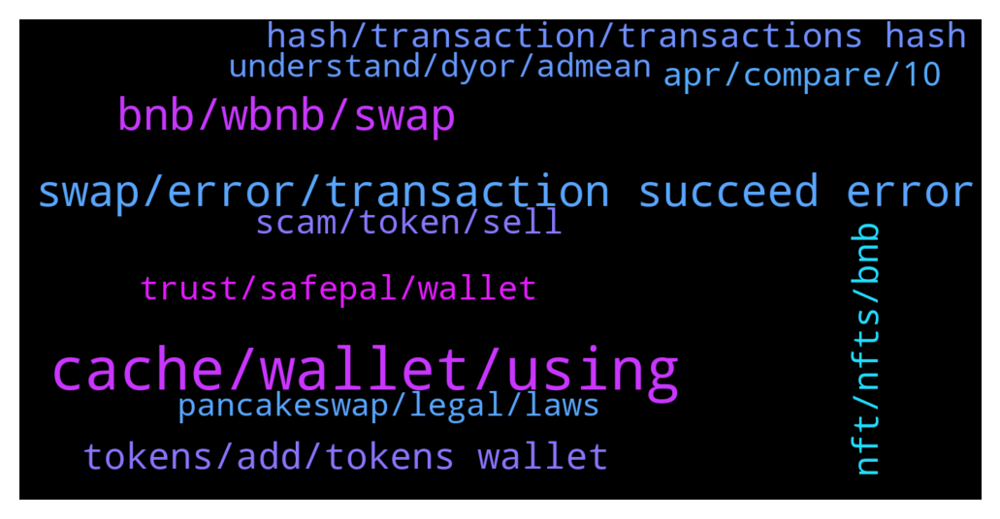

# **@PancakeSwap**
 ## Analysis for **2022-02-06** - **2022-02-07**.

---

## 📊 **Basic Stats**

**n_messages_sent**: 968

---

---

## 🔝 **Top keywords and related messages**

1. **cache, wallet, using**

    @Johannes --- *Hi, Hai Tien, I have tried to clear the Cache, but still failed* **--->** [TG Discussion](https://t.me/PancakeSwap/2324867)

    @Ceddi200 --- *Make sure you are using the right website. https://pancakeswap.finance/* **--->** [TG Discussion](https://t.me/PancakeSwap/2322507)

    @trentrez --- *ok. Is this the only solution if this doesnt work?* **--->** [TG Discussion](https://t.me/PancakeSwap/2322671)

    @QV_zz --- *works fine for me. trying clearing your cache* **--->** [TG Discussion](https://t.me/PancakeSwap/2325598)

    @HAITIENLK --- *clear cache and try again. you can send your address wallet , i will check* **--->** [TG Discussion](https://t.me/PancakeSwap/2324863)

    @Sina --- *I tried all of these and didn't work* **--->** [TG Discussion](https://t.me/PancakeSwap/2323774)

2. **swap, error, transaction succeed error**

    @Ricardo Lima --- *I am trying sell my tokens in pancakeswap, but the following message appears: The transaction cannot succeed due to error: execution reverted: TransferHelper: TRANSFER_FROM_FAILED.* **--->** [TG Discussion](https://t.me/PancakeSwap/2322437)

    @john --- *it wont let me swap, wants big fee for swap also.. damn eth* **--->** [TG Discussion](https://t.me/PancakeSwap/2323102)

    @HAITIENLK --- *https://t.me/PancakeSwap/2323447 —> try this way or the best, ask the team of that toke about condition to swap* **--->** [TG Discussion](https://t.me/PancakeSwap/2323448)

    @stevensmith001 --- *Then it’s probably a problematic token even if you buy,you will find it hard to swap back* **--->** [TG Discussion](https://t.me/PancakeSwap/2322969)

    @Johannes --- *I just tried safepal and encountered the same problem.  the message I got is  'the transaction cannot succeed due to error: execution reverted: PancakeRouter: INSUFFICIENT_OUTPUT_AMOUNT* **--->** [TG Discussion](https://t.me/PancakeSwap/2324825)

    @ekeh4gunners --- *Am always getting an error msg anytime I want to swap my tokens* **--->** [TG Discussion](https://t.me/PancakeSwap/2323829)

3. **bnb, wbnb, swap**

    @Sina --- *In this step after pressing confirm nothing happen...I used wbnb too* **--->** [TG Discussion](https://t.me/PancakeSwap/2323769)

    @Re1naldoch4 --- *You are not talking sensibly. Straightforward really. I didnt swap the tojens. And even if i did there is no trace for that wbnb* **--->** [TG Discussion](https://t.me/PancakeSwap/2325804)

    @Brahmanandam --- *I converted ninja floky njf to bnb using pancakeswap platform connected to trust wallet. Transaction says completed. But njf to bnb. Could you please tell me what's the problem.* **--->** [TG Discussion](https://t.me/PancakeSwap/2323905)

    @healer216 --- *holly shit… one question, I purchased the token with BNB -> c2x swap pancake swap, but the token cannot be c2x -> bnb swap again………………* **--->** [TG Discussion](https://t.me/PancakeSwap/2322897)

    @cryptoyieldfarmm --- *The bnb is in your wallet , clear metamask cache and refresh* **--->** [TG Discussion](https://t.me/PancakeSwap/2324505)

    @Carrymon --- *Please help   0x86c0d4f3fc7a4c54573a6c06ed39cfa5ca5fbf0fb48a2643dd70b45066f45e59  Please help  I have swapped some bnb on pancake swap but I haven't received busd  And BNB deducted from my wallet* **--->** [TG Discussion](https://t.me/PancakeSwap/2325908)

4. **tokens, add, tokens wallet**

    @TomorrowlandForLife --- *There was an update lately and all the tokens added were deleted. You need to add them again, that's all* **--->** [TG Discussion](https://t.me/PancakeSwap/2322690)

    @TomorrowlandForLife --- *There you have the tokens You need to add the tokens to your wallet* **--->** [TG Discussion](https://t.me/PancakeSwap/2323743)

    @ManBlyat --- *Dyor before buy token sir, atleast you need check contract code and function on theyr contract, if safe or not, alot of token put dangerous hard code on they smart contract. i have check your wallet, there is fully dusting token. but now its better you create new wallet* **--->** [TG Discussion](https://t.me/PancakeSwap/2322547)

    @jayachandran --- *I don't have tokens in my wallet* **--->** [TG Discussion](https://t.me/PancakeSwap/2324929)

    @TomorrowlandForLife --- *try from a different device or ask token's owner if there's somthing special* **--->** [TG Discussion](https://t.me/PancakeSwap/2325315)

    @sharif201241 --- *Yh i cant see any transaction that i made but the tokens disappeared 😢* **--->** [TG Discussion](https://t.me/PancakeSwap/2322693)

5. **nft, nfts, bnb**

    @Re1naldoch4 --- *Yeah but i did not swap the nft. Another token has done the same thing coape* **--->** [TG Discussion](https://t.me/PancakeSwap/2325792)

    @Re1naldoch4 --- *No i did not want to sell my nft. If it was converted. Its not showing in my wallet. Can you show where to look?* **--->** [TG Discussion](https://t.me/PancakeSwap/2325730)

    @G --- *Hey guys,  I ve been staking on pancake for quite some time now and I had some nfts as well. I don't log in very often but now it seems that my nfts are not shown. I don't see any outward transactions but my nfts are nowhere to be found...? Any ideas?* **--->** [TG Discussion](https://t.me/PancakeSwap/2324155)

    @Victor --- *Can’t see my NFTs, anyone know the reason?* **--->** [TG Discussion](https://t.me/PancakeSwap/2322977)

    @Flyingfrenchy --- *Why did pcs not use their own token for the nft marketplace ?* **--->** [TG Discussion](https://t.me/PancakeSwap/2324920)

    @Re1naldoch4 --- *Nft not even there. I did make a few transactions that day. However I do not think that i added to any pools or staking....* **--->** [TG Discussion](https://t.me/PancakeSwap/2325700)

6. **hash, transaction, transactions hash**

    @Ceddi200 --- *Bro you previously said ETH / WBNB and I asked you to provide transactions hash* **--->** [TG Discussion](https://t.me/PancakeSwap/2323783)

    @Ceddi200 --- *This isn’t transactions hash of your purchase* **--->** [TG Discussion](https://t.me/PancakeSwap/2325657)

    @Ceddi200 --- *transactions hash the period you provide liquidity* **--->** [TG Discussion](https://t.me/PancakeSwap/2323544)

    @Ceddi200 --- *Bro you haven’t given me the right transactions hash.* **--->** [TG Discussion](https://t.me/PancakeSwap/2323591)

    @Rush_lover --- *can y copy and past the transaction hash in here* **--->** [TG Discussion](https://t.me/PancakeSwap/2323065)

    @stevensmith001 --- *This is not a valid transaction hash… Pls check and give a valid one* **--->** [TG Discussion](https://t.me/PancakeSwap/2325856)

7. **scam, token, sell**

    @RangerApos --- *Did little more digging that token.. is honeypot scam.* **--->** [TG Discussion](https://t.me/PancakeSwap/2324426)

    @JurnalTebe --- *How can I know that a token is a scam one?* **--->** [TG Discussion](https://t.me/PancakeSwap/2323318)

    @Umeko --- *its not honeypot scam sir, I create this token, and people can buy and sell nornally* **--->** [TG Discussion](https://t.me/PancakeSwap/2324430)

    @khlifi --- *How you accept scam token!!! We can buy it but we cant sell it Fix this guys Damn* **--->** [TG Discussion](https://t.me/PancakeSwap/2324084)

    @nnothing2 --- *it's seem the creator of that token, prevent all address to sell it.* **--->** [TG Discussion](https://t.me/PancakeSwap/2323260)

    @healer216 --- *I think I bought a token that I can't sell. It breaks my heart.* **--->** [TG Discussion](https://t.me/PancakeSwap/2322907)

8. **trust, safepal, wallet**

    @Mohamed --- *So how can I sell safemoon in trust wallet V2* **--->** [TG Discussion](https://t.me/PancakeSwap/2325879)

    @HAITIENLK --- *👉Try trustwallet or safepal is work on 100%👈  ✅ Metamask - PC ✅ Safepal - iphone, android ✅ Trustwallet - android  Don't use metamask with phone ❌ Don't use Binance wallet with pc ❌ ---------------------------------------------------  You can import your wallet to any other wallets that works with Pancakeswap if you want. You can continue to use same wallet with your seed. That seed is not special for safepal or trust wallet or metamask. You can use it in any wallet app  You will write the seed words to new app with choosing "I have already a wallet" or " Import Wallet"  Trust ➜  Safepal Guide👇🏻👇🏻👇🏻 https://youtu.be/FSGmEW9fFA0* **--->** [TG Discussion](https://t.me/PancakeSwap/2324782)

    @CrewsControl800 --- *U can on trust wallet but not on Safepal for some reason* **--->** [TG Discussion](https://t.me/PancakeSwap/2324680)

    @arlok26 --- *I Press confirm but no response* **--->** [TG Discussion](https://t.me/PancakeSwap/2325287)

    @CrewsControl800 --- *I don't think you understood that the confirm button is disabled with 1% withdraw and 49% slippage on Safepal... Holy shit* **--->** [TG Discussion](https://t.me/PancakeSwap/2324566)

    @cryptoyieldfarmm --- *Reimport your wallet in trust wallet* **--->** [TG Discussion](https://t.me/PancakeSwap/2324589)

9. **apr, compare, 10**

    @kundankumar3122 --- *Ohhh..  Right now it's 49% APR So as per your response in future it may become even 2% also..  But if that is the case then I will be in loss because my investment amount is $65000 And less APR will be not beneficial for investors..  Can you please let me know the expected least APR in future?* **--->** [TG Discussion](https://t.me/PancakeSwap/2323422)

    @eREKT10n --- *Tell about the 1% that’s not? PM bobs?* **--->** [TG Discussion](https://t.me/PancakeSwap/2324142)

    @SDDTommyGram --- *I think it’s always 10% or something maybe this can try calculating tho* **--->** [TG Discussion](https://t.me/PancakeSwap/2325584)

    @PanzerkampFren --- *its probably me. im the 1%* **--->** [TG Discussion](https://t.me/PancakeSwap/2324147)

    @Miroslavnes --- *so do you recomend to use always less? like 3% ?* **--->** [TG Discussion](https://t.me/PancakeSwap/2325449)

    @Josueparedes --- *Is there a chance that Apr go up singnifically lets say 80%? Or it is just not possible?* **--->** [TG Discussion](https://t.me/PancakeSwap/2324243)

10. **pancakeswap, legal, laws**

    @stevensmith001 --- *Yes it can be dangerous…. pancakeswap is not responsible* **--->** [TG Discussion](https://t.me/PancakeSwap/2325076)

    @stevensmith001 --- *No,you using Pancakeswap is not legal… !1020* **--->** [TG Discussion](https://t.me/PancakeSwap/2325067)

    @stevensmith001 --- *It’s not legal according to your local laws…  Pancakeswap doesn’t encourage any illegal activity…  DYOR* **--->** [TG Discussion](https://t.me/PancakeSwap/2325065)

    @enclaved --- *yes, which is why I'm asking: so far I fail to see how pancakeswap could get in trouble for not complying with, say, Belarussian laws, given that it has no legal entity. it's not like that you can sue a bunch of smart contracts for not caring who uses them...* **--->** [TG Discussion](https://t.me/PancakeSwap/2325407)

    @enclaved --- *curious. but pancakeswap isn't a legal entity, how come it has to "comply"? does it block visitors from those countries itself, or do those countries block it vice versa?* **--->** [TG Discussion](https://t.me/PancakeSwap/2325404)

    @mttMx --- *Good day! Is there a minimum exchange amount on a pancakeswap?* **--->** [TG Discussion](https://t.me/PancakeSwap/2324758)

