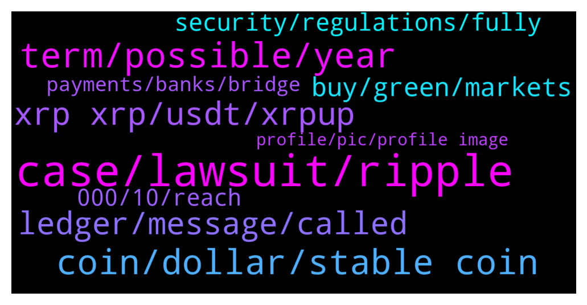

# **@Ripple**
 ## Analysis for **2022-02-06** - **2022-02-07**.

---

## 📊 **Basic Stats**

**n_messages_sent**: 269

---

---

## 🔝 **Top keywords and related messages**

1. **case, lawsuit, ripple**

    @NialPial --- *The documents regarding Garlinghouse’s emails, are published, and the public hearing is 9 February. Thats why its going wild now.* **--->** [TG Discussion](https://t.me/Ripple/3050041)

    @Sandy --- *“The reason why I still hold such a massive amount of XRP despite the sluggish price action is that I now kind of see it as a hedge against the rest of the market. If this SEC lawsuit ends – and I think it will, I don’t know when – but I think it will end ultimately favorably for Ripple and XRP and when it does end, XRP will essentially be the only crypto asset with regulatory clarity in the United States…  When the case does get settled, you can expect XRP’s price to absolutely pop. So if you’re waiting to hear the outcome of the case to jump in, you’re going to be too late. So you’re placing your bets right now and if your bet pays off and XRP wins, XRP is going to rocket, and then everything else is at the mercy of the SEC, and we don’t know what’s going to happen.”* **--->** [TG Discussion](https://t.me/Ripple/3050234)

    @XRPMUSTMOON --- *Maybe prepare due to the victory of the lawsuit immenent* **--->** [TG Discussion](https://t.me/Ripple/3049975)

    @acegeorge --- *well im sure 1 year now they had a lots of chances to get in and for the lawsuit to come to a settlement...but nothing about it* **--->** [TG Discussion](https://t.me/Ripple/3050266)

    @ReiTeh --- *Well because when the lawsuit was announced, xrp was top 3. They can't sue btc and eth because they are in on it with the SEC. So they go after the next best thing. Well it's a long and complicated story. Ppl also do speculate that the lawsuit is a way to hinder XRP growth so that the rich can get in on it first and leave nothing to the general public.* **--->** [TG Discussion](https://t.me/Ripple/3050265)

    @Voltaire123 --- *Is 10$ uberhaupt possible? I think end of Feb 2022 is to early but who knows. First lawsuit needs to be closed.* **--->** [TG Discussion](https://t.me/Ripple/3049866)

2. **term, possible, year**

    @JustNNM --- *Guess we playing the long game. One year flew by but lets hope for the best this year* **--->** [TG Discussion](https://t.me/Ripple/3050197)

    @mementoauderesempre --- *The whole week will be bullish* **--->** [TG Discussion](https://t.me/Ripple/3050241)

    @Pouyahamii --- *You mean the next 21 days???* **--->** [TG Discussion](https://t.me/Ripple/3049882)

    @XcHiLLz616 --- *Was thinking something bigger will happen* **--->** [TG Discussion](https://t.me/Ripple/3049699)

    @Russty007 --- *Is the moon going to be hyped and pass or will remain?* **--->** [TG Discussion](https://t.me/Ripple/3049769)

    @auriorajaa --- *Yeah sorry for that 😂, can i terminate the fixed term before it’s due date?* **--->** [TG Discussion](https://t.me/Ripple/3050053)

3. **coin, dollar, stable coin**

    @Riiggo --- *Thats how much i earn in intrest daily 😎* **--->** [TG Discussion](https://t.me/Ripple/3049395)

    @Juicynela --- *It's really a coin that has a future . Haha ) 😂* **--->** [TG Discussion](https://t.me/Ripple/3049445)

    @ReiTeh --- *You are making me look broke Harambe* **--->** [TG Discussion](https://t.me/Ripple/3049396)

    @zurik86 --- *Don't pay attention to others here, some people laugh at what you say and don't even dream that xrp soared to the moon, they tell me one dollar is enough or five dollars, that's what I'll say, I don't know what the price will be, but I hope that xrp was in the first place and that each of us is proud that we own this coin* **--->** [TG Discussion](https://t.me/Ripple/3049663)

    @Riiggo --- *Lol you do not have 10 you are joking with me haha* **--->** [TG Discussion](https://t.me/Ripple/3049398)

    @Sarashoba05 --- *Do u know how much the MC...even now to reach $1 fucking hard..* **--->** [TG Discussion](https://t.me/Ripple/3049424)

4. **xrp xrp, usdt, xrpup**

    @XRPMUSTMOON --- *Why many people hate XRP? ( I HODL XRP )* **--->** [TG Discussion](https://t.me/Ripple/3049836)

    @jared1996z --- *Xrp is up +20% today. Where the fudders and haters?* **--->** [TG Discussion](https://t.me/Ripple/3050040)

    @zurik86 --- *Tell the guys where the xrp stores on the trust wallet securely or not for a long time* **--->** [TG Discussion](https://t.me/Ripple/3049676)

    @Will77 --- *Can someone tell me what is XRPUP and XRPDOWN on Binance please ?* **--->** [TG Discussion](https://t.me/Ripple/3050064)

    @Jakes1993 --- *When xrp runs away from the rest🚀* **--->** [TG Discussion](https://t.me/Ripple/3049837)

    @NewEraBoxing --- *It is to do with XRP* **--->** [TG Discussion](https://t.me/Ripple/3049598)

5. **ledger, message, called**

    @Robert --- *Why do you guys from on here keep messaging me huh 😒?* **--->** [TG Discussion](https://t.me/Ripple/3049431)

    @anuj90322 --- *I just got myself ledger nano s* **--->** [TG Discussion](https://t.me/Ripple/3049677)

    @Will77 --- *Same but nano X oooo flex 😂 I feel pretty secure with Ledger* **--->** [TG Discussion](https://t.me/Ripple/3049680)

    @ObiT3r --- *Ok. I am just grumbling haha* **--->** [TG Discussion](https://t.me/Ripple/3050230)

    @JustNNM --- *Treat anyone that messages you as a scammer.   Also please add a @Username as per the group rules in the pinned message* **--->** [TG Discussion](https://t.me/Ripple/3049435)

    @nothing_void_0 --- *Yes, and it's called as Memo.* **--->** [TG Discussion](https://t.me/Ripple/3049586)

6. **buy, green, markets**

    @JustNNM --- *Allot of the market is having a green day* **--->** [TG Discussion](https://t.me/Ripple/3050187)

    @XcHiLLz616 --- *Any thinking this months spiking in the market a pump n dump by whales especially knowing new investors are participating?* **--->** [TG Discussion](https://t.me/Ripple/3049693)

    @ReiTeh --- *Remember to have money on the side Incase it dips! If I was a whale, when everyone is bullish, I would sell and short the market. That way I can buy at a lower price.   I personally nvr likes when it pumps. I thrive when it's low so I can bag more. If it goes up I wouldn't buy it and I just have to sit on my hands.* **--->** [TG Discussion](https://t.me/Ripple/3050274)

    @Riaje2 --- *I wait the next dip to buy. DCA ;)* **--->** [TG Discussion](https://t.me/Ripple/3050275)

    @RobiBobi1 --- *So ther must be something else and not just the market* **--->** [TG Discussion](https://t.me/Ripple/3050158)

    @Jakes1993 --- *Us markets open a bit later lets see if there is more movement* **--->** [TG Discussion](https://t.me/Ripple/3049984)

7. **security, regulations, fully**

    @Varicks --- *for the courts to decide, but in the eyes of sec most crypto is security* **--->** [TG Discussion](https://t.me/Ripple/3050215)

    @acegeorge --- *crypto regulations would include stuff like? report all ur crypto etc?* **--->** [TG Discussion](https://t.me/Ripple/3050271)

    @acegeorge --- *I saw a video that Garry was saying that most likely a lot of coins are securities* **--->** [TG Discussion](https://t.me/Ripple/3050198)

    @Varicks --- *if you pre mine to sell, or presale, then security* **--->** [TG Discussion](https://t.me/Ripple/3050213)

    @ReiTeh --- *Without crypto regulations, no one truly can rule in favor of any party as there is no such crypto laws yet* **--->** [TG Discussion](https://t.me/Ripple/3050270)

    @Tinkabellagal --- *Courts will decide what are securities Not us* **--->** [TG Discussion](https://t.me/Ripple/3050219)

8. **000, 10, reach**

    @SimoneLeoni26 --- *To reach $ 10, XRP would need a larger market cap than ETH's current one* **--->** [TG Discussion](https://t.me/Ripple/3050148)

    @XRPMUSTMOON --- *$XRP = $100 End of Q1 2022. Could??* **--->** [TG Discussion](https://t.me/Ripple/3049929)

    @Ogdoadic --- *what would the face of the owner of 200,000+ XRP look like?* **--->** [TG Discussion](https://t.me/Ripple/3049555)

    @brownpilled --- *How much will JPM, C, BAC and others big US pay your for your XRP?!* **--->** [TG Discussion](https://t.me/Ripple/3049637)

    @zurik86 --- *Xrp will reach $1,000 or not* **--->** [TG Discussion](https://t.me/Ripple/3049630)

    @brownpilled --- *I guess with XRP at $1000, mcap doesn’t really matter* **--->** [TG Discussion](https://t.me/Ripple/3049629)

9. **payments, banks, bridge**

    @ObiT3r --- *And buying xrp is not the same as an investment in the co, cos xrp affords u no rights in the co conventionally associated with share ownership. Not even close to rights as a debenture holder of a company.* **--->** [TG Discussion](https://t.me/Ripple/3050222)

    @santa_domenica --- *Can I send messages within a xrp transaction?* **--->** [TG Discussion](https://t.me/Ripple/3049583)

    @Cointh88 --- *Why Ripple’s XRP price hasn’t detached from Bitcoin yet? – JP Morgan report answers  “From what we can tell, Ripple has been working with banks to help them build infrastructure to make cross-border payments but few are using Ripple’s actual cryptocurrency to execute them”.  https://financefeeds.com/ripples-xrp-price-hasnt-detached-bitcoin-yet-jp-morgan-report-answers/* **--->** [TG Discussion](https://t.me/Ripple/3050078)

    @ObiT3r --- *And if there is regulatory clarity on xrp, it doesnt mean that the other cryptos will be left naked. Simply because the decision in xrp would have established parameters as to what constituttes security which can be applied vis a vis other coins. Again my two cents worth* **--->** [TG Discussion](https://t.me/Ripple/3050247)

    @ObiT3r --- *I think xrp is better seen as a product which the company sells to do what the co has set out to do... Facilitate money trannsfers* **--->** [TG Discussion](https://t.me/Ripple/3050229)

    @ZLee337 --- *We are little guys.  Imagine banks dropping millions into xrp to move payments.  This has yet to happen yet but it will very soon.* **--->** [TG Discussion](https://t.me/Ripple/3049949)

10. **profile, pic, profile image**

    @acegeorge --- *What’s the case with the rule of public pic? Any real reason ?* **--->** [TG Discussion](https://t.me/Ripple/3050188)

    @zurik86 --- *These sources tell the truth or lies* **--->** [TG Discussion](https://t.me/Ripple/3049644)

    @Jake_ripple_XRP --- *They are only pictures... and the "bot" says they are fake news...* **--->** [TG Discussion](https://t.me/Ripple/3049645)

    @JustNNM --- *You need to go to settings then privacy and set your Profile photo to Everybody because right now its not visible* **--->** [TG Discussion](https://t.me/Ripple/3049508)

    @anuj90322 --- *Can I use this picture or is this copyrighted* **--->** [TG Discussion](https://t.me/Ripple/3049496)

    @Jake_ripple_XRP --- *Have we got sources for these images you've posted?* **--->** [TG Discussion](https://t.me/Ripple/3049641)

