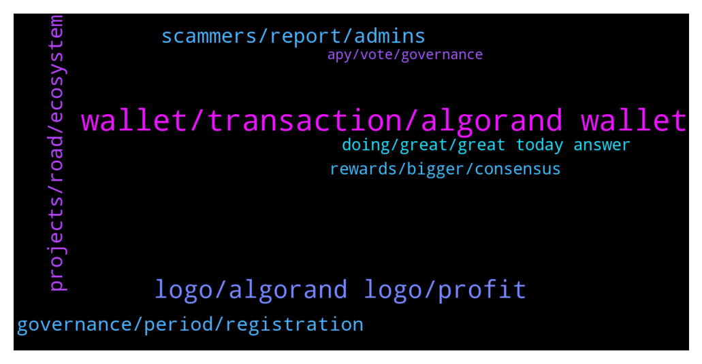

# **@algorand**
 ## Analysis for **2022-02-06** - **2022-02-07**.

---

## 📊 **Basic Stats**

**n_messages_sent**: 132

---

---

## 🔝 **Top keywords and related messages**

1. **wallet, transaction, algorand wallet**

    @angelo9007 --- *You can simply google official algorand wallet* **--->** [TG Discussion](https://t.me/algorand/337104)

    @yunusp24 --- *I tried to vote and proff to my wallet but why can't* **--->** [TG Discussion](https://t.me/algorand/337386)

    @Shane --- *Open the algorand app on the ledger.* **--->** [TG Discussion](https://t.me/algorand/337346)

    @Alfalfaseeker --- *how do I buy algo coins on ETH? my meta mask is not letting me transfer my USDT coins* **--->** [TG Discussion](https://t.me/algorand/337317)

    @fkyshow --- *Having this issue with wallet connect recently* **--->** [TG Discussion](https://t.me/algorand/337109)

    @The Dude --- *Please confirm transaction in Algorand wallet and nothing happens* **--->** [TG Discussion](https://t.me/algorand/337131)

2. **logo, algorand logo, profit**

    @JR_GB --- *''for community purposes only, including merchandise'' what does that mean?* **--->** [TG Discussion](https://t.me/algorand/337231)

    @JR_GB --- *does that mean that someone cant sell something with the Algorand logo for profit?* **--->** [TG Discussion](https://t.me/algorand/337225)

    @JR_GB --- *great so would someone be able to sell merch with the logo in some way?* **--->** [TG Discussion](https://t.me/algorand/337222)

    @randygona --- *not the time yet, wait for a few days then buy* **--->** [TG Discussion](https://t.me/algorand/337232)

    @NightAlgorand --- *It means that you can produce merchandise but it has to be non-profit I believe* **--->** [TG Discussion](https://t.me/algorand/337239)

    @JAmesruq --- *it seems they start to grow a little, maybe now is the time. What to buy? I want to long-term invest into some cmc top coin* **--->** [TG Discussion](https://t.me/algorand/337233)

3. **scammers, report, admins**

    @Malnum --- *wow this channel is full of scammers* **--->** [TG Discussion](https://t.me/algorand/337343)

    @MackDenver --- *Hello Panda, please contact us from our website regarding this* **--->** [TG Discussion](https://t.me/algorand/337204)

    @Am --- *🚨 People who are contacting me claiming are algo admins, you'll get only block and report, stop* **--->** [TG Discussion](https://t.me/algorand/337215)

    @fkyshow --- *Thanks, i didn't even bother to engage. Just blocked and deleted them all* **--->** [TG Discussion](https://t.me/algorand/337150)

    @MackDenver --- *Please do report the account and stay safe* **--->** [TG Discussion](https://t.me/algorand/337147)

    @fkyshow --- *Thanks, foolish scammers DMing already, lol* **--->** [TG Discussion](https://t.me/algorand/337112)

4. **projects, road, ecosystem**

    @MackDenver --- *Hi Ebuka, start building on Algorand. The community is ready to engage with quality projects.* **--->** [TG Discussion](https://t.me/algorand/337327)

    @Crypto_Wizardmon --- *But what abt road map ?* **--->** [TG Discussion](https://t.me/algorand/337354)

    @DunchiofMars --- *Hey I have a project I want to build on Algorand. How do I engage with the community?* **--->** [TG Discussion](https://t.me/algorand/337326)

    @Crypto_Wizardmon --- *Where to find road map and tokenomics please?* **--->** [TG Discussion](https://t.me/algorand/337350)

    @MackDenver --- *You can start from here: https://developer.algorand.org/.* **--->** [TG Discussion](https://t.me/algorand/337329)

    @MackDenver --- *Applications are now open for the eMerge Americas 2022 Global Startup Showcase!   With innovation accelerating across Miami’s thriving tech ecosystem, we are excited to continue to empower founders and developers building applications and solutions of the future: https://www.prnewswire.com/news-releases/emerge-americas-partners-with-algorand-florida-funders--panoramic-ventures-for-the-2022-global-startup-showcase-301471124.html* **--->** [TG Discussion](https://t.me/algorand/337349)

5. **governance, period, registration**

    @saqibxp --- *Thanks for the clarification. Is there a guide to how we can stake in governance? I currently stake on my Ledger.* **--->** [TG Discussion](https://t.me/algorand/337361)

    @peroz1 --- *Hello, anyone know when is the next sign up date for governance?* **--->** [TG Discussion](https://t.me/algorand/337283)

    @Discretionn --- *I'm being lazy, I probably should just check for mtself, can I jump in on governance at any time or is it only specified times when you have to be locked in by?* **--->** [TG Discussion](https://t.me/algorand/337143)

    @Martin --- *Has there been any official info about why Sean Lee left?* **--->** [TG Discussion](https://t.me/algorand/337247)

    @MackDenver --- *You can only join the governance during the registration period which starts at the beginning of each quarter. You can't participate in the current governance phase. For more info on the governance, check the link below  https://governance.algorand.foundation* **--->** [TG Discussion](https://t.me/algorand/337362)

    @MackDenver --- *You will need to join the governance during the Registration period. They usually start at the beginning of each quarter.* **--->** [TG Discussion](https://t.me/algorand/337144)

6. **doing, great, great today answer**

    @Shane --- *And what a good Monday it is.* **--->** [TG Discussion](https://t.me/algorand/337322)

    @AKBARIIN --- *Hi, can you answer my question?* **--->** [TG Discussion](https://t.me/algorand/337040)

    @MackDenver --- *Hi there, glad to see you.* **--->** [TG Discussion](https://t.me/algorand/337334)

    @MackDenver --- *It's the beginning of a great week.* **--->** [TG Discussion](https://t.me/algorand/337323)

    @MackDenver --- *Hi there, what are you taking about?* **--->** [TG Discussion](https://t.me/algorand/337339)

    @MackDenver --- *Everything is alright here. How are you doing?* **--->** [TG Discussion](https://t.me/algorand/337336)

7. **rewards, bigger, consensus**

    @Victor --- *With algorand getting bigger and bigger who will tell whether the participants will be honest or not without any rewards* **--->** [TG Discussion](https://t.me/algorand/337369)

    @saqibxp --- *Can anyone provide me clarification on why the ALGO staking rewards have dropped to less than 1%?* **--->** [TG Discussion](https://t.me/algorand/337358)

    @zoran --- *Hello. How big are algo rewards now for holding algos?* **--->** [TG Discussion](https://t.me/algorand/337175)

    @MackDenver --- *The consensus protocol will remain the same. Instead of the staking reward, we have introduced governance where the participants can get rewarded on their ALGO.* **--->** [TG Discussion](https://t.me/algorand/337371)

    @Victor --- *Why are there no incentives at the moment por participating in consensus? Is algorand going to change it?* **--->** [TG Discussion](https://t.me/algorand/337368)

    @👽 --- *reward system is changing to once a quartal. you need to stake in governance to have bigger %* **--->** [TG Discussion](https://t.me/algorand/337359)

8. **apy, vote, governance**

    @MackDenver --- *Hello there, did you join the current governance and committed ALGO? You have to vote on each governance phase if you want to get APY.* **--->** [TG Discussion](https://t.me/algorand/337377)

    @MackDenver --- *The APY was reduced some time ago to less than 1%. You can participate in the governance instead for a better APY* **--->** [TG Discussion](https://t.me/algorand/337142)

    @ceonen --- *So is still possibile to vote/get.apy this time? No need to wait the next round?* **--->** [TG Discussion](https://t.me/algorand/337391)

    @ceonen --- *So guys, now i misr wait the next governance to be able to vote and so getting apy? I need to vote one time/year to get the rewards for 12 months? Still 6%?* **--->** [TG Discussion](https://t.me/algorand/337376)

    @zoran --- *Yeah I notice it has decreased. Thanks for answer.* **--->** [TG Discussion](https://t.me/algorand/337202)

