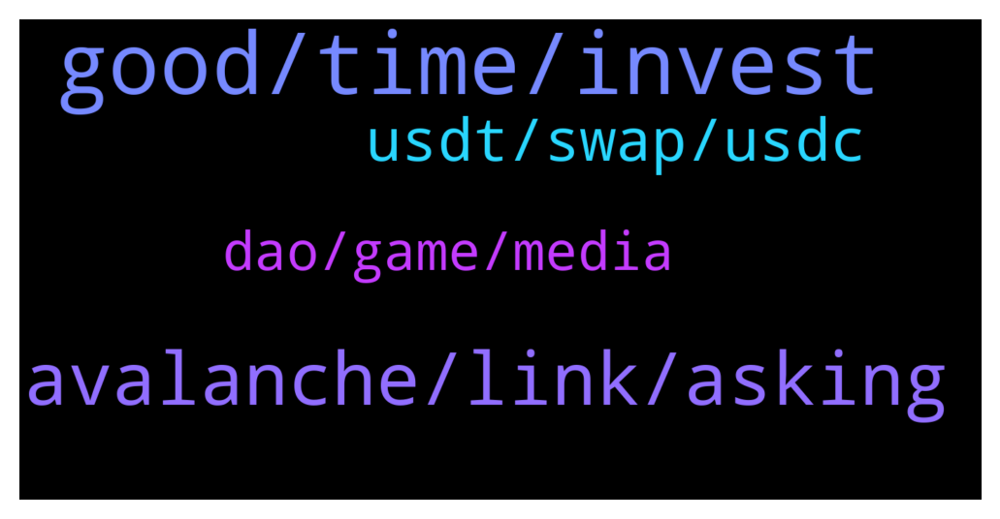

# **@avalancheavax**
 ## Analysis for **2022-02-06** - **2022-02-07**.

---

## 📊 **Basic Stats**

**n_messages_sent**: 86

---

---

## 🔝 **Top keywords and related messages**

1. **good, time, invest**

    @thedevilskin --- *Lol.. Going to invest in both. 😉* **--->** [TG Discussion](https://t.me/avalancheavax/327076)

    @Tenshu --- *You come here to shill sol 😂* **--->** [TG Discussion](https://t.me/avalancheavax/327077)

    @thedevilskin --- *Nope not interested in shilling any blockchain or coins.. I want to invest in anything which is better. I have read the whitepaper and seem avax to be very good in many aspects then sol. 🙂* **--->** [TG Discussion](https://t.me/avalancheavax/327080)

    @Nicolas_A --- *Which company ? Ava Labs ? Well there are people whose only job is to take out scams but it's not that easy there are hundreds of them and every time you delete one new ones come up* **--->** [TG Discussion](https://t.me/avalancheavax/327197)

    @cryp1223 --- *What’s wrong with wonderland (TImE) it keeps falling* **--->** [TG Discussion](https://t.me/avalancheavax/327138)

    @MuhammadHamzaNisar --- *i have already stake xava from last 4 month, how i can take apart in competition* **--->** [TG Discussion](https://t.me/avalancheavax/327005)

2. **avalanche, link, asking**

    @Baribalthedruid --- *Hi, I'd like to setup Avalanche blockchain datas in Metamask. Would you please share them?* **--->** [TG Discussion](https://t.me/avalancheavax/326955)

    @ricardogainza97 --- *Hello, could you give me a way to contact someone from support please?* **--->** [TG Discussion](https://t.me/avalancheavax/327078)

    @zombieb0yx --- *Network Name: Avalanche Network      New RPC URL: https://api.avax.network/ext/bc/C/rpc      ChainID: 43114      Symbol: AVAX      Explorer: https://snowtrace.io/* **--->** [TG Discussion](https://t.me/avalancheavax/326957)

    @Emmyology --- *Pls    Admin ..  How to get   Avalanche c chain address...??* **--->** [TG Discussion](https://t.me/avalancheavax/326964)

    @oathtobarbatos --- *You could try asking them in their Telegram channel, here's the invitation link https://t.me/avalaunch_app* **--->** [TG Discussion](https://t.me/avalancheavax/327006)

    @iwouldbediogenes --- *Did you try to ask help to the assistance ?* **--->** [TG Discussion](https://t.me/avalancheavax/326961)

3. **usdt, swap, usdc**

    @jonijonimyfren --- *Whats the different usdt and usdt.e?* **--->** [TG Discussion](https://t.me/avalancheavax/326991)

    @serafettincetin --- *hello, I sent avax from coinlist to binanceTR with c chain, but binance tr says unsupported sending and says that it cannot transfer it to the wallet.  lingers, does not find a solution.  please help what can i do.* **--->** [TG Discussion](https://t.me/avalancheavax/326960)

    @Vinh86 --- *Hello admin.  I need help. 250 days ago I got CNR to usdt swap token. but the current usdt that is not used. and it still shows up on my wallet. my question. is the data in the time 250 day that. usdt on the avax system has an event contract? and how can i use usdt token on my wallet. thank you very much* **--->** [TG Discussion](https://t.me/avalancheavax/327093)

    @oathtobarbatos --- *usdt.e is one of the bridge tokens* **--->** [TG Discussion](https://t.me/avalancheavax/326993)

    @phuboat --- *I sent UST from SOL > AVAX (0xb599c3590f42f8f995ecfa0f85d2980b76862fc1)  via wormhole. How to swap them to USDC?* **--->** [TG Discussion](https://t.me/avalancheavax/326968)

    @jonijonimyfren --- *I want to bridge my avax to bsc network* **--->** [TG Discussion](https://t.me/avalancheavax/326986)

4. **dao, game, media**

    @TerryPines --- *yeah, people that will play my story DAO game* **--->** [TG Discussion](https://t.me/avalancheavax/327125)

    @TerryPines --- *A DAO could associate an address with an identity if there is sufficient presence on social media.  Proof of personality.  Not necessarily proof of identity. Not of the person. Just at least 1 of their personalities.   But yeah. Would require sufficient public social media evidence the DAO watchers could observe* **--->** [TG Discussion](https://t.me/avalancheavax/327200)

    @TerryPines --- *Yeah this is what an identity DAO can take care of.  Only verified social media accounts* **--->** [TG Discussion](https://t.me/avalancheavax/327199)

    @Nicolas_A --- *Well you create a group and put 47k bots in it* **--->** [TG Discussion](https://t.me/avalancheavax/327193)

    @iwouldbediogenes --- *@Baribalthedruid friend are you Italian?we have a great channel in Italian if you want* **--->** [TG Discussion](https://t.me/avalancheavax/326962)

    @TerryPines --- *can i ask people to dm me about my adventure game?* **--->** [TG Discussion](https://t.me/avalancheavax/327151)

