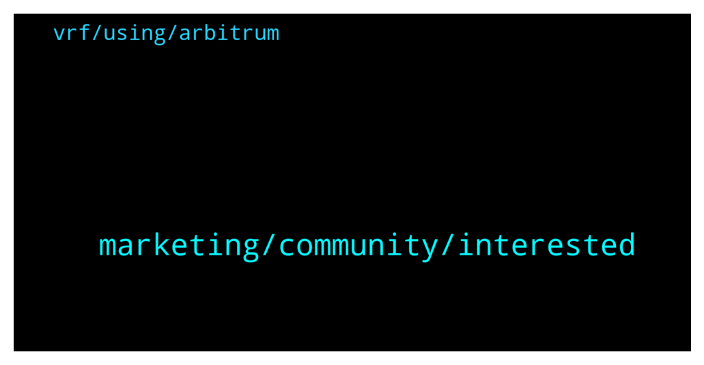

# **@chainlinkofficial**
 ## Analysis for **2022-02-06** - **2022-02-07**.

---

## 📊 **Basic Stats**

**n_messages_sent**: 40

---

---

## 🔝 **Top keywords and related messages**

1. **marketing, community, interested**

    @harrumphharrumph --- *The team does not pay third parties for marketing as they have a full marketing team internally.* **--->** [TG Discussion](https://t.me/chainlinkofficial/372120)

    @harrumphharrumph --- *https://chainlinklabs.com/jobs lists open positions if you are interested in joining the team. :)* **--->** [TG Discussion](https://t.me/chainlinkofficial/372125)

    @llSpaceXll --- *Hi  I have a marketing proposal to reach out 5 million customers. Who can I talk with.* **--->** [TG Discussion](https://t.me/chainlinkofficial/372197)

    @Sylvarantt --- *Hi there, the Chainlink Labs team doesn’t offer timelines for development targets. Although you can assume that a certain solution will be deployed on a given network when the engineering team considers that it's safe and fail-proof to do so 👍* **--->** [TG Discussion](https://t.me/chainlinkofficial/371981)

    @Nigerdelta18 --- *Who should I contact for marketing prospsal* **--->** [TG Discussion](https://t.me/chainlinkofficial/372119)

    @Nigerdelta18 --- *My team can as well joined the team for marketing* **--->** [TG Discussion](https://t.me/chainlinkofficial/372124)

2. **vrf, using, arbitrum**

    @AriKiry --- *Perhaps they announced they'll be using VRF once it's live. You can check the list of chains where VRF is live here: https://docs.chain.link/docs/vrf-contracts/* **--->** [TG Discussion](https://t.me/chainlinkofficial/371921)

    @SerecThunderson --- *do you have any idea on the timeline for implementation is? Oracles were back in august, and VRF was part of the advertising at the time* **--->** [TG Discussion](https://t.me/chainlinkofficial/371930)

    @SerecThunderson --- *Other projects are using VRF on arbitrum I'm fairly certain* **--->** [TG Discussion](https://t.me/chainlinkofficial/371919)

    @SerecThunderson --- *Can I get some support for LINK integration?  What's the price of a VRF call on arbitrum? Documentation missing.* **--->** [TG Discussion](https://t.me/chainlinkofficial/371915)

    @AriKiry --- *I believe the documentation will be available once the service is live on Arbitrum. Hopefully soon!* **--->** [TG Discussion](https://t.me/chainlinkofficial/371917)

    @roshlink --- *From what I understand, and I may not be 100%. So if someone else can add that would be great.  CCIP will be a service of Chainlink, and similar to VRF, Keepers, PoR etc, will therefore would require x amount of LINK as a “gas fee”. I’m sure, with staking, there will be some collateral required too, but not sure about this. CCIP sounds like a wrapped token on other chains? And so the regularity of the “gas fee” could be every block, or whatever is set by the protocol developers.* **--->** [TG Discussion](https://t.me/chainlinkofficial/371879)

