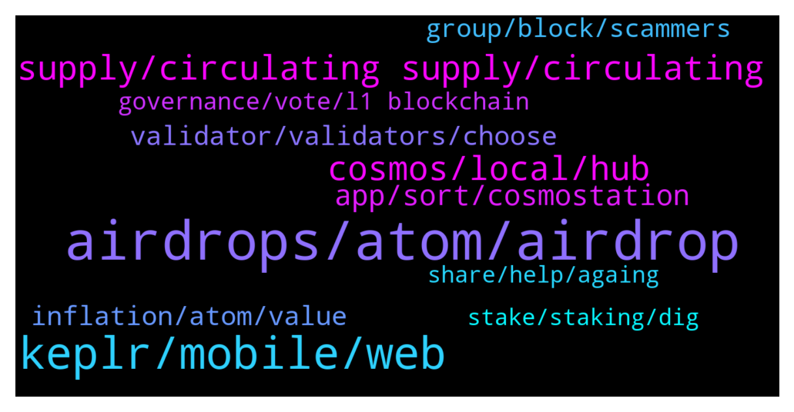

# **@cosmosproject**
 ## Analysis for **2022-02-06** - **2022-02-07**.

---

## 📊 **Basic Stats**

**n_messages_sent**: 414

---

---

## 🔝 **Top keywords and related messages**

1. **airdrops, atom, airdrop**

    @jebus97 --- *Just tell me,if i get 15 k neta airdrop,should i convert in nomic and take the 2300%apy? Lol seem to good* **--->** [TG Discussion](https://t.me/cosmosproject/487156)

    @zackmann --- *Thanks for the tips admin🙏🙏🙏.I want some of my savings to put in staking and also want to get appropriate airdrops form there.So I am finding some infos to make sure.* **--->** [TG Discussion](https://t.me/cosmosproject/487136)

    @ZoltanAtom --- *https://t.me/CosmosAirdrops unofficial airdrop group. Community driven one.* **--->** [TG Discussion](https://t.me/cosmosproject/487140)

    @MadlyGo0d --- *in order to participate in airdrops i need only to stake atom?* **--->** [TG Discussion](https://t.me/cosmosproject/486701)

    @Chicokevz --- *How many atom do I need to stake in keplr in other to receive airdrops and do the amount of atom stake determine the Amount of airdrop received?* **--->** [TG Discussion](https://t.me/cosmosproject/487313)

    @🥍 --- *I am staking my $atom in Keplr, is there anything I have to do in order to be eligible for future airdrops?* **--->** [TG Discussion](https://t.me/cosmosproject/487240)

2. **keplr, mobile, web**

    @seny --- *Ya I've been hesitant to try keplr mobile after reading the reviews but the web interface is VERY beautiful. I'm really loving how streamlined the UX for this ecosystem is* **--->** [TG Discussion](https://t.me/cosmosproject/487358)

    @CrypticPisang --- *is cosmostation better than keplr in any way?* **--->** [TG Discussion](https://t.me/cosmosproject/486615)

    @Babyy123 --- *Can I also download keplr from play store?* **--->** [TG Discussion](https://t.me/cosmosproject/486809)

    @TicoJohnny --- *There are links to Keplr and Cosmostation in the pinned post* **--->** [TG Discussion](https://t.me/cosmosproject/486853)

    @ZoltanAtom --- *Yes right. All Keplr Or Cosmoststion. Keplr mobile has limited supported chain but Cosmostation has more than 30+ supported chains.* **--->** [TG Discussion](https://t.me/cosmosproject/487356)

    @seny --- *ohhh but their all inside the Keplr interface? Thats so awesome* **--->** [TG Discussion](https://t.me/cosmosproject/487355)

3. **supply, circulating supply, circulating**

    @king_of_airdropsss --- *any correct chart of supply for reference? it's so scary after looking this chart@@* **--->** [TG Discussion](https://t.me/cosmosproject/486726)

    @king_of_airdropsss --- *I wanna figure out if the increase of Circulating supply is sudden. Therefore, I gotta find the chart to see the trend. If the circulating supply is increased crazily suddenly, it's too scary* **--->** [TG Discussion](https://t.me/cosmosproject/486732)

    @king_of_airdropsss --- *as a user/fan of atom, I hope there can be a chart to show the circulating supply* **--->** [TG Discussion](https://t.me/cosmosproject/486820)

    @king_of_airdropsss --- *the circulating supply issue hasn't solved ... any expert here? any data to show the change of circulating supply ?* **--->** [TG Discussion](https://t.me/cosmosproject/486787)

    @AtomJazz --- *You can draw it yourself. Going from 255M in 2019 to 287M now in 2022. There were no magic unlockings, only controlled inflation* **--->** [TG Discussion](https://t.me/cosmosproject/486756)

    @king_of_airdropsss --- *so what's the correct chart?    it seems too crazy* **--->** [TG Discussion](https://t.me/cosmosproject/486724)

4. **cosmos, local, hub**

    @ZoltanAtom --- *Hi there,no limit. Cosmos is Limitless.* **--->** [TG Discussion](https://t.me/cosmosproject/487152)

    @ZoltanAtom --- *Always. Devs are on Cosmos Discord. If you have any technical questions, feel free to join ;  https://discord.gg/vcExX9T* **--->** [TG Discussion](https://t.me/cosmosproject/487308)

    @grizzmccrypto --- *New to the ecosystem and was just wondering if there is a limit to the number of people who can stake on cosmos? similar to polkadot i guess* **--->** [TG Discussion](https://t.me/cosmosproject/487151)

    @AtomJazz --- *No not really. Cosmos is not one chain it's decentralized network of many interconnected chains so having such place would be hard* **--->** [TG Discussion](https://t.me/cosmosproject/487252)

    @Bobby --- *For sure! Thanks! Weirdest thing, i just got a call from cosmos customerservice 😂😂😂🤦🏽‍♂️🤦🏽‍♂️🤦🏽‍♂️* **--->** [TG Discussion](https://t.me/cosmosproject/487128)

    @Ryan --- *Hey, I'm reading the Cosmos intro right now and some of the links to Github are broken. Can someone provide me with the proper links?* **--->** [TG Discussion](https://t.me/cosmosproject/487297)

5. **app, sort, cosmostation**

    @aaaaaaaaaaaauuuuuu --- *Anyone know why the cosmostation app get blocked* **--->** [TG Discussion](https://t.me/cosmosproject/487094)

    @jebus97 --- *Dunno Bro,i can't see It,Just seen a screen 2 days ago* **--->** [TG Discussion](https://t.me/cosmosproject/487168)

    @Cordtus --- *The one really messed up one I was talking about, I tracked it down and it just sort of stopped at a relayer and sat there for probably 12 hours before returning to sender.* **--->** [TG Discussion](https://t.me/cosmosproject/486540)

    @v_vacant --- *anyone update cosmostation v1.5.36 (iOS) and instantly crash ?* **--->** [TG Discussion](https://t.me/cosmosproject/486597)

    @DAD_DEFI --- *i sent a test transaction just now* **--->** [TG Discussion](https://t.me/cosmosproject/487287)

    @Gustavo --- *Did it sort out on its own? Or did you have to take any action whatsoever* **--->** [TG Discussion](https://t.me/cosmosproject/486542)

6. **validator, validators, choose**

    @ZoltanAtom --- *The best validator is always subjective. Here are some factors that might help:  - Higher is the self bonded ratio and higher is the validator’s skin-in-the-game, that usually means that this validator has all the reasons to keep a fair attitude and the infrastructure secure  - Commission is something that depends from the validators, usually it is 0-20%. This represents the payment that the validator asks for its service. To make a pratical example, some validators, like Cosmostation and Forbole, are very active in the community and keep developing tools like the wallets and explorers, and this cost an huge amount of money at the end of the day. So I would suggest to split your funds if possible and delegate to validators that are involved in the growth of the network.  You can learn more about each validator in their profiles on the wallets and explorers.  Please avoid staking to centralized exchanges that do not contribute at all the the growth of the network and don’t vote into governance proposals.  The 8-10% is almost for everyone, feel free to use this reward calculator  https://www.stakingrewards.com/earn/cosmos  Btw commissions can be changed anytime so keep an eye on your validator via telegram or twitter* **--->** [TG Discussion](https://t.me/cosmosproject/487135)

    @AtomJazz --- *Make sure you avoid exchange validators! Other than that...The best validator is always subjective, here are some factors that might help:   - Commission Rate:  This is the % of earned rewards that go to the validator. Not the % of your total stake, just to eliminate that confusion.   - Self-Bonded rate:  This is the % of bonded ATOM that belong to the validator. Think of this as their skin in the game.   - Decentralization:  Choosing the smaller validators helps to decentralize the network which improves security overall. Again, decentralization should be a priority. On this point, centralized exchanges are not the best choice as they don't really support the network at all.   You can learn more about each validator in their profiles on the wallets and explorers.  The 8-10% is almost for everyone, feel free to use this reward calculator  https://www.stakingrewards.com/earn/cosmos  Commissions can be changed anytime so keep an eye on your validator via telegram or twitter* **--->** [TG Discussion](https://t.me/cosmosproject/486912)

    @GerryOkwy --- *Which validator is best to stake under?* **--->** [TG Discussion](https://t.me/cosmosproject/486429)

    @zackmann --- *Hi everyone.I am new to cosmos network.I want to stake some atom and hope to get furture stakedrop.I've seen about so many validator in Kepler .I have two questions. (1)Can I choose any validator to eligible furture airdrop and stake drop  (2) Should I put all in one validator or split on two or more validators.  If any minimum atom need to eligible,please let me know🙏🙏* **--->** [TG Discussion](https://t.me/cosmosproject/487132)

    @ZoltanAtom --- *Great. So you are ready to choose a validator. Just don’t forget “no exchanges validators.”* **--->** [TG Discussion](https://t.me/cosmosproject/487127)

    @TicoJohnny --- *Keplr or Cosmostation on a low commission validator.* **--->** [TG Discussion](https://t.me/cosmosproject/486484)

7. **inflation, atom, value**

    @Santos076 --- *Why  atom is so inflationary 25% since 21 aug  should consider token  burn* **--->** [TG Discussion](https://t.me/cosmosproject/487419)

    @seny --- *So ive been reading a ton into atom and am starting to see the importance of something like it in the future. Im wondering tho, where does the value come into the token? People can just integrate ibc but that doesnt give and demand to the token itself doss it?* **--->** [TG Discussion](https://t.me/cosmosproject/486833)

    @Santos076 --- *Is there plans for making atom deflationary* **--->** [TG Discussion](https://t.me/cosmosproject/487422)

    @ZoltanAtom --- *Well it’s crypto. You never know what’s is coming next.if your Atoms are all staked,you chill and relaxed. There has been many dump/pump days price went up to down,down to up. But staked Atom is not letting to have any panic. Delegating your Atom should be very long term plan.* **--->** [TG Discussion](https://t.me/cosmosproject/487078)

    @king_of_airdropsss --- *I am a die-hard fans of atom but recently i saw that scary change, which is like FED :(* **--->** [TG Discussion](https://t.me/cosmosproject/486742)

    @king_of_airdropsss --- *hey, anyone knows why the supply of atom suddenly rose for 26.5% on* **--->** [TG Discussion](https://t.me/cosmosproject/486722)

8. **group, block, scammers**

    @aaaaaaaaaaaauuuuuu --- *Thank you! Just one guy with your name contacted me in DM ahhahah . I blocked him* **--->** [TG Discussion](https://t.me/cosmosproject/487100)

    @dr_wander --- *FYI there is a fake Johnny B in the group chat and he is DMing people. Block this person and do not click any of his links* **--->** [TG Discussion](https://t.me/cosmosproject/487009)

    @Given17 --- *yep, i thought that reporting him to the group he contacted me from, was useful for administrators and users* **--->** [TG Discussion](https://t.me/cosmosproject/487231)

    @seny --- *ya I've been getting bombarded by them nonstop lol. Just joined that one that was shared here. I appreciate the heads up tho!* **--->** [TG Discussion](https://t.me/cosmosproject/487409)

    @seny --- *Damn You guys are reaching into everything. I'll look at it some more and chat in that group to stop spamming here 😅 thanks for the infos :)* **--->** [TG Discussion](https://t.me/cosmosproject/487407)

    @ZoltanAtom --- *Just always be careful when you enter new groups. Scammers are everywhere! Be mega careful please.* **--->** [TG Discussion](https://t.me/cosmosproject/487408)

9. **governance, vote, l1 blockchain**

    @seny --- *Where do you go to vote on proposals like people keep saying?* **--->** [TG Discussion](https://t.me/cosmosproject/487348)

    @ZoltanAtom --- *Each chain has their own governance token and you cast your vote for proposals at Keplr or Cosmostation wallets.* **--->** [TG Discussion](https://t.me/cosmosproject/487353)

    @eolingrav --- *why we should vote governance ? what is vote governance ?* **--->** [TG Discussion](https://t.me/cosmosproject/486586)

    @seny --- *And does each chain have their own system for governance? (for example atom, osmos, juno, etc)* **--->** [TG Discussion](https://t.me/cosmosproject/487350)

    @iamcrowne --- *Quick question: where do u participate in voting for governance on cosmos or when u delegate to a certain validator u give them permission to vote for you* **--->** [TG Discussion](https://t.me/cosmosproject/486684)

    @AtomJazz --- *Before upgrades happen they have to be approved by the governance yes* **--->** [TG Discussion](https://t.me/cosmosproject/486878)

10. **stake, staking, dig**

    @seny --- *that was so vague. You need to create demand on a token to increase value. I get the idea of staking driving demand but what makes people want to stake? Wats first movers advantage? Whats various use cases?* **--->** [TG Discussion](https://t.me/cosmosproject/486856)

    @Bobby --- *I read it, i was just getting opinions from other people.. new to staking.* **--->** [TG Discussion](https://t.me/cosmosproject/487124)

    @seny --- *Ya I guess. I'm just a bit paranoid about being dumped on. If we could see that a huge stake is being unbonded then it wouldn't come as a surprise* **--->** [TG Discussion](https://t.me/cosmosproject/487077)

    @Bobby --- *Hey question, when you stake do you always go for the highest %?* **--->** [TG Discussion](https://t.me/cosmosproject/487122)

    @seny --- *Is there anywhere to see how many coins are currently staked and how many are in the proccess of being unstaked?* **--->** [TG Discussion](https://t.me/cosmosproject/487070)

    @AtomJazz --- *Stake as much as you can obviously 😁* **--->** [TG Discussion](https://t.me/cosmosproject/486784)

