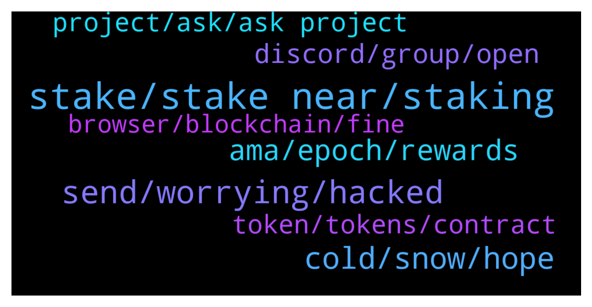

# **@cryptonear**
 ## Analysis for **2022-02-06** - **2022-02-07**.

---

## 📊 **Basic Stats**

**n_messages_sent**: 453

---

---

## 🔝 **Top keywords and related messages**

1. **stake, stake near, staking**

    @Simeon4real --- *NEAR staking on Bit store farm is available here: https://swap.bit.store/#/farm* **--->** [TG Discussion](https://t.me/cryptonear/328158)

    @oppzsmoKe --- *I have 2000 near can you give me some advice About Farming or staking What should I do to get the best returns I want to make the most out of this* **--->** [TG Discussion](https://t.me/cryptonear/327815)

    @oppzsmoKe --- *Do I add this to the farm or I have to select pools first* **--->** [TG Discussion](https://t.me/cryptonear/327453)

    @EnemchukwuGloria --- *How to stake NEAR on bit store cos I only saw bitcoin on the site* **--->** [TG Discussion](https://t.me/cryptonear/328155)

    @sasappo --- *is it safe to stake? and how long is the profit we have to stake* **--->** [TG Discussion](https://t.me/cryptonear/328104)

    @Pleasenotanotherrugpull --- *Who do you recommend for staking validators?* **--->** [TG Discussion](https://t.me/cryptonear/327726)

2. **send, worrying, hacked**

    @viratiannn --- *I haven't  particpated  but how did i received  it* **--->** [TG Discussion](https://t.me/cryptonear/328133)

    @larry_lang --- *hmm yes u can send it to the others wallet,* **--->** [TG Discussion](https://t.me/cryptonear/327408)

    @Ghazian --- *Yeah, but i don't want it* **--->** [TG Discussion](https://t.me/cryptonear/327278)

    @Ghazian --- *Well... Im worrying about it. Someone adding that to my wallet, this is beyond my knowledge...* **--->** [TG Discussion](https://t.me/cryptonear/327274)

    @larry_lang --- *Yeah i think as long as u dont touch it then it would not harmful* **--->** [TG Discussion](https://t.me/cryptonear/327300)

    @Aimer --- *What if I haven't taken it out for more than a year?* **--->** [TG Discussion](https://t.me/cryptonear/328068)

3. **cold, snow, hope**

    @butola_ravi --- *Same sir although it's Sunny day today* **--->** [TG Discussion](https://t.me/cryptonear/327213)

    @larry_lang --- *hehe my plan it's to shut in and make some hot pot to eat for the meal=)) nothings suit a cold day better than a hot pot=))* **--->** [TG Discussion](https://t.me/cryptonear/327216)

    @GeorgePro1 --- *I guess I have to keep quiet 🤐 and also stop using extreme( in terms of cold). hehe..  I can’t deal with the coldness at your side. You said snow!!  🥶* **--->** [TG Discussion](https://t.me/cryptonear/327841)

    @TheGo1denBull --- *Stay warm and snow my way a few days ago. Covered my vehicle 😣* **--->** [TG Discussion](https://t.me/cryptonear/327834)

    @GeorgePro1 --- *Harmattan is here and it’s extremely cold today 🥶.   I’m doing great.* **--->** [TG Discussion](https://t.me/cryptonear/327833)

    @larry_lang --- *Building my own frozen fortress lol=]]]* **--->** [TG Discussion](https://t.me/cryptonear/327486)

4. **ama, epoch, rewards**

    @larry_lang --- *Ah my bad 14-20 Feb , sorry about that@@* **--->** [TG Discussion](https://t.me/cryptonear/327503)

    @Lalangbuccu06 --- *Hello Admin. When will Rewards going to be distributed for Cheddar ama?* **--->** [TG Discussion](https://t.me/cryptonear/327364)

    @Kripto_Raptor --- *is that some kind of event? 😅 ?* **--->** [TG Discussion](https://t.me/cryptonear/327585)

    @Kripto_Raptor --- *I can't but I can show you the way to earn 1-5 Nears 😄 in each event* **--->** [TG Discussion](https://t.me/cryptonear/327540)

    @sasappo --- *how much u can give me😅* **--->** [TG Discussion](https://t.me/cryptonear/327536)

    @larry_lang --- *https://near-staking.com/ also u can check your reward each epoch using this site* **--->** [TG Discussion](https://t.me/cryptonear/328072)

5. **discord, group, open**

    @larry_lang --- *https://discord.gg/SBRVK5zT can u try again on the discord server?* **--->** [TG Discussion](https://t.me/cryptonear/327414)

    @Ghazian --- *It's hard to get into their Discord* **--->** [TG Discussion](https://t.me/cryptonear/327415)

    @Indro1977 --- *Where to ask questions?? On youtube??* **--->** [TG Discussion](https://t.me/cryptonear/328236)

    @NearFritz --- *You can go to jobs channel on discord and even open web sandbox too* **--->** [TG Discussion](https://t.me/cryptonear/327118)

    @NearFritz --- *You can open a ticket on discord, #custom-ticket channel* **--->** [TG Discussion](https://t.me/cryptonear/327126)

    @EJabani --- *I am in the discord channel* **--->** [TG Discussion](https://t.me/cryptonear/327136)

6. **token, tokens, contract**

    @viratiannn --- *How to delete  that token* **--->** [TG Discussion](https://t.me/cryptonear/328258)

    @viratiannn --- *Is it possible  to delete that token* **--->** [TG Discussion](https://t.me/cryptonear/328135)

    @larry_lang --- *yeah this token comes from a project called Land to Empire* **--->** [TG Discussion](https://t.me/cryptonear/328129)

    @thodo --- *Ok. But can I check token address in Near? I can do it if some token sent to my Metamask wallet. I dont know how to do that in Near.* **--->** [TG Discussion](https://t.me/cryptonear/327352)

    @luminousgreens --- *i have been able to make several deposits and to stake tokens but I am unable to withdraw/send the tokens* **--->** [TG Discussion](https://t.me/cryptonear/328276)

    @Jami2017 --- *https://www.reddit.com/r/nearprotocol/comments/smjnfa/its_near_apocalypse_everyone_wants_it/  Pls guys.. dnt forget to do the upvotes of my meme NEAR token in reddit..🙏😊* **--->** [TG Discussion](https://t.me/cryptonear/328182)

7. **project, ask, ask project**

    @larry_lang --- *well then i think @bailey_12 would have more detail about this since he is working on reddit platform* **--->** [TG Discussion](https://t.me/cryptonear/327376)

    @larry_lang --- *i think u have to check it with the project themself* **--->** [TG Discussion](https://t.me/cryptonear/328134)

    @larry_lang --- *Since from what im seeing the account related to your work as well* **--->** [TG Discussion](https://t.me/cryptonear/327303)

    @larry_lang --- *hmm can u ask the project directly about it?* **--->** [TG Discussion](https://t.me/cryptonear/327279)

    @Ghazian --- *My work? What does it mean?* **--->** [TG Discussion](https://t.me/cryptonear/327304)

    @larry_lang --- *can u elaborate more about this =))* **--->** [TG Discussion](https://t.me/cryptonear/328074)

