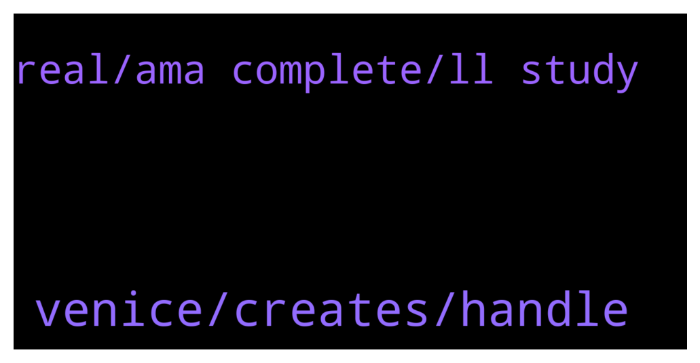

# **@defisearchpublic**
 ## Analysis for **2022-02-05** - **2022-02-07**.

---

## 📊 **Basic Stats**

**n_messages_sent**: 30

---

---

## 🔝 **Top keywords and related messages**

1. **venice, creates, handle**

    @SkyMeFly21 --- *Venice is partnering with top auditing firms including Certik to guarantee the security of users’ money* **--->** [TG Discussion](https://t.me/defisearchpublic/241493)

    @SkyMeFly21 --- *Unique in a sense of How Venice will handle securing and making private trading* **--->** [TG Discussion](https://t.me/defisearchpublic/241484)

    @SkyMeFly21 --- *In summary to that: VENI tokens will be minted at genesis. VENI token issuance master smart contract level - a per-transfer 0.2% tax policy will be enforced and sent to a blackhole address. incorporates a tax that creates clear deflation for every on-chain movement. A 5% average movement per day creates an effective deflation of 4% annually.* **--->** [TG Discussion](https://t.me/defisearchpublic/241477)

    @SkyMeFly21 --- *Yes.twas designed like that to for balance, sustainability.* **--->** [TG Discussion](https://t.me/defisearchpublic/241468)

    @CryptoMaskeRider --- *In what feature of venice this can handle frauds?* **--->** [TG Discussion](https://t.me/defisearchpublic/241492)

    @SkyMeFly21 --- *$Veni is the ticker of Venice Finance* **--->** [TG Discussion](https://t.me/defisearchpublic/241462)

2. **real, ama complete, ll study**

    @CryptoMaskeRider --- *Is this for real? Its huge for a new project.* **--->** [TG Discussion](https://t.me/defisearchpublic/241472)

    @Marcus --- *Mmm, I'll study them in more detail, thanks)* **--->** [TG Discussion](https://t.me/defisearchpublic/241546)

    @CryptoGoki_sensai --- *Better to join their community and try testnet* **--->** [TG Discussion](https://t.me/defisearchpublic/241495)

    @CryptoMaskeRider --- *Thanks. It feels like i attended their AMA. Complete details* **--->** [TG Discussion](https://t.me/defisearchpublic/241479)

    @CryptoMaskeRider --- *For real? They have collaboration with Findora?* **--->** [TG Discussion](https://t.me/defisearchpublic/241489)

