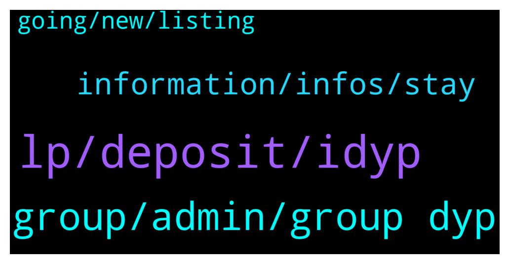

# **@dypfinance**
 ## Analysis for **2022-02-06** - **2022-02-07**.

---

## 📊 **Basic Stats**

**n_messages_sent**: 69

---

---

## 🔝 **Top keywords and related messages**

1. **lp, deposit, idyp**

    @D0nkeyKong --- *what does LP Token mean and what is the price for it? is it IDYP?* **--->** [TG Discussion](https://t.me/dypfinance/245115)

    @WatermelonNoia --- *Struggling to work this one out. I have added more LP to AVAX farm V2 90 days and it feels like my rewards has decreased compared to before i added more LP. The APY hasnt changed much the last week, nor negative price in DYP or iDYP in the past few days (noting it has decreased in price over the last month however).* **--->** [TG Discussion](https://t.me/dypfinance/245193)

    @marzyl --- *I have just removed my lp token but can’t figure out how I remove the liquidity. I have tired on pancake swap but it does not find it - can anyone point me in the right direction?* **--->** [TG Discussion](https://t.me/dypfinance/245283)

    @DhoniMSD516 --- *Sorry I still didn't get you, staking and liquidity are two different concepts.* **--->** [TG Discussion](https://t.me/dypfinance/245242)

    @Ali pajoo --- *This concept means besides increasing the security by staking you also will able to provide liquidity and your funds aren't locked* **--->** [TG Discussion](https://t.me/dypfinance/245240)

    @hemanrock --- *It can be due to the value of wbnb increased.* **--->** [TG Discussion](https://t.me/dypfinance/244983)

2. **group, admin, group dyp**

    @Solomon --- *any  available admin work for me group* **--->** [TG Discussion](https://t.me/dypfinance/245113)

    @Don_Coles --- *Hello team, is there an admin online ?* **--->** [TG Discussion](https://t.me/dypfinance/245214)

    @Kentus764 --- *Who's a defi expert here? I need assistance?* **--->** [TG Discussion](https://t.me/dypfinance/245036)

    @Caesar | heroesofnft --- *Hello.... how do I participate in IDO pls?* **--->** [TG Discussion](https://t.me/dypfinance/244997)

    @Googeec --- *hi , DYP have chinese group??* **--->** [TG Discussion](https://t.me/dypfinance/245246)

    @hosimo --- *Hi, is there any DYP burning plan ?* **--->** [TG Discussion](https://t.me/dypfinance/245080)

3. **information, infos, stay**

    @Vl_investor --- *Hi Dhoni, would like to see new information from the team on the progress of the project in the coming days in accordance with the roadmap, everyone wants to see the information, many are nervous, I know, but nevertheless we stay with you and always believe and support the team.* **--->** [TG Discussion](https://t.me/dypfinance/245052)

    @WatermelonNoia --- *If you dont mind me asking, how big is the team now?* **--->** [TG Discussion](https://t.me/dypfinance/245205)

    @DhoniMSD516 --- *Here is recent update from Tim regarding the team :) https://t.me/dypfinance/243735* **--->** [TG Discussion](https://t.me/dypfinance/245207)

    @hemanrock --- *You go through this to know more about it https://dypfinance.medium.com/staking-farming-and-buyback-v2-is-live-on-binance-smart-chain-6be89f573f19* **--->** [TG Discussion](https://t.me/dypfinance/245120)

    @DhoniMSD516 --- *Sure they will acknowledge please stay tuned :)* **--->** [TG Discussion](https://t.me/dypfinance/245241)

    @DhoniMSD516 --- *The last update I have is devs working on it, so we can expect about it soon imo :)* **--->** [TG Discussion](https://t.me/dypfinance/245202)

4. **going, new, listing**

    @DhoniMSD516 --- *Hey here is an update for your query asked yesterday :)  Everything is going according to plan; plus, other things are coming that are not included in the Roadmap. A completely new website will come, new Dapps, two new products related to staking, farming, borrow & lending, and DEX aggregator. Also, a P2E game will be launched for the CAWS collection. The team was expanded, and we are confident that all the above things will be delivered within six months. This month we are going to release an update for the Roadmap.* **--->** [TG Discussion](https://t.me/dypfinance/245275)

    @alvindrajw --- *Can we exoect tier 1 exchnage listing in February?* **--->** [TG Discussion](https://t.me/dypfinance/245066)

    @MJMuppet_JayJay --- *Heman, the Rolex give away is still open right?* **--->** [TG Discussion](https://t.me/dypfinance/244987)

    @Al19bn --- *btc price is going up,  now is good time for listing.* **--->** [TG Discussion](https://t.me/dypfinance/245286)

    @DhoniMSD516 --- *@alvindrajw I know you are so excited for exchanges, trust me it will come, we cannot say any dates because as said multiples the listing decision when to list is on exchange side* **--->** [TG Discussion](https://t.me/dypfinance/245068)

