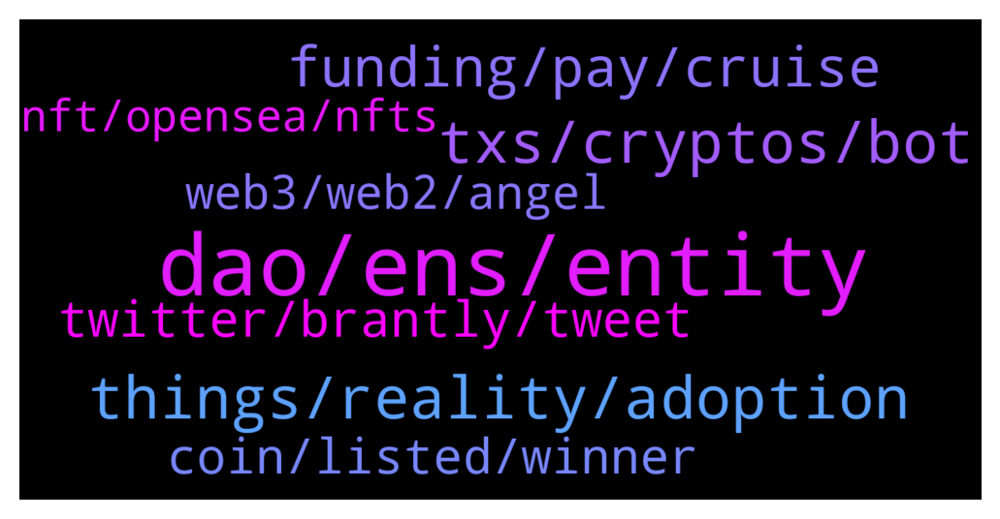

# **@lobsters_chat**
 ## Analysis for **2022-02-06** - **2022-02-07**.

---

## 📊 **Basic Stats**

**n_messages_sent**: 362

---

---

## 🔝 **Top keywords and related messages**

1. **dao, ens, entity**

    @ivangbi --- *I can’t really agree here, because:  he wasn’t removed from the dao nor was his ens tokens were taken away (imagine lmao) - he was just removed from the web 2 entity  But the public is dumb as always so they will mix the two. Ens should probably communicate better that it was not a dao move hence does not concern the dao, the non profit just decided this. That’s all* **--->** [TG Discussion](https://t.me/lobsters_chat/323757)

    @alexinlife --- *Organizations are criticized by an opposing section for both taking action or not taking action upon pressure from a subset of the public (Uber/Google on women empowerment). The question is whether the Foundation's move was a knee-jerk reaction to public opinion (which you assume here) or its own call to stand by certain values and taking a call when evidence of a member violating those values came to light by its own accord. Its already clear that the Foundation and DAO are 2 different entities and the Foundation can have its own values and decision making process.* **--->** [TG Discussion](https://t.me/lobsters_chat/323763)

    @vorot93 --- *But this also means is that DAO is not truly in control of ENS assets and goodwill, there's at least one other entity which is ruled by private individuals* **--->** [TG Discussion](https://t.me/lobsters_chat/323718)

    @vorot93 --- *If there's a web2 entity left behind which is not controlled by DAO, then the whole thing is decentralization in name only* **--->** [TG Discussion](https://t.me/lobsters_chat/323740)

    @vorot93 --- *The dark truth is DAO does have org to back it up IRL and its board of directors can ignore DAO at its own whim* **--->** [TG Discussion](https://t.me/lobsters_chat/323707)

    @cactushoes --- *Seems like awaiting on true colors to emerge after "contentious" or "non politically correct" views of influential members of daos is now the best method to determine whether a project  is truly decentralized... New definition of a DAO? When a shadow centralized decision maker does not emerge..* **--->** [TG Discussion](https://t.me/lobsters_chat/323779)

2. **things, reality, adoption**

    @ivangbi --- *This is the story of every L1. Some of us in 2018 who didn't grasp it all and believed it (was me!) - moved on and stopped w the narrative while moving goalposts. Others continue to larp into the normie world. Watch out for ESG posts to pump shitcoins, AI, and stuff like that.* **--->** [TG Discussion](https://t.me/lobsters_chat/323804)

    @FiveBoroughs --- *I think the real solution is more about educating the newcomers about the culture of our space. And less about getting angry at cancel attempts.* **--->** [TG Discussion](https://t.me/lobsters_chat/323647)

    @juju1234534 --- *I believe it’s actually rather the opposite. When things stop working people start digging why it’s not working. In the process they may well end up discovering what Infura is and why things like Pokt are a potential improvement to it (due to decentralization).* **--->** [TG Discussion](https://t.me/lobsters_chat/323408)

    @ivangbi --- *Yes tragedy of the commons, we been over it and I dunno if anybody has a good solution to it yet? So I am not sure what we can be discussing even* **--->** [TG Discussion](https://t.me/lobsters_chat/323810)

    @vorot93 --- *but this does not inspire public confidence* **--->** [TG Discussion](https://t.me/lobsters_chat/323746)

    @ivangbi --- *Idk, not seeing any of those *concerns* actually be real* **--->** [TG Discussion](https://t.me/lobsters_chat/323535)

3. **txs, cryptos, bot**

    @Jorgemartinez --- *I'm sure the timing of this is pure coincidence and the actors being hurt by what crypto upholds won't leverage these situations in their favor at all. Never give them one inch of ground.* **--->** [TG Discussion](https://t.me/lobsters_chat/323782)

    @cypher42069 --- *bandwagoners/latercomers always try to ruin the very foundation of what makes crypto valuable - such as privacy.. anonymity... Soon these cancel culture types in Ethereum will be calling for more regulations.* **--->** [TG Discussion](https://t.me/lobsters_chat/323630)

    @tesslerc --- *It's actually interesting. Most of the TXs is bots (unless we believe there are users spamming TXs for 1000s of TPS).  So in a permissionless ledger how could you prevent bots or make it harder for spamming? (rate limit).  - Prioritize TXs / addresses? = just ignore the spam if you can somehow classify it. - Add "proof of work" as a computational effort to each TX to slow down individual senders = somewhat similar to increasing costs, so not clear... - ?  Would this even be useful? tbh no idea. But eventually I believe people will find a solution. Otherwise we fooked 😄* **--->** [TG Discussion](https://t.me/lobsters_chat/323817)

    @tandeloff --- *Talking to people who do ~same in crypto helps to stay motivated, large difference with online text communication for me  Also: irl cowork with team members* **--->** [TG Discussion](https://t.me/lobsters_chat/323490)

    @Sunny --- *I was asked if i wanted to live in a crypto hacker house, could you imagine anything worse than not being able to unplug? I'd go insane being surrounded by endless defi / nft chatter* **--->** [TG Discussion](https://t.me/lobsters_chat/323462)

    @Rider_54 --- *And all days all cryptos are compared.against the fixed date of 31-01-2020* **--->** [TG Discussion](https://t.me/lobsters_chat/323862)

4. **funding, pay, cruise**

    @limfx8 --- *A typical 10-year VC fund would:)* **--->** [TG Discussion](https://t.me/lobsters_chat/323561)

    @Cryptoaq --- *How can be profitable with the funding rates?* **--->** [TG Discussion](https://t.me/lobsters_chat/323415)

    @tesslerc --- *How much is a long time? A year?* **--->** [TG Discussion](https://t.me/lobsters_chat/323540)

    @SD107 --- *These are pretty amazing actually, usually for atom stakers, osmosis LPs and juno Stakers, I have received more in aidrops than I originally invested only in the last couple of months* **--->** [TG Discussion](https://t.me/lobsters_chat/323907)

    @coine_r --- *Heh, you're already familiar my stance on that chain (or at least its history) 😅  But success is failure when the only thing people can pay fees in can x100* **--->** [TG Discussion](https://t.me/lobsters_chat/323809)

    @sonicblend --- *$450M is a big raise... https://www.cnbc.com/2022/02/07/sequoia-leads-400-million-investment-in-crypto-project-polygon.html* **--->** [TG Discussion](https://t.me/lobsters_chat/323930)

5. **twitter, brantly, tweet**

    @arncarr --- *This is the third Taylor tweet linking sushi issues to Wonderland. Anyone know why?* **--->** [TG Discussion](https://t.me/lobsters_chat/323713)

    @Pleyuh --- *how were brantly's olds tweets found suddenly?* **--->** [TG Discussion](https://t.me/lobsters_chat/323665)

    @vPEPO --- *the hypocrisy here lmao  fireeyesdao.eth (cooopahtroopa & co) is proposing to remove Brantly from its position  https://discuss.ens.domains/t/ens-dao-next-steps-re-brantly/10424?s=09* **--->** [TG Discussion](https://t.me/lobsters_chat/323589)

    @Guatemalala --- *yeah i dont think brantly has handled this well...his defense at-least.* **--->** [TG Discussion](https://t.me/lobsters_chat/323655)

    @Pleyuh --- *brantly didnt even apologize, Cooopahtroopa was 15 or so when he went through his gangsta phase and still got cancelled after all his contribution. wild.* **--->** [TG Discussion](https://t.me/lobsters_chat/323652)

    @jrFFDDD --- *dude digged up a 6 year old tweet of brantly being x-phobic  people trying to remove him from ens  yadayadayada* **--->** [TG Discussion](https://t.me/lobsters_chat/323682)

6. **coin, listed, winner**

    @Jorgemartinez --- *Filters would be nice. For example to exclude big mcap coins* **--->** [TG Discussion](https://t.me/lobsters_chat/323870)

    @Rider_54 --- *The first day the coin was imported* **--->** [TG Discussion](https://t.me/lobsters_chat/323865)

    @Rider_54 --- *For me many times i see a coin and i wonder where did it came from and how got there. If i could have catched when it was in lower ranks for example….* **--->** [TG Discussion](https://t.me/lobsters_chat/323855)

    @Rider_54 --- *If a coin grows consinstenly in time i suppose it is for a reason, therefore i can check that coin and investigate the project further* **--->** [TG Discussion](https://t.me/lobsters_chat/323854)

    @Rider_54 --- *The counter for the days winner is to avoid the pumps and dumps. The more time the coin is listed winner the more organic the grow is supposed to be* **--->** [TG Discussion](https://t.me/lobsters_chat/323850)

    @Rider_54 --- *The tools detects those fast moving coins that grow fast in time before they come to the first positions* **--->** [TG Discussion](https://t.me/lobsters_chat/323847)

7. **web3, web2, angel**

    @banteg --- *wen will people start protecting web3 values? the space is experiencing an abhorrent takeover* **--->** [TG Discussion](https://t.me/lobsters_chat/323605)

    @ivangbi --- *web2 angel w web3 angel investing* **--->** [TG Discussion](https://t.me/lobsters_chat/323514)

    @vorot93 --- *Also, remember that deplatforming started with nazis, but now anyone can get banned from web2 for going against party line on COVID  Same will happen to web3* **--->** [TG Discussion](https://t.me/lobsters_chat/323781)

    @Pleyuh --- *we just started shaping the web3 values* **--->** [TG Discussion](https://t.me/lobsters_chat/323607)

    @Pleyuh --- *"we will shape the future of web3 TOGETHER"* **--->** [TG Discussion](https://t.me/lobsters_chat/323600)

    @sneg55 --- *making smart choices in web2 angel investing vs. just be early in web3 and put as many bets as you can* **--->** [TG Discussion](https://t.me/lobsters_chat/323526)

