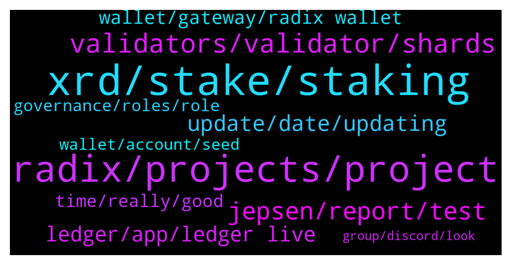

# **@radix_dlt**
 ## Analysis for **2022-02-06** - **2022-02-07**.

---

## 📊 **Basic Stats**

**n_messages_sent**: 425

---

---

## 🔝 **Top keywords and related messages**

1. **xrd, stake, staking**

    @CrypViskosity --- *Dear Radix Community, We have posted a Downtime Repost on our website for those of you who are interested in further details. Additionally, we have just created a Google Document for all of those who were delegators to Viskosity Staking during the down time and would like to receive a portion of the 10,000 XRD that has been allocated from our own wallet to be distributed to the people who were staked. If you choose not to participate because of your status as a “whale” then your generosity is appreciated and it will provide a larger compensation for some of the other delegators. There is a link to the document in the Downtime Report on our website but we will also provide it below. Please copy and paste it into your browser. https://docs.google.com/forms/d/e/1FAIpQLSe8DAC0ZlbfhiYa3m5-i7HwZdb_YawvnlHdXuUEIqKyTd2DvQ/viewform?usp=sf_link  This  link will be valid for the next 7 days (until 2/13/2022) so we can get the compensation to those affected as soon as possible. We will also continue to post this message for the next 7 days to alert as many people as we can. Thank you as always for the feedback from the Radix Community. -Viskosity Staking* **--->** [TG Discussion](https://t.me/radix_dlt/351945)

    @Radstakes --- *I would advise staking on nodes with less than 2% stake to improve decentralisation. Choose a few with high uptime. Also check out this post for some pointers: https://radixtalk.com/t/how-do-i-choose-which-validators-to-delegate-stake-to/140?u=faraz* **--->** [TG Discussion](https://t.me/radix_dlt/351683)

    @butterkeks27 --- *Hey everyone, newcomer question incoming: what's the best way to transfer my EXRD (on KuCoin) to XRD and send it to my Radix Wallet? Thanks!* **--->** [TG Discussion](https://t.me/radix_dlt/352004)

    @Char_0x --- *What is the best way to buy radix xrd? Through bitfinex or is there any other way because I don't have bitfinex account* **--->** [TG Discussion](https://t.me/radix_dlt/352209)

    @ITProfligate --- *Part 5 - Other networks (https://t.me/radix_dlt/327491): Internet Computer / Dfinity, IOTA, Holo, Mina, Nano, Casper, COTI, NKN, QuarkChain, Glitch, Zenon, Elastos, Saito, Plasma, QANplatform, Koinos, Shardus, Cypherium, Xeta Reality, Hypergraph, ManaFlow, T3RN, Facebook Diem/Libra* **--->** [TG Discussion](https://t.me/radix_dlt/351656)

    @Natethegreat762 --- *So what would you need to double spend? Or take the network down?* **--->** [TG Discussion](https://t.me/radix_dlt/351709)

2. **radix, projects, project**

    @BlAzAk --- *This is a (not) small message to express my displeasure.  As you know, I have been developing tools used by the community for a few years now. GetRadix for those who knew it, airdrop scripts (DogeCube, DIX, etc...), some community projects (backend) and my own projects like XIDAR (token creator, wallet) and Radix Collection (NFTs, collection) .  All these projects only go in one direction: to promote the use of the network. The perfect example is Radix Collection which lets you earn badges based on your activity on the network. With absolutely NOTHING to gain for us. We were counting on donations made to the project with the Backer badge to recover some money (transaction fees and token creation are not free for us either). But that was, with the exception of friends, very disappointing. I remind you that everything is on the ledger, we have NO database.  So we released our NFT collection playing a role in our game. There are sales but not with the same enthusiasm as some new projects. A little disappointing I admit.  We are currently developing an NFT and token marketplace (cross projects) as well as a browser and mobile wallet. No worries, it will be deployed soon.  Regarding XIDAR, our node is among the best performers on the network thanks to Kesswitz and we take 0% fees. That doesn't stop people from staking at ALLNODES... disappointing.  Here are some projects created with the XIDAR token creator: DIX, XSEED, SAMUSKY, HOARD, ELICOIN, DREAMIX, ENTERTHERADTRIX (ALL), NATTYRADISHES, RADLABS, RADAPE, RATIX, MAFIA, RADTHINGS, RADIXVILLE, ROOTMATERIALS, RADICALPENGUINS, ROIDBOIZ, DAPPERDASHUNDS, RADSTAKES A total of 122 tokens that have been created. We only take 150 XRD in fees on each token. So we earned 18k XRD. How much have these projects generated?  We think we are invested in the community but our patience has some limits. Enriching others does not interest us. And since the official team doesn't seem to want to pay attention to the ONLY project really using their network (Radix Collection), we decided to increase the creator token fee to 2100XRD per creation. From tomorrow 00:00 (Paris).  Also, on March 1, Radix Collection will no longer be free. It will be necessary to have "Backed" 100XRD minimum or to have purchased at least 1 NFT. Of course people who already have the Backer badge will remain registered. The marketplace will be usable ONLY by people registered on RadixCollection.* **--->** [TG Discussion](https://t.me/radix_dlt/351664)

    @Rusty --- *Radix DLT Official Announcements Radix - Layer 1 DeFi done right https://t.me/RadixAnnouncements* **--->** [TG Discussion](https://t.me/radix_dlt/352190)

    @prookie --- *https://www.reddit.com/r/CryptoCurrency/comments/sl3h00/why_i_believe_we_are_all_still_a_decade_early_to/ jump into this. radix is the solution for the things they are arguing about* **--->** [TG Discussion](https://t.me/radix_dlt/351630)

    @Kansuler --- *🔥 Don't miss out on all the cool community projects on Radix! 🔥  Get to know what's being built, and be first to get involved.  Subscribe to Radix List announcement channel  Visit https://www.radixlist.com* **--->** [TG Discussion](https://t.me/radix_dlt/351783)

    @Jazzer9F --- *The Community Pulse Survey is back!  We’d love to learn a bit about you and get your feedback on how we can improve the Radix Community.   Answers are anonymous, and detailed feedback is appreciated.   👉 https://forms.gle/b1ih58gmhmJd1yxz6 👈* **--->** [TG Discussion](https://t.me/radix_dlt/351779)

    @Jazzer9F --- *In the 4th installment of his Alexandria blog series, Chief Product Officer at Radix, Matthew Hine, describes how Radix is building the foundation of a new world where #DeFi dApps can scale without limit. 🚀  👉 https://www.radixdlt.com/post/how-radix-engine-is-designed-to-scale-dapps* **--->** [TG Discussion](https://t.me/radix_dlt/352236)

3. **validators, validator, shards**

    @Radstakes --- *I agree with the sentiment though completely, some way of qualifying validators would be useful. The Radix Talk validator code of conduct is one such initiative but still depends on stakers avoiding overstaked nodes. I like the suggestion of colour coding the table though and reversing the order (like Florian did in his own list)* **--->** [TG Discussion](https://t.me/radix_dlt/351985)

    @CIA_SER --- *hey, does it matter which validator i go with?* **--->** [TG Discussion](https://t.me/radix_dlt/352281)

    @Radstakes --- *This issue led to the enactment of a Code of Conduct amongst validators to maintain a basic level of redundancy and safety against this issue happening: https://radixtalk.com/t/validator-code-of-conduct/320?u=faraz* **--->** [TG Discussion](https://t.me/radix_dlt/351976)

    @h0ll0wstick --- *some validators already state in their website that they are kyced* **--->** [TG Discussion](https://t.me/radix_dlt/351970)

    @ZeroPointThree --- *Hey Nate. Our validator is fairly new but we’ve been tracking Radix for a long time (I’ve personally have been following the project since 2018). Our validator node is on the latest node software and we have thorough, active monitoring to keep on top of the health of the node. Additionally, we have a backup node ready to be swapped in immediately  should our primary validator node fail. I’m the owner of the validator and personally have 14+ years of IT infrastructure and software development experience.  I’ve started working with solidity in 2015, but over time have switched looking for better ledger technology (which is why I support Radix now)… so I’m pretty familiar with decentralized ledgers and installing/maintaining nodes.  I have backup team members ready to take the helm if needed. Basically, we lie awake at night thinking of ways the validator could fail so that we can prevent that and have our delegators and Raddish.io prosper together.* **--->** [TG Discussion](https://t.me/radix_dlt/351769)

    @h0ll0wstick --- *talking about colors, it has come to my attention that there is no incentives beside shadowing the top 2 validators in the validator list. My suggestion was to use a colored grid pattern to let people know that they can stake with validators < 50 as much that with the > 50 by applying a set of colors from orange to green. The validator page is a bit bland of decentralisation promotion or very impartial which i might suggest was made on purpose and it s fair enough, thus I could imagine that color patterns are very efficient way to communicate cognitive directions towards a more evenly spread delegating  stake in the network without damaging the position of radix towards the validators. My other suggestion is why not starting the validator page from 100 to 1 instead? I am trying to find sensible ways for people to integrate good decentralisation practices.* **--->** [TG Discussion](https://t.me/radix_dlt/351946)

4. **jepsen, report, test**

    @TheCodeisTheLaw --- *Idk if I'm nitpicking here but it seems their analysis was of the live "Radix DLT" (Olympia) rather than an analysis of the Cerberus consensus itself(this seems to be more akin to Jepsen analyzing Cosmos but instead they analyzed Tendermint consensus!?).  Any thoughts on the implications of this difference or if it matters?  Scratching my head at the moment.* **--->** [TG Discussion](https://t.me/radix_dlt/351621)

    @ITProfligate --- *I guess it wouldn’t be expected for Jepsen to build their own test harness just for this.  But odd Radix didn’t have one to hand. What do I know? Not on the ground.* **--->** [TG Discussion](https://t.me/radix_dlt/351648)

    @SYS_01 --- *I wonder to what extent Jepsen's measure of peak "goodput" was due to their testing methodology.* **--->** [TG Discussion](https://t.me/radix_dlt/351584)

    @tesslerc --- *Report is great, and he really gets into detail. Is there any response to his TPS tests?  Was sure hot stuff can reach 150 TPS or so, and Olympia has a pessimistic estimation of 50 TPS, yet he claims 16 in his tests.* **--->** [TG Discussion](https://t.me/radix_dlt/351573)

    @Radstakes --- *I don't believe the team have responded on this specifically since the release, but there is this rebuttal in the report itself:   RDX Works states that they consistently observe sustained throughput of 40–50 transactions per second in globally distributed Olympia test networks, and believe that our lower observed throughput is a consequence of our testing methodology rather than the network being incapable of processing a greater throughput. In particular, RDX Works points to the fact that our test harness used Radix’s Java client and HTTP APIs to construct and submit transactions from outside the network, and that these transactions might have higher contention.* **--->** [TG Discussion](https://t.me/radix_dlt/351642)

    @Taswegian --- *+1 haven't seen this responded to? Sometime ago community members also raised concerns around how the scalability of radix is worded/portrayed on the homepage as already 1000x more scalable than any other L1 when it's not (yet). Runs a risk of leaving people feeling like there's an attempt to dupe them and this report adds weight to that concern, as well as seeming to question current claim of 50tps.  Is there a Radix team response regarding the Jepsen 16tps result? Great to see Jepsen engaged and the report published, much appreciated!* **--->** [TG Discussion](https://t.me/radix_dlt/351633)

5. **update, date, updating**

    @NOUS_one --- *Ok thanks. Thought it would at least suggest to update if it was overdue :D* **--->** [TG Discussion](https://t.me/radix_dlt/352350)

    @Radstakes --- *Are you using the latest version v1.3.1?* **--->** [TG Discussion](https://t.me/radix_dlt/352186)

    @Blind5ight --- *Date is still feb 11 tho right? There's another mention I see in the article of that date* **--->** [TG Discussion](https://t.me/radix_dlt/352365)

    @José Ramón --- *C'mon man. You're basically saying just an update will do it* **--->** [TG Discussion](https://t.me/radix_dlt/351742)

    @Magal36 --- *I can see not. Please update* **--->** [TG Discussion](https://t.me/radix_dlt/351823)

    @Jacob_XRD --- *Refresh, its since been edited, as was previously going out last week.* **--->** [TG Discussion](https://t.me/radix_dlt/352362)

6. **ledger, app, ledger live**

    @RMK1990 --- *Question: I have sideloaded xrd application on my ledger nano S.  Do I need to Uninstall it and re-download the application from ledger live? Or just keep it as it is?  It's working normally with no issues. Just asking out of curiosity.* **--->** [TG Discussion](https://t.me/radix_dlt/351931)

    @TyPo1 --- *In the ledger Nano x, do we still have to turn contract data or something like that* **--->** [TG Discussion](https://t.me/radix_dlt/351937)

    @s4f4r1 --- *I’m using a ledger with the radix app side loaded. Is it safe to update ledger live and the  ledgers firmware?* **--->** [TG Discussion](https://t.me/radix_dlt/351674)

    @s4f4r1 --- *Hey. Can I update my ledger if I’m still using radix sideloaded app* **--->** [TG Discussion](https://t.me/radix_dlt/351665)

    @diGlitterati --- *Could it be related to my ledger, where I sideloaded?* **--->** [TG Discussion](https://t.me/radix_dlt/351857)

    @CryptoRaccoon --- *Can we stake from ledger ?* **--->** [TG Discussion](https://t.me/radix_dlt/351883)

7. **wallet, gateway, radix wallet**

    @diGlitterati --- *Can I please ask for advice? Today, my radix wallet showed 0 xrd (staked nor unstaked). After running the update, nothing is resolved. What is going wrong?* **--->** [TG Discussion](https://t.me/radix_dlt/351853)

    @NOUS_one --- *Is Radix down? Or is my Radix App outdated (v1.2.5.)? Can't log into my wallet* **--->** [TG Discussion](https://t.me/radix_dlt/352344)

    @TraderCMC --- *Looks like the radix wallet v1.3.1 is importing different wallet address that differs from the default* **--->** [TG Discussion](https://t.me/radix_dlt/352032)

    @gakpenthink --- *We have reproduced a problem where the Radix Wallet UI can become sluggish, particularly when looking at the transaction history. The application has to be restarted in order to restore normal performance.  Some optimizations have been made to reduce memory and CPU demand, and an updated build is currently under testing.* **--->** [TG Discussion](https://t.me/radix_dlt/352193)

    @Jazzer9F --- *The release of Radix Desktop Wallet v1.3 marks the transition of the wallet from using Archive Nodes to the new Gateway Service! 🎉  To access the Wallet from Feb. 18th you will need to be on v1.3 or above.  Download the latest Radix Wallet here: https://wallet.radixdlt.com  More information below.  https://www.radixdlt.com/post/archive-nodes-shutting-down-on-feb-18th* **--->** [TG Discussion](https://t.me/radix_dlt/351929)

    @Jazzer9F --- *Radix Desktop Wallet v1.3 has been released!  Get the latest at https://wallet.radixdlt.com/ - or accept the automatic update if you're on the latest v1.2.6.  This is an important update that we strongly recommend everyone take. Details below.  This release is mostly about migrating to the new API and Gateway service under the hood. That's important because once everyone has moved to this version, we will be able to obsolete our old Archive nodes that were severely limiting our ability to scale to peak demand, causing periodic problems with not being able to connect. Use of the Gateway service also resolves some spotty issues a few people were having with balances being shown incorrectly or inconsistently.  Features: * Seed phrases can now be 12, 18, or 24 words. For the more security-conscious, you may wish to create a new wallet using a longer seed phrase. (It is not possible to upgrade an existing address to one using a different seed phrase.)  * You can now hide tokens you aren't interested in. These tokens will no longer appear on your balances screen and shall upset you no further. If you change your mind, you can unhide a token in the wallet's settings.  * A warning is now presented whenever sending or staking of XRD would drop your balance below 10 XRD. This is to help prevent the "oops" situation of not having sufficient XRD to pay for further transactions.  Fixes: * Error messages are much improved overall. This is a direct consequence of the new API and hopefully should provide a more clear idea why a transaction wasn't possible.  * When connecting to a custom Gateway node, the wallet now offers a clear warning that you must trust the Gateway to not present you with bogus transactions. This is a very important bit of information that we communicated socially when we first added custom archive node capability to the wallet, but we overlooked adding a clear warning in the wallet itself. Thanks to community member @devmannic  for pointing out the lack of this warning message.  * More information about staking and unstaking status is shown in your list of validators. In particular, we now show "pending stake" for stake that is awaiting the end of the epoch to take effect - and thus cannot yet be requested to be unstaked.  * A validator that is not currently in the top-100 now presents a visible warning, indicating that it is not currently producing emissions XRD for you.  * Password fields now show if you're typing a password with caps lock set.  * Improved handling when a hardware wallet is disconnected during usage.  * Wallet now remembers the last account that you had selected when you last quit.* **--->** [TG Discussion](https://t.me/radix_dlt/351666)

8. **time, really, good**

    @Vorgesetzter --- *Not to be rude, but does he understand what this is all about?* **--->** [TG Discussion](https://t.me/radix_dlt/351605)

    @Julie0318 --- *Did you have a good time today?* **--->** [TG Discussion](https://t.me/radix_dlt/352248)

    @RadixStaker --- *I guess I am in the "no explanation will ever be good enough" category...  but i guarantee i am not the only one...* **--->** [TG Discussion](https://t.me/radix_dlt/351949)

    @aus87 --- *Ive never felt like this before.* **--->** [TG Discussion](https://t.me/radix_dlt/352253)

    @<UNK> --- *Sorry Leo, no I meant to reply to @Adam_XRD earlier comment above about supporting community initiatives.* **--->** [TG Discussion](https://t.me/radix_dlt/352014)

    @yr12345678 --- *I read it, but it wasn't explicit enough for me to be sure* **--->** [TG Discussion](https://t.me/radix_dlt/352358)

9. **governance, roles, role**

    @chrisijoyah --- *I’ve been exploring the idea of Role Based Governance for Adept. It’s loosely based off the concept of a epistocracy but applied to other areas of expertise. To ensure that each decision is made for the greater good of the DAO it makes sense that you have the right people or people highly experienced in those areas in relation to the decision being made making an informed decision on the behalf of the DAO or at the very least carry a higher voting weight. For example a motion could be put forward to decide on the best tech stack to build out a DApp for the DAO. It wouldn’t be beneficial if you had members who had no experience in this area to make a decision on this, it would be better suited for members that had the role or badge of developer to collectively decide on this.* **--->** [TG Discussion](https://t.me/radix_dlt/352123)

    @chrisijoyah --- *What are your thoughts on an epistocracy based model for governance?* **--->** [TG Discussion](https://t.me/radix_dlt/352103)

    @ITProfligate --- *Tricky subjects. These are issues all validators need to think about in the open and try to come up with possible solutions. Does also touch on governance.* **--->** [TG Discussion](https://t.me/radix_dlt/351965)

    @chrisijoyah --- *I think it could work out well for Adept since it’s a DAO based on highly skilled creators from different areas of expertise all contributing and collaborating. I don’t think it’s been done before* **--->** [TG Discussion](https://t.me/radix_dlt/352131)

    @chrisijoyah --- *I have an initial list which covers most of the typical roles you would expect which should cover most areas. We would add flexibility so additional roles could be added. There would be badges for role assigning. These are for the highly skilled individuals in their area of expertise to assign new roles to new members that they were experts in.* **--->** [TG Discussion](https://t.me/radix_dlt/352137)

    @AfterWave2 --- *Voting Weights are an interesting angle, and the whole badge structuring aligns well.* **--->** [TG Discussion](https://t.me/radix_dlt/352128)

10. **wallet, account, seed**

    @saeglopur10 --- *Link it up to the Olympia wallet* **--->** [TG Discussion](https://t.me/radix_dlt/351887)

    @Ajdhughjgc --- *Regarding the latest update of remembering the  last used account to be shown after the wallet is opened, The wallet does remember the last account and gets it selected after opening, however, the shown balances upon opening the wallet are always of the first account regardless of the remembered one* **--->** [TG Discussion](https://t.me/radix_dlt/351637)

    @Ajdhughjgc --- *You can create a brand new wallet from the seed words, but be aware of scammers, a lot of people will try to DM you to trick you thinking they're support or something so they steal your money* **--->** [TG Discussion](https://t.me/radix_dlt/351858)

    @Andhika_Yessyka --- *Ok sure, but will i need to input seed phrase again?* **--->** [TG Discussion](https://t.me/radix_dlt/351825)

    @even_Phteven --- *https://www.radixscan.io/index.shtml try to search it up for peace of mind while u get wallet fixed* **--->** [TG Discussion](https://t.me/radix_dlt/351855)

    @Magal36 --- *Yes, update, the old wallet will be discontinued soon* **--->** [TG Discussion](https://t.me/radix_dlt/352059)

