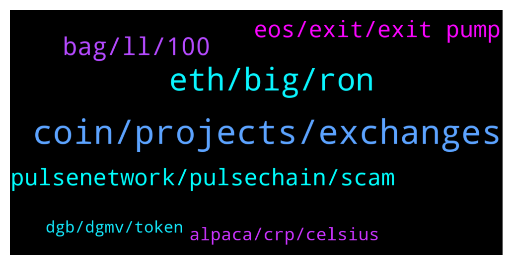

# **@shitpool**
 ## Analysis for **2022-02-06** - **2022-02-07**.

---

## 📊 **Basic Stats**

**n_messages_sent**: 143

---

---

## 🔝 **Top keywords and related messages**

1. **coin, projects, exchanges**

    @XuvIsKing --- *I suggest you look into it to avoid poverty in the future.* **--->** [TG Discussion](https://t.me/shitpool/723463)

    @BearishWhale --- *holy shit, ded dino coins holders, papa is coming back to save you all. lol* **--->** [TG Discussion](https://t.me/shitpool/723616)

    @wojackdegreate --- *I check both before making a trade* **--->** [TG Discussion](https://t.me/shitpool/723673)

    @BearishWhale --- *is it on coingecko? give me ticker* **--->** [TG Discussion](https://t.me/shitpool/723432)

    @criptix --- *I coin this the Larimer Syndrome* **--->** [TG Discussion](https://t.me/shitpool/723626)

    @BearishWhale --- *name any coin, i will tell you yay or nay* **--->** [TG Discussion](https://t.me/shitpool/723449)

2. **eth, big, ron**

    @wojackdegreate --- *He longed the top and did the disappearing act. Still eating hotdogs.* **--->** [TG Discussion](https://t.me/shitpool/723688)

    @R0mster --- *Record breaking green dot wall though.* **--->** [TG Discussion](https://t.me/shitpool/723504)

    @MoneroPal --- *I’m thinking of loading up on ETH, MATIC, and potentially something like AXIE* **--->** [TG Discussion](https://t.me/shitpool/723724)

    @R0mster --- *Imagine locking into hex for ten years.* **--->** [TG Discussion](https://t.me/shitpool/723444)

    @reamBay --- *I don't believe he longed the top but his arrogance did kill him* **--->** [TG Discussion](https://t.me/shitpool/723690)

    @EOSAIDCHAINS --- *He's just as bad as Wilma* **--->** [TG Discussion](https://t.me/shitpool/723652)

3. **bag, ll, 100**

    @pizza_dog --- *what the fuck is he even saying* **--->** [TG Discussion](https://t.me/shitpool/723535)

    @MoneroPal --- *he’ll bounce back, he’s a solid trader in that he is diciplined, doesn’t fuck with shit coins, but that is largely due to having a large bag* **--->** [TG Discussion](https://t.me/shitpool/723767)

    @Horselorde --- *And the holders still refuse to think they got duped* **--->** [TG Discussion](https://t.me/shitpool/723624)

    @EOSAIDCHAINS --- *Yeah trust this guy with your money lmao* **--->** [TG Discussion](https://t.me/shitpool/723651)

    @Horselorde --- *Oh shit where you been lol* **--->** [TG Discussion](https://t.me/shitpool/723644)

    @onchainjoe --- *it's funny how he has to overcomplicate stuff to appear as 250IQ* **--->** [TG Discussion](https://t.me/shitpool/723566)

4. **pulsenetwork, pulsechain, scam**

    @Jumper87 --- *Pulsenetwork is not pulsechain my bro* **--->** [TG Discussion](https://t.me/shitpool/723425)

    @Jumper87 --- *Nope it's not a shit coin, Pulsenetwork is aiming to deliver the most advanced medical care to individuals around the globe. DYOR* **--->** [TG Discussion](https://t.me/shitpool/723422)

    @BearishWhale --- *whoever got PulseChain "interviews/promos" are the same scammers as Richard Heart is. Be aware of those mdrfckers* **--->** [TG Discussion](https://t.me/shitpool/723429)

    @BearishWhale --- *oh and also used Ledger data leak addresses to send PulseChain spam. Lol* **--->** [TG Discussion](https://t.me/shitpool/723426)

    @Jumper87 --- *Bro this is no fucking scam, try doing some research before conclusion.* **--->** [TG Discussion](https://t.me/shitpool/723416)

    @Jumper87 --- *Yeah but they really not Pulsenetwork had actually developed an healthcare app that possibly gonna access any medical information about the current infection rate.* **--->** [TG Discussion](https://t.me/shitpool/723431)

5. **eos, exit, exit pump**

    @criptix --- *omg should we all get some eos for the exit pump 😆* **--->** [TG Discussion](https://t.me/shitpool/723618)

    @BearishWhale --- *eos comumunity seems have some partyzans fightin those vcs but not sure there is so much hope* **--->** [TG Discussion](https://t.me/shitpool/723628)

    @BearishWhale --- *Excuse me ser, what Eos, Bitshares and Steem holders would say to you?* **--->** [TG Discussion](https://t.me/shitpool/723615)

    @BearishWhale --- *eos - "the most cash raised ICO ever" VC funds got away with in modern history* **--->** [TG Discussion](https://t.me/shitpool/723622)

    @Horselorde --- *Ahaha the second exit pump 😂* **--->** [TG Discussion](https://t.me/shitpool/723620)

    @iamslow --- *sorry it doesn't fit your requirements sir* **--->** [TG Discussion](https://t.me/shitpool/723554)

6. **alpaca, crp, celsius**

    @BearishWhale --- *Celsius. Another scamish institution. will not end well* **--->** [TG Discussion](https://t.me/shitpool/723445)

    @protonzia --- *Utopia is still raining CRP . 1 CRP is worth 0.9 USDT right now . This is what you guys should not miss .* **--->** [TG Discussion](https://t.me/shitpool/723687)

    @Dominator008 --- *🚀 Swap 615,958 BUSD for 1,488,667 ALPACA ($617,502) ♻️ $0.4148 per #ALPACA by #0x9c43... // PancakeSwap 🥞* **--->** [TG Discussion](https://t.me/shitpool/723609)

    @AsianFever --- *why is celsius a "nay" just curious with resident cel whale Pervy being here :)* **--->** [TG Discussion](https://t.me/shitpool/723512)

    @BeAMightyKing --- *Lmfao yeah, as if Alameda swapped their entire cold wallet 😆* **--->** [TG Discussion](https://t.me/shitpool/723507)

    @Dominator008 --- *Someone bought a ton of ALPACA in one go* **--->** [TG Discussion](https://t.me/shitpool/723610)

7. **dgb, dgmv, token**

    @Obli1 --- *They created a dgmv token on erc20 using the liechenstein protocol. So the token is fully globally compliant to all laws. And they are working on a smartlayer to transfer dgmv to dgbchain, among other erc20 tokens if they want to.  They will use the dgmv on dgb chain to run threefolds web3 and offer its compliance to enterprises to access the metaverse and use blockchain globally with the same token, instead of multiple.* **--->** [TG Discussion](https://t.me/shitpool/723590)

    @Obli1 --- *Digibyte been working on multiple stuff since 2017 to be launched this year. Binance doubled their dgb wallet from 900m to 2.1b dgb 29th of december.* **--->** [TG Discussion](https://t.me/shitpool/723567)

    @Obli1 --- *Bittrex and Binance increased their onchain position* **--->** [TG Discussion](https://t.me/shitpool/723591)

    @BearishWhale --- *never looked into mango, apart presentation on WP ytube. But seems on derivatives onchain trading dydx/ dopex leading so far, no* **--->** [TG Discussion](https://t.me/shitpool/723460)

    @XuvIsKing --- *like there are more DGB coins on their wallets?* **--->** [TG Discussion](https://t.me/shitpool/723597)

