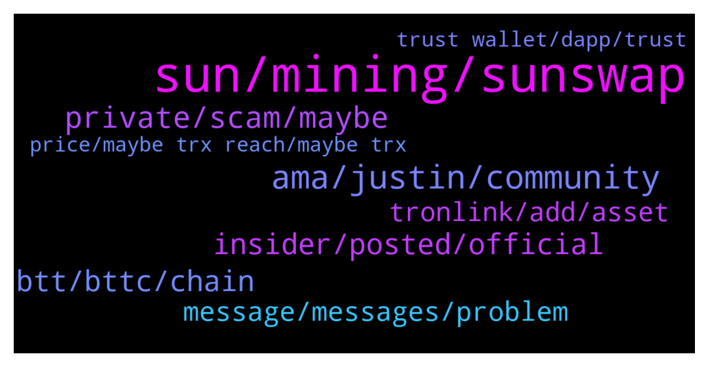

# **@tronnetworkEN**
 ## Analysis for **2022-02-06** - **2022-02-07**.

---

## 📊 **Basic Stats**

**n_messages_sent**: 221

---

---

## 🔝 **Top keywords and related messages**

1. **sun, mining, sunswap**

    @firmam12 --- *Yes, I'm still trying to study the ecosystem, usually I just lp and stake on other coins hehe* **--->** [TG Discussion](https://t.me/tronnetworkEN/3875979)

    @Bitcoinmustbemoney --- *I think he meant veSun mining Apy which is a low 0.70 %, pretty much unheard of these days lol* **--->** [TG Discussion](https://t.me/tronnetworkEN/3875946)

    @briayantin --- *Sir please how can I increase my mining rate* **--->** [TG Discussion](https://t.me/tronnetworkEN/3875916)

    @alpha0247 --- *I have staked for about 2 years now and I have plenty bandwidth and energy. Apart from using it to make transactions fees.  Can I use it to do anything else ? Like selling or borrowing it out* **--->** [TG Discussion](https://t.me/tronnetworkEN/3874645)

    @O_oDonnell --- *I thought you can mine and get reward* **--->** [TG Discussion](https://t.me/tronnetworkEN/3873997)

    @agentpiki --- *LP mining Advantage: higher APY + swap fees Disadvantage: Impermanent loss  SR Vote Advantage: Free bandwidth / energy Disadvantage: Frozen for 72 hrs* **--->** [TG Discussion](https://t.me/tronnetworkEN/3875957)

2. **ama, justin, community**

    @WindsofChange92 --- *@Carlos_TRX you are doing gods work. 🙏 May your children recieve blessing 100 fold.* **--->** [TG Discussion](https://t.me/tronnetworkEN/3876257)

    @Moneyversac --- *You are 4 years late 😂* **--->** [TG Discussion](https://t.me/tronnetworkEN/3873774)

    @PiterSpain --- *🙌Calling all #TRONICS :  🥳Join and Vote for Justin Sun for a chance to win Luxury Swag Gifts! 🎁We will choose ten lucky winners!  ✅Share your voting screenshot in the comment section below ⏰Feb 4th (SGT) - Feb 14th (SGT)  https://www.votingdao.io/vote  Read more: https://twitter.com/trondao/status/1489425322692907009* **--->** [TG Discussion](https://t.me/tronnetworkEN/3874560)

    @Angela_TRON --- *Hello everyone, The AMA with H.E.Justin will start in about 10 minutes. To ensure the AMA proceeds smoothly, we will mute this Telegram group when the AMA starts. Thank you for your understanding!* **--->** [TG Discussion](https://t.me/tronnetworkEN/3875666)

    @Angela_TRON --- *Special thanks to H.E.Justin for sparing your valuable time in our community and giving us the really good and thoughtful AMA Session, also thanks to our community for joining this AMA Session.* **--->** [TG Discussion](https://t.me/tronnetworkEN/3875741)

    @Angela_TRON --- *Yes, let's look forward to TRON together. Thank you so much H.E.Justin for coming today! Thank you for your patience in answering, I'm sure everyone in the community has benefited greatly.* **--->** [TG Discussion](https://t.me/tronnetworkEN/3875740)

3. **private, scam, maybe**

    @Moneyversac --- *No you are not. I have helped about 70 people with that already, altough they didn't even see them in their wallet until I told them how.* **--->** [TG Discussion](https://t.me/tronnetworkEN/3873778)

    @Anil Kumar --- *Some one is asking for my 12 recovery words. Should I provide him* **--->** [TG Discussion](https://t.me/tronnetworkEN/3876274)

    @davedine --- *Don't trust anybody who message you on private. Beware of scammers* **--->** [TG Discussion](https://t.me/tronnetworkEN/3876396)

    @davedine --- *They are scammer. 12 word is your secret. Never share with anyone* **--->** [TG Discussion](https://t.me/tronnetworkEN/3876286)

    @Erick --- *is every new person joining scam nowadays? :D* **--->** [TG Discussion](https://t.me/tronnetworkEN/3875257)

    @Carlos_TRX --- *Not now, be care dont fall in scams* **--->** [TG Discussion](https://t.me/tronnetworkEN/3875066)

4. **btt, bttc, chain**

    @rencos2 --- *Bitorrent (BTT) are the coin that will make millionaires* **--->** [TG Discussion](https://t.me/tronnetworkEN/3875149)

    @rencos2 --- *yes, and 22-02 BTT will have mainnet 2.0* **--->** [TG Discussion](https://t.me/tronnetworkEN/3875156)

    @rencos2 --- *Best to have at this moment, i expect BTT* **--->** [TG Discussion](https://t.me/tronnetworkEN/3876241)

    @rencos2 --- *with tron network BTT will go to the moon* **--->** [TG Discussion](https://t.me/tronnetworkEN/3875899)

    @agentpiki --- *Tron and BTT will probably have similar pattern.* **--->** [TG Discussion](https://t.me/tronnetworkEN/3875442)

    @rencos2 --- *lets follow BTT to see what it can do with the new TRON blockchain - to the moon* **--->** [TG Discussion](https://t.me/tronnetworkEN/3875170)

5. **insider, posted, official**

    @GhostUnderYourBed --- *Can any tron dev tell what's the top feature they are working on now?* **--->** [TG Discussion](https://t.me/tronnetworkEN/3874584)

    @MilNoslen --- *If you’re using Ledger, it’s self explanatory from Tronlink* **--->** [TG Discussion](https://t.me/tronnetworkEN/3873576)

    @gabri1111 --- *What does Tron has to offer me* **--->** [TG Discussion](https://t.me/tronnetworkEN/3874996)

    @Carlos_TRX --- *What app, TRON NETWORK never had a problem* **--->** [TG Discussion](https://t.me/tronnetworkEN/3873366)

    @simon866 --- *All official updates are posted on the official Tron DAO social media, insider info obviously wont be posted from the devs  Same as insider trading like Nancy Pelosi 😂* **--->** [TG Discussion](https://t.me/tronnetworkEN/3874602)

    @Angellesharese0512 --- *I want to sell my tron* **--->** [TG Discussion](https://t.me/tronnetworkEN/3873909)

6. **message, messages, problem**

    @Sima --- *Please all of you messaging me should stop messaging me.  I already have where I do my trading. I'm not interested in yours* **--->** [TG Discussion](https://t.me/tronnetworkEN/3874906)

    @sTONe --- *I was 2 days agou with a problem and today I remembered I have another one* **--->** [TG Discussion](https://t.me/tronnetworkEN/3873356)

    @markbenolim --- *Hi all, I ran into a problem, who is online and available now ?* **--->** [TG Discussion](https://t.me/tronnetworkEN/3874086)

    @JoymeMark --- *Sorry, that message was not for you* **--->** [TG Discussion](https://t.me/tronnetworkEN/3874885)

    @shahriylar123 --- *Why are you deleting my message* **--->** [TG Discussion](https://t.me/tronnetworkEN/3874256)

    @markbenolim --- *I getting messages only from fak admins* **--->** [TG Discussion](https://t.me/tronnetworkEN/3874097)

7. **tronlink, add, asset**

    @Fynb1 --- *Hello can anyone help please…. I sent TRC20 to my tronlink wallet and I can’t see it it’s been 7hrs* **--->** [TG Discussion](https://t.me/tronnetworkEN/3873569)

    @MilNoslen --- *It's whatever token you're trying to add. Look it up in Tronscan.org and make sure it's the right one* **--->** [TG Discussion](https://t.me/tronnetworkEN/3873648)

    @MilNoslen --- *Add the contract address of whatever token you're trying to see* **--->** [TG Discussion](https://t.me/tronnetworkEN/3873641)

    @Fynb1 --- *I did but I don’t see it* **--->** [TG Discussion](https://t.me/tronnetworkEN/3873639)

    @Fynb1 --- *So I sent USDt Trc20 to my tronlink wallet on iOS but I checked and added asset but I didn’t see my usdt* **--->** [TG Discussion](https://t.me/tronnetworkEN/3873660)

    @Moneyversac --- *Click the plus sign and search after the name* **--->** [TG Discussion](https://t.me/tronnetworkEN/3873661)

8. **trust wallet, dapp, trust**

    @Rxcharge --- *Is that a site or wallet* **--->** [TG Discussion](https://t.me/tronnetworkEN/3876325)

    @Carlos_TRX --- *I dont know trust wallet mate, i recommend you tronlink.org to keep all your TRON funds* **--->** [TG Discussion](https://t.me/tronnetworkEN/3876238)

    @Rxcharge --- *? Dapp......?  Does it also includes *Dapp* on trust wallet?* **--->** [TG Discussion](https://t.me/tronnetworkEN/3876235)

    @Carlos_TRX --- *This is the legit website where u can download your wallet in pc, tronlinkpro is in play store too* **--->** [TG Discussion](https://t.me/tronnetworkEN/3876349)

    @Fynb1 --- *It’s not an exchange or wallet it’s just a regular broker account* **--->** [TG Discussion](https://t.me/tronnetworkEN/3873720)

    @simon866 --- *May be easier to ask large exchange's what their TRX address is if they are willing to say* **--->** [TG Discussion](https://t.me/tronnetworkEN/3876164)

9. **price, maybe trx reach, maybe trx**

    @Turbo 🅿️ --- *I just bought 25k TRX. I don’t beg.* **--->** [TG Discussion](https://t.me/tronnetworkEN/3874881)

    @Alei1122 --- *They scammed me 300 TRX already 🥲🥲* **--->** [TG Discussion](https://t.me/tronnetworkEN/3875970)

    @ayobami_samson --- *And how can I buy trx* **--->** [TG Discussion](https://t.me/tronnetworkEN/3876380)

    @firmam12 --- *maybe it will take a while trx to reach his ATH price, so let's just be patient and hold on Or you can trade futures* **--->** [TG Discussion](https://t.me/tronnetworkEN/3876005)

    @agentpiki --- *There is risk. When your TRX is frozen, you cannot sell* **--->** [TG Discussion](https://t.me/tronnetworkEN/3875960)

    @Sameer250501 --- *When we can see TRX at $10..?* **--->** [TG Discussion](https://t.me/tronnetworkEN/3874554)

