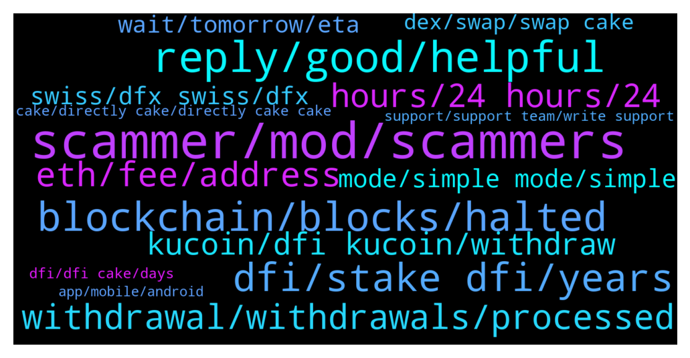

# **@CakeDeFi_EN**
 ## Analysis for **2021-12-12** - **2021-12-19**.

---

## 📊 **Basic Stats**

**n_messages_sent**: 3752

---

---

## 🔝 **Top keywords and related messages**

1. **scammer, mod, scammers**

    @christina --- *Can anyone confirm Daniel Basista is not a scammer* **--->** [TG Discussion](https://t.me/CakeDeFi_EN/153102)

    @christina --- *Thank you all! Daniel Batista is a scammer. Not to be confused with Daniel Baptista.* **--->** [TG Discussion](https://t.me/CakeDeFi_EN/153110)

    @Robrio1008 --- *Bernd the scammer!!!!….I just blocked him for the exact same message* **--->** [TG Discussion](https://t.me/CakeDeFi_EN/146736)

    @Derrick --- *i have a daniel baptista helping me is he legit?* **--->** [TG Discussion](https://t.me/CakeDeFi_EN/153859)

    @G --- *Daniel Baptista is pretending to work for Cake and asking for info, can someone report plz?* **--->** [TG Discussion](https://t.me/CakeDeFi_EN/154793)

    @Manvydasm --- *Is a word sc-am not allowed here? Whyyy?* **--->** [TG Discussion](https://t.me/CakeDeFi_EN/147302)

2. **reply, good, helpful**

    @Nik --- *Hey! Sorry me again and excuse my lack of knowledge but where can l get that information? Thanks* **--->** [TG Discussion](https://t.me/CakeDeFi_EN/146431)

    @Dorrent_Quelchergeeshkon --- *Ahhhhhhhhh that’s more interesting thanks Daniel hope you’re well* **--->** [TG Discussion](https://t.me/CakeDeFi_EN/150202)

    @freedfidotcom --- *let me pass this on internally - thanks* **--->** [TG Discussion](https://t.me/CakeDeFi_EN/152076)

    @riserspec24 --- *Thanks for answering. I really made it quick in FOMO..lol* **--->** [TG Discussion](https://t.me/CakeDeFi_EN/146841)

    @Albertlong922 --- *And thank you guys for all of your patience with me and all my questions haa* **--->** [TG Discussion](https://t.me/CakeDeFi_EN/150559)

    @Messem0181 --- *Thats just nuts 😂 thnx for the time and explanation* **--->** [TG Discussion](https://t.me/CakeDeFi_EN/146501)

3. **blockchain, blocks, halted**

    @Michael_Schredl --- *The DeFiChain Blockchain  had some issues and there were no new blocks.* **--->** [TG Discussion](https://t.me/CakeDeFi_EN/149299)

    @freedfidotcom --- *DeFiChain stalled due to a bug during the night - no blocks, no rewards. Not a Cake issue, a DeFiChain issue* **--->** [TG Discussion](https://t.me/CakeDeFi_EN/148650)

    @jezzkng --- *Hello, there was issue with DeFiChain through the night. Now fixed - some time to get back up to speed, in other words, it'd reflect in your asset balance, just taking more time than usual. Our engineering team is on it fully. rest assured your fund is safe.* **--->** [TG Discussion](https://t.me/CakeDeFi_EN/148781)

    @freedfidotcom --- *4 days puts this beyond the timeframe of the bug in DeFiChain - I think all you can do is submit a support request then our team can investigate further for you. There is no known issue right now other than through the night with reduced blocks* **--->** [TG Discussion](https://t.me/CakeDeFi_EN/148869)

    @fabioandreatta --- *No that is not how a blockchain works. Nobody can force close anything* **--->** [TG Discussion](https://t.me/CakeDeFi_EN/150778)

    @fabioandreatta --- *Everything should be back to normal from here on, updates where yesterday and Blockchain issues on DeFiChain was a day before that* **--->** [TG Discussion](https://t.me/CakeDeFi_EN/150766)

4. **dfi, stake dfi, years**

    @Terungwa --- *So how much can I invest to make one DFI a day* **--->** [TG Discussion](https://t.me/CakeDeFi_EN/148484)

    @Juan --- *3000 dfi on lightwallet is earning , almost the same as 15000 dfi in 10 year freeze* **--->** [TG Discussion](https://t.me/CakeDeFi_EN/151562)

    @helix78 --- *Cheers for the price shootout and the success of DFI! Greetings to Singapore from Switzerland* **--->** [TG Discussion](https://t.me/CakeDeFi_EN/146531)

    @Michael_Schredl --- *Yes that works, but only DFI* **--->** [TG Discussion](https://t.me/CakeDeFi_EN/146337)

    @TruuMax --- *Dont forget, that you will need to put in the same amount of DFI* **--->** [TG Discussion](https://t.me/CakeDeFi_EN/149555)

    @velo314 --- *You mean manually converted DFI are auto-staked? And you'd have to unstake them to, for example, LM? What's the downside to temporarily disabling auto? Just the manual hassle? I think we're all anxiously awaiting simple mode's return!* **--->** [TG Discussion](https://t.me/CakeDeFi_EN/152846)

5. **withdrawal, withdrawals, processed**

    @Daniel --- *Is there no support?? Been waiting over 72 hours for a withdrawal* **--->** [TG Discussion](https://t.me/CakeDeFi_EN/148717)

    @YSL --- *I love the withdrawal checklist .. this is good* **--->** [TG Discussion](https://t.me/CakeDeFi_EN/149786)

    @rhodium289 --- *I really dislike this stock response. It suggests that the 11 hours delay is due to some precautionary security measure (that we're being looked after) when we all know that it's because there are technical issues and so all transactions, rewards etc are blocked. This stock reply is disingenuous. It may be that some withdrawals will be ultimately be delayed because of checks, but really!* **--->** [TG Discussion](https://t.me/CakeDeFi_EN/149373)

    @freedfidotcom --- *I have just checked our system and there are no pending withdrawals over 72 hours.* **--->** [TG Discussion](https://t.me/CakeDeFi_EN/149686)

    @freedfidotcom --- *Yes me too - but to repeat, no withdrawal request is over the stated 72hr timeframe yet and the instruction to resume withdrawals has already been given - please be patient for just a short time more* **--->** [TG Discussion](https://t.me/CakeDeFi_EN/149699)

    @Tom --- *Hi, is there a withdrawal issue. My withdrawal is now pending over 72h now.* **--->** [TG Discussion](https://t.me/CakeDeFi_EN/148796)

6. **eth, fee, address**

    @maxxzz89 --- *$100 for address Fee. So it will not be charged again for ETH transfer?* **--->** [TG Discussion](https://t.me/CakeDeFi_EN/150939)

    @AntWhale666 --- *Sweet, and also if i want to start LIQUIDITY FARMING with ethereum pair, do i need to first buy a ethereum wallet for 130$? is that true? i think ive read that somehwhere, if not i will be more than happy to sending some eth over right away and start out.* **--->** [TG Discussion](https://t.me/CakeDeFi_EN/150393)

    @Ru --- *Ethereum gas fee can be very high and has nothing to do with Cake. So indeed there is no fee for depositing but there is no way around the standard Ethereum gas fee.* **--->** [TG Discussion](https://t.me/CakeDeFi_EN/149525)

    @R --- *Wait $300??? Eth is expensive so i guess* **--->** [TG Discussion](https://t.me/CakeDeFi_EN/152283)

    @Ru --- *I looked it up and it seems to be a one time Ethereum address creation fee. I remember getting a warning when I first deposited Ethereum and I was aware the fee existed. If there really was no indication anywhere while depositing USDC perhaps it was an oversight.* **--->** [TG Discussion](https://t.me/CakeDeFi_EN/149533)

    @☁️🍑 --- *Anybody knows roughly how much is the ethereum address going to cost me* **--->** [TG Discussion](https://t.me/CakeDeFi_EN/149763)

7. **hours, 24 hours, 24**

    @Michael_Schredl --- *That is normal, it can take some time* **--->** [TG Discussion](https://t.me/CakeDeFi_EN/146119)

    @plscallmeadmin --- *How long does it normaly take?* **--->** [TG Discussion](https://t.me/CakeDeFi_EN/146122)

    @Michael_Schredl --- *It can take up to 28 hours https://t.me/CakeDeFi_EN_announcements/329* **--->** [TG Discussion](https://t.me/CakeDeFi_EN/148051)

    @Michael_Schredl --- *Normally within 24 hours, I would contact them again* **--->** [TG Discussion](https://t.me/CakeDeFi_EN/153168)

    @Happy --- *Apparently it only takes up to an hour on the defichain lightwallet. How come there is such a disparity between wait times?* **--->** [TG Discussion](https://t.me/CakeDeFi_EN/153651)

    @Manvydasm --- *But always completed within 24 hours?* **--->** [TG Discussion](https://t.me/CakeDeFi_EN/153649)

8. **kucoin, dfi kucoin, withdraw**

    @Jose --- *Lost my DFI. Sent it to Kucoin and as of right now they are not taking DFI. Lost about $1,100...* **--->** [TG Discussion](https://t.me/CakeDeFi_EN/152084)

    @Careluna1201 --- *Is it just me having problems to withdraw to Kucoin?* **--->** [TG Discussion](https://t.me/CakeDeFi_EN/152832)

    @ashishsojan --- *Hi Michael, are we able to transfer DFI out from kucoin now?* **--->** [TG Discussion](https://t.me/CakeDeFi_EN/150074)

    @TimescapeHD --- *I transferred some dfi to kucoin just before transfers got deactivated on that exchange. I assume the coins will be credited as soon as maintenance is finished?* **--->** [TG Discussion](https://t.me/CakeDeFi_EN/150346)

    @nadastropovic --- *You can send your DFI on kucoin, then change it to USDT, use your UDST to buy Stellar, send it to your Coinbase Pro account, then sell your Stellar to USD or EUR and then whithdraw your money on your account. In Europe and Revolut it takes 5s to have the money on the account.* **--->** [TG Discussion](https://t.me/CakeDeFi_EN/153390)

    @Jürgen --- *Hi Fabio, ist this also the reason why I cannot transfer DFI from kucoin to cake? Kucoin says „network upgrade“ - for 2 days now and I can’t do anything - their support also didn’t answer, yet* **--->** [TG Discussion](https://t.me/CakeDeFi_EN/150768)

9. **mode, simple mode, simple**

    @cwhNick --- *Yes i am using simple mode.* **--->** [TG Discussion](https://t.me/CakeDeFi_EN/146161)

    @Michael_Schredl --- *Some users get an error with the simple mode - if you add it manually it should work* **--->** [TG Discussion](https://t.me/CakeDeFi_EN/146166)

    @ratedm2a --- *What’s going on with simple mode? It hasn’t been working for the past few days 😕* **--->** [TG Discussion](https://t.me/CakeDeFi_EN/147937)

    @rogelicious6969 --- *Hey Steve, when will the simple mode be available? Thx ☺️* **--->** [TG Discussion](https://t.me/CakeDeFi_EN/148855)

    @DmgBautista --- *Simple mode is currently not working, maybe tomorrow it is already, but for the moment, under maintenace still. But normal mode works fine!* **--->** [TG Discussion](https://t.me/CakeDeFi_EN/150564)

    @DmgBautista --- *If you are then using the normal mode to add, it should work. Only if the team maybe disabled the option to add in order to implement the correction to the simple mode. Try again a bit later, maybe work already* **--->** [TG Discussion](https://t.me/CakeDeFi_EN/150568)

10. **swiss, dfx swiss, dfx**

    @DmgBautista --- *Or you can send it to bittrex, convert into USDT and the USD or EUR, directly to your bank. Other option is DFX.swiss. Soecifically designed for DFI, no KYC under 900 EUR and with off-ramp capability ;)* **--->** [TG Discussion](https://t.me/CakeDeFi_EN/153429)

    @Joel --- *What do you send? DFI? AFAIK CoinBase doesn’t trade DFI.* **--->** [TG Discussion](https://t.me/CakeDeFi_EN/153409)

    @kompyka407 --- *Hi guys. There is any exchange where I can deposit DFI!?* **--->** [TG Discussion](https://t.me/CakeDeFi_EN/151158)

    @Juan --- *Problem with dfi , we are too reliant on a hand few of exchanges* **--->** [TG Discussion](https://t.me/CakeDeFi_EN/153037)

    @fabioandreatta --- *DEX and dfx.swiss is working like magic* **--->** [TG Discussion](https://t.me/CakeDeFi_EN/151324)

    @Michael_Schredl --- *You want to send DFI over the DeFiChain network to an Exchange?* **--->** [TG Discussion](https://t.me/CakeDeFi_EN/146331)

11. **wait, tomorrow, eta**

    @jackluo --- *Nice speech. So is it delayed or wat* **--->** [TG Discussion](https://t.me/CakeDeFi_EN/153047)

    @plscallmeadmin --- *I think we will be at 10-12$ in some days* **--->** [TG Discussion](https://t.me/CakeDeFi_EN/146462)

    @DmgBautista --- *A release was already released, but when will all up to date, maybe a day I would say until everything gets stable again* **--->** [TG Discussion](https://t.me/CakeDeFi_EN/148711)

    @fabioandreatta --- *Just wait until Friday. It will be a best in the whole industry one 😉* **--->** [TG Discussion](https://t.me/CakeDeFi_EN/152888)

    @fabioandreatta --- *Yes, probably at the end of year or beginning of next year* **--->** [TG Discussion](https://t.me/CakeDeFi_EN/147565)

    @peterralff --- *You have to wait until tomorrow. It's a prediction. Could be 3000% or something else.* **--->** [TG Discussion](https://t.me/CakeDeFi_EN/146333)

12. **dex, swap, swap cake**

    @Michael_Schredl --- *You can only swap it on the DEX or create it by yourself* **--->** [TG Discussion](https://t.me/CakeDeFi_EN/149395)

    @GCY --- *No you can't swap on cake* **--->** [TG Discussion](https://t.me/CakeDeFi_EN/149606)

    @Michael_Schredl --- *Just swap in on the DEX, or create you own and send it to Cake* **--->** [TG Discussion](https://t.me/CakeDeFi_EN/147403)

    @arjpet --- *That is the one. After that swap you can send the dUstd to cake usdt wallet.* **--->** [TG Discussion](https://t.me/CakeDeFi_EN/152371)

    @fabioandreatta --- *Click on DEX then click on swap and then click on the arrows to turn around* **--->** [TG Discussion](https://t.me/CakeDeFi_EN/152363)

    @jezzkng --- *Full dex integration in the pipeline. Stay tuned!* **--->** [TG Discussion](https://t.me/CakeDeFi_EN/151599)

13. **cake, directly cake, directly cake cake**

    @MOAB --- *But it’s the master nodes right?…. The same thing we were told we didn’t need to concern ourselves on cake…..* **--->** [TG Discussion](https://t.me/CakeDeFi_EN/151572)

    @Michael_Schredl --- *You can only do that on Cake* **--->** [TG Discussion](https://t.me/CakeDeFi_EN/147227)

    @geraldho81 --- *More reassuring if someone from cake would clarify what happened* **--->** [TG Discussion](https://t.me/CakeDeFi_EN/154711)

    @danielklaiber --- *That's correct... but has nothing to do directly with Cake 😃* **--->** [TG Discussion](https://t.me/CakeDeFi_EN/152983)

    @Dan --- *Seeing this on my Cake balance. How is it possible?* **--->** [TG Discussion](https://t.me/CakeDeFi_EN/147794)

    @uuid42 --- *Maybe  @itmlgife can tell u why u don't have those options on cake 😅* **--->** [TG Discussion](https://t.me/CakeDeFi_EN/149607)

14. **support, support team, write support**

    @Ethan --- *Hi can I get help my support won't reply it's been 20 days #45431* **--->** [TG Discussion](https://t.me/CakeDeFi_EN/146988)

    @fabioandreatta --- *Everything is working, please contact Support so that they can check your account.* **--->** [TG Discussion](https://t.me/CakeDeFi_EN/153257)

    @bentansg --- *Same here. I have emailed support as well, pending their response also.* **--->** [TG Discussion](https://t.me/CakeDeFi_EN/153593)

    @Graham --- *I've written to support & they've asked for 24-48 hrs to respond ?* **--->** [TG Discussion](https://t.me/CakeDeFi_EN/150815)

    @DmgBautista --- *Yup, received them in the morning. Please raise a ticket for support in the app or website, support will check on you 😉* **--->** [TG Discussion](https://t.me/CakeDeFi_EN/153478)

    @enalettin --- *Applied for support and except for an auto message i received nothing* **--->** [TG Discussion](https://t.me/CakeDeFi_EN/153503)

15. **dfi, dfi cake, days**

    @Michael_Schredl --- *Well that is hard at the moment - DFI withdraws are paused on Cake DeFi https://t.me/CakeDeFi_EN/150151* **--->** [TG Discussion](https://t.me/CakeDeFi_EN/150437)

    @Pharamond --- *Are withdraws from cake to dfi wallet suspended due to the block problem ? Mine is still processing. Usualy done in a minute or two, but it's been more than an hour this time...* **--->** [TG Discussion](https://t.me/CakeDeFi_EN/149234)

    @b_arda007 --- *Hello. I joined cake dfi airdrop on 08 June 2021. After 185 days, my reward has not been unlocked. From the staking orders, I turned off the staking so that it wouldn't continue after the 8th interval.* **--->** [TG Discussion](https://t.me/CakeDeFi_EN/149803)

    @datoshinakamoto --- *I transferred dfi from defichain app to cake 2 hours ago but still not arrived are there delays?* **--->** [TG Discussion](https://t.me/CakeDeFi_EN/149216)

    @3017 --- *Omg .. i withdraw from cake to my whitelist address in bittrex and i just found out that bittrex cant deposit dfi anymore? Will bittrex reinstate the deposits? And my dfi is safe in my whitelist address that i been withdrawing to? Omg..* **--->** [TG Discussion](https://t.me/CakeDeFi_EN/154187)

    @Andy --- *Is there a issue depositing DFI?  I sent a transaction from DFX 2hours ago and still not received any notification from Cake it is being processed ...* **--->** [TG Discussion](https://t.me/CakeDeFi_EN/149342)

