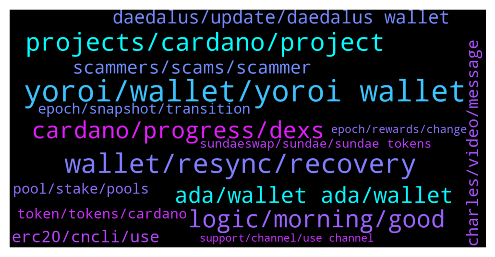

# **@Cardano**
 ## Analysis for **2021-12-12** - **2021-12-19**.

---

## 📊 **Basic Stats**

**n_messages_sent**: 687

---

---

## 🔝 **Top keywords and related messages**

1. **yoroi, wallet, yoroi wallet**

    @Hans --- *Thats why I swaped to Yoroi....my old comp does not make it anymore👐* **--->** [TG Discussion](https://t.me/Cardano/758481)

    @Lgbeano --- *Emurgo do not run any Yoroi channels. Any channel with yoroi in the name is scamming you* **--->** [TG Discussion](https://t.me/Cardano/759081)

    @Lee --- *Hi - I am having difficulties connecting ledge to yoroi - any advice or should I use another app?* **--->** [TG Discussion](https://t.me/Cardano/756445)

    @ExInfernis --- *Hi, I have question for Daedalus and Yoroi. Can I have at the same time my ada on both wallets or when I download yoroi and create wallet there my ada will be transferred from the daedalus to yoroi?* **--->** [TG Discussion](https://t.me/Cardano/759102)

    @Hans --- *Yoroi just reads the data of your wallet. Use same credentials as in D!* **--->** [TG Discussion](https://t.me/Cardano/758489)

    @p --- *Hey guys. I have some issue withdrawing and restaking ada on Yoroi. I’m using my Trezor T for my yoroi wallet and I transferred Ada into it 2 months ago, delegated it with no issue. Now I’m trying to redelegate it to a different pool and a message pops up on my Trezor, saying “change address payment credential is a path…” then when i tick the checkmark, it takes me to another prompt saying “change address staking credential is a key hash…” then to another prompt of a sum of my account minus the amount I’m trying to withdraw before taking me to the standard signing off that fails to go through. I’ve noticed the same problem on the forums in a few cases but there seems to be no definitive solution for this. Does anyone know how to fix this problem?* **--->** [TG Discussion](https://t.me/Cardano/758585)

2. **wallet, resync, recovery**

    @Nel --- *https://typhonwallet.io/#/  Is typhon.io for alternative cardano wallet legit? 👆* **--->** [TG Discussion](https://t.me/Cardano/755261)

    @p --- *I tried. But when i try to use the recovery phrase on adalite it shows that my wallet has 0 balance. I’m sure this is the only set of seedphrase i have because I only have the one cardano wallet and I only wrote down one set of it. Checked it multiple times. The balance on yoroi and cardanoscan is correct tho* **--->** [TG Discussion](https://t.me/Cardano/758603)

    @apex_pool_spo --- *yes. if you don't have the old wallet (and password) and you don't have the words, that's it.* **--->** [TG Discussion](https://t.me/Cardano/759960)

    @Katsumot0 --- *Can use adalite or typhon wallet. (Ignore the DMs you will get from scammers)* **--->** [TG Discussion](https://t.me/Cardano/756447)

    @daaviid0r --- *haha no :) I'll refill my bag so :p* **--->** [TG Discussion](https://t.me/Cardano/756978)

    @Zyroxa --- *Its just a display bug. Resync your wallet and the problem should be resolved.* **--->** [TG Discussion](https://t.me/Cardano/757073)

3. **projects, cardano, project**

    @glitch04 --- *You may want to ask dev/technical questions in one of the areas below:   @IOHK_Marlowe - For Marlowe related discussions  @CardanoDevelopersOfficial - For other Developer related discussions  IOG Discord - For IOG hosted community forum  Link - Community Reddit for Developers  Link - Developer talk area on Cardano Forum* **--->** [TG Discussion](https://t.me/Cardano/758220)

    @rightsof1791 --- *Seems kind of silly to me for a chain to have a community chat about the chain and not allow the sharing of projects being built on that chain. But I will respect your rules* **--->** [TG Discussion](https://t.me/Cardano/760466)

    @glitch04 --- *It's an open network anyone can build and launch a project Cardano foundation has a neutral stance on projects and you should DYOR with any and all projects* **--->** [TG Discussion](https://t.me/Cardano/755849)

    @TheBigBossK --- *I meant long-term projects like Cardano, not "s***coins" on Cardano platform* **--->** [TG Discussion](https://t.me/Cardano/759734)

    @farh_khan --- *It is been planned as AstarterPad ran their first transaction with the Yoroi Dapp connector. Stay tuned for more enticing projects coming into Cardano Ecosystem* **--->** [TG Discussion](https://t.me/Cardano/756968)

    @SeLinRoDe --- *I want to develop smart contract on ADA* **--->** [TG Discussion](https://t.me/Cardano/758219)

4. **logic, morning, good**

    @youandhoo --- *haha , yea so much hatred pressure on us but I'm an OG though lol* **--->** [TG Discussion](https://t.me/Cardano/760329)

    @ExInfernis --- *thanks a lot for the info* **--->** [TG Discussion](https://t.me/Cardano/759113)

    @ExInfernis --- *We are getting behind tron 😔* **--->** [TG Discussion](https://t.me/Cardano/759131)

    @adaantonwihardja --- *i am not sure what you are talking about?* **--->** [TG Discussion](https://t.me/Cardano/756233)

    @Bsdklund --- *But i have also wanted to know about this* **--->** [TG Discussion](https://t.me/Cardano/759769)

    @dinprasetyo --- *I'm so sorry, my bad 🙌* **--->** [TG Discussion](https://t.me/Cardano/758048)

5. **cardano, progress, dexs**

    @JoshuaEJ --- *Does anyone know when DEXs will launch on Cardano?* **--->** [TG Discussion](https://t.me/Cardano/757442)

    @JoshuaEJ --- *I've had a play around there. But what's the latest on other DEXs?* **--->** [TG Discussion](https://t.me/Cardano/757447)

    @oOOEricOOo --- *Cardano DEXes are still to go live right?* **--->** [TG Discussion](https://t.me/Cardano/759959)

    @Deji --- *Hey everyone!  cardano's favorite centralized competitor just slowed to a crawl due to a distributed denial of service attack.  Don't cry.  Be strong.* **--->** [TG Discussion](https://t.me/Cardano/757165)

    @FE --- *Hopefully they could fix it asap. Because their performance will.impact to Cardano performance also* **--->** [TG Discussion](https://t.me/Cardano/755315)

    @JoshuaEJ --- *Question for the Cardano team, who are the front runners to be Cardano's dex?* **--->** [TG Discussion](https://t.me/Cardano/755845)

6. **ada, wallet ada, wallet**

    @BarracudaCrypto --- *If I undelegate and delegate to another pool, do I keep my wallet address or will it change? I'm wondering because there are multiple addresses for receiving ADA in Daedalus.* **--->** [TG Discussion](https://t.me/Cardano/756905)

    @PhaniKGrand --- *Do we have a list of all ISPOs that we can delegate ADA for ISPO tokens?* **--->** [TG Discussion](https://t.me/Cardano/755791)

    @youandhoo --- *I'm an OG who not married to ada and seeking for a answer to calm my concern .* **--->** [TG Discussion](https://t.me/Cardano/760333)

    @QuickOne_Validator --- *not sure, i have never transfered ADA from binance* **--->** [TG Discussion](https://t.me/Cardano/759307)

    @olutosyn --- *I have issue withdrawing Ada to my other wallet* **--->** [TG Discussion](https://t.me/Cardano/758756)

    @ratskim --- *nope, you don't need to unstake to transfer your ADA* **--->** [TG Discussion](https://t.me/Cardano/758251)

7. **daedalus, update, daedalus wallet**

    @SilentCam --- *Do you think we’ll ever be able to use Daedalus without having to wait an hour for it to sync each time? I love the wallet but it’s so damn slow to use* **--->** [TG Discussion](https://t.me/Cardano/756557)

    @Akro_Maer --- *amI I the only one to wait for hours just to open Daedalus and send some Ada to another wallet?  And all this because I haven't open it for 6 months Cause it's driving me crazy...* **--->** [TG Discussion](https://t.me/Cardano/757281)

    @TJSP2024 --- *Dam guys The new daedalus update is 25gb! Please tell me it loads at least a day faster then previously versions 😔* **--->** [TG Discussion](https://t.me/Cardano/758479)

    @daaviid0r --- *long time no send to daedelus ;)* **--->** [TG Discussion](https://t.me/Cardano/759921)

    @glitch04 --- *Close the open instance of Daedalus* **--->** [TG Discussion](https://t.me/Cardano/755234)

    @AndreyKarra --- *My Daedalus (after updating to 4.5.2) cannot sync for the past 3 days. I have restarted multiple times to no avail... Please help* **--->** [TG Discussion](https://t.me/Cardano/756881)

8. **scammers, scams, scammer**

    @glitch04 --- *Now you likely have a flood of scammers trying to send you to shady websites* **--->** [TG Discussion](https://t.me/Cardano/758614)

    @Yan --- *less than 1min in group and  scammers made contact already 😂* **--->** [TG Discussion](https://t.me/Cardano/756152)

    @Lgbeano --- *yeah most words are unfortunately due to bots and people spamming and shilling.* **--->** [TG Discussion](https://t.me/Cardano/757454)

    @dinprasetyo --- *yeah the scammer sent me a message too.* **--->** [TG Discussion](https://t.me/Cardano/758036)

    @addcrypto2 --- *I have asked questions  many time on yoroi but did not receive reply. But instead scammer are active than admin itself* **--->** [TG Discussion](https://t.me/Cardano/755294)

    @Zyroxa --- *Please dont post such scams in this group.   https://t.me/CardanoReportToAdmin* **--->** [TG Discussion](https://t.me/Cardano/756090)

9. **erc20, cncli, use**

    @R | BCA.W --- *What is a the ERC20 convertor?* **--->** [TG Discussion](https://t.me/Cardano/755986)

    @Headelf --- *I thought I read 8000 in a Project Cataylst doc from a year ago. Did it change?* **--->** [TG Discussion](https://t.me/Cardano/760204)

    @adaantonwihardja --- *not sure of this never tried it but I use adalite never had problem* **--->** [TG Discussion](https://t.me/Cardano/755265)

    @TJSP2024 --- *Oh ok i have the extension on brave browser* **--->** [TG Discussion](https://t.me/Cardano/758497)

    @Lee --- *I’m on chrome - maybe I’ll try adalite* **--->** [TG Discussion](https://t.me/Cardano/756450)

    @oOOEricOOo --- *Does it work with iPhone too?* **--->** [TG Discussion](https://t.me/Cardano/759828)

10. **charles, video, message**

    @Bro --- *I got a message from Charlie yesterday* **--->** [TG Discussion](https://t.me/Cardano/756771)

    @apex_pool_spo --- *yes, on Telegram it's him. if he posted the link, then it's his.* **--->** [TG Discussion](https://t.me/Cardano/760133)

    @yutazzz --- *Charles Video Article: Vasil Dabov, RIP: June's hard fork is named after him  https://forum.cardano.org/t/vasil-dabov-rip-6/88577  Charles Video Article: I'm taking a week of meditation leave and coming back stronger than ever! 🔥  https://forum.cardano.org/t/topic/88579* **--->** [TG Discussion](https://t.me/Cardano/757450)

    @DrNo8910 --- *Charles is live on YouTube n Twitter* **--->** [TG Discussion](https://t.me/Cardano/760364)

    @glitch04 --- *unfortunately it's not an easy task you would need to review his videos or narrow it down with a search* **--->** [TG Discussion](https://t.me/Cardano/759086)

    @TheBigBossK --- *Would appreciate if someone shared a particular link of him speaking on this topic.* **--->** [TG Discussion](https://t.me/Cardano/759084)

11. **epoch, snapshot, transition**

    @glitch04 --- *Snapshot was taken at the start of the epoch rewards for 308 arrive in 310* **--->** [TG Discussion](https://t.me/Cardano/759351)

    @glitch04 --- *Snapshot is the transition between epochs. the epochs are always offset so it appears in a future epoch when there are changes made (n+2)* **--->** [TG Discussion](https://t.me/Cardano/759342)

    @glitch04 --- *The next epoch transition is where the new balance snapshot is taken which you will then see the increase in rewards in a future epoch.   EX you increase the balance in 308 > snapshot is taken at beginning of 309 > rewards for 309 arrive with the new adjustment in epoch 311* **--->** [TG Discussion](https://t.me/Cardano/759374)

    @Lgbeano --- *3 days left of the current epoch. What is your concern?* **--->** [TG Discussion](https://t.me/Cardano/756240)

    @glitch04 --- *Rewards for epoch 308 this current epoch will arrive at the transition to epoch 310* **--->** [TG Discussion](https://t.me/Cardano/759350)

    @glitch04 --- *Snapshot is at the transition (start) but the rewards arrive in a future epoch n+2* **--->** [TG Discussion](https://t.me/Cardano/759347)

12. **pool, stake, pools**

    @Moon --- *Of course. Here are the links to the two stacking pools. They are both in the same pool(ADA Pools A), and the delegate with less ADA(65.83k) gets more than the delegate with 72.17k ADA. 1) https://adapools.org/stake/stake1ux6h23tn33kgu0kgl7ltfe5pathlhvufnm5nxce4pa0utsctgeajk 2) https://adapools.org/stake/stake1ux7sz8nk2g0msh88camrckn74y9pkv45vutwf0hut3jesvcgqt62g* **--->** [TG Discussion](https://t.me/Cardano/756746)

    @Moon --- *Hi. Can someone please explain why 2 delegates with the same amount of stacking hells in the same pool get different rewards?  The difference in the reward is 20-30%* **--->** [TG Discussion](https://t.me/Cardano/756743)

    @srinivas2121 --- *Small question need suggestions...if I stake Ada coins in a pool where staking more than 60Millions..Ada..what are the disadvantages...ex: pool A  staking 18millions 1 month returns 4.8% , pool B staking more than 60millions 1 month returns 5%....both pools having same parameters..no difference.  Which will give more Ada....if user stake thier Ada coins .. pool A or pool B..* **--->** [TG Discussion](https://t.me/Cardano/760074)

    @Headelf --- *Thank you? Different stake pools are good?  Need to register each?* **--->** [TG Discussion](https://t.me/Cardano/760211)

    @tham3rr --- *Is there any news regarding multi pool staking? Can't be stock with one pool. I guess multi pool staking can help with rewards having better luck?* **--->** [TG Discussion](https://t.me/Cardano/757955)

    @You --- *Hello hello I am wondering if there is a quicker way to see what stake pools are doing with rewards (charity, interesting projects, etc), than going to each ones website and searching it out.  Is there some kind of categorizer in action somewhere? There are too many to be worth spending all that time.   If my only interest is returns, than it doesn’t matter, but if Im more interested in what its contributing to, then its more important.   Is there a quicker way?* **--->** [TG Discussion](https://t.me/Cardano/757823)

13. **token, tokens, cardano**

    @Juanlot --- *https://www.cardanocube.io/ here you can see the other stable coins* **--->** [TG Discussion](https://t.me/Cardano/758444)

    @mwaddip --- *those representing a certain value / amount of tokens, not so easy* **--->** [TG Discussion](https://t.me/Cardano/756045)

    @Lgbeano --- *Tokens or NFTs. Any token on ethereum, if the project is coming over to Cardano.  For example Singularity net, currently on Etheruem are moving over to Cardano* **--->** [TG Discussion](https://t.me/Cardano/755989)

    @Mads --- *Thanks, but that doesn't really answer my question. It seems that all those stablecoins are pegged to fiat.* **--->** [TG Discussion](https://t.me/Cardano/758445)

    @Mads --- *Does a stablecoin like Djed need to be pegged to a fiat currency? Or could you peg it to something in the natural world fx. Number of rainy days in Germany or size of forest in Brazil?* **--->** [TG Discussion](https://t.me/Cardano/758443)

    @R | BCA.W --- *when you say token, you mean N/FTs?* **--->** [TG Discussion](https://t.me/Cardano/755988)

14. **sundaeswap, sundae, sundae tokens**

    @Gerolamo --- *Tried sundae today again. Everything is working smoothly 💪🏻* **--->** [TG Discussion](https://t.me/Cardano/757460)

    @Vic --- *it appears many setback to sundaeswap* **--->** [TG Discussion](https://t.me/Cardano/755430)

    @David --- *SundaeSwap is a game changer!!!!! I am super excited the amount of volume this will bring to the chain is going to be insane!* **--->** [TG Discussion](https://t.me/Cardano/755884)

    @jokercronet13 --- *Will sundaeswap be ready until EoY?* **--->** [TG Discussion](https://t.me/Cardano/754871)

    @mikecryptotrader --- *@ArneCrypto hi. Is it too late to stake cardano for sundaeswap? If it ain't too late... Any pool suggestions?! Thanks* **--->** [TG Discussion](https://t.me/Cardano/755191)

    @JoshuaEJ --- *feels like north Korea out here, cant say anything about anyone expect for Sundaeswap, good thing you guys arent bias* **--->** [TG Discussion](https://t.me/Cardano/755900)

15. **support, channel, use channel**

    @glitch04 --- *^— use that channel which is dedicated to the topic* **--->** [TG Discussion](https://t.me/Cardano/759844)

    @glitch04 --- *^ the above channel is used for support anyone that dm's you directly first is a scam* **--->** [TG Discussion](https://t.me/Cardano/759031)

    @glitch04 --- *#support don't reply to anyone that dm's you they are scammers please use the channel below* **--->** [TG Discussion](https://t.me/Cardano/758595)

    @glitch04 --- *Ask in the other channel if you need more help someone will check and respond shortly* **--->** [TG Discussion](https://t.me/Cardano/757383)

    @glitch04 --- *👆 use the channel above anyone that dm's you report and block* **--->** [TG Discussion](https://t.me/Cardano/756311)

    @glitch04 --- *Yep, still has some intermittent issues usually it will load but take a little more time than usual, You can try Adalite.io as an alternative or seek further assistance in the channel linked below #support remember anyone that messages you directly is not staff or support they are scammers* **--->** [TG Discussion](https://t.me/Cardano/755278)

