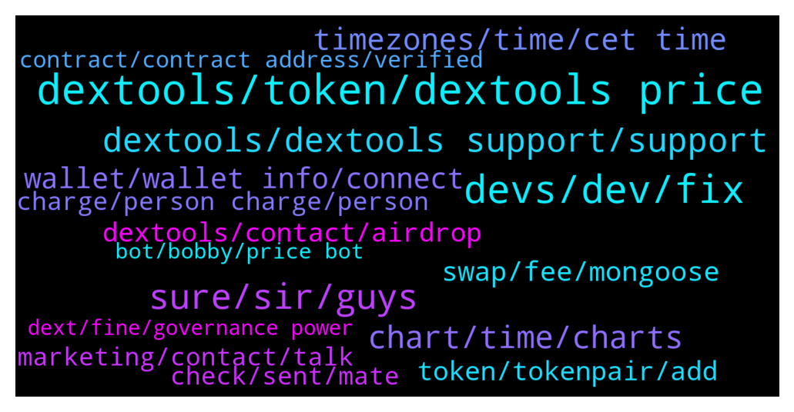

# **@DEXToolsCommunity**
 ## Analysis for **2021-12-12** - **2021-12-19**.

---

## 📊 **Basic Stats**

**n_messages_sent**: 1043

---

---

## 🔝 **Top keywords and related messages**

1. **dextools, token, dextools price**

    @Madems8 --- *Wait. Let me be more specific.🤦‍♂  I am asking about the DexTools Price bot.* **--->** [TG Discussion](https://t.me/DEXToolsCommunity/312233)

    @prep_mb --- *dex tools already showing token pair and trading volumes and chart. but it only shows etherscan contract link, I wanna add social links for token info.* **--->** [TG Discussion](https://t.me/DEXToolsCommunity/312669)

    @CoinDudeBro --- *one of my friends accidentally sent ether to the DEXT address trying to trade on dextools* **--->** [TG Discussion](https://t.me/DEXToolsCommunity/314396)

    @bastardganpunk --- *We have presales. Free money is not planned atm, rather dextools aims to grow the platform and add more Utility for users. Cex integration is not the primary goal for a platform which offers tools for defi traders (defi traders are traders who trade on decentralised exchanges which is the complete opposite of centralised exchanges) 🙂* **--->** [TG Discussion](https://t.me/DEXToolsCommunity/312092)

    @nachivacrypto --- *Hi, can I ask where does dextools obtain token information from , eg. website, socials etc? Is it something that is submitted to dextools or just referenced from another source? Thanks.* **--->** [TG Discussion](https://t.me/DEXToolsCommunity/314080)

    @wwsalpha --- *My token is not listed in Dextools automatically? Any help please!* **--->** [TG Discussion](https://t.me/DEXToolsCommunity/311184)

2. **devs, dev, fix**

    @JoeyDieleman --- *Please give the pair address i'll let the devs check.* **--->** [TG Discussion](https://t.me/DEXToolsCommunity/309670)

    @stanes --- *Oh, ok, I understand now. Ok, let me forward the issue to the devs.* **--->** [TG Discussion](https://t.me/DEXToolsCommunity/312812)

    @hmk18990 --- *it means devs should check your pair 😊* **--->** [TG Discussion](https://t.me/DEXToolsCommunity/310679)

    @bastardganpunk --- *Yes, devs are working on integrations 🙂* **--->** [TG Discussion](https://t.me/DEXToolsCommunity/312832)

    @DGman1 --- *as soon as I can acces my acct I will also check for that* **--->** [TG Discussion](https://t.me/DEXToolsCommunity/313906)

    @FredericDEXT --- *We will check, thanks for reporting* **--->** [TG Discussion](https://t.me/DEXToolsCommunity/313225)

3. **sure, sir, guys**

    @Fl_crypto --- *I just wanted a concrete answer* **--->** [TG Discussion](https://t.me/DEXToolsCommunity/310343)

    @IAMYellowCake --- *Yes, I know, I was joking* **--->** [TG Discussion](https://t.me/DEXToolsCommunity/309989)

    @KingQuokka1 --- *I assure you my friend it did* **--->** [TG Discussion](https://t.me/DEXToolsCommunity/310064)

    @BrotherKDG --- *Understood. Thank you for your responses.* **--->** [TG Discussion](https://t.me/DEXToolsCommunity/311302)

    @JswapFinanceShona --- *yes sir thank you for the heads up.* **--->** [TG Discussion](https://t.me/DEXToolsCommunity/313505)

    @aagoodidea --- *Hi, sir, I need some help* **--->** [TG Discussion](https://t.me/DEXToolsCommunity/312352)

4. **dextools, dextools support, support**

    @robin_set_b --- *hello admin please help me with info about Dextool adds* **--->** [TG Discussion](https://t.me/DEXToolsCommunity/312652)

    @Akansha --- *Hello, I need help. Plz provide me the dextools API.* **--->** [TG Discussion](https://t.me/DEXToolsCommunity/310609)

    @viiv_vi --- *is there a dextools data API ?* **--->** [TG Discussion](https://t.me/DEXToolsCommunity/310039)

    @gil_era --- *Is it known if there are any plans to add other chains to Dextools?* **--->** [TG Discussion](https://t.me/DEXToolsCommunity/312826)

    @Jame --- *Why dextool chart not movi ng* **--->** [TG Discussion](https://t.me/DEXToolsCommunity/309643)

    @stanes --- *What do you mean, this is Dextools support.* **--->** [TG Discussion](https://t.me/DEXToolsCommunity/309889)

5. **chart, time, charts**

    @catcatscatcats --- *Why we have problems to see the chart ? https://www.dextools.io/app/bsc/pair-explorer/0x1d49a35b0029d1c40690a8c79bab6ed3c2864e63* **--->** [TG Discussion](https://t.me/DEXToolsCommunity/310442)

    @Janice --- *Is it possible to have the chart show candles instead of just a line?* **--->** [TG Discussion](https://t.me/DEXToolsCommunity/310306)

    @NoOneNooooo --- *No chart change :) And hot pairs !!!* **--->** [TG Discussion](https://t.me/DEXToolsCommunity/311931)

    @Janice --- *For some reason it’s not letting me set the chart with candles for this   https://www.dextools.io/app/bsc/pair-explorer/0x1e06b8480733505e9dc228f69588511586edaad1  I did the command right but when I do /price in the group it comes up as 4 as chart option and then says no pair found* **--->** [TG Discussion](https://t.me/DEXToolsCommunity/310354)

    @spfr237 --- *is site down? not loading charts for me* **--->** [TG Discussion](https://t.me/DEXToolsCommunity/310567)

    @Leadustosuccess --- *is there other options for setting the style of chart to display in our group* **--->** [TG Discussion](https://t.me/DEXToolsCommunity/311168)

6. **timezones, time, cet time**

    @stanes --- *Sure, please take into account timezones (he is based in Spain).* **--->** [TG Discussion](https://t.me/DEXToolsCommunity/311287)

    @IAMYellowCake --- *But I had issues last 8h or so* **--->** [TG Discussion](https://t.me/DEXToolsCommunity/312621)

    @gumbercules --- *Like have it saved for more than that time?* **--->** [TG Discussion](https://t.me/DEXToolsCommunity/311150)

    @Monolithof --- *As you know, it's kinda complicate to send the moment. If it doesn't go off next time, then I'll report it here with the moment* **--->** [TG Discussion](https://t.me/DEXToolsCommunity/311684)

    @napascual --- *Dm me the moment you expected the alert to go off* **--->** [TG Discussion](https://t.me/DEXToolsCommunity/311683)

    @KingQuokka1 --- *Yeah don’t mind me, I can be a bit slow sometimes 😅* **--->** [TG Discussion](https://t.me/DEXToolsCommunity/310069)

7. **wallet, wallet info, connect**

    @bastardganpunk --- *did you recheck you connected to the right wallet?* **--->** [TG Discussion](https://t.me/DEXToolsCommunity/312111)

    @DanTheVizionary --- *Can’t view the tokens in wallet info* **--->** [TG Discussion](https://t.me/DEXToolsCommunity/309698)

    @bastardganpunk --- *try this:  1. clear your cashe 2. connect your wallet again* **--->** [TG Discussion](https://t.me/DEXToolsCommunity/312104)

    @PG100272 --- *Not showing my token balance on connecting wallet* **--->** [TG Discussion](https://t.me/DEXToolsCommunity/314601)

    @JoeyDieleman --- *No that has nothing to do with it. Maybe I misunderstand, you can't connect your account? Ir you can't view tokens in the wallet info?* **--->** [TG Discussion](https://t.me/DEXToolsCommunity/309694)

    @Ms4crypto --- *another question, its been about a week that i have this for bsc wallet info. Any idea why?* **--->** [TG Discussion](https://t.me/DEXToolsCommunity/312891)

8. **swap, fee, mongoose**

    @roni20212 --- *Can i swap this token busd to mongoose* **--->** [TG Discussion](https://t.me/DEXToolsCommunity/314797)

    @roni20212 --- *No i want buy 50 busd to mongoose* **--->** [TG Discussion](https://t.me/DEXToolsCommunity/314799)

    @carlblow --- *hey the mcap for hamster is being calculated weird, it's the same total supply and general starting price as MONGOOSE* **--->** [TG Discussion](https://t.me/DEXToolsCommunity/311343)

    @Igor --- *to have alarm when there is specific price* **--->** [TG Discussion](https://t.me/DEXToolsCommunity/309709)

    @roni20212 --- *Dextool  token buy fee how $  If i swap eth to other token then how $ transaction fee* **--->** [TG Discussion](https://t.me/DEXToolsCommunity/314790)

    @Joshua --- *I need some help transfering coins* **--->** [TG Discussion](https://t.me/DEXToolsCommunity/309887)

9. **dextools, contact, airdrop**

    @catcatscatcats --- *I want to ask for advertising on the dextools website* **--->** [TG Discussion](https://t.me/DEXToolsCommunity/311845)

    @genesisx1000 --- *I want to advertise my project on dextools, who to contact* **--->** [TG Discussion](https://t.me/DEXToolsCommunity/311013)

    @genesisx1000 --- *Hi, so who can I dm to promote my project on dextools like set up a banner* **--->** [TG Discussion](https://t.me/DEXToolsCommunity/311032)

    @broadgasorc --- *Launch IDO section  Airdrop for users with  High volume trade by dextools Add to CEXs  Like : Mexc/gate/kucoin Launch stake section for DEXT* **--->** [TG Discussion](https://t.me/DEXToolsCommunity/312091)

    @altcoingirl --- *@napascual how can we add website to our  dextool profile?* **--->** [TG Discussion](https://t.me/DEXToolsCommunity/312320)

    @Fl_crypto --- *Who is an admin here? Also who works for dextools ?* **--->** [TG Discussion](https://t.me/DEXToolsCommunity/310329)

10. **token, tokenpair, add**

    @bastardganpunk --- *could you provide the link to the tokenpair pelease?* **--->** [TG Discussion](https://t.me/DEXToolsCommunity/311176)

    @bastardganpunk --- *can you sent the tokenpair link please?* **--->** [TG Discussion](https://t.me/DEXToolsCommunity/314318)

    @bn1admin --- *Need more txs? It’s a new token* **--->** [TG Discussion](https://t.me/DEXToolsCommunity/310927)

    @carlosnima --- *Hello, how do we list our tokens on your site?* **--->** [TG Discussion](https://t.me/DEXToolsCommunity/311471)

    @wiMMMzQ4 --- *where do you need to stake your tokens?* **--->** [TG Discussion](https://t.me/DEXToolsCommunity/310273)

    @broadgasorc --- *Hi to all You have governance token?* **--->** [TG Discussion](https://t.me/DEXToolsCommunity/312082)

11. **check, sent, mate**

    @kaspargalactic --- *can you please check my DM* **--->** [TG Discussion](https://t.me/DEXToolsCommunity/314427)

    @<UNK> --- *hey mate can you check DM thanks* **--->** [TG Discussion](https://t.me/DEXToolsCommunity/311118)

    @ToddBelleghem --- *Awesome! I appreciate it; should I DM?* **--->** [TG Discussion](https://t.me/DEXToolsCommunity/310867)

    @Tore1996 --- *Thanks mate now i dm him* **--->** [TG Discussion](https://t.me/DEXToolsCommunity/311286)

    @Godahavefaithh --- *@iamtommyn could you please check DM* **--->** [TG Discussion](https://t.me/DEXToolsCommunity/314751)

    @stanes --- *Send me the tx hash in DM please. I will not DM you first.* **--->** [TG Discussion](https://t.me/DEXToolsCommunity/310376)

12. **marketing, contact, talk**

    @D_consul --- *@guillermorodriguez78 check your pm for advertisement* **--->** [TG Discussion](https://t.me/DEXToolsCommunity/311606)

    @ToddBelleghem --- *Hello; could I ask someone directly how much a month of Advertising would be for a Banner per month? Or point me in the right direction* **--->** [TG Discussion](https://t.me/DEXToolsCommunity/310865)

    @gumbercules --- *Yessir, contact @guillermorodriguez78 for all ad inquiries* **--->** [TG Discussion](https://t.me/DEXToolsCommunity/310866)

    @Amy822 --- *pls be careful guys. for info on adverts pls send an email to the official mail. you can get it from the website. Dont be scammed.* **--->** [TG Discussion](https://t.me/DEXToolsCommunity/311035)

    @linkstar1108 --- *Hi team who can I contact regarding a VC partnership. Thank you* **--->** [TG Discussion](https://t.me/DEXToolsCommunity/313130)

    @Bearzkin --- *Hello, who may I contact to get on the ad banner or sponsor section* **--->** [TG Discussion](https://t.me/DEXToolsCommunity/311055)

13. **contract, contract address, verified**

    @JoeyDieleman --- *Usually (99%) this is because people set the contract address instaid of the PAIR address 😇* **--->** [TG Discussion](https://t.me/DEXToolsCommunity/309605)

    @bn1admin --- *Hello. Admin, pls help, why this contract doesn’t work 0x3bb9920dadc1106d05f40da4d6e60c798cbdd653 ?* **--->** [TG Discussion](https://t.me/DEXToolsCommunity/310923)

    @DanTheVizionary --- *Why is this showing 2 different contract addresses?* **--->** [TG Discussion](https://t.me/DEXToolsCommunity/309595)

    @bastardganpunk --- *It’s automatic. What’s your contract address? Has liquidity been added?* **--->** [TG Discussion](https://t.me/DEXToolsCommunity/311482)

    @stanes --- *Not sure what you are talking about... Nobody can steal the contract address...* **--->** [TG Discussion](https://t.me/DEXToolsCommunity/312810)

    @stanes --- *🤔 What is the contract address?* **--->** [TG Discussion](https://t.me/DEXToolsCommunity/311326)

14. **charge, person charge, person**

    @napascual --- *@guillermorodriguez78, he's our marketing manager. Remember never DMs first* **--->** [TG Discussion](https://t.me/DEXToolsCommunity/310728)

    @napascual --- *There are no trending spots available, only ads/banners. Dm @guillermorodriguez78, he's our marketing manager. Admins NEVER dm first!* **--->** [TG Discussion](https://t.me/DEXToolsCommunity/309858)

    @stanes --- *Please DM @JoeyDieleman he is the person in charge.* **--->** [TG Discussion](https://t.me/DEXToolsCommunity/313785)

    @stanes --- *For ads? Please DM @guillermorodriguez78 he is the person-in-charge.  Be aware of scammers, HE WILL NEVER DM YOU FIRST.* **--->** [TG Discussion](https://t.me/DEXToolsCommunity/310980)

    @stanes --- *Hi, please DM @guillermorodriguez78 he is the person-in-charge.  Be aware of scammers, HE WILL NEVER DM YOU FIRST.* **--->** [TG Discussion](https://t.me/DEXToolsCommunity/311059)

    @stanes --- *Please DM @guillermorodriguez78 he is the person-in-charge of ads. Be aware of scammers, HE WILL NEVER DM YOU FIRST.* **--->** [TG Discussion](https://t.me/DEXToolsCommunity/311285)

15. **bot, bobby, price bot**

    @bastardganpunk --- *what is bobby bot? we have a price bot and millions of people using it 😄* **--->** [TG Discussion](https://t.me/DEXToolsCommunity/311771)

    @Leadustosuccess --- *Will you provide a price bot like bobby bot. Lots of ppl asking* **--->** [TG Discussion](https://t.me/DEXToolsCommunity/311762)

    @StarLEco --- *Another question, can I use the Trader bot in the Standard plan?* **--->** [TG Discussion](https://t.me/DEXToolsCommunity/310613)

    @Missionhelios.io (Will Never DM First ) --- *do you know velox bot is free or not?* **--->** [TG Discussion](https://t.me/DEXToolsCommunity/309872)

    @Jame --- *The bot is not allowing me to send here. can i dm* **--->** [TG Discussion](https://t.me/DEXToolsCommunity/309671)

    @stanes --- *If for TG, you can use the bot: https://dextools.medium.com/introducing-the-dextools-telegram-price-bot-21fdae07bb78* **--->** [TG Discussion](https://t.me/DEXToolsCommunity/310614)

