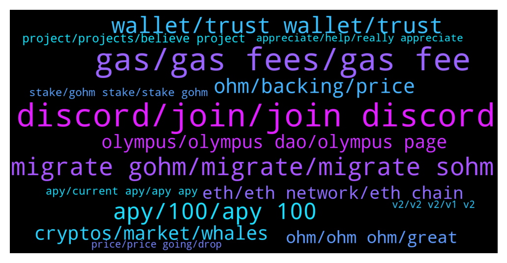

# **@OlympusTG**
 ## Analysis for **2021-12-12** - **2021-12-19**.

---

## 📊 **Basic Stats**

**n_messages_sent**: 10649

---

---

## 🔝 **Top keywords and related messages**

1. **discord, join, join discord**

    @Poopoo (never dm first) --- *Any of you not in Discord yet, strongly encourage you to join us there: https://discord.gg/dSGcz5TM* **--->** [TG Discussion](https://t.me/OlympusTG/113715)

    @Nemo --- *Hello, I'm having issues with the discord invite link that can be found on the https://www.olympusdao.finance/ main page this: https://discord.com/invite/olympusdao I always get "unable to accept invite"  this happens on chrome an on the Discord APP I'm way within the limit of servers anyone know what the issue might be? thanks* **--->** [TG Discussion](https://t.me/OlympusTG/121084)

    @BROHMZ --- *Would be nice to shift a bit of attention from the discord community calls to our telegram community, as a lot of people here for some reason are not interested to try using discord* **--->** [TG Discussion](https://t.me/OlympusTG/107352)

    @Nemo --- *👆Hi, any Olympus Community mods in here?  the Discord invite isn't working and we can't join it. (Myth  has the same problem too). thanks* **--->** [TG Discussion](https://t.me/OlympusTG/122097)

    @Poopoo (never dm first) --- *no announcement yet for the official launch date, best to join Discord to keep up tp date* **--->** [TG Discussion](https://t.me/OlympusTG/113451)

    @Poopoo (never dm first) --- *Best to join the Discord to ask your question* **--->** [TG Discussion](https://t.me/OlympusTG/121683)

2. **gas, gas fees, gas fee**

    @Ninja --- *The apy is not the problem..the problem it is on eth chain...nobody wants to pay 300$ in gas* **--->** [TG Discussion](https://t.me/OlympusTG/126541)

    @K --- *I wasted $1600 on gas fees unstaking n selling OHM on ETH when it was congested (9,9)* **--->** [TG Discussion](https://t.me/OlympusTG/121034)

    @JimWelder --- *Is defi or nft really worth paying an extra gd 50$ per transaction. I couldn't imagine going into a gas station and the attendent saying "that'll be an extra fifty dollars on top of the price heh"* **--->** [TG Discussion](https://t.me/OlympusTG/128004)

    @xaco33 --- *Hey guys question I had 0.5 ohm staked in the 3,3 together… saw that it had been stopped so unstake payed a lot in gas fees and now only got back 0.0005ohm back in return.. can a admin explain this to me ?* **--->** [TG Discussion](https://t.me/OlympusTG/109842)

    @decentralisati0n --- *this is not worth it I only have 1.2 OHM, maybe the gas fees is more then I own* **--->** [TG Discussion](https://t.me/OlympusTG/115776)

    @mizimeor --- *may i know what is the total gas fee for this migration? first approve then migrate* **--->** [TG Discussion](https://t.me/OlympusTG/122764)

3. **migrate gohm, migrate, migrate sohm**

    @ibaniba --- *Hi all- there’s been a lot of chatter but I can’t seem to find what I’m looking for. My sOhm has been missing. I checked on etherscan and it shows that it was migrated and transferred to sohmv2 about 8-10 hours ago.  That said- Am now sure how to locate my sOhm as it’s not shown on my MetaMask nor the app.    Can anyone provide guidance* **--->** [TG Discussion](https://t.me/OlympusTG/120118)

    @Ap0l1o --- *Yes, but it is advised that you migrate to gOhm* **--->** [TG Discussion](https://t.me/OlympusTG/119610)

    @Poopoo (never dm first) --- *you will eventually need to do something, either wrap to gOHM or migrate to sOHM v2 （still waiting for announcement), but regardless you will have time to do it and won't lose rebase* **--->** [TG Discussion](https://t.me/OlympusTG/115799)

    @Rocky --- *If you have gohm that means migration worked already ...you can check on etherscan also if you have gohm or sohm* **--->** [TG Discussion](https://t.me/OlympusTG/125214)

    @Stella --- *So I just migrated my sohm to gohm* **--->** [TG Discussion](https://t.me/OlympusTG/121586)

    @theMagicUnicorn --- *v2 migration is in progress, they are working their butts off to make sure everything goes right, you can have ohm v2, sohm v2 and wshom v2 (gohm) right now though, so if you want to migrate right now, you can...just they are encouraging migrating to gohm now, but if you want sohmv2, just unwrap the gohm and you can have sohm v2.  altho you can keep the gohm and see the rebases on the app....if you prefer to go directly from sohmv1 to sohmv2 without wrapping to gohm and unwrapping to sohmv2, then just wait until they have that ready* **--->** [TG Discussion](https://t.me/OlympusTG/125470)

4. **apy, 100, apy 100**

    @KingThanosx --- *Is there is mistake or is the apy really over %50k* **--->** [TG Discussion](https://t.me/OlympusTG/119283)

    @yu586sjc --- *https://dune.xyz/queries/29030/58580 circulation supply always goes up while APY is not* **--->** [TG Discussion](https://t.me/OlympusTG/110060)

    @frizurd --- *what are you basing that on? it’s currently 437,081% on the website* **--->** [TG Discussion](https://t.me/OlympusTG/118565)

    @vampyren --- *yet with less then 4 month the calculation above with even 700% apy shows insane gane....it dont add up in my head* **--->** [TG Discussion](https://t.me/OlympusTG/107066)

    @JiseongHoang --- *apy 400,373%   is this apy for real???    sir* **--->** [TG Discussion](https://t.me/OlympusTG/116104)

    @David IL --- *Everything keeps decreasing. Even with the current Apy and rebase i still in a big lose.* **--->** [TG Discussion](https://t.me/OlympusTG/109133)

5. **wallet, trust wallet, trust**

    @TatabQx --- *1 kindly click on "wallet type " and connect manually. 2: Put in the required info. 3: follow the instructions  4: Generate your new QR.* **--->** [TG Discussion](https://t.me/OlympusTG/115957)

    @AWL_ape --- *But sohm never lives your wallet though right?* **--->** [TG Discussion](https://t.me/OlympusTG/109510)

    @Travis --- *My trust wallet keeps disconnecting from the site when I try to migrate. Have others had this issue? If so, solution?* **--->** [TG Discussion](https://t.me/OlympusTG/127480)

    @Ninho --- *I can see my staking in the app but no tokens show up in Trust wallet. Is this normal?* **--->** [TG Discussion](https://t.me/OlympusTG/123519)

    @Captain_ZaZa --- *I want to send my gOHM to a ledger wallet* **--->** [TG Discussion](https://t.me/OlympusTG/121513)

    @DD0820 --- *my diamond hands weakened to cardboard hands after $400 was breached* **--->** [TG Discussion](https://t.me/OlympusTG/127319)

6. **ohm, backing, price**

    @PLcr0w --- *Well this was on eth but either way it seemed like some people were better off holding sohm, I think this price issue waa brought to the team though* **--->** [TG Discussion](https://t.me/OlympusTG/121626)

    @David IL --- *I am not trying to Fud here. i bought 50K worth of OHM at 900$. Now my 50K is worth less than 35K.  I know i need to be patient but price keeps going down and i don't know if it will bounce back in the future.  I feel sad and sorry . No fud.😔* **--->** [TG Discussion](https://t.me/OlympusTG/117098)

    @DD0820 --- *my next question - on a more theoretical basis right. say ohm is $400 now, backed by $100 treasury. would it be a natural conclusion to say the price should coverge towards $100 over the mid term. , would the compounding be able to make anyone rich? like at least 20-30x returns in USD terms?* **--->** [TG Discussion](https://t.me/OlympusTG/120408)

    @khtgram --- *hmm, indeed the raw price of ohm has been trending down since Oct 25th.... what the index-adjusted price tells us is that despite the impressive APY, for every dollar you invested in Ohm since Oct 25th, you hardly gained anything in dollar terms....is my interpretation correct?* **--->** [TG Discussion](https://t.me/OlympusTG/107063)

    @Ajay --- *Ohm's price is 311$, but it mentions that the ohm backing is 60 $ , what does it mean  ?* **--->** [TG Discussion](https://t.me/OlympusTG/127306)

    @Al_S1919 --- *for me, the best strategy is wait for the backing drop to, say, $10 per OHM and then sell all my gOHMs. Then wait and see. If the price starts resuming (with the rest of the market), buy gOHM at a discounted price. There is no point in buying more gOHMs now. The price is bound to decrease further. Until backing resumes increasing, it is ridiculous to hope for better.* **--->** [TG Discussion](https://t.me/OlympusTG/122466)

7. **cryptos, market, whales**

    @Syed --- *Give me a break with the pessimism. This is why I always say that most crypto “investors” have no understanding or faith in what they are investing in.* **--->** [TG Discussion](https://t.me/OlympusTG/107450)

    @optiklass --- *What is that? I am open, I don't even have a job anymore. I used to be an Investment Advisor but then I retired after getting into crypto because it is just too good. I have the time.* **--->** [TG Discussion](https://t.me/OlympusTG/113279)

    @sticks_na_beany --- *Ya but always take profits on the way up. Only way to make money in crypto* **--->** [TG Discussion](https://t.me/OlympusTG/110199)

    @unclejimmmmmy --- *man, you can see it for yourself, the whales are playing around and the paperhands are falling for it... its just how it is in crypto* **--->** [TG Discussion](https://t.me/OlympusTG/110683)

    @EnricoMendonca --- *every other crypto went down, it could be worst. im not disagreeing with you, its my opinion based on the cryptos price.* **--->** [TG Discussion](https://t.me/OlympusTG/107072)

    @Ap0l1o --- *Well there are possibilities with crypto as well* **--->** [TG Discussion](https://t.me/OlympusTG/120430)

8. **olympus, olympus dao, olympus page**

    @Malski --- *I hope it won't. But I am in big loss with Olympus as I invested high :( but watching OHM chart it looks very bearish* **--->** [TG Discussion](https://t.me/OlympusTG/108012)

    @Nexold --- *I need to speak with olympusdao old timers, those who entered at launch and held unto this day... How much have you made??? 🤔 I am a new comer to this game, I wish to know what veterans have made from it, to give perspective* **--->** [TG Discussion](https://t.me/OlympusTG/108995)

    @NoelMuziqa --- *Has Olympus made millionaires then? It’s been going 9 months?* **--->** [TG Discussion](https://t.me/OlympusTG/119685)

    @Ravish83 --- *How much maximum olympus token can fall?forexample is 250$ deep?* **--->** [TG Discussion](https://t.me/OlympusTG/107994)

    @shammka --- *My Olympus hasn’t been staking for a few days now.. I’m confused* **--->** [TG Discussion](https://t.me/OlympusTG/125153)

    @JayJayJayMa --- *https://www.reddit.com/r/olympusdao/comments/qboshb/what_does_the_current_index_mean/  sorry im too stupiddd climbing the olympus mountain slowly* **--->** [TG Discussion](https://t.me/OlympusTG/117664)

9. **eth, eth network, eth chain**

    @Poopoo (never dm first) --- *lol institution will continue to use ETH, it's more likely that more chains operate alongside ETH than something takes over ETH* **--->** [TG Discussion](https://t.me/OlympusTG/126653)

    @cobb101 --- *I wanted to stay in OHM, but anything in Eth is BS. The fee’s are shocking, even if you can get it to go through and not steal your money. I’ve made money but good luck guys. Make sure you unstake with a lot of money as Eth will screw you. Over and out!* **--->** [TG Discussion](https://t.me/OlympusTG/110761)

    @cryptostackerr --- *The fees on ETH are skyrocketing ofc as it is or did I say otherwise…* **--->** [TG Discussion](https://t.me/OlympusTG/127233)

    @Andr3w_1 --- *Based on documentation the project benefits from long term holders. They was not intended for you to get in an out. In the long run eth fees would not affect you as much* **--->** [TG Discussion](https://t.me/OlympusTG/126568)

    @M --- *Mine is on eth and is not allowing me to stake.* **--->** [TG Discussion](https://t.me/OlympusTG/124914)

    @Legendofthecrypt --- *This market is about to crash. ETH is the main reason why not Bitcoin. ETH is over inflated layer 1 thats not operable to retail. The life blood of any market.* **--->** [TG Discussion](https://t.me/OlympusTG/126699)

10. **ohm, ohm ohm, great**

    @Avery0606 --- *any important thing i need to know about ohm？* **--->** [TG Discussion](https://t.me/OlympusTG/113889)

    @defimaster4 --- *Only when OHM < 1DAI. It's hard coded, I suppose.* **--->** [TG Discussion](https://t.me/OlympusTG/113151)

    @BenDemaj --- *Ohm Support is great, they DM immediately* **--->** [TG Discussion](https://t.me/OlympusTG/116088)

    @cryptoemprendeyt --- *I think you dont understand how OHM works, read the docs.* **--->** [TG Discussion](https://t.me/OlympusTG/110453)

    @Ap0l1o --- *if you click the down arrow, it will show you the detailed information of what type of Ohm you hold* **--->** [TG Discussion](https://t.me/OlympusTG/128109)

    @ForEverrise1 --- *What happens when all of the ohm are issues* **--->** [TG Discussion](https://t.me/OlympusTG/113507)

11. **project, projects, believe project**

    @vhaltot --- *If you believe in the project, just accumulate OHM as many as you can* **--->** [TG Discussion](https://t.me/OlympusTG/111189)

    @stacyd82d --- *Painful to see my sohm turn into such a small amount of Gohm. But the project makes sense and I have faith in the team!!* **--->** [TG Discussion](https://t.me/OlympusTG/121017)

    @Legendofthecrypt --- *Thats makes this project longterm chance of success bad. ETH is not operable and never will be no matter how much they claim it will be. If it was that easy they would been did it…..* **--->** [TG Discussion](https://t.me/OlympusTG/126694)

    @theMagicUnicorn --- *if you go in massively that means you believe strongly in the project, which means you can go in massively now* **--->** [TG Discussion](https://t.me/OlympusTG/121483)

    @ScrumpleKingCrypto --- *Hey! I made a video about the project :)                                                                                             https://www.youtube.com/watch?v=8VD9Ce5NYA8* **--->** [TG Discussion](https://t.me/OlympusTG/108115)

    @dannymoonbags --- *I don’t know what that is, I’m new to this project* **--->** [TG Discussion](https://t.me/OlympusTG/121049)

12. **stake, gohm stake, stake gohm**

    @rampageerr --- *I don't want to be priced out and I need to build back my position. I'm the guy that got hacked like a week ago for a hand ful of sOHM and was joking about sucking on toes for rebases* **--->** [TG Discussion](https://t.me/OlympusTG/108799)

    @Ray_QRDO --- *Do i need to unstake, wrap to gohm and stake again or how does this work* **--->** [TG Discussion](https://t.me/OlympusTG/125101)

    @Simulator88 --- *I have to approve again to stake for some reason.* **--->** [TG Discussion](https://t.me/OlympusTG/122820)

    @Abraham --- *I wrapped my sOHM to gOHM..anything else to do? I also see sOHM balance in the stake page* **--->** [TG Discussion](https://t.me/OlympusTG/121944)

    @Ravish83 --- *I ve but if i want to stake again why i need to to spend money to "approve"prosess again.* **--->** [TG Discussion](https://t.me/OlympusTG/121945)

    @David --- *When will I be able to stake only gohm* **--->** [TG Discussion](https://t.me/OlympusTG/117431)

13. **apy, current apy, apy apy**

    @mengjack22 --- *I see. Apy also not been loading for me.* **--->** [TG Discussion](https://t.me/OlympusTG/124600)

    @Leon --- *Why it doesnt show current apy ?!* **--->** [TG Discussion](https://t.me/OlympusTG/117005)

    @Katrina1230 --- *I’m tryna look but they won’t say current APY, can u send a photo* **--->** [TG Discussion](https://t.me/OlympusTG/115180)

    @Cryptology 2 --- *Hi guys just wanted to ask what’s going on with the apy? Is it accurate? Is it temporary?* **--->** [TG Discussion](https://t.me/OlympusTG/118676)

    @JM --- *Is the dashboard miss showing APY or is that legit?* **--->** [TG Discussion](https://t.me/OlympusTG/115894)

    @vk55 --- *how come apy isn’t showing on the app?* **--->** [TG Discussion](https://t.me/OlympusTG/123605)

14. **appreciate, help, really appreciate**

    @crypto1Q --- *I am good, thanks. I really appreciate ur effort* **--->** [TG Discussion](https://t.me/OlympusTG/112334)

    @Waseem --- *Makes sense, thank you very much for your support 🙏🏾* **--->** [TG Discussion](https://t.me/OlympusTG/114388)

    @allenkor --- *Thanks for the all hard work you are putting in.* **--->** [TG Discussion](https://t.me/OlympusTG/122102)

    @HODLAMA --- *Okay! Already add it, really appreciate it.* **--->** [TG Discussion](https://t.me/OlympusTG/113731)

    @unclejimmmmmy --- *ok bro I understand. thank you for your insight.* **--->** [TG Discussion](https://t.me/OlympusTG/110697)

    @defimaster4 --- *I'm just trying to learn from you, bro!😅* **--->** [TG Discussion](https://t.me/OlympusTG/113570)

15. **v2, v2 v2, v1 v2**

    @BROHMZ --- *We dont know what l1 and l2 looks like 1 2 3 4 5 years from now* **--->** [TG Discussion](https://t.me/OlympusTG/111748)

    @nahs --- *why was that v2 shit necessary though* **--->** [TG Discussion](https://t.me/OlympusTG/126896)

    @vpetyr --- *Sure, thanks. And when v2 will be available* **--->** [TG Discussion](https://t.me/OlympusTG/117912)

    @Dave_881010 --- *I am super excited over the v2 after reading the details* **--->** [TG Discussion](https://t.me/OlympusTG/122175)

    @Da4ni11 --- *Thank you 🙏, now I try to figure out about v2 :))* **--->** [TG Discussion](https://t.me/OlympusTG/126293)

    @samurai_clown --- *It’ll add up, V2 is in process* **--->** [TG Discussion](https://t.me/OlympusTG/118820)

