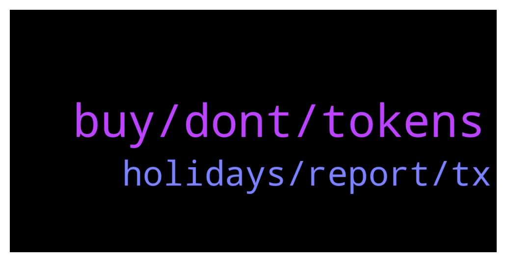

# **@ampnetapxchat**
 ## Analysis for **2021-12-12** - **2021-12-19**.

---

## 📊 **Basic Stats**

**n_messages_sent**: 36

---

---

## 🔝 **Top keywords and related messages**

1. **buy, dont, tokens**

    @sourmans --- *its gonna be a nightmare to fill taxes form if you guys dont do the freaking Etherscan price update* **--->** [TG Discussion](https://t.me/ampnetapxchat/35611)

    @Krabatu --- *just please dont ask us to stake AAPX on Ethereum network 😅* **--->** [TG Discussion](https://t.me/ampnetapxchat/35630)

    @<UNK> --- *We are still considering new token for DAO, but if there is one, it wont be airdropped, rather AAPX holders will stake the tokens to farm Pontoon token* **--->** [TG Discussion](https://t.me/ampnetapxchat/35624)

    @maroraza --- *Hey @mislavjavor any update on this when you are launching this PontoonDAO? if no date any idea in which month its gonna come?* **--->** [TG Discussion](https://t.me/ampnetapxchat/35667)

    @PFCBLic --- *I just hope that mechanism for providing value for aapx holders will be functional and well engineered as well. We deserve it at the end of the story.* **--->** [TG Discussion](https://t.me/ampnetapxchat/35676)

    @runex_x1 --- *I think it will stay hard on ampnet, untill it tokenizes some real world assets everybody can buy portions of :).* **--->** [TG Discussion](https://t.me/ampnetapxchat/35665)

2. **holidays, report, tx**

    @mislavjavor --- *Hey community. I know we've been silent for a while but there was really nothing major to report.   However, we are pleased to say we have some very big news which will be released at the beginning of January.   I would love to inform you more, however we have to be respectful towards our contractual obligations.* **--->** [TG Discussion](https://t.me/ampnetapxchat/35728)

    @runex_x1 --- *Would be nice if you guys could do a pontoondao-progress update before going into the holidays. Tx* **--->** [TG Discussion](https://t.me/ampnetapxchat/35725)

    @<UNK> --- *https://t.me/ampnetapxchat/35378 This is the latest update on DAO and overall situation, next one will be after the holidays* **--->** [TG Discussion](https://t.me/ampnetapxchat/35726)

    @runex_x1 --- *ok. I suppose there is nothing new to report for now then. Tx* **--->** [TG Discussion](https://t.me/ampnetapxchat/35727)

    @runex_x1 --- *I'm looking forward to January and it will hoepfully pump up the excitement and implement the project's goal (to bring in real work assets).* **--->** [TG Discussion](https://t.me/ampnetapxchat/35651)

