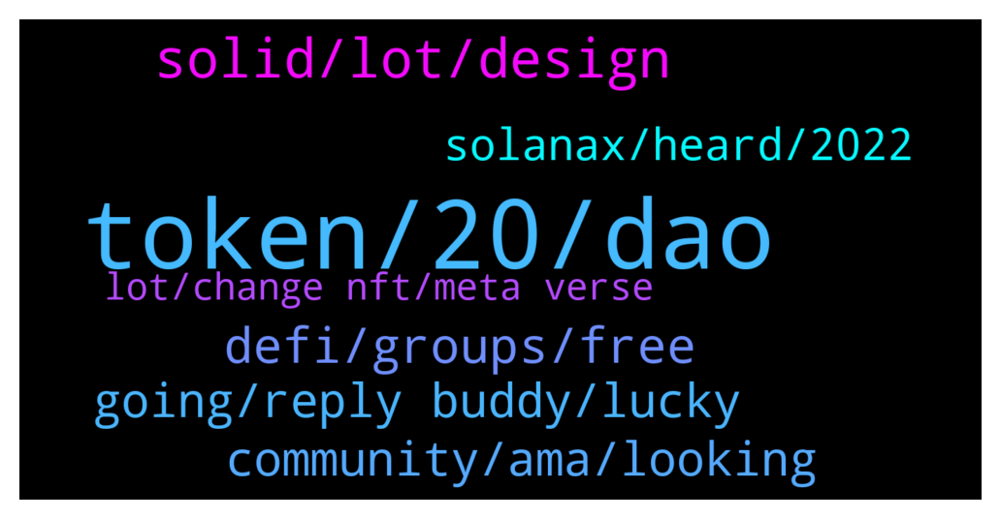

# **@de_fi**
 ## Analysis for **2021-12-12** - **2021-12-19**.

---

## 📊 **Basic Stats**

**n_messages_sent**: 282

---

---

## 🔝 **Top keywords and related messages**

1. **token, 20, dao**

    @Tomy1919 --- *I'm using all these platforms.  Hodlnaut > Higher rates Nexo > 0 interest loan Celsius > more assets.* **--->** [TG Discussion](https://t.me/de_fi/231108)

    @xnatasx --- *Are they messing up their airdrop or something with those fees? https://etherscan.io/tx/0x9681bcf8d00169c9eeb61f025cf4a59de2cef8995462db8a4bb70fe84af94507  Edit: No, expected very high gas to claim.* **--->** [TG Discussion](https://t.me/de_fi/231503)

    @WhoCareBaby1 --- *What do you guys think about market direction??* **--->** [TG Discussion](https://t.me/de_fi/231088)

    @WhoCareBaby1 --- *I'm buying every dip. But it keep dipping and I'm out of fiat 😁* **--->** [TG Discussion](https://t.me/de_fi/231092)

    @Matthew Nelson --- *is someone holding shib? I want to try it* **--->** [TG Discussion](https://t.me/de_fi/230071)

    @Partickk29 --- *Nexus mutual is an insurance project in blockchain which offer loss insurance which will cover your loss in case of hack or anything like that.  Hodlnaut and nexo supporting nexus mutual* **--->** [TG Discussion](https://t.me/de_fi/231118)

2. **solid, lot, design**

    @Kartik --- *Yo I came across a good BSC project, private sell ongoing, Safu play. Check it out  TG: goatprotocolfinance* **--->** [TG Discussion](https://t.me/de_fi/230087)

    @dcaeverything --- *I would like to discuss this project. Can I PM you?* **--->** [TG Discussion](https://t.me/de_fi/231851)

    @Tronix50 --- *I’ve heard nothing but good things about it actually from a lot of people! Very solid project. Easy 100x in the near future.* **--->** [TG Discussion](https://t.me/de_fi/230226)

    @xnatasx --- *Seems like you should ask that project instead.* **--->** [TG Discussion](https://t.me/de_fi/231309)

    @nvy0x --- *Only if you let me shill your project* **--->** [TG Discussion](https://t.me/de_fi/230114)

    @<UNK> --- *Yo guys any good plays coming up soon? got some extra money wanna play with* **--->** [TG Discussion](https://t.me/de_fi/230508)

3. **defi, groups, free**

    @David --- *Please can anyone teach me defi* **--->** [TG Discussion](https://t.me/de_fi/231806)

    @cryptokittyy --- *What is a meaning of Defi for you?* **--->** [TG Discussion](https://t.me/de_fi/230532)

    @LindaDaughter --- *Hello everyone how to make money in defi please?* **--->** [TG Discussion](https://t.me/de_fi/229807)

    @brianelders --- *I am working with a DeFi project looking for a CMO ... any idea's please DM me* **--->** [TG Discussion](https://t.me/de_fi/230503)

    @GioFlorin --- *they are fully backed with cartesi* **--->** [TG Discussion](https://t.me/de_fi/229655)

    @realpeter --- *Don’t miss out on our job openings on DeFi Prime! https://defiprime.pallet.xyz/jobs* **--->** [TG Discussion](https://t.me/de_fi/231612)

4. **going, reply buddy, lucky**

    @xnatasx --- *https://messari.io/governor/proposal-tracker Good way to see what's going on/voted on...* **--->** [TG Discussion](https://t.me/de_fi/230462)

    @xnatasx --- *Ok. Just being on look out and offering a warning.  Do proceed.* **--->** [TG Discussion](https://t.me/de_fi/231837)

    @OxPak --- *Hey everyone glad to be here!* **--->** [TG Discussion](https://t.me/de_fi/230897)

    @dcaeverything --- *I have already and going to HODL* **--->** [TG Discussion](https://t.me/de_fi/230543)

    @ayoistimi18 --- *Okay will do that right away.* **--->** [TG Discussion](https://t.me/de_fi/230019)

    @cryptokittyy --- *Hi there! How is your Saturday going?* **--->** [TG Discussion](https://t.me/de_fi/231746)

5. **community, ama, looking**

    @<UNK> --- *No it's my community that will do it* **--->** [TG Discussion](https://t.me/de_fi/230221)

    @ayoistimi18 --- *About the AMA, is it my community that will do the hosting of the AMA session?* **--->** [TG Discussion](https://t.me/de_fi/230167)

    @Mohammad reza nasiri --- *Please add me(admin) to the list of periods so that I can create group in my country and do the group's turnout work* **--->** [TG Discussion](https://t.me/de_fi/230988)

    @<UNK> --- *Hey guys... 👋 I am from Crypto Castle 🏰 and would like to share an AMA proposal... Who is the right person to Contact...??* **--->** [TG Discussion](https://t.me/de_fi/230100)

    @dereksilva --- *Please make an account on the site, and apply! Looking forward to seeing your information come through.* **--->** [TG Discussion](https://t.me/de_fi/229715)

    @TheCartelX --- *GoldFinX  We're growing a community of disrupters in the artisanal gold mining industry. Join a group a people, like you, who want to change the world for the better and need the resources to do so. We're your resource, and together we can alter the course of our future for the better.  Join the GoldFinX movement, become an Ambassador today: https://goldfinx.com/ambassador/* **--->** [TG Discussion](https://t.me/de_fi/229957)

6. **solanax, heard, 2022**

    @cryptokittyy --- *Few days ago Solanax team on their Twitter page announced approximate date in February* **--->** [TG Discussion](https://t.me/de_fi/231848)

    @poppycoins --- *Sounds interesting for sure. I think I've heard something about this one. When will be launched?* **--->** [TG Discussion](https://t.me/de_fi/230063)

    @cryptokittyy --- *Solanax is the new project by Solana* **--->** [TG Discussion](https://t.me/de_fi/231830)

    @Gu_Mammadova --- *Things like IDO will push Solanax forward* **--->** [TG Discussion](https://t.me/de_fi/230549)

    @cryptokittyy --- *Does anyone here know when is the launch of Solanax?* **--->** [TG Discussion](https://t.me/de_fi/231828)

    @cryptokittyy --- *I have heard of this gus if I am not mistaken it is Solana team, right?* **--->** [TG Discussion](https://t.me/de_fi/230538)

7. **lot, change nft, meta verse**

    @poppycoins --- *Any new NFT project? Or something interesting in this area, maybe* **--->** [TG Discussion](https://t.me/de_fi/230059)

    @mosesgod --- *Well I've got a project for you that started out as a NFT, and then became DeFi.   They were actually, at time of the launch a top 15 opensea project. Yesterday they launched their fair launch auction on Copper.* **--->** [TG Discussion](https://t.me/de_fi/230065)

    @ayoistimi18 --- *Anyone with sites where I can claim some free Nft's* **--->** [TG Discussion](https://t.me/de_fi/230704)

    @mosesgod --- *As a NFT holder youll be able to stake your NFTs and receive apy boosts on your strategies.* **--->** [TG Discussion](https://t.me/de_fi/230066)

    @Knavecrypto --- *Qubsim will change the NFT world, check it out* **--->** [TG Discussion](https://t.me/de_fi/229862)

    @loiehc --- *Qubsim will change the NFT world, check it out* **--->** [TG Discussion](https://t.me/de_fi/229846)

