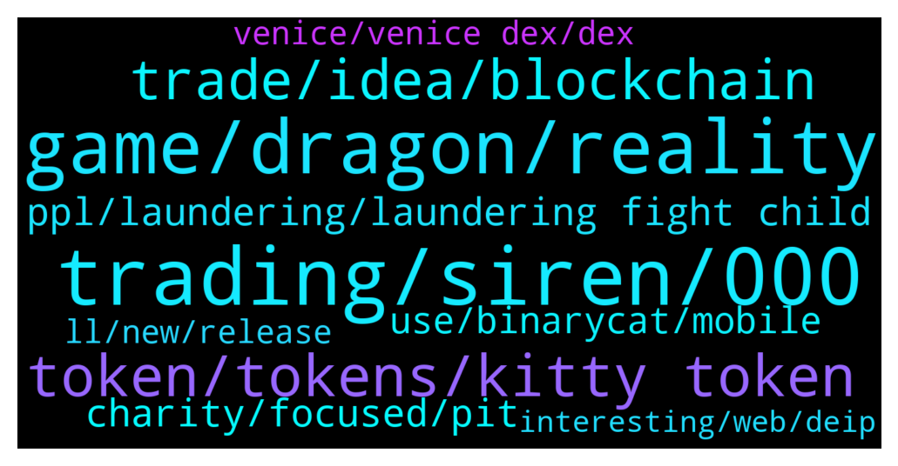

# **@defisearchpublic**
 ## Analysis for **2021-12-12** - **2021-12-19**.

---

## 📊 **Basic Stats**

**n_messages_sent**: 147

---

---

## 🔝 **Top keywords and related messages**

1. **trading, siren, 000**

    @samuelgupta --- *hodling, staking, and event-trading is for me* **--->** [TG Discussion](https://t.me/defisearchpublic/239962)

    @samuelgupta --- *but guy...talk to me about your nft or your bags :)* **--->** [TG Discussion](https://t.me/defisearchpublic/239945)

    @Phillo369 --- *🚨 4 DAYS LEFT 🚨 Community Airdrop Event ⏰ Ends on: Dec 10th 💵 200.000 $WIS  JOIN NOW: https://wn.nr/qvMT3q 😉 Airdrop will be distributed for ones joining in Pioneer Liquidity Proving and early depositing for Farming Be early birds guys 💪🏻  ——— You can find us here • Website • Twitter • Medium • Telegram • Telegram Ann Channel • Discord* **--->** [TG Discussion](https://t.me/defisearchpublic/239841)

    @samuelgupta --- *yeah but sometime you need to know when to cut losses haha* **--->** [TG Discussion](https://t.me/defisearchpublic/239968)

    @ToraDoraLover --- *Im monotoring Sway and its dip now. Good time to buy its $0.01797 as of now* **--->** [TG Discussion](https://t.me/defisearchpublic/240100)

    @IZenki20 --- *Then see it yourself. A lot hitmakers are joining. You know sean kingston? He sold his first minted post last nov.* **--->** [TG Discussion](https://t.me/defisearchpublic/240091)

2. **game, dragon, reality**

    @Jhayz18 --- *Every day, there will be a special mission for the Dragon Trainers in the game.* **--->** [TG Discussion](https://t.me/defisearchpublic/239852)

    @Kininight --- *Was told it's poised to connect users to the gaming Metaverse* **--->** [TG Discussion](https://t.me/defisearchpublic/239908)

    @Jhayz18 --- *The Hydraverse’s Alpha Version has 3 Features* **--->** [TG Discussion](https://t.me/defisearchpublic/239858)

    @Jhayz18 --- *Yes! the Alpha version will be completely FREE for everyone to participate!* **--->** [TG Discussion](https://t.me/defisearchpublic/239874)

    @Breed123 --- *It's really a unique gaming project compared to other platforms.. Users get to receive a $5 Rhinos NFT card per purchase and also $5 is burnt* **--->** [TG Discussion](https://t.me/defisearchpublic/239912)

    @Kennoi --- *Is it the Rhinos game project or Graviton? Many people are talking about it already* **--->** [TG Discussion](https://t.me/defisearchpublic/239910)

3. **token, tokens, kitty token**

    @MaskedRiderBlackRX --- *What's the name of the token of Clout? I want to buy one* **--->** [TG Discussion](https://t.me/defisearchpublic/240098)

    @ειρήνη --- *but I wonder if this Kitty token will get a high value* **--->** [TG Discussion](https://t.me/defisearchpublic/239825)

    @momshie1328 --- *one thing more... first holders of the native token will have a larger ownership stake before the offer increases.* **--->** [TG Discussion](https://t.me/defisearchpublic/239824)

    @ειρήνη --- *I am interested with the part of earning free token* **--->** [TG Discussion](https://t.me/defisearchpublic/239817)

    @ToraDoraLover --- *Im just curious though, what do you think are those tokens that wil be listed here?* **--->** [TG Discussion](https://t.me/defisearchpublic/240071)

    @ειρήνη --- *what kind of reward is that?* **--->** [TG Discussion](https://t.me/defisearchpublic/239820)

4. **trade, idea, blockchain**

    @Queenstarlet --- *Instead of laundering, they should trade crypto* **--->** [TG Discussion](https://t.me/defisearchpublic/239946)

    @cryptofood10 --- *never heard we can trade options with crypto* **--->** [TG Discussion](https://t.me/defisearchpublic/239965)

    @nobelmoto --- *I think crypto in the future will still be guided by something like web3* **--->** [TG Discussion](https://t.me/defisearchpublic/239988)

    @Jhayz18 --- *The results are based on blockchain technology, which ensures fairness even when they are not online!* **--->** [TG Discussion](https://t.me/defisearchpublic/239869)

    @momshie1328 --- *since avalanche has the fastest transactions among all those blockchain* **--->** [TG Discussion](https://t.me/defisearchpublic/239830)

    @momshie1328 --- *where users can bet on the price of crypto-assets and the relationship between them.* **--->** [TG Discussion](https://t.me/defisearchpublic/239814)

5. **ppl, laundering, laundering fight child**

    @samuelgupta --- *not just mone laundering, everything that they fight against, they do,... from child traficing, to rest* **--->** [TG Discussion](https://t.me/defisearchpublic/239943)

    @Queenstarlet --- *Can't be helped, ppl will be ppl* **--->** [TG Discussion](https://t.me/defisearchpublic/239941)

    @cryptofood10 --- *wonder if those organizations aren't laundering money too* **--->** [TG Discussion](https://t.me/defisearchpublic/239939)

    @ToraDoraLover --- *Yes. Lots of hackers and scammers are just around* **--->** [TG Discussion](https://t.me/defisearchpublic/240055)

    @cryptofood10 --- *true but as long as they help* **--->** [TG Discussion](https://t.me/defisearchpublic/239942)

    @samuelgupta --- *I would say not ... you saw that they couldn't answer to duche Elon where would they spend 6B hah* **--->** [TG Discussion](https://t.me/defisearchpublic/239940)

6. **charity, focused, pit**

    @Queenstarlet --- *We need more charity focused projects IMO* **--->** [TG Discussion](https://t.me/defisearchpublic/239919)

    @Letizia0001 --- *I have here PittysERC20. A charity based project. Collection of 5000 generative pits will be made with a goal to give back to the pit community. Focused on giving back the mans bestfriend through supporting pit community.* **--->** [TG Discussion](https://t.me/defisearchpublic/239914)

    @Queenstarlet --- *Yes to make more money for charity* **--->** [TG Discussion](https://t.me/defisearchpublic/239954)

    @samuelgupta --- *unicef with all the money they get annualy, could end hunger, thurst and half of the homeless* **--->** [TG Discussion](https://t.me/defisearchpublic/239931)

    @samuelgupta --- *aha really ? tell me one charity that really does charity and makes a differenc* **--->** [TG Discussion](https://t.me/defisearchpublic/239929)

    @Queenstarlet --- *Is this one based on charity?!* **--->** [TG Discussion](https://t.me/defisearchpublic/239918)

7. **use, binarycat, mobile**

    @ToraDoraLover --- *Even the info if this can be used in mobile phones is not there, is it?* **--->** [TG Discussion](https://t.me/defisearchpublic/240078)

    @ειρήνη --- *where can I find more information about BinaryCat?* **--->** [TG Discussion](https://t.me/defisearchpublic/239831)

    @ToraDoraLover --- *Im also using this one too. This is good its easy to use* **--->** [TG Discussion](https://t.me/defisearchpublic/240094)

    @MaskedRiderBlackRX --- *It would be better of thay can have an app for this* **--->** [TG Discussion](https://t.me/defisearchpublic/240077)

    @nobelmoto --- *But so far nothing at all in general use* **--->** [TG Discussion](https://t.me/defisearchpublic/239990)

    @momshie1328 --- *Have you heard BinaryCat App? This is soon to launch...* **--->** [TG Discussion](https://t.me/defisearchpublic/239811)

8. **venice, venice dex, dex**

    @IZenki20 --- *Venice works Nearly to "Rialto" Cross chain Bridge to enable tokens from other EVM-based network to be migrated over to the Venice Dex* **--->** [TG Discussion](https://t.me/defisearchpublic/240064)

    @IZenki20 --- *Yeah. That's why me. Im waiting for Venice to be release* **--->** [TG Discussion](https://t.me/defisearchpublic/240056)

    @ToraDoraLover --- *Venice? Sounds new to me? How's your research about it so far?* **--->** [TG Discussion](https://t.me/defisearchpublic/240057)

    @ViCious25 --- *will ape in big! won't miss that for sure* **--->** [TG Discussion](https://t.me/defisearchpublic/240263)

    @IZenki20 --- *Once the TG group of Venice was opened, we can suggest that* **--->** [TG Discussion](https://t.me/defisearchpublic/240076)

    @IZenki20 --- *Well, there will be a lot of features that will come up. For now what i know is token swapping. And much easier to swap here in venice i can say that* **--->** [TG Discussion](https://t.me/defisearchpublic/240067)

9. **ll, new, release**

    @Jezzyrei --- *Can you tell me what will happen to those features?* **--->** [TG Discussion](https://t.me/defisearchpublic/239862)

    @MaskedRiderBlackRX --- *Well, fundamentals. are good for me.if this will be release, this will help to make security of our payments* **--->** [TG Discussion](https://t.me/defisearchpublic/240069)

    @Whale6_9 --- *I see you got the link in your bio so I'll take a closer look into it* **--->** [TG Discussion](https://t.me/defisearchpublic/240266)

    @MaskedRiderBlackRX --- *I'll buy now. Thanks for sharing clout. There's new in my port folio now im glad* **--->** [TG Discussion](https://t.me/defisearchpublic/240102)

    @IZenki20 --- *Yes that new feature and update of clout* **--->** [TG Discussion](https://t.me/defisearchpublic/240096)

    @ToraDoraLover --- *Okay i'll check it later thanks by the way* **--->** [TG Discussion](https://t.me/defisearchpublic/240084)

10. **interesting, web, deip**

    @Kris --- *I've been paying attention to web 3.0 projects lately, DEIP in particular, looks very interesting* **--->** [TG Discussion](https://t.me/defisearchpublic/240214)

    @ddddweffc --- *It most certainly has the capacity to. I believe the DEIP protocol for content creation will pique the curiosity of many web developers.* **--->** [TG Discussion](https://t.me/defisearchpublic/240194)

    @Zelda --- *What are your opinions on the condition of web 3 development today? I started hearing less and less about it.* **--->** [TG Discussion](https://t.me/defisearchpublic/240193)

    @marateblan --- *That's why I'm interested in DEIP; it's an interesting platform. It appears to be really cool. It's a protocol for the economics of creators.* **--->** [TG Discussion](https://t.me/defisearchpublic/240167)

    @Manchkin --- *I found the platform really interesting* **--->** [TG Discussion](https://t.me/defisearchpublic/239992)

    @Kininight --- *Hello guys... What's up. Heard about a new next gen project that's poised to connect users. How true is this?* **--->** [TG Discussion](https://t.me/defisearchpublic/239907)

