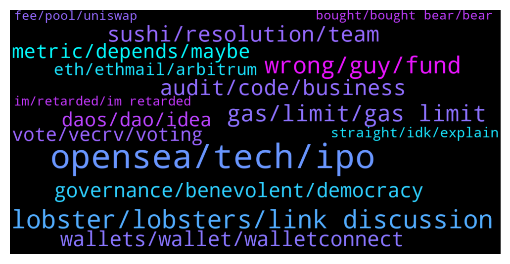

# **@lobsters_chat**
 ## Analysis for **2021-12-12** - **2021-12-19**.

---

## 📊 **Basic Stats**

**n_messages_sent**: 2006

---

---

## 🔝 **Top keywords and related messages**

1. **opensea, tech, ipo**

    @Figu3 --- *Yeah, I agree with the current conclusions. Still think crossing a line after a year of experimentation is too quick. The goal of crypto is to scale trust by replacing it with algorithmic control, right ? So if we can't scale governance this way, what good is the tech ?* **--->** [TG Discussion](https://t.me/lobsters_chat/307287)

    @samd0000 --- *Starting salaries for crypto should be $400k minimum for biz dev, finance and tech roles if crypto wants to steal talent from legacy tech, investment banking or consulting* **--->** [TG Discussion](https://t.me/lobsters_chat/305931)

    @ChiTimesChi --- *While it's possible to unfuck the situation, why would anyone do it? It's crypto, everyone forgot already. Just launch MUSD instead and tell this time it will work.* **--->** [TG Discussion](https://t.me/lobsters_chat/307596)

    @dblockdiver --- *Probably a nothing burger. There is currently no tax regulation for crypto in Korea atm.* **--->** [TG Discussion](https://t.me/lobsters_chat/305596)

    @nourharidy --- *these guys raised like $45k and actually built a fully functional crypto game which I enjoy playing every single day tbh* **--->** [TG Discussion](https://t.me/lobsters_chat/306612)

    @alekseipu --- *https://www.theblockcrypto.com/post/126540/south-korea-crypto-vc-hashed-investigation-tax-authority-nts?utm_source=telegram&utm_medium=social   First time I see something like that as a news. How crypto community must react on that?  Like negative scenario: Hashed sells all assets they are in, which means projects from their portfolio rekt? Or how?* **--->** [TG Discussion](https://t.me/lobsters_chat/305595)

2. **lobster, lobsters, link discussion**

    @alejoamiras --- *Sup guys ! Lobster’s NFTs owners get once a again special treatment ! Open BETA to holders 🎉   We are a decentralized cost averaging protocol. Just pay for deposit and withdraw, even if you want to execute 100 swaps :)  https://twitter.com/mean_fi/status/1470427779854442502?s=21* **--->** [TG Discussion](https://t.me/lobsters_chat/307138)

    @FiveBoroughs --- *Basically Lobsters is a community or real DeFi knowledgeable people that will actually test beta products and not just farm airdrop, and it turns out that is valuable to other projects* **--->** [TG Discussion](https://t.me/lobsters_chat/308455)

    @Autismvisky --- *Gm lads I've surfing here for a while and remember a logo discussion over the past months but i was busy back then‚ and i would like to contribute with a branding design regarding the lobster logo and the lobster nft‚ if that subject still up i would like to get a few answers regarding the direction of the branding matter to start working on the task* **--->** [TG Discussion](https://t.me/lobsters_chat/307625)

    @tmmae --- *Hmm I have my one lobster in the same wallet I minted it on and not on whitelist. Wallet as a couple of txs but less than 10* **--->** [TG Discussion](https://t.me/lobsters_chat/306538)

    @tesslerc --- *Ads should be paid for and go towards lobster dao.* **--->** [TG Discussion](https://t.me/lobsters_chat/306127)

    @Dogetoshi --- *Free research for Lobster plebs who cant afford sub* **--->** [TG Discussion](https://t.me/lobsters_chat/308046)

3. **wrong, guy, fund**

    @GuthL --- *Did he ever develop anything ever?* **--->** [TG Discussion](https://t.me/lobsters_chat/307057)

    @Alchemy --- *You think he'll be successful in extending his reach across and over existing protocols?* **--->** [TG Discussion](https://t.me/lobsters_chat/306973)

    @vPEPO --- *funny Arthur mentions that when he literally is frontrunning its own fund // building oversized positions vs the sizing he does for its own fund (he outperformed its own fund by 2x lmao)* **--->** [TG Discussion](https://t.me/lobsters_chat/305576)

    @ivangbi --- *ran is a smamming moron this is known by everyone, he has been doing PnD videos same as bitboy for eternity (but less paid, more so getting big investments)* **--->** [TG Discussion](https://t.me/lobsters_chat/305258)

    @somebodyontelegram --- *He’s sort of a compulsive gambler so this is not surprising. Would be funny if the one horse he bet everything on fails and is replaced by ETH* **--->** [TG Discussion](https://t.me/lobsters_chat/306304)

    @justsomedeveloper --- *He has hundred of millions of dollar in the war chest he can freely use so why not.* **--->** [TG Discussion](https://t.me/lobsters_chat/306974)

4. **gas, limit, gas limit**

    @Alphamint --- *Q: if i sent a txn with a gaslimit of 30M, and the block gas limit is 30M, am i guarantied to be the first txn in the block even tho i might not really burn all the gas?* **--->** [TG Discussion](https://t.me/lobsters_chat/305389)

    @Alphamint --- *Does anyone know what miners are optimising for when deciding on the next block gas limit?* **--->** [TG Discussion](https://t.me/lobsters_chat/308287)

    @Alphamint --- *in 1559, abs(blockGasLimit - parentGasLimit) <= parentGasLimit // 1024  It's kinda up to the miners to move it if they want, in hardhat it's just a constant 30M* **--->** [TG Discussion](https://t.me/lobsters_chat/306354)

    @zhongfu --- *0.0025 eth * gas price in gwei* **--->** [TG Discussion](https://t.me/lobsters_chat/308111)

    @admiralape --- *I have a strange thing on Kovan. The exact same code, same function. Contract deployed 9h ago uses 90k gas while a freshly deployed one uses 141k. Any suggestions?* **--->** [TG Discussion](https://t.me/lobsters_chat/306298)

    @BenChainsight --- *if the contract has some tokens in now with a non-zero balance it will use less gas if you add more of that token to it* **--->** [TG Discussion](https://t.me/lobsters_chat/306299)

5. **sushi, resolution, team**

    @StrategicReserve --- *I just don't understand  a) how are they planning on managing sushi's LP when they yank stables 10 days after they appear? Do they really not have a stables strategy? b) no announcement of this move, but happy to announce more TVL c) no indication of where the funds went and for what purpose, or who made the call to remove them* **--->** [TG Discussion](https://t.me/lobsters_chat/307413)

    @dsp83 --- *The Sushi governance saga continues, this time with an actually very interesting proposal https://forum.sushi.com/t/sushi-dao-restructure-proposal/6282* **--->** [TG Discussion](https://t.me/lobsters_chat/305535)

    @zegdathetkan --- *Is anyone seeing the fact that if dani sets sushi up for something like uni v3 pools, than popsicle would get more use cases. considering how multichain sushi already is, this would achieve the goal of multi-chain optimized farming on popsicle.   Can we expect something like this? Univ3 pools cannot be forked yet right?* **--->** [TG Discussion](https://t.me/lobsters_chat/307414)

    @rasikhmorani --- *Metadata: "In the interest of the Sushi Community I am resigning as CTO effective immediately. I very much enjoyed the things that we built together and will look back positively on this moment. https://media3.giphy.com/media/CmfPKzD1Lreb8lhgfh/giphy.gif  I wish Sushi the best and am saddened that Sushi is so imperiled within and without. The chaos that is occurring now is unlikely to result in a resolution that will leave the DAO as much more of a shadow than it once was without a radical structural transformation. I highly recommend the installation of a C-suite from outside the DAO and give them the tools to effectively manage a team. Be wary of any self proclaimed leaders arising from the current core team.  Now in my opinion is the time to bring together the community and move towards an effective resolution together.  I am standing by to dutifully hand over any accounts or information necessary to the next leader that is selected.  I am now going to take a one month vacation with my wife and kids and go build my next project. Long live Sushi 🍣"* **--->** [TG Discussion](https://t.me/lobsters_chat/305999)

    @pjsm1508 --- *dappradar airdropped a few hours ago, trading on sushi in case anybody's interested* **--->** [TG Discussion](https://t.me/lobsters_chat/307560)

    @LilMoonLamboX3 --- *equally successful as sushi means it's a trashfire lmfao* **--->** [TG Discussion](https://t.me/lobsters_chat/305250)

6. **audit, code, business**

    @dlingzm --- *Aside from Trail of Bits, anyone trust / recommend any other audit firms?* **--->** [TG Discussion](https://t.me/lobsters_chat/305860)

    @gonzogirl --- *do you read audit reports? much information could be gained out them* **--->** [TG Discussion](https://t.me/lobsters_chat/306336)

    @eth2enthusiast --- *Stumbled on them via tweet by code4rena, didn’t realize audit firms could be marketers. But here we are* **--->** [TG Discussion](https://t.me/lobsters_chat/308540)

    @Siimmoonn --- *Already doing that. Unfortunately almost all of the code/commits the audits deal with are not publicly available. so its a bit hard to follow* **--->** [TG Discussion](https://t.me/lobsters_chat/306337)

    @twpks --- *Yeah I'd be keen for 3rd party audit* **--->** [TG Discussion](https://t.me/lobsters_chat/305638)

    @river0x --- *Yeah code was audited aug 25, maybe reentrancyguard was modified/ retired in space between now and then?* **--->** [TG Discussion](https://t.me/lobsters_chat/308801)

7. **wallets, wallet, walletconnect**

    @freshaspect --- *hey guys - we have a list of at risk wallets, like this one https://etherscan.io/address/0xdc87397165b4f0f6d586f1bf60fa37494a362a6a that we just need these folk to look at their etherscan pages... any smart ideas on how we could make this happen?* **--->** [TG Discussion](https://t.me/lobsters_chat/307465)

    @sneg55 --- *cool but the problem is you have to go to inbox to see received messages and wallet owner don't know if he have any* **--->** [TG Discussion](https://t.me/lobsters_chat/305505)

    @nickbtts --- *guys, someone shared a cool tool that showed a visual web of wallets tx connections before...can you help a brother out? I can't find it now :(* **--->** [TG Discussion](https://t.me/lobsters_chat/305486)

    @iicc1 --- *You can import your Coinbase wallet seed in metamask* **--->** [TG Discussion](https://t.me/lobsters_chat/308280)

    @mdzor --- *hi frens, is there a dApp to take all dust coins from my wallet and send somewhere? (except scamcoins preferably 🙈)* **--->** [TG Discussion](https://t.me/lobsters_chat/305560)

    @ivangbi --- *You can google for bip39 and download the page and run it locally w/o wifi connected. You insert your seed phrase there and change “account” in one of the rows below to generate different ones. Or just check that you “created” that wallet through a ledger-style path or a metamask-style path (it asks so in the metamask interface)* **--->** [TG Discussion](https://t.me/lobsters_chat/305570)

8. **governance, benevolent, democracy**

    @Figu3 --- *Governance is also used for treasury management, partnership deals (Gauntlet and Certora on Aave, auditors and Compound), to decide on tokenomics (YFI) and plenty more. The whole point of on chain governance is avoiding juntas, via transparency, sufficiently decentralised distribution and option of ragequitting to a fork* **--->** [TG Discussion](https://t.me/lobsters_chat/307240)

    @DeadMeatHK --- *Governance isn't a new defi construct, it's a mandatory part of running a business in the outside world. I believe those "old fashioned" governance processes and roles are the very thing defi needs and it will come. But, it will come from outside.* **--->** [TG Discussion](https://t.me/lobsters_chat/307239)

    @Figu3 --- *Governance is a construct as old as the world. The whole point is were supposed to reinvent it with scaled and distributed governance. Anything else is just a lazy transposition from old corporate structures* **--->** [TG Discussion](https://t.me/lobsters_chat/307242)

    @coine_r --- *"The whole point of on chain governance is avoiding juntas, via transparency, sufficiently decentralised distribution and option of ragequitting to a fork"  If that is the whole point then how many times over does it need to woefully fail at it to yank people back to the reality of the fact that brockshane + glorified shares does not a reinvention make?* **--->** [TG Discussion](https://t.me/lobsters_chat/307276)

    @adammchen --- *I agree. We need distributed governance, great point* **--->** [TG Discussion](https://t.me/lobsters_chat/307248)

    @Figu3 --- *I like how everyone turns to the easy choice of dictatorship when faced with adversity. "Oh my god, governing together is hard, you do it". Builder burnout is very reason and I think it justifies a lot the reaction, still, delegated governance scaled with decentralization is the future, I bet my carreer on that* **--->** [TG Discussion](https://t.me/lobsters_chat/307352)

9. **metric, depends, maybe**

    @nicolares10 --- *That’s a good one derivative metric! Any idea on where I can source that? Nansen maybe ? @khanHamzah* **--->** [TG Discussion](https://t.me/lobsters_chat/308596)

    @Lorddimiter --- *uhh , FDV is a pretty stupid metric 🙂* **--->** [TG Discussion](https://t.me/lobsters_chat/308095)

    @stqrd --- *afaik they dont, 15m is the target, 30m is max* **--->** [TG Discussion](https://t.me/lobsters_chat/308292)

    @drinkius --- *Plus some raw stats that we build the daily upon: https://t.me/lobster_watcher* **--->** [TG Discussion](https://t.me/lobsters_chat/308366)

    @ivangbi --- *What is the difference between tally and snpashot or r they diff products?* **--->** [TG Discussion](https://t.me/lobsters_chat/308761)

    @oh_fuck_im_drunk --- *maybe but it's not about whether it's a good metric* **--->** [TG Discussion](https://t.me/lobsters_chat/308099)

10. **daos, dao, idea**

    @andrecronje --- *Personally, I've changed my mind on this one, I no longer think DAO's in a broad spectrum can work, I think DAO's based on an incredibly niche goal work well, but then its a coordination tool at best, and should be dissolved after achieving said goal. Benevolent dictatorship is the way to go.* **--->** [TG Discussion](https://t.me/lobsters_chat/307282)

    @eboado --- *I would recommend to take a look at the forum discussion about the topic, at least in my opinion pretty useful for people involved in DAOs https://governance.aave.com/t/aave-v3-launch-strategy-code-licensing/6316* **--->** [TG Discussion](https://t.me/lobsters_chat/307303)

    @DeadMeatHK --- *Eventually the DAO model will change from direct democracy to something that works. Meanwhile DAOs are infighting and stalled due to gov token apathy,   VCs and later money managers and funds will step in and take over and make stuff progress — albeit not in directions we'd necessarily like/want.* **--->** [TG Discussion](https://t.me/lobsters_chat/307228)

    @DeadMeatHK --- *I'd also suggest that if you have the misfortune of being familiar with MiFID II/MiFIR you'll see the challenges that face DAOs when it comes to being compliant with the regs.* **--->** [TG Discussion](https://t.me/lobsters_chat/307284)

    @farm42 --- *In an ideal format, I see the DAO system as trying on something that has passed its stage of development as just a group of people united by one secret (idea) to something with bigger social responsibility.* **--->** [TG Discussion](https://t.me/lobsters_chat/306569)

    @phil_muhbags --- *Why do daos have to get agreement from everyone? I think we know how other structures/ businesses run.* **--->** [TG Discussion](https://t.me/lobsters_chat/307105)

11. **vote, vecrv, voting**

    @FinGeekDeFi --- *what would be a good alternative to a simple majority vote system* **--->** [TG Discussion](https://t.me/lobsters_chat/307219)

    @Figu3 --- *Democracies get 50-70% turnout with people having to write their vote on a piece of paper. That's the current comparison we should make to understand how bad we are at this* **--->** [TG Discussion](https://t.me/lobsters_chat/307236)

    @Figu3 --- *That's just because not enough people vote lol. I feel were misunderstanding the issue here.* **--->** [TG Discussion](https://t.me/lobsters_chat/307225)

    @vPEPO --- *worse part is that there were 1200 voters in that proposal* **--->** [TG Discussion](https://t.me/lobsters_chat/307216)

    @komrade_keeks --- *Quadratic voting, but that’s not even remotely Sybil resistant without some hacky hidden heuristics slapped on the voting weight* **--->** [TG Discussion](https://t.me/lobsters_chat/307220)

    @vPEPO --- *and it changed due to a single entity voting* **--->** [TG Discussion](https://t.me/lobsters_chat/307217)

12. **eth, ethmail, arbitrum**

    @captainlarry --- *What should i do if i am on the list but you don’t have my eth address *NFT AIRDROP* i try to send to the bot but it says that it have all the addresses now* **--->** [TG Discussion](https://t.me/lobsters_chat/307647)

    @farm42 --- *Suggest reading https://joelgsamuel.medium.com/how-to-keep-your-smartphone-safe-from-spying-d7d50fbed817 , the best option for IMEI/IMSI change is a rooted (!) cellphone or even physical upgrade. To my mind you can change IMEI (but not IMSI) in engineermode, as well as other CDS info…* **--->** [TG Discussion](https://t.me/lobsters_chat/307034)

    @sneg55 --- *Hey, I wonder what's the business model in aggregating bridges?   You don't incentivize integrators who brings trading volume to you via SDK, right?* **--->** [TG Discussion](https://t.me/lobsters_chat/307180)

    @ivangbi --- *Sorry for killing ETH for now, but in the future it will make reusable Credit Accounts greener* **--->** [TG Discussion](https://t.me/lobsters_chat/308061)

    @Alphamint --- *Nope, im wondering if there's a http gateway to eth state* **--->** [TG Discussion](https://t.me/lobsters_chat/305443)

    @phil_muhbags --- *Can we put through an EIP to lock all the eth stuck in the beacon chain contract 🤔* **--->** [TG Discussion](https://t.me/lobsters_chat/308731)

13. **straight, idk, explain**

    @confidoqueen --- *hello can someone help me figure out wtf is happening here? https://etherscan.io/tx/0x90a5d10ca9092a82464fd87efb1a7ed06c0d0420fde0cbb20af6e7ec9046c303* **--->** [TG Discussion](https://t.me/lobsters_chat/306721)

    @gonzogirl --- *https://qcpcapital.medium.com/an-explanation-of-defi-options-vaults-dovs-22d7f0d0c09f  ok, being total dumb, can someone easily explain what the hell DOV is* **--->** [TG Discussion](https://t.me/lobsters_chat/307146)

    @eldefijesus --- *apparently not, so here it is. Enjoy: https://docs.google.com/document/d/1U0JxKfQiMRorTZnt_POSz2eCqQcg0J8LT3SNxf-aTk8/edit* **--->** [TG Discussion](https://t.me/lobsters_chat/307099)

    @zegdathetkan --- *It definetly is, but it was just a morning brain fart* **--->** [TG Discussion](https://t.me/lobsters_chat/307606)

    @Sp33dyTT --- *People uh hur durr looks bad but not a single person to explain wtf is this* **--->** [TG Discussion](https://t.me/lobsters_chat/306452)

    @ivangbi --- *“Why is a shitcoin up” guys cmon this is a straight path ot a ban. How is this a convo.* **--->** [TG Discussion](https://t.me/lobsters_chat/308684)

14. **im, retarded, im retarded**

    @freshaspect --- *That doesn't matter in this instance.* **--->** [TG Discussion](https://t.me/lobsters_chat/307496)

    @Alphamint --- *theoretical Q, i said im retarded....* **--->** [TG Discussion](https://t.me/lobsters_chat/305432)

    @ivangbi --- *Is oke to share y delet @PeterMm ser* **--->** [TG Discussion](https://t.me/lobsters_chat/305800)

    @Alphamint --- *cool, but not what i meant* **--->** [TG Discussion](https://t.me/lobsters_chat/305427)

    @Ekius --- *Hi ser, Pmed you a question.* **--->** [TG Discussion](https://t.me/lobsters_chat/306301)

    @ivangbi --- *@OxMikko maybe u can reply ser, a techy question.* **--->** [TG Discussion](https://t.me/lobsters_chat/308184)

15. **bought, bought bear, bear**

    @coine_r --- *Basically, last price someone managed to sell it for? That is... dubious* **--->** [TG Discussion](https://t.me/lobsters_chat/308419)

    @whiterun --- *they act like google. buy stuff before it's getting big.* **--->** [TG Discussion](https://t.me/lobsters_chat/306206)

    @ivangbi --- *They always list at market dumps funny* **--->** [TG Discussion](https://t.me/lobsters_chat/305463)

    @Nikar00 --- *https://debank.com/profile/0xd47438c816c9e7f2e2888e060936a499af9582b3 apparently this funded other ones* **--->** [TG Discussion](https://t.me/lobsters_chat/308815)

    @defidude --- *Because pleasrdao is already for profit? (Doge NFT) Or why?* **--->** [TG Discussion](https://t.me/lobsters_chat/307445)

    @vPEPO --- *why? they received partially payment on BNB vested afaik (which did multiples over the last 2 years)* **--->** [TG Discussion](https://t.me/lobsters_chat/307981)

