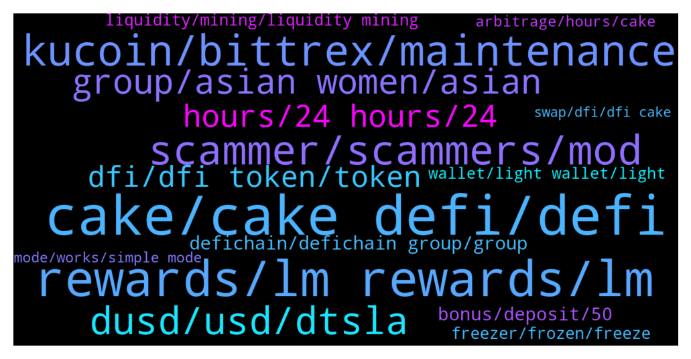

# **@CakeDeFi_EN**
 ## Analysis for **2021-12-19** - **2021-12-26**.

---

## 📊 **Basic Stats**

**n_messages_sent**: 1643

---

---

## 🔝 **Top keywords and related messages**

1. **cake, cake defi, defi**

    @fabioandreatta --- *Yes it does! (just not on Cake)  Download the app: www.defichain.com* **--->** [TG Discussion](https://t.me/CakeDeFi_EN/152348)

    @moneydelics --- *Hey, Bakers! I made a quick and easy tutorial for beginners on how to calculate and plan Cake DeFi earnings using the calculator on Cake home page 💸  https://m.youtube.com/watch?v=DnH176R8aKc&feature=youtu.be* **--->** [TG Discussion](https://t.me/CakeDeFi_EN/155038)

    @Bettie10no --- *Hello, please can someone help introduce me to cake Defi. Am just new to it* **--->** [TG Discussion](https://t.me/CakeDeFi_EN/155044)

    @JonD26 --- *Do you think Cake-defi is actual defi?* **--->** [TG Discussion](https://t.me/CakeDeFi_EN/155402)

    @fabioandreatta --- *Cake DeFi's Services Simply Explained  👉 https://blog.cakedefi.com/cake-simply-explained/* **--->** [TG Discussion](https://t.me/CakeDeFi_EN/155681)

    @moneydelics --- *If you like video content, I create YouTube video review and tutorial about Cake DeFi and I have a playlist about it:  What is Cake DeFi?  https://www.youtube.com/playlist?list=PLleJzcLaifSqFHO-2QihxEh26Mwq5TAag* **--->** [TG Discussion](https://t.me/CakeDeFi_EN/155050)

2. **rewards, lm rewards, lm**

    @brandoncjl --- *have LM rewards been delayed today? have not received it yet* **--->** [TG Discussion](https://t.me/CakeDeFi_EN/153022)

    @Willian --- *A lot people didn't receive the LM reward this morning i think* **--->** [TG Discussion](https://t.me/CakeDeFi_EN/153472)

    @christina --- *There are no rewards on my transaction page. The only rewards I see are the small ones in LP page. And my assets balance overall keeps getting lower* **--->** [TG Discussion](https://t.me/CakeDeFi_EN/153009)

    @Weiquan --- *feels reassuring that i am not jsut the only one who didn’t receive LM rewards .. phew* **--->** [TG Discussion](https://t.me/CakeDeFi_EN/154700)

    @jackluo --- *scammers keep msg us, is any staff working on the problem of no rewards this morning?* **--->** [TG Discussion](https://t.me/CakeDeFi_EN/153467)

    @bentansg --- *I'm seeing the same thing with my LM rewards as well.* **--->** [TG Discussion](https://t.me/CakeDeFi_EN/153550)

3. **kucoin, bittrex, maintenance**

    @Careluna1201 --- *Kucoin the same, so we are pretty much stuck. If you need you money now now you are in trouble. It would be nice to have more Exchanges to work with.* **--->** [TG Discussion](https://t.me/CakeDeFi_EN/153049)

    @Patrick --- *Hey guys, i bought dfi tokens ok bittrex but now i cannot send them to my dfi desktop app since days because they have maintenance on this currency. Does any body know how long it will take?* **--->** [TG Discussion](https://t.me/CakeDeFi_EN/153595)

    @Careluna1201 --- *Is it just me having problems to withdraw to Kucoin?* **--->** [TG Discussion](https://t.me/CakeDeFi_EN/152832)

    @Jose --- *Lost my DFI. Sent it to Kucoin and as of right now they are not taking DFI. Lost about $1,100...* **--->** [TG Discussion](https://t.me/CakeDeFi_EN/152084)

    @Bence --- *withdrew some DFI from cake to kucoin like 2hrs ago and it still hasn’t arrived, cake says transaction is complete, how come?* **--->** [TG Discussion](https://t.me/CakeDeFi_EN/153405)

    @enalettin --- *You can withdraw to kucoin as i did it many Times you lose if you do send by wrong protocol such as using dfi protocol where the destination wallet is not DfI supported* **--->** [TG Discussion](https://t.me/CakeDeFi_EN/153357)

4. **scammer, scammers, mod**

    @Eugene --- *Had a good time answering the scammers though haha* **--->** [TG Discussion](https://t.me/CakeDeFi_EN/156897)

    @NicholasLiew --- *Can we compile a list of known scammers and pin it* **--->** [TG Discussion](https://t.me/CakeDeFi_EN/153095)

    @BerndMack --- *The scammers are rarely here in the channel. Please block if you are contacted and report directly to a moderator. Here in the channel is not necessary* **--->** [TG Discussion](https://t.me/CakeDeFi_EN/153662)

    @Sam --- *how can I report a scammer?* **--->** [TG Discussion](https://t.me/CakeDeFi_EN/156025)

    @whiskyzulu13 --- *@fabioandreatta @Michael_Schredl these scammers individually messaged me but refused to pick up my call* **--->** [TG Discussion](https://t.me/CakeDeFi_EN/154085)

    @James --- *Day 1 of trying to get scammers to send me dfi* **--->** [TG Discussion](https://t.me/CakeDeFi_EN/154373)

5. **dusd, usd, dtsla**

    @itmlgife --- *Hi BrokeFeller, you didn't lose 514$. The current value of DUSD is roughly around 1.32$. You should be able to confirm that by checking the USD value of your DUSD balance in Cake.* **--->** [TG Discussion](https://t.me/CakeDeFi_EN/152088)

    @Charlyjaja --- *How come DUSD price went down from 1.3 USD to about 1.22USD? Is it because people withrew some of their money during/after yesterday's "crash"?* **--->** [TG Discussion](https://t.me/CakeDeFi_EN/152723)

    @randylzj --- *Hi what will happen when dusd price changes to 1 usd? I got it at around 1.3usd, will there be more allocation of dusd given or will I just lose the value* **--->** [TG Discussion](https://t.me/CakeDeFi_EN/154378)

    @fabioandreatta --- *You can only swap it into DFI dUSD* **--->** [TG Discussion](https://t.me/CakeDeFi_EN/152394)

    @Tim --- *As I understand it  dUSD and several other dTokens offered by Cake are bought from the defichain dex which for example have dUSD at 1.30 USD. This problem is being looked into at the moment.. and when it is solved the value of dUSD will become circa 1 USD.. which in turn will represent a loss for anyone holding dUSD who bought it in the last few weeks when the value was 1.30 USD like it is now.* **--->** [TG Discussion](https://t.me/CakeDeFi_EN/153194)

    @Michael_Schredl --- *Yes, if you trade your dUSD back you should have about the same, don't forget that you have around 0,5% trading fee* **--->** [TG Discussion](https://t.me/CakeDeFi_EN/152300)

6. **group, asian women, asian**

    @DmgBautista --- *Sorry did not understood what you are trying to say 😕* **--->** [TG Discussion](https://t.me/CakeDeFi_EN/153471)

    @Michael --- *Just want to double check that all conversation are in this group chat.  Someone has duplicated Michael moderator account and has pim me* **--->** [TG Discussion](https://t.me/CakeDeFi_EN/155760)

    @L --- *I see, looked at your message carefully and determined it's not the same person, sorry about that* **--->** [TG Discussion](https://t.me/CakeDeFi_EN/154352)

    @默默啃书小凳子~ --- *Hmm, you can search your name in this group, you will see another account same as you* **--->** [TG Discussion](https://t.me/CakeDeFi_EN/153489)

    @Beth868868 --- *You can give me some then😬* **--->** [TG Discussion](https://t.me/CakeDeFi_EN/152946)

    @Diana🌹 --- *Beware of the Asian women in this group🙅‍♀️🙅‍♀️🙅‍♀️* **--->** [TG Discussion](https://t.me/CakeDeFi_EN/154579)

7. **hours, 24 hours, 24**

    @Michael_Schredl --- *It can take up to 3 business days* **--->** [TG Discussion](https://t.me/CakeDeFi_EN/156572)

    @hridoy_khan111 --- *Is it give instantly?  Is there any conditions?* **--->** [TG Discussion](https://t.me/CakeDeFi_EN/155411)

    @Michael_Schredl --- *It can take up to 72 hours* **--->** [TG Discussion](https://t.me/CakeDeFi_EN/155080)

    @fabioandreatta --- *Can take up to 24 hours* **--->** [TG Discussion](https://t.me/CakeDeFi_EN/153626)

    @Michael_Schredl --- *It can take up to 24 hours* **--->** [TG Discussion](https://t.me/CakeDeFi_EN/153724)

    @moonman73 --- *It's been about 3 hours now* **--->** [TG Discussion](https://t.me/CakeDeFi_EN/154296)

8. **dfi, dfi token, token**

    @Juan --- *Problem with dfi , we are too reliant on a hand few of exchanges* **--->** [TG Discussion](https://t.me/CakeDeFi_EN/153037)

    @fabioandreatta --- *For discussions & questions regarding DFI & DeFiChain:  https://t.me/defiblockchain* **--->** [TG Discussion](https://t.me/CakeDeFi_EN/152328)

    @Joel --- *What do you send? DFI? AFAIK CoinBase doesn’t trade DFI.* **--->** [TG Discussion](https://t.me/CakeDeFi_EN/153409)

    @AntWhale666 --- *Yeah I saw that, DFI is listed in only a few places* **--->** [TG Discussion](https://t.me/CakeDeFi_EN/152131)

    @Ward_andHome --- *All alts follow the king. DFI is screaming BUY ME* **--->** [TG Discussion](https://t.me/CakeDeFi_EN/152319)

    @enalettin --- *If you believe your hard worked dfis will fly out of your hands you will be empty don't believe anyone asking you for support* **--->** [TG Discussion](https://t.me/CakeDeFi_EN/154888)

9. **defichain, defichain group, group**

    @jezzkng --- *We have a DeFiChain Channel for the topic  https://t.me/defiblockchain* **--->** [TG Discussion](https://t.me/CakeDeFi_EN/153937)

    @jezzkng --- *Hello! we have a DeFiChain group for this topics  https://t.me/defiblockchain* **--->** [TG Discussion](https://t.me/CakeDeFi_EN/152573)

    @jezzkng --- *team released a couple of updated version in last weeks. you could check it out.  We have a DeFiChain Channel   https://t.me/defiblockchain* **--->** [TG Discussion](https://t.me/CakeDeFi_EN/153917)

    @Michael --- *Where can I find the channel roles?* **--->** [TG Discussion](https://t.me/CakeDeFi_EN/155771)

    @Michael_Schredl --- *The DeFiChain Team is working on it* **--->** [TG Discussion](https://t.me/CakeDeFi_EN/155137)

    @DmgBautista --- *If unsure, we can continue this conversation on the defichain channel, you have all the links you need in the pined messages* **--->** [TG Discussion](https://t.me/CakeDeFi_EN/153907)

10. **bonus, deposit, 50**

    @marketwarriorfx --- *I signed up through the brave ad that was deposit 25 usd and get   a welcome bonus, I did that and now im told that i needed to deposit 50 usd or more in one deposit, that was not waht brave ad said* **--->** [TG Discussion](https://t.me/CakeDeFi_EN/154202)

    @user844826748 --- *If someone joins using your referral code but did not verify or deposit yet, if they wait for the next promotion will they be able to get rewards from it or is it based on account sign up date rather than verification and deposit* **--->** [TG Discussion](https://t.me/CakeDeFi_EN/151880)

    @acsivrikaya --- *How does the percentage in the referral bonus section change? It was 75 yesterday, it's 50 today.* **--->** [TG Discussion](https://t.me/CakeDeFi_EN/152195)

    @dj7660 --- *Like 1 week back there was 25$ deposit bonus* **--->** [TG Discussion](https://t.me/CakeDeFi_EN/152703)

    @fabioandreatta --- *!Support contact our CS team, they can check if your deposit was in time & if so you will get the bonus. We pay what we promote, always. In most cases the deposit is too late or not enough. Click the link below & ask our support to check* **--->** [TG Discussion](https://t.me/CakeDeFi_EN/154212)

    @nonuseextra --- *New signup bonus  DOes it apply if I buy BTC for $50 as well?* **--->** [TG Discussion](https://t.me/CakeDeFi_EN/156415)

11. **liquidity, mining, liquidity mining**

    @TheGibsonChan --- *Can anyone explain why when I remove my assets from liquidity mining it's lower than the amount I put in? Thanks!* **--->** [TG Discussion](https://t.me/CakeDeFi_EN/155155)

    @akp55 --- *Hi, why am I unable to add liquidity?   I have 4 did shares pair with the same amount of usdt.  When I tried to deposit it says insufficient balance* **--->** [TG Discussion](https://t.me/CakeDeFi_EN/153943)

    @jmenyon --- *Adding liquidity to stocks is greyed out for me…is that a US thing?* **--->** [TG Discussion](https://t.me/CakeDeFi_EN/153894)

    @MohammedAlashi0 --- *Hi Why can't I currently add my money to Liquidity Mining?* **--->** [TG Discussion](https://t.me/CakeDeFi_EN/153304)

    @repinfaust --- *Hi, if I already hold say 240 dfi - and I want to do liquidity mining (btc-dfi) what's the best way to do this? I need to sell 50% of the dfi and get btc with it?* **--->** [TG Discussion](https://t.me/CakeDeFi_EN/155693)

    @fabioandreatta --- *The 7 Most Frequently Asked Questions About Liquidity Mining  https://blog.cakedefi.com/the-7-most-frequently-asked-questions-about-liquidity-mining/* **--->** [TG Discussion](https://t.me/CakeDeFi_EN/154812)

12. **freezer, frozen, freeze**

    @Albertlong922 --- *At some point freezer rewards will be available...very small but you once your rewards hit 1 dfi you can stake it* **--->** [TG Discussion](https://t.me/CakeDeFi_EN/151921)

    @GCY --- *Freezer rewards are missing on the web app. You can see it on the mobile app.* **--->** [TG Discussion](https://t.me/CakeDeFi_EN/154818)

    @Erwin_Vb --- *Do you get in the meanwhile the tokens are freezed your rewards? Or in the end of the 'freeze period'* **--->** [TG Discussion](https://t.me/CakeDeFi_EN/151977)

    @Arno --- *How many of you are in the freezer for 10 years?* **--->** [TG Discussion](https://t.me/CakeDeFi_EN/155803)

    @Arno --- *Question about freezing  How can I check if I auto-compound or not?* **--->** [TG Discussion](https://t.me/CakeDeFi_EN/156104)

    @Yoygg --- *And my 50 doller also freeze?* **--->** [TG Discussion](https://t.me/CakeDeFi_EN/152779)

13. **wallet, light wallet, light**

    @Willian --- *I just downloaded the defichain wallet, not sure if that is the so called light wallet* **--->** [TG Discussion](https://t.me/CakeDeFi_EN/153904)

    @fabioandreatta --- *You can use light wallet, the phone app, no snapshot needed. You are downloading the full node/full wallet right now.* **--->** [TG Discussion](https://t.me/CakeDeFi_EN/152360)

    @Kassius84 --- *Okay the DFX wallet is a fork of the DeFiChain light Wallet and I guess it works technically the same way 😃* **--->** [TG Discussion](https://t.me/CakeDeFi_EN/155424)

    @zforelle --- *I’m using the DFX wallet .* **--->** [TG Discussion](https://t.me/CakeDeFi_EN/155422)

    @Joel --- *The wallet it is referring to for DFX.swiss . What kind of wallet is it asking to create? a DFI wallet perhaps?* **--->** [TG Discussion](https://t.me/CakeDeFi_EN/153432)

    @Joel --- *So why have a database, when a master node wallet would do the same thing?* **--->** [TG Discussion](https://t.me/CakeDeFi_EN/153806)

14. **arbitrage, hours, cake**

    @enalettin --- *Cake please speeds up LTC withdrawals i don't know what's security metrics you apply but there is a balance between security and customer satisfaction ,,🤪* **--->** [TG Discussion](https://t.me/CakeDeFi_EN/153542)

    @enalettin --- *Yes but please admit at least the fact that cakes withdrawal process is way slow comparing other exchanges* **--->** [TG Discussion](https://t.me/CakeDeFi_EN/153515)

    @enalettin --- *Cake defi not want us to make arbitrage profit i guess i sold for LTC on defi wallet then send it cake and then to other exchange it is still pending (white list address) it is more than 9 hours. it is ltc protocol what is preventing them so long to pump it on to the ltc network* **--->** [TG Discussion](https://t.me/CakeDeFi_EN/153507)

    @enalettin --- *is it normal for a ltc transfer out From Cake to take longer than 2 hours?* **--->** [TG Discussion](https://t.me/CakeDeFi_EN/153368)

    @mikkelseg --- *I have made a deposit for to my btc on cake defi account but it is still pending for over 5 hours* **--->** [TG Discussion](https://t.me/CakeDeFi_EN/156602)

    @jollyboat --- *Same happened with me too. Waiting for Three hours and it shows completed in cake but transaction id not in defiscan* **--->** [TG Discussion](https://t.me/CakeDeFi_EN/156204)

15. **mode, works, simple mode**

    @DmgBautista --- *Maybe some question with the latest upgrade. If more users inform such, we'll see it for surelly. If not, maybe just an upgrade on your phone? Already happened with mine in the past also* **--->** [TG Discussion](https://t.me/CakeDeFi_EN/151864)

    @Willian --- *I see, good to know in advance, are there many bugs currently in the phone app? Coz normally desktop works better* **--->** [TG Discussion](https://t.me/CakeDeFi_EN/153915)

    @Michael_Schredl --- *Works for me - I would try another Browser* **--->** [TG Discussion](https://t.me/CakeDeFi_EN/152911)

    @DmgBautista --- *Maybe some issue with your browser. Can you try with another? Just tried with mine and it works fine* **--->** [TG Discussion](https://t.me/CakeDeFi_EN/151862)

    @DmgBautista --- *Ate you using simple mode? Simple mode is currently disabled due to a glitch, only manual mode is available. Other than that there should be no problems at all* **--->** [TG Discussion](https://t.me/CakeDeFi_EN/153305)

    @Kassius84 --- *Hmm sounds strange, you're using the app or the website? Maybe switch and try again.* **--->** [TG Discussion](https://t.me/CakeDeFi_EN/156015)

