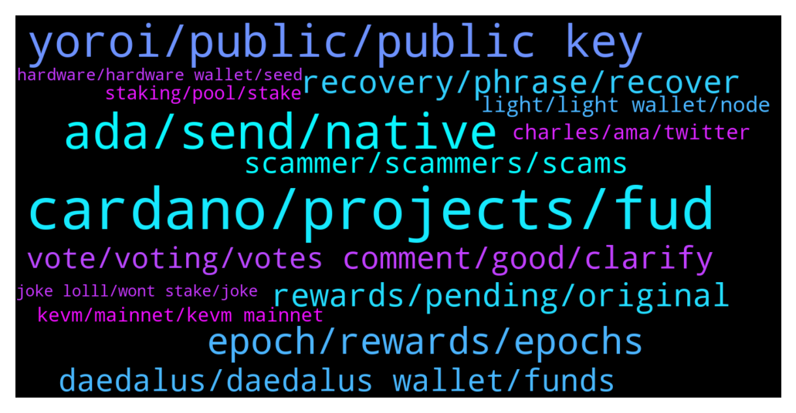

# **@Cardano**
 ## Analysis for **2021-12-19** - **2021-12-26**.

---

## 📊 **Basic Stats**

**n_messages_sent**: 611

---

---

## 🔝 **Top keywords and related messages**

1. **cardano, projects, fud**

    @Lgbeano --- *[Forwarded from Cardano Announcements] Hey all! Want to help get more adoption and grow #Cardano? 👀  Please take a moment to vote and potentially get Ada added to bitpay app! ✨  Thanks for all the support! 💪  https://twitter.com/bitpay/status/1458977852230180868?s=21  Direct link to poll: https://gleam.io/1a0mE/bitpay-coin-poll (FYI: You can vote every day!😉)  Would you rather request a feature via the website and ask them for Cardano support? Please visit here and let your voices be heard: https://bitpay.canny.io/feature-request?sort=top* **--->** [TG Discussion](https://t.me/Cardano/757964)

    @Sydney --- *Oh totally, the more I learn about it the more I realize it is leaps and bounds theoretically compared to other projects. Makes me pretty excited. Im fairly new to Haskell as well but joined the Emurgo Academy program and am super excited to learn and dive in head first. I think Cardano is gonna change so much of the world!* **--->** [TG Discussion](https://t.me/Cardano/759591)

    @Mr_Johnathan --- *yeah, those articles are just pure FUD. It's like people are paying to make cardano look bad. The major "fault" with cardano is that it's taking a lot longer than other projects to fully mature. But if you can wait a bit, then I'm confident you will be pleasantly rewarded.* **--->** [TG Discussion](https://t.me/Cardano/759586)

    @Sydney --- *Yup yup, I read that and thought it was poor “journalism” for sure, just couldn’t think of the flaw myself, but knew someone could! I certainly agree, Cardano will take sometime to develop but I think that speaks to its benefit. It’s about development, not hype and pumping. I myself have dropped everything to learn to be a developer myself. So I’m in it way more than the investment.* **--->** [TG Discussion](https://t.me/Cardano/759589)

    @TheBigBossK --- *I meant long-term projects like Cardano, not "s***coins" on Cardano platform* **--->** [TG Discussion](https://t.me/Cardano/759734)

    @ChrisSTR8 --- *It is up to us to change that by voting daily for Cardano* **--->** [TG Discussion](https://t.me/Cardano/759271)

2. **ada, send, native**

    @Fowsi88 --- *i want to add ADA contract to my NAMI wallet* **--->** [TG Discussion](https://t.me/Cardano/761443)

    @Tanmaygupta397 --- *Hi guys  A quick question  How can i transfer my Ada from binance to another wallet like metamask or trust wallet ??* **--->** [TG Discussion](https://t.me/Cardano/759299)

    @Bsdklund --- *Just think guys thats a not good indicator ... Only 10% wallet holding 94% of ada lol .. just think if they sell it then where we see the ada ? Just think ... Ada tweet that we hit 2 million wallets then why only 6 % ada Holding 90% wallet thats mean 1.8 million wallets just holding 6% lf ada mean 2 billon ada and other 31 billon token just only 10% mean 0.2 millon wallets .. wow .. thats very creepy and we think about this* **--->** [TG Discussion](https://t.me/Cardano/759766)

    @apex_pool_spo --- *your sentence does not make sense. ADA is not a erc20 token to add its contract to a wallet.* **--->** [TG Discussion](https://t.me/Cardano/761447)

    @youandhoo --- *I'm an OG who not married to ada and seeking for a answer to calm my concern .* **--->** [TG Discussion](https://t.me/Cardano/760333)

    @Bill --- *I'm a long term holder for ada* **--->** [TG Discussion](https://t.me/Cardano/761602)

3. **yoroi, public, public key**

    @Hans --- *Thats why I swaped to Yoroi....my old comp does not make it anymore👐* **--->** [TG Discussion](https://t.me/Cardano/758481)

    @Lgbeano --- *Emurgo do not run any Yoroi channels. Any channel with yoroi in the name is scamming you* **--->** [TG Discussion](https://t.me/Cardano/759081)

    @Hans --- *Yoroi just reads the data of your wallet. Use same credentials as in D!* **--->** [TG Discussion](https://t.me/Cardano/758489)

    @B --- *Hi guys, I recently see all transactions in my yoroi wallet as failed but I am very sure this was not before and the transactions were actually good. Is there a known problem with yoroi?* **--->** [TG Discussion](https://t.me/Cardano/761818)

    @oOOEricOOo --- *Is it possible to connect Yoroi with nano s since it does not have bluetooth?* **--->** [TG Discussion](https://t.me/Cardano/759823)

    @TJSP2024 --- *my yorio wallet is the brave extension, im not that comfortable with online wallets* **--->** [TG Discussion](https://t.me/Cardano/758484)

4. **epoch, rewards, epochs**

    @glitch04 --- *The next epoch transition is where the new balance snapshot is taken which you will then see the increase in rewards in a future epoch.   EX you increase the balance in 308 > snapshot is taken at beginning of 309 > rewards for 309 arrive with the new adjustment in epoch 311* **--->** [TG Discussion](https://t.me/Cardano/759374)

    @glitch04 --- *Snapshot is the transition between epochs. the epochs are always offset so it appears in a future epoch when there are changes made (n+2)* **--->** [TG Discussion](https://t.me/Cardano/759342)

    @glitch04 --- *Snapshot was taken at the start of the epoch rewards for 308 arrive in 310* **--->** [TG Discussion](https://t.me/Cardano/759351)

    @JohnGoldberg --- *If I re-delegate a stake to another stakepool does it take 2 full epochs before I can earn rewards again or does it take the ongoing epoch + the next epoch?* **--->** [TG Discussion](https://t.me/Cardano/762274)

    @oOOEricOOo --- *if you delegate tokens before an epoch ends, rewards will be calculated starting from next one epoch right?* **--->** [TG Discussion](https://t.me/Cardano/759965)

    @AKnTN --- *Why it takes 3 epochs to start earning rewards ?* **--->** [TG Discussion](https://t.me/Cardano/761170)

5. **rewards, pending, original**

    @perplex --- *yea, i understand that part, but say half way through a epoch, i double my ADA, that will start earning rewards as soon as your pool mints a new block?* **--->** [TG Discussion](https://t.me/Cardano/759369)

    @Zyroxa --- *If you dont have access to the wallet anymore you also wont have access to the rewards.* **--->** [TG Discussion](https://t.me/Cardano/758317)

    @glitch04 --- *Then you do nothing and they will* **--->** [TG Discussion](https://t.me/Cardano/758200)

    @perplex --- *yea so after you get your first rewards, you can add more ada and get the full reward the next epoch* **--->** [TG Discussion](https://t.me/Cardano/758169)

    @glitch04 --- *it's actually better to move the funds directly to the new wallet you still have 2 pending epochs in your original by that time the new wallet would be returning the full rewards and you miss no rewards by having an extended delay* **--->** [TG Discussion](https://t.me/Cardano/758186)

    @glitch04 --- *Just remember to leave a few ada in the original to claim the 2 epochs of pending rewards that will arrive* **--->** [TG Discussion](https://t.me/Cardano/758189)

6. **recovery, phrase, recover**

    @p --- *I tried. But when i try to use the recovery phrase on adalite it shows that my wallet has 0 balance. I’m sure this is the only set of seedphrase i have because I only have the one cardano wallet and I only wrote down one set of it. Checked it multiple times. The balance on yoroi and cardanoscan is correct tho* **--->** [TG Discussion](https://t.me/Cardano/758603)

    @apex_pool_spo --- *if you still have the wallet on your phone, be careful not to delete it and not to lose the password. create a new wallet and write down the words. wait until the old wallet is accessible on your mobile phone and send all you have in that wallet to the new wallet.* **--->** [TG Discussion](https://t.me/Cardano/759964)

    @Zyroxa --- *Yeah you can also restore the wallet via Yoroi or adalite. The only thing you need is your seedphrase.* **--->** [TG Discussion](https://t.me/Cardano/758319)

    @glitch04 --- *You aren't supposed to use that recover phrase only the device* **--->** [TG Discussion](https://t.me/Cardano/758610)

    @apex_pool_spo --- *yes. if you don't have the old wallet (and password) and you don't have the words, that's it.* **--->** [TG Discussion](https://t.me/Cardano/759960)

    @Mpd03 --- *Has anyone heard of revalidating the wallet when it’s not working ? Is the wallet down ?* **--->** [TG Discussion](https://t.me/Cardano/759033)

7. **comment, good, clarify**

    @Jakez68 --- *I think you are a joke too* **--->** [TG Discussion](https://t.me/Cardano/758836)

    @... --- *Ah okay. Good to know though👍* **--->** [TG Discussion](https://t.me/Cardano/761473)

    @ADATommy --- *Is this a question or just a statement? 😏* **--->** [TG Discussion](https://t.me/Cardano/760857)

    @vidadavi --- *Lolll what because you dont like my comment . 🤣🤣🤣🤣* **--->** [TG Discussion](https://t.me/Cardano/758837)

    @dinprasetyo --- *I'm so sorry, my bad 🙌* **--->** [TG Discussion](https://t.me/Cardano/758048)

    @Sydney --- *Thank you for that thought! I myself have been thinking that there was some logic there that they were missing, you make an excellent point. I myself am not concerned, but was looking for thoughts that I couldn’t come up with myself.  Your answer was exactly the type of logic I was looking for.  Thank you!* **--->** [TG Discussion](https://t.me/Cardano/759585)

8. **daedalus, daedalus wallet, funds**

    @TJSP2024 --- *Dam guys The new daedalus update is 25gb! Please tell me it loads at least a day faster then previously versions 😔* **--->** [TG Discussion](https://t.me/Cardano/758479)

    @TJSP2024 --- *Is it ok to restore a daedalus wallet in a yoroi Chrome extension wallet? Or is there a risk of being hacked?* **--->** [TG Discussion](https://t.me/Cardano/761556)

    @crazycanuck65 --- *Hi Guys, anyone having problems with Daedalus. I just ran the update and it's not verifying the blockchain. Just sits at 0% complete and it's been over a half hour now.* **--->** [TG Discussion](https://t.me/Cardano/761887)

    @DJKuns --- *Is there any chance that Daedalus will be optimized for M1 Macs? Thanks!* **--->** [TG Discussion](https://t.me/Cardano/759194)

    @glitch04 --- *That will display your information from the Daedalus* **--->** [TG Discussion](https://t.me/Cardano/759112)

    @Hans --- *The problem is, with Daedalus you run a full node* **--->** [TG Discussion](https://t.me/Cardano/758488)

9. **scammer, scammers, scams**

    @glitch04 --- *Now you likely have a flood of scammers trying to send you to shady websites* **--->** [TG Discussion](https://t.me/Cardano/758614)

    @dinprasetyo --- *yeah the scammer sent me a message too.* **--->** [TG Discussion](https://t.me/Cardano/758036)

    @DimkaT --- *Why do you think they are called receiving adresses?* **--->** [TG Discussion](https://t.me/Cardano/759919)

    @Zyroxa --- *You can report them here : https://t.me/CardanoReportToAdmin but most often we cant really do anything against those scams.* **--->** [TG Discussion](https://t.me/Cardano/758781)

    @TheBigBossK --- *Scammers are the ones that make crypto look bad to other people. Gets a bit annoying at this point* **--->** [TG Discussion](https://t.me/Cardano/759708)

    @Paul Ato --- *I believe they are going to scam some people so beware, then* **--->** [TG Discussion](https://t.me/Cardano/758755)

10. **vote, voting, votes**

    @jaypatelEarthling --- *I think votes have reduced probably due to Charle's dissatisfaction with their listing Shibainu* **--->** [TG Discussion](https://t.me/Cardano/760775)

    @ExInfernis --- *I think we can do better. Just a reminder to help with the voting 😉* **--->** [TG Discussion](https://t.me/Cardano/760773)

    @Kardel The Sniper --- *What is catalyst voting registration? New here* **--->** [TG Discussion](https://t.me/Cardano/760035)

    @ExInfernis --- *tron is leading with around 26000 votes. So if half of the group here votes at least once we will be with similar percents* **--->** [TG Discussion](https://t.me/Cardano/760781)

    @jaypatelEarthling --- *Well we can all create 3-6 Gmail id and vote multiple times 😜* **--->** [TG Discussion](https://t.me/Cardano/760779)

    @jaypatelEarthling --- *Agreed but people following reddit and twitter don't understand that and avoid polling further and we got reduced weightage 😂* **--->** [TG Discussion](https://t.me/Cardano/760778)

11. **light, light wallet, node**

    @oOOEricOOo --- *What is the difference between “full” or “light” for a wallet type? I would consider Yoroi since its on iOS too, and i have a ledger nano s.* **--->** [TG Discussion](https://t.me/Cardano/759820)

    @iiLap --- *Similar to a bitcoin full node which requires more than a TB storage.* **--->** [TG Discussion](https://t.me/Cardano/759923)

    @Rene1234 --- *I need a wallet that is fast and is working. This wallet is verifying the blockchain most of the times* **--->** [TG Discussion](https://t.me/Cardano/759928)

    @Navi --- *deadalus not responding after update to 4.6.0 ?* **--->** [TG Discussion](https://t.me/Cardano/759606)

    @glitch04 --- *Full are generally seen as more secure as you are running the node but that comes at the added cost of resources to run the machine, If you are using hardware support to create your wallets there is nothing wrong with using a light wallet or several imo* **--->** [TG Discussion](https://t.me/Cardano/759822)

    @glitch04 --- *Full nodes are heavy and require lots of resources on the host machine light wallets use their own servers to do the heavy lifting more suitable for everyday devices* **--->** [TG Discussion](https://t.me/Cardano/759821)

12. **charles, ama, twitter**

    @Lgbeano --- *He wrote about his experience at his week long silence retreat* **--->** [TG Discussion](https://t.me/Cardano/760138)

    @jaypatelEarthling --- *Vipasana ? I will read that blog later on I guess 😁* **--->** [TG Discussion](https://t.me/Cardano/760140)

    @glitch04 --- *Probably a few of the ama's* **--->** [TG Discussion](https://t.me/Cardano/759066)

    @... --- *I think Charles may have tweeted too soon then* **--->** [TG Discussion](https://t.me/Cardano/761470)

    @glitch04 --- *Sounds plausible would be a question for the next Charles sighting or ama* **--->** [TG Discussion](https://t.me/Cardano/761075)

    @DrNo8910 --- *Charles is live on YouTube n Twitter* **--->** [TG Discussion](https://t.me/Cardano/760364)

13. **kevm, mainnet, kevm mainnet**

    @glitch04 --- *As stated previously above there has not been a date given, so there is no rough estimate to give you either. I have forwarded the question unfortunately that's the best I can do.* **--->** [TG Discussion](https://t.me/Cardano/760784)

    @Iluvgermany --- *Any updates regarding a rough launch date (e. g. Q1/Q2 2022) of KEVM to mainnet today? Thank you in advance.* **--->** [TG Discussion](https://t.me/Cardano/761445)

    @Iluvgermany --- *Please dear admins at least tell us a rough date when KEVM on mainnet launches (e. g. Q1/Q2 2022).* **--->** [TG Discussion](https://t.me/Cardano/760782)

    @Iluvgermany --- *What project are you talking about? I am not referring to anything else but a rough launchdate of KEVM to mainnet. This is not related to anything else. So let's please focus on that. Did you receive any information regarding a launchdate after forwarding my question?* **--->** [TG Discussion](https://t.me/Cardano/761452)

    @Iluvgermany --- *I upvote your question,I also wanna know when cardano release kevm to mainnet* **--->** [TG Discussion](https://t.me/Cardano/760759)

    @Dmsy2 --- *Helo when cardano release the kevm testnet to mainnet?* **--->** [TG Discussion](https://t.me/Cardano/760764)

14. **staking, pool, stake**

    @srinivas2121 --- *Small question need suggestions...if I stake Ada coins in a pool where staking more than 60Millions..Ada..what are the disadvantages...ex: pool A  staking 18millions 1 month returns 4.8% , pool B staking more than 60millions 1 month returns 5%....both pools having same parameters..no difference.  Which will give more Ada....if user stake thier Ada coins .. pool A or pool B..* **--->** [TG Discussion](https://t.me/Cardano/760074)

    @Headelf --- *Thank you? Different stake pools are good?  Need to register each?* **--->** [TG Discussion](https://t.me/Cardano/760211)

    @tham3rr --- *Is there any news regarding multi pool staking? Can't be stock with one pool. I guess multi pool staking can help with rewards having better luck?* **--->** [TG Discussion](https://t.me/Cardano/757955)

    @trollthetyrants --- *Hi. If i delegate my ada to a staking pool,  will i get sundae tokens soon?* **--->** [TG Discussion](https://t.me/Cardano/758930)

    @Angel --- *If I have a wallet already delegating to a stake pool  and I have another wallet with y amount of ada sitting there without being stake and I send the funds from that wallet to the wallet that my ada is being stake  Would my transfered ada be automatically staking? If so, how long would it take to see this increment in staking rewards?* **--->** [TG Discussion](https://t.me/Cardano/760959)

    @glitch04 --- *join this channel for stake pool issues https://t.me/CardanoStakePoolWorkgroup* **--->** [TG Discussion](https://t.me/Cardano/762430)

15. **hardware, hardware wallet, seed**

    @StammeRama --- *Does a hardware wallet basically store your encrypted seed phrase? I am ashamed to say I am still not 100% on how it works. Also, it would surely protect from things like keyloggers, right? Since nothing has to be manually typed to complete a transaction or access a wallet, presumably.* **--->** [TG Discussion](https://t.me/Cardano/760972)

    @haevaristo --- *a keylogger by itself wont do much .. but if someone managed to install a keylogger on your machine, chances are .. they are able to do more than just that .. in which case it doesnt matter much having a hardware wallet* **--->** [TG Discussion](https://t.me/Cardano/760977)

    @apex_pool_spo --- *you use a 24 words seed phrase to generate the keys. the keys are stored in the wallet, never leaving it. to do transactions, you connect the hardware wallet to the wallet (Daedalus, Yoroi, ccvault.io, typhonwallet.io, nami or whatever you want to use) and you will have to confirm the transactions with the hardware wallet. you will never type the recovery seed on a computer. the hardware wallet also has a pin to lock it.* **--->** [TG Discussion](https://t.me/Cardano/760975)

    @Zyroxa --- *its secure as long as you are using a safe and clean device.* **--->** [TG Discussion](https://t.me/Cardano/761557)

    @StammeRama --- *I thought about buying a HW wallet before, quite a number of times actually, but what always stopped me is doubt on the hardware authenticity. What if scammers sell me a fake Ledger with spyware etc. on it... would you say that is an irrational fear to have? Is there a way to verify these things reliably?* **--->** [TG Discussion](https://t.me/Cardano/760989)

    @haevaristo --- *so you could have 2 hardware wallets on different locations and use either depending on where you are ?* **--->** [TG Discussion](https://t.me/Cardano/760990)

