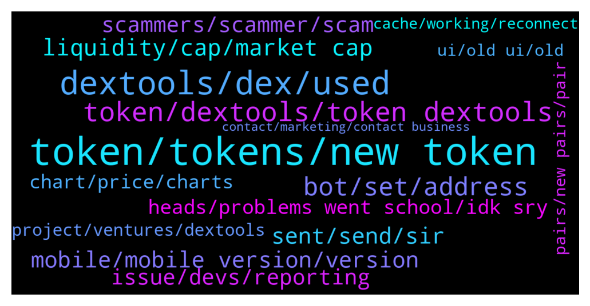

# **@DEXToolsCommunity**
 ## Analysis for **2021-12-19** - **2021-12-26**.

---

## 📊 **Basic Stats**

**n_messages_sent**: 1333

---

---

## 🔝 **Top keywords and related messages**

1. **token, tokens, new token**

    @Kian_hashemi --- *Because everyone who trades has valuable seconds to check the tokens on the favorite list.  We had access to the previous version very quickly, but now we have to click a few times to be informed about the status of the tokens.  This is very bad for the trader.  I hope users think fast before their numbers dwindle.* **--->** [TG Discussion](https://t.me/DEXToolsCommunity/317746)

    @FredericDEXT --- *Same as before , at token info tab* **--->** [TG Discussion](https://t.me/DEXToolsCommunity/318154)

    @solidask --- *Hello, is it possible to remove old version (V1) chart of a token that migrated to new version (V2)?* **--->** [TG Discussion](https://t.me/DEXToolsCommunity/316912)

    @huseyincelikorg --- *please remove my token dexpage   " Team of this token has sold at least 2.032 BNB. Be aware of this token!" alert remove, please   https://www.dextools.io/app/bsc/pair-explorer/0x0fc72d759e875c619e7af9b20495c6894d194332  mytoken contract adress : bsc on 0xd35c64b94939ff214c1af79b6966f79a9c57e5c7* **--->** [TG Discussion](https://t.me/DEXToolsCommunity/313518)

    @ngl_ee --- *I have a feeling its being mixed up with another token of the same name* **--->** [TG Discussion](https://t.me/DEXToolsCommunity/316214)

    @lex_44 --- *I want to focus on that but it is very difficult to find tokens in time* **--->** [TG Discussion](https://t.me/DEXToolsCommunity/315781)

2. **dextools, dex, used**

    @FredericDEXT --- *This is the first step to make a more complete and modern UI, but many things are still in progress, and the community feedback is the best way to improve and the guide we always followed at dextools since the beginning.* **--->** [TG Discussion](https://t.me/DEXToolsCommunity/317317)

    @matarazzee00 --- *Yes i don't no i want you guys to show me how to list it on dextools* **--->** [TG Discussion](https://t.me/DEXToolsCommunity/316985)

    @Chris --- *Any way to revert to the old DexTools?* **--->** [TG Discussion](https://t.me/DEXToolsCommunity/317101)

    @darkstorns --- *I haven't seen a significant change in functionality yet, this is not an update but an idle.  The number showing the price is too small, need blue red as before to know the price movement, I think the dev is imitating some other dex site, while dextools is number 1, who else needs to be imitated?* **--->** [TG Discussion](https://t.me/DEXToolsCommunity/317980)

    @robin_set_b --- *hello admin please help me with info about Dextool adds* **--->** [TG Discussion](https://t.me/DEXToolsCommunity/312652)

    @MaxPeterson --- *Thank you DEXTools community for introducing MetaBrands to us. Amazing project. Confident of success particularly in the long term for holders of NFT relics.* **--->** [TG Discussion](https://t.me/DEXToolsCommunity/314741)

3. **token, dextools, token dextools**

    @prep_mb --- *dex tools already showing token pair and trading volumes and chart. but it only shows etherscan contract link, I wanna add social links for token info.* **--->** [TG Discussion](https://t.me/DEXToolsCommunity/312669)

    @prep_mb --- *Can anyone help me to register token info in dex tools?* **--->** [TG Discussion](https://t.me/DEXToolsCommunity/312667)

    @prep_mb --- *so dex tools has no registration steps about token info?* **--->** [TG Discussion](https://t.me/DEXToolsCommunity/312674)

    @matarazzee00 --- *How can i treda my token on dextools?* **--->** [TG Discussion](https://t.me/DEXToolsCommunity/316960)

    @moondriver1 --- *Hey! what do I need to list my token on DexTools?* **--->** [TG Discussion](https://t.me/DEXToolsCommunity/315836)

    @haoranhong --- *Hey! what do I need to list my token on DexTools?* **--->** [TG Discussion](https://t.me/DEXToolsCommunity/315851)

4. **bot, set, address**

    @stanes --- *You have to set the bot with the pair address, not the token address.* **--->** [TG Discussion](https://t.me/DEXToolsCommunity/318132)

    @ty_flush --- *set_pair command on bot tells me only admin can do this but I am admin* **--->** [TG Discussion](https://t.me/DEXToolsCommunity/313778)

    @melfalou --- *nice website. is there a way to set notification in real time for prices* **--->** [TG Discussion](https://t.me/DEXToolsCommunity/318085)

    @gumbercules --- *Those are sandwhich bots that frontrun transactions if you set slippage too high usually* **--->** [TG Discussion](https://t.me/DEXToolsCommunity/317052)

    @napascual --- *Limit orders is provided by our partner Velox. They'll be happy to answer you any related question at @veloxglobal 😊* **--->** [TG Discussion](https://t.me/DEXToolsCommunity/315040)

    @fiesta_0604 --- *Could I ask something relate to the BOTS? How can I stop users using BOT to call for a chart? There are no helps command show me that.* **--->** [TG Discussion](https://t.me/DEXToolsCommunity/316592)

5. **liquidity, cap, market cap**

    @HELLO1241 --- *Where is the mc pooled eth and liquidity* **--->** [TG Discussion](https://t.me/DEXToolsCommunity/318150)

    @napascual --- *You can see it on the Liquidity tab, bottom tabs on mobile* **--->** [TG Discussion](https://t.me/DEXToolsCommunity/317359)

    @HELLO1241 --- *Why do I have to come down and click on liquidity shitt to see the mc pooled eth etc* **--->** [TG Discussion](https://t.me/DEXToolsCommunity/318163)

    @bladee24 --- *The menu comes up, there’s no issue with that, it’s just the UI isn’t as good as before imo, I think the market cap and liquidity should just be shown automatically* **--->** [TG Discussion](https://t.me/DEXToolsCommunity/318223)

    @danrunn --- *For new UI can we see liquidity amount for each pair anywhere?* **--->** [TG Discussion](https://t.me/DEXToolsCommunity/318062)

    @sharvMF --- *I can’t even see marketcap and LP on my phone* **--->** [TG Discussion](https://t.me/DEXToolsCommunity/317529)

6. **sent, send, sir**

    @kaspargalactic --- *can you please check my DM* **--->** [TG Discussion](https://t.me/DEXToolsCommunity/314427)

    @napascual --- *Could you dm me the issue?* **--->** [TG Discussion](https://t.me/DEXToolsCommunity/318222)

    @moondriver1 --- *thanks 👌🏼yep already someone DM me first 😳* **--->** [TG Discussion](https://t.me/DEXToolsCommunity/315841)

    @lex_44 --- *Hey nive profile pic.. Rob zombie* **--->** [TG Discussion](https://t.me/DEXToolsCommunity/315773)

    @sunshinecrypto --- *Gosh I I asked one question in the chat and I got about three fake people messaging me pretending to be you lol   Anyway do you mind if I send you a DM? Needed some help with my dextools plz* **--->** [TG Discussion](https://t.me/DEXToolsCommunity/317623)

    @DGman1 --- *u are a stranger and I dont talk to strangers* **--->** [TG Discussion](https://t.me/DEXToolsCommunity/314259)

7. **mobile, mobile version, version**

    @唐老哥在囤币 --- *Guys,is there an app for IOS？* **--->** [TG Discussion](https://t.me/DEXToolsCommunity/315065)

    @Simon --- *This is iPad however none of these point were problems on previous version* **--->** [TG Discussion](https://t.me/DEXToolsCommunity/317552)

    @Kian_hashemi --- *Almost everyone who trades on BSC and Pancake uses a mobile phone because it is fast because of the volume and speed of their wallets.  I myself trade in binance and kucoin, but on the system, but for pancakes for convenience and speed in mobile.  And thank you again for your feedback and for sending it to the developers.  Thankful* **--->** [TG Discussion](https://t.me/DEXToolsCommunity/317759)

    @HeiHei1985 --- *This is the picture of the mobile phone.* **--->** [TG Discussion](https://t.me/DEXToolsCommunity/317704)

    @chupapimunyenyo60 --- *Oh really? You can disable on desktop though. What is reason for mobile not being able to?* **--->** [TG Discussion](https://t.me/DEXToolsCommunity/318405)

    @stanes --- *Actually I am glad almost all the complains are about the mobile version. So team knows on what they should focus for further improvements 😉* **--->** [TG Discussion](https://t.me/DEXToolsCommunity/317741)

8. **scammers, scammer, scam**

    @JunLOA --- *How do we downvote scam coin?* **--->** [TG Discussion](https://t.me/DEXToolsCommunity/313139)

    @napascual --- *Feel free to share/dm any scam coin in there. In the future we will enable it directly from the wallet info so it's automatic based on users' input* **--->** [TG Discussion](https://t.me/DEXToolsCommunity/313913)

    @nate102 --- *Sure but in my opinion from what I see 90% of the scams are just high tax or honeypot. Other ones automatically blacklist anyone that buys etc* **--->** [TG Discussion](https://t.me/DEXToolsCommunity/313916)

    @napascual --- *We've just removed most of the scam coins from the wallet info. Feel free to report any extra scam token* **--->** [TG Discussion](https://t.me/DEXToolsCommunity/313208)

    @JunLOA --- *Smart? We need to downvote scam coin But we have to pay first* **--->** [TG Discussion](https://t.me/DEXToolsCommunity/313188)

    @napascual --- *Feel free to share the scam coin here, there are a lot of community members willing to help* **--->** [TG Discussion](https://t.me/DEXToolsCommunity/313190)

9. **issue, devs, reporting**

    @stanes --- *The issue has been forwarded to the devs. They will check and fix it asap.   Thanks for reporting 🙏* **--->** [TG Discussion](https://t.me/DEXToolsCommunity/316823)

    @stanes --- *The issue has been forwarded to the devs. They will check and fix it asap.  Thanks for reporting 🙏* **--->** [TG Discussion](https://t.me/DEXToolsCommunity/316180)

    @trojantechltd --- *The issue was corrected and now it has reverted back.* **--->** [TG Discussion](https://t.me/DEXToolsCommunity/315789)

    @bastardganpunk --- *it can happen sometimes, then the best is to report it that devs can fix it* **--->** [TG Discussion](https://t.me/DEXToolsCommunity/312625)

    @napascual --- *Yeah, we identified an issue that was fixed don't hours ago. It should be working fine from now on* **--->** [TG Discussion](https://t.me/DEXToolsCommunity/312629)

    @stanes --- *Oh, ok, I understand now. Ok, let me forward the issue to the devs.* **--->** [TG Discussion](https://t.me/DEXToolsCommunity/312812)

10. **heads, problems went school, idk sry**

    @bastardganpunk --- *Please ask in the group about it. This is the support for the community 🙂* **--->** [TG Discussion](https://t.me/DEXToolsCommunity/316735)

    @stanes --- *You haven't been frontrunned so doesn't matter 😉* **--->** [TG Discussion](https://t.me/DEXToolsCommunity/315517)

    @CryptoSadt --- *yes, we submitted the details but they are slow... you know😂* **--->** [TG Discussion](https://t.me/DEXToolsCommunity/313512)

    @bastardganpunk --- *yes, i info at the top left* **--->** [TG Discussion](https://t.me/DEXToolsCommunity/318064)

    @mtac79 --- *yes, that is , i bought* **--->** [TG Discussion](https://t.me/DEXToolsCommunity/316869)

    @ContentsMayVary --- *Are you comfortable with me pming you or do you wanna share the tx here so I can also investigate* **--->** [TG Discussion](https://t.me/DEXToolsCommunity/316416)

11. **chart, price, charts**

    @Flashbang665 --- *Hi, is there any issues with charts now?, the history of this chart is gone: https://www.dextools.io/app/bsc/pair-explorer/0x486697ae24469cb1122f537924aa46e705b142aa* **--->** [TG Discussion](https://t.me/DEXToolsCommunity/316191)

    @CryptoElro --- *looks like any other shitty charting site* **--->** [TG Discussion](https://t.me/DEXToolsCommunity/317569)

    @jock982 --- *hello yesterday we added our coin on polygon network, but chart is still not visible, can someone help me?* **--->** [TG Discussion](https://t.me/DEXToolsCommunity/316618)

    @FredericDEXT --- *Charts are the same , we use Trading View Library.* **--->** [TG Discussion](https://t.me/DEXToolsCommunity/318040)

    @ContentsMayVary --- *@JoeyDieleman or any other admin/dev   Your chart is showing we removed liquidity when poocoins is showing correct chart. This impacts appearance on pancakeswap to look like the wrong price then swap at the proper price   Need help* **--->** [TG Discussion](https://t.me/DEXToolsCommunity/316402)

    @stanes --- *If you want you can set a cool-down period (time before a new chart request can be done) by typing the following syntax: /set_cooldown <chart number> <cooldown minutes> The cool-down period is in minutes, the minimum is 3 Example: /set_cooldown 1 5* **--->** [TG Discussion](https://t.me/DEXToolsCommunity/316596)

12. **project, ventures, dextools**

    @WilmerToro17 --- *Hey guys. Is it legit that Tango Chain is a dext force ventures backed project?* **--->** [TG Discussion](https://t.me/DEXToolsCommunity/313921)

    @Godahavefaithh --- *Are there any Admins that can assist me with a Dextools Venture presale allocation allotment that I haven't received* **--->** [TG Discussion](https://t.me/DEXToolsCommunity/315011)

    @ED_tgrm --- *hello. admins, some days ago i saw velox banner on dextools. is it your project and i can trust them as much as i trust you? or it's an independent project?* **--->** [TG Discussion](https://t.me/DEXToolsCommunity/314909)

    @CoinDudeBro --- *one of my friends accidentally sent ether to the DEXT address trying to trade on dextools* **--->** [TG Discussion](https://t.me/DEXToolsCommunity/314396)

    @napascual --- *There is no other Ventures program other than DextForce one if that's what you mean* **--->** [TG Discussion](https://t.me/DEXToolsCommunity/315810)

    @WilmerToro17 --- *The project is called Tango chain and on their website they have your dext force ventures logo. I tried to share a screenshot but the bot didn’t allow it* **--->** [TG Discussion](https://t.me/DEXToolsCommunity/313928)

13. **pairs, new pairs, pair**

    @VitalFox87 --- *https://www.dextools.io/app/bsc/pair-explorer/0x86213ec713bc32dccac12413a49aaf1419faaf4f   could you please check why this pair isn't working?* **--->** [TG Discussion](https://t.me/DEXToolsCommunity/314346)

    @mtac79 --- *i get 3 new pairs , went to 0* **--->** [TG Discussion](https://t.me/DEXToolsCommunity/316775)

    @TK1337 --- *i need to see the last 5 pairs for a second* **--->** [TG Discussion](https://t.me/DEXToolsCommunity/317853)

    @xenyh123 --- *How to report a bug in one pair showing wrong prices ?* **--->** [TG Discussion](https://t.me/DEXToolsCommunity/317004)

    @MegaTed --- *Is there a pair problem again?* **--->** [TG Discussion](https://t.me/DEXToolsCommunity/313330)

    @mtac79 --- *i get 4 new pairs , then the 3 went to 0, 100% down . and no more moves at the pairs* **--->** [TG Discussion](https://t.me/DEXToolsCommunity/316858)

14. **ui, old ui, old**

    @spfr237 --- *u guys want old UI back because you are too lazy to study new one!😂 common step out of your comfort zone and try to learn it, i bet it worth it, cause there are things that can be done with this UI which was impossible with old one😉* **--->** [TG Discussion](https://t.me/DEXToolsCommunity/317542)

    @hopiumvictim --- *Everything about the old UI was done right.* **--->** [TG Discussion](https://t.me/DEXToolsCommunity/317970)

    @PGtheGreat --- *New UI not support UNI V3?* **--->** [TG Discussion](https://t.me/DEXToolsCommunity/318091)

    @v1llz --- *guys return to normal UI pls... why fuck with my brain :(* **--->** [TG Discussion](https://t.me/DEXToolsCommunity/317343)

    @atosm --- *is there a way to revert back to old UI then? a lot of work but I prefer to use the old UI much more.* **--->** [TG Discussion](https://t.me/DEXToolsCommunity/317140)

    @stanes --- *It does but we don't show yet all the info for Uni V3 pairs, it was the same with the old UI.* **--->** [TG Discussion](https://t.me/DEXToolsCommunity/318101)

15. **cache, working, reconnect**

    @stanes --- *Clear your cache it should solve the problem.* **--->** [TG Discussion](https://t.me/DEXToolsCommunity/316811)

    @HELLO1241 --- *It’s not even working for me* **--->** [TG Discussion](https://t.me/DEXToolsCommunity/318164)

    @FredericDEXT --- *It should work properly, try to reload* **--->** [TG Discussion](https://t.me/DEXToolsCommunity/317427)

    @IAMYellowCake --- *But I had issues last 8h or so* **--->** [TG Discussion](https://t.me/DEXToolsCommunity/312621)

    @stanes --- *Strange... Can you remove it and try again?* **--->** [TG Discussion](https://t.me/DEXToolsCommunity/313783)

    @bladee24 --- *It works but it’s still just not good* **--->** [TG Discussion](https://t.me/DEXToolsCommunity/318221)

