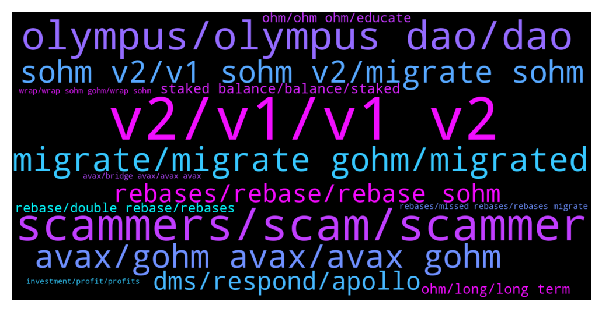

# **@OlympusTG**
 ## Analysis for **2021-12-19** - **2021-12-26**.

---

## 📊 **Basic Stats**

**n_messages_sent**: 9670

---

---

## 🔝 **Top keywords and related messages**

1. **v2, v1, v1 v2**

    @cdp279 --- *You will migrate to v2 soon* **--->** [TG Discussion](https://t.me/OlympusTG/122956)

    @nfwaple --- *multichain token (gOHM), on chain governance and better bonding mechanism, it is better for the protocol but you decide if it is better for you or not, regardless migration is quite necessary because you don't want to be stuck in v1 I suppose* **--->** [TG Discussion](https://t.me/OlympusTG/131774)

    @A. --- *Hey... You say there will no increasing displayed on v1 or there will be not any increasing on v1 any longer...? That's a big difference...* **--->** [TG Discussion](https://t.me/OlympusTG/134366)

    @nahs --- *why was that v2 shit necessary though* **--->** [TG Discussion](https://t.me/OlympusTG/126896)

    @Samtheman2212 --- *@Ap0l1o sorry i missed the entire replies you just answered, but do we have to manually do the swap to V2 or will it automatically happen?* **--->** [TG Discussion](https://t.me/OlympusTG/116300)

    @A. --- *I don't understand whether I should migrate from v1 to v2. Is there any disadvantage when I keep on v1 for my increase of money.?* **--->** [TG Discussion](https://t.me/OlympusTG/122993)

2. **scammers, scam, scammer**

    @Bolo --- *A scammer would say that lol* **--->** [TG Discussion](https://t.me/OlympusTG/133771)

    @SMNFT7 --- *These scammers have been making so much money, I chexk the address of scammed ohmies and damn, these mf be getting bags! F for lost ohmies* **--->** [TG Discussion](https://t.me/OlympusTG/129209)

    @chittyusername --- *Can we please send media...I need to show the community this message with a scammer* **--->** [TG Discussion](https://t.me/OlympusTG/131669)

    @Dev team --- *Why was my message deleted ?  I said this is the username of the person who scammed me !!  @shogunf1x* **--->** [TG Discussion](https://t.me/OlympusTG/124510)

    @john4p --- *This is what gets people scammed, someone dmed me already trying to scam me if I didn’t know better I would’ve listened to them* **--->** [TG Discussion](https://t.me/OlympusTG/127998)

    @chittyusername --- *Be careful of being added to identical groups that are scams* **--->** [TG Discussion](https://t.me/OlympusTG/131589)

3. **olympus, olympus dao, dao**

    @JayJayJayMa --- *https://www.reddit.com/r/olympusdao/comments/qboshb/what_does_the_current_index_mean/  sorry im too stupiddd climbing the olympus mountain slowly* **--->** [TG Discussion](https://t.me/OlympusTG/117664)

    @syberk1d --- *I agree, things just don’t add up, I think Olympus have used an opportunity to reduce our reward yield percentage and covered it up by blaming it’s the migration* **--->** [TG Discussion](https://t.me/OlympusTG/124928)

    @syberk1d --- *The less people that are staked into the project, the more the apy goes up,   I’m also confused here as what it looks like on paper is  More people have staked for it to drop in apy so drastically, when in actual fact we pretty much can safely assume it’s the opposite since the migration, more people have been uneasy with it, and complaining, so I put my money on it that more people would of no doubt in staked and got out, thus , the apy should of gone up due to this, I’ve lost a lot of faith in Olympus, I have more faith in my wonderland bag than Olympus now, feel like they have robbed us of nearly 50% of potential 3,3  future gains* **--->** [TG Discussion](https://t.me/OlympusTG/124918)

    @JimWelder --- *How is Olympus DAO going to survive without indians? https://www.bloomberg.com/news/articles/2021-12-18/rbi-told-board-it-wants-blanket-crypto-ban-economic-times-says* **--->** [TG Discussion](https://t.me/OlympusTG/127702)

    @bigmushroom --- *Google OlympusDAO v2 medium post, in short, it's getting ready for 4, 4* **--->** [TG Discussion](https://t.me/OlympusTG/124018)

    @Dtt --- *Im only asking cause I saw a lot of people in the comments sections under Olympus vids calling it a ponzi and printing tokens out of thin air* **--->** [TG Discussion](https://t.me/OlympusTG/129761)

4. **migrate, migrate gohm, migrated**

    @Ap0l1o --- *Yes, but it is advised that you migrate to gOhm* **--->** [TG Discussion](https://t.me/OlympusTG/119610)

    @XB_888 --- *Finally did my migration. Smooth, paid for two transactions....Approve $9,  Migrate $25.  I stop seeing my rebases since yesterday, so decided to do the migration. The rebases were added back and i m holding gOhm now.  Process was smooth, took less than 3mins.* **--->** [TG Discussion](https://t.me/OlympusTG/125521)

    @K. --- *NVM it looks like it's all there. however I thought I migrated to gOHM and it's still showing sOHM* **--->** [TG Discussion](https://t.me/OlympusTG/130522)

    @ibaniba --- *Hi all- there’s been a lot of chatter but I can’t seem to find what I’m looking for. My sOhm has been missing. I checked on etherscan and it shows that it was migrated and transferred to sohmv2 about 8-10 hours ago.  That said- Am now sure how to locate my sOhm as it’s not shown on my MetaMask nor the app.    Can anyone provide guidance* **--->** [TG Discussion](https://t.me/OlympusTG/120118)

    @DandC932830 --- *It’s weird because I migrated and nothing has changed on the main page. Why wouldn’t it now show gOHM?* **--->** [TG Discussion](https://t.me/OlympusTG/121633)

    @Stella --- *So I just migrated my sohm to gohm* **--->** [TG Discussion](https://t.me/OlympusTG/121586)

5. **avax, gohm avax, avax gohm**

    @cdp279 --- *You can migrate do avax to avoid paying the huge eth gas fees, you don’t HAVE to. Also if you wrap to gohm you will get the governance benefits and you’ll be able to bridge to different networks* **--->** [TG Discussion](https://t.me/OlympusTG/116809)

    @Henryift --- *Is it ok if I get some gohm in my eth mm and some gohm in avax? How is it displaying on my dashboard?* **--->** [TG Discussion](https://t.me/OlympusTG/128240)

    @jesceljames --- *Is there a way to track the potential earnings of gOhm? I traded my Avax for gOhm at trader joe.* **--->** [TG Discussion](https://t.me/OlympusTG/117517)

    @Colonelgaddafi --- *Loving the multichain ohm idea. Buying gohm on avax saves so much fees man.* **--->** [TG Discussion](https://t.me/OlympusTG/132179)

    @nfwaple --- *no need, just migrate to gOHM on eth, no need to go to AVAX, no need to unstake, read pinned message* **--->** [TG Discussion](https://t.me/OlympusTG/128189)

    @nfwaple --- *LP only gOHM - AVAX pair, do you own research* **--->** [TG Discussion](https://t.me/OlympusTG/128408)

6. **sohm v2, v1 sohm v2, migrate sohm**

    @theMagicUnicorn --- *it is already happening, you canmigrate now to gohm andyou will be all set, or you can wait a few days for sohm v2* **--->** [TG Discussion](https://t.me/OlympusTG/118313)

    @theMagicUnicorn --- *v2 migration is in progress, they are working their butts off to make sure everything goes right, you can have ohm v2, sohm v2 and wshom v2 (gohm) right now though, so if you want to migrate right now, you can...just they are encouraging migrating to gohm now, but if you want sohmv2, just unwrap the gohm and you can have sohm v2.  altho you can keep the gohm and see the rebases on the app....if you prefer to go directly from sohmv1 to sohmv2 without wrapping to gohm and unwrapping to sohmv2, then just wait until they have that ready* **--->** [TG Discussion](https://t.me/OlympusTG/125470)

    @航 --- *When can sohmV2 be migrated? Now I sohm has no income.* **--->** [TG Discussion](https://t.me/OlympusTG/118281)

    @jeffru812 --- *Is the sohm on uni v2 or we would still have to migrate? Sweet dip* **--->** [TG Discussion](https://t.me/OlympusTG/123604)

    @Ap0l1o --- *yes, you can migrate to gOhm or wait for sOhm V2 migration to be available* **--->** [TG Discussion](https://t.me/OlympusTG/123672)

    @theMagicUnicorn --- *or wait few days for sohm v2 and migrate to sohm v2* **--->** [TG Discussion](https://t.me/OlympusTG/118331)

7. **dms, respond, apollo**

    @nfwaple --- *all cool I just wanted to make sure that there is no bug or something, and I did not dm you, that's why I asked you to dm me first* **--->** [TG Discussion](https://t.me/OlympusTG/116077)

    @ChrisBCrypto --- *Hey apollo, i think i might have opened up dm on discord with you* **--->** [TG Discussion](https://t.me/OlympusTG/133648)

    @<UNK> --- *You can DM me if you need specific questions answered.* **--->** [TG Discussion](https://t.me/OlympusTG/129836)

    @nfwaple --- *you can send dm but I am not a metamask expert...* **--->** [TG Discussion](https://t.me/OlympusTG/130672)

    @clarks76 --- *3 DM’s one helpful two fishing.. 😂* **--->** [TG Discussion](https://t.me/OlympusTG/131325)

    @don0bb --- *I’ve dyord bro dw bout that so what’s your point then* **--->** [TG Discussion](https://t.me/OlympusTG/131377)

8. **rebases, rebase, rebase sohm**

    @nfwaple --- *Olympus Migration TL;DR for the Ohmies  - Current sOHM won't see rebases anymore. will get all backdated rewards whenever you migrate. - Folks collateralised at Rari don't need to do anything. will be taken care of in the backend. - sOHM to sOHM v2 migration will become available soon. - sOHM to gOHM and wsOHM to gOHM migration is already available at https://app.olympusdao.finance/#/wrap - In no scenario will you lose rewards  The APY will show correctly on website when V2 migration is done. Current sOHM won't see rebases anymore. Ohmies will get all backdated rewards whenever you migrate.  Ohmies collateralized at Rari don't need to do anything. Everything will be taken care of in the backend.  You don’t have to unstake or do anything right now. sOHM to sOHM v2 migration will become available soon with easy step by step instructions.   sOHM: wait for migration to sOHM v2 or wrap to gOHM wsOHM:  convert to gOHM gOHM:  nothing fsOHM (Rari): nothing* **--->** [TG Discussion](https://t.me/OlympusTG/120083)

    @KingMozzie --- *Yep, you will need to migrate sOHM to gOHM or sOHM v2. But other than that everything else like your rebase rewards will be updated automatically* **--->** [TG Discussion](https://t.me/OlympusTG/117903)

    @KlimDao --- *I can see my gOHMs on my avax MM however nothing in the OHM Dashboard. I no longer see my rebase, nothing at all and that since yesterday.* **--->** [TG Discussion](https://t.me/OlympusTG/118581)

    @Martin --- *I own wsohm, do i still get rebase ?* **--->** [TG Discussion](https://t.me/OlympusTG/130934)

    @cdp279 --- *you have gohm, gohm doesnt grow with each rebase* **--->** [TG Discussion](https://t.me/OlympusTG/130323)

    @nfwaple --- *won't see rebase till you wrap to gOHM, you need to do it within 2 months from now* **--->** [TG Discussion](https://t.me/OlympusTG/122401)

9. **staked balance, balance, staked**

    @nfwaple --- *you unwrap to get the number of Staked balance you see in the Stake page, gOHM is like a box, every rebase you get more sOHM in the box but you'll always only have 1 box* **--->** [TG Discussion](https://t.me/OlympusTG/130005)

    @nfwaple --- *when you expand (there should be a down arrow next to the Staked balance), you can see sOHM v2 0, and only gOHM balance showing, gOHM is already v2* **--->** [TG Discussion](https://t.me/OlympusTG/125618)

    @nfwaple --- *if you're on the Eth chain you can see your equivalent staked balance in the Stake page* **--->** [TG Discussion](https://t.me/OlympusTG/125491)

    @CryptoCobiUSA --- *Hello! Can someone explain how I can see my actual value of gOHM after it has been staked ?* **--->** [TG Discussion](https://t.me/OlympusTG/134143)

    @nfwaple --- *you can actually see your balance increases in the stake page even when you're holding gOHM, it calculates it for you. But if you fancy spending gas for another transaction, when you unwrap now it should already be sOHM v2* **--->** [TG Discussion](https://t.me/OlympusTG/124785)

    @Al_S1919 --- *oh I see now. So it shows the staked balance, not sOHMs. In this case, the dev team should correct this so as not to confuse users.* **--->** [TG Discussion](https://t.me/OlympusTG/122088)

10. **ohm, long, long term**

    @will108 --- *Yup OHM price seems to be melting away. I wont be selling but its time to write off this OHM investment* **--->** [TG Discussion](https://t.me/OlympusTG/126849)

    @syberk1d --- *I’m no expert, but from waking up this morning and looking at the price and the charts, there looks to be a massive sell off of ohm?, wtf man* **--->** [TG Discussion](https://t.me/OlympusTG/127171)

    @lovenotdrugs --- *Can ohm go up 4x after New Years pls* **--->** [TG Discussion](https://t.me/OlympusTG/128898)

    @Ap0l1o --- *I bought first in April at 1250 fren, had to sell most of it in September at 370 😭😭😭 and now slowly regaining more Ohm* **--->** [TG Discussion](https://t.me/OlympusTG/120348)

    @etoshioliver --- *I got in at $600 months ago; I'm not worried $OHM is at Bitcoin hundreds price range. The long-term will be promising.* **--->** [TG Discussion](https://t.me/OlympusTG/125301)

    @adrian_squared --- *Sold all my OHM. What a shame.  Will buy agin around 230-250. Next week. Good luck all.* **--->** [TG Discussion](https://t.me/OlympusTG/126343)

11. **rebase, double rebase, rebases**

    @scapiia --- *its bc of the rebases we miss out* **--->** [TG Discussion](https://t.me/OlympusTG/116536)

    @br4nd0n5 --- *It's like hidden rebase or something?* **--->** [TG Discussion](https://t.me/OlympusTG/122364)

    @stomataph --- *sorry can you ELI5 double rebase?* **--->** [TG Discussion](https://t.me/OlympusTG/116348)

    @sativamanonly --- *Ty ,so the rebases are off right ?* **--->** [TG Discussion](https://t.me/OlympusTG/128775)

    @ZR_CRYPTO --- *btw, we missed 2 rebases so far* **--->** [TG Discussion](https://t.me/OlympusTG/116871)

    @kentkadewell --- *Anyone else not rebasing? Dashboard has showed 46.7 for a while now and I’m not getting rebases* **--->** [TG Discussion](https://t.me/OlympusTG/126462)

12. **ohm, ohm ohm, educate**

    @D --- *guys just sharing video of OHM https://youtu.be/oM21wPplSDY* **--->** [TG Discussion](https://t.me/OlympusTG/132981)

    @DD0820 --- *and legit partners only work with legit ohm* **--->** [TG Discussion](https://t.me/OlympusTG/120404)

    @gwyd1982 --- *wtf is this address doing with his OHM? https://etherscan.io/address/0xc69aba66e17be8c72442a4571351146fb145a985* **--->** [TG Discussion](https://t.me/OlympusTG/126665)

    @Al_S1919 --- *what is the nature of this connection? Does the LOBIS team have anything to do with the OHM team?* **--->** [TG Discussion](https://t.me/OlympusTG/133678)

    @richdao --- *Not accurate. OHM is upgrading its contract.* **--->** [TG Discussion](https://t.me/OlympusTG/116746)

    @pacificnorriswest --- *Maybe we name our next kids Ohmie 1 and Ohmie 2* **--->** [TG Discussion](https://t.me/OlympusTG/125396)

13. **rebases, missed rebases, rebases migrate**

    @dongigante --- *OK, thx. So I got it right before and was confused by reading ,,eventually you will not receive any rebases until you migrate" So I will receive the missed ones after migration.* **--->** [TG Discussion](https://t.me/OlympusTG/128710)

    @nfwaple --- *that's right as far as I know, migrate to get compensated if you missed any rebases* **--->** [TG Discussion](https://t.me/OlympusTG/121813)

    @Ap0l1o --- *If you don’t, then the rebases will stop after some time, but when you migrate eventually, you will get all the missed rebases.* **--->** [TG Discussion](https://t.me/OlympusTG/122677)

    @shogunfx1 --- *Yep that's right, your rebases have not been reflected just yet, so you'll need to wait! Unfortunately.* **--->** [TG Discussion](https://t.me/OlympusTG/129450)

    @bbeennzz --- *This means I need to migrate? And I will get the missed rebases?* **--->** [TG Discussion](https://t.me/OlympusTG/129857)

    @Ap0l1o --- *eventually you will not receive any rebases until you migrate* **--->** [TG Discussion](https://t.me/OlympusTG/123893)

14. **avax, bridge avax, avax avax**

    @Mahed --- *Is it same when moving to avax network* **--->** [TG Discussion](https://t.me/OlympusTG/132943)

    @H --- *I need to do unstake When I want to convert from Ethereum to avax ?* **--->** [TG Discussion](https://t.me/OlympusTG/133798)

    @my_tribe --- *Better to move from eth to avax?* **--->** [TG Discussion](https://t.me/OlympusTG/116150)

    @Legendofthecrypt --- *Thats a lot hopium ETH is all hype no action thats why Solana and BNB are threatening.   ETH is not useable short term or long term.  Avax  has the potential to be real dominant. Look how Time took off because its cheaper to transact* **--->** [TG Discussion](https://t.me/OlympusTG/126644)

    @frizurd --- *its just cheaper to hold it on ava if you want to move it around* **--->** [TG Discussion](https://t.me/OlympusTG/118663)

    @<UNK> --- *You have to eventually move it to AVAX lol.* **--->** [TG Discussion](https://t.me/OlympusTG/124926)

15. **wrap, wrap sohm gohm, wrap sohm**

    @samurai_clown --- *Go to wrap, then choose sOHM to gOHM. Check out the documentation here:  https://docs.olympusdao.finance/main/basics/migration* **--->** [TG Discussion](https://t.me/OlympusTG/118864)

    @nfwaple --- *wrap to gOHM on the website* **--->** [TG Discussion](https://t.me/OlympusTG/125683)

    @Rijul --- *I wraped my sohm to gohm after that what will happen* **--->** [TG Discussion](https://t.me/OlympusTG/128307)

    @nfwaple --- *wrap to receive gOHM,then chill, prolly 2 transactions* **--->** [TG Discussion](https://t.me/OlympusTG/122377)

    @Samtheman2212 --- *i wrapped it to gOhm and approved that transaciton already😢* **--->** [TG Discussion](https://t.me/OlympusTG/122662)

    @Encrypted --- *so your rebased stop if u don’t wrap your sohm to gohm* **--->** [TG Discussion](https://t.me/OlympusTG/121991)

