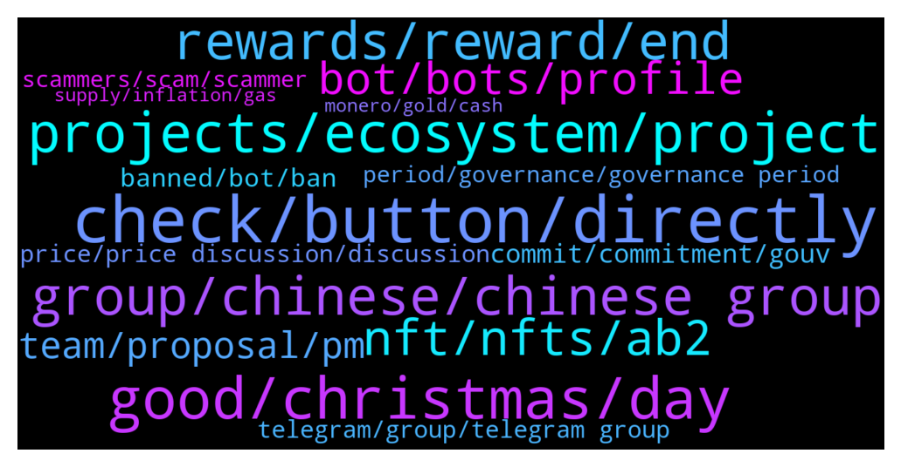

# **@algorand**
 ## Analysis for **2021-12-19** - **2021-12-26**.

---

## 📊 **Basic Stats**

**n_messages_sent**: 1852

---

---

## 🔝 **Top keywords and related messages**

1. **check, button, directly**

    @MackDenver --- *You can check the link below to find them  https://www.algorand.com/ecosystem/use-cases* **--->** [TG Discussion](https://t.me/algorand/325704)

    @Martin --- *Is there any tutorial to understand this better? I feel so dumb* **--->** [TG Discussion](https://t.me/algorand/323138)

    @MackDenver --- *You should find a button to do so soon, not sure why it is unavailable at the moment* **--->** [TG Discussion](https://t.me/algorand/326056)

    @MackDenver --- *It is currently in the works, more info will be made available soon* **--->** [TG Discussion](https://t.me/algorand/323756)

    @asirshahid --- *Rosa N. Coleman if you need help, just ask here* **--->** [TG Discussion](https://t.me/algorand/323071)

    @MackDenver --- *You are askin for link to where?* **--->** [TG Discussion](https://t.me/algorand/325050)

2. **good, christmas, day**

    @mcmaxims --- *Wish you a merry Christmas as well my friend* **--->** [TG Discussion](https://t.me/algorand/325777)

    @Rev Okereke --- *Good morning good people in the platform. I am new here and am from West Africa, precisely a Nigeria. Thanks so much* **--->** [TG Discussion](https://t.me/algorand/321849)

    @MackDenver --- *Glad to hear it, hope you enjoy the experience* **--->** [TG Discussion](https://t.me/algorand/323738)

    @MackDenver --- *Good day, guys! How is everyone doing today?* **--->** [TG Discussion](https://t.me/algorand/321933)

    @Chocoim --- *I pity myself wasted whole year* **--->** [TG Discussion](https://t.me/algorand/324661)

    @OGPoorMan --- *that is excellent. I love being early!* **--->** [TG Discussion](https://t.me/algorand/321857)

3. **projects, ecosystem, project**

    @MackDenver --- *We will let you know if there is a partnership with Algorand with such a project.* **--->** [TG Discussion](https://t.me/algorand/321056)

    @Leugim_21 --- *I want to know if Algorand is compliant with ISO 20022? please publish in your website if you have auditings, thats all thanks* **--->** [TG Discussion](https://t.me/algorand/321197)

    @pictonz8 --- *algorand was on the radar before this - it's looking very good so far!  Iso 20022, eco friendly and all that, checks all the boxes.* **--->** [TG Discussion](https://t.me/algorand/326089)

    @MackDenver --- *There is no contract of Algorand, we are not on ETH/BSC.* **--->** [TG Discussion](https://t.me/algorand/325297)

    @MG_6781 --- *Are there any launchpads or other projects being developed on Algorand?* **--->** [TG Discussion](https://t.me/algorand/321183)

    @Patdogbaby --- *Are there any hydrogen production/infrastructure projects in the Algorand eco system ?* **--->** [TG Discussion](https://t.me/algorand/321547)

4. **group, chinese, chinese group**

    @MackDenver --- *You should join the Spanish group  https://t.me/algorand_es* **--->** [TG Discussion](https://t.me/algorand/325289)

    @Chocoim --- *I was talking about that group* **--->** [TG Discussion](https://t.me/algorand/324694)

    @Kmw81 --- *Which page linked you to the other group . If you check official website this is the group* **--->** [TG Discussion](https://t.me/algorand/321844)

    @evio19x --- *I want to know more about this group* **--->** [TG Discussion](https://t.me/algorand/323905)

    @ChadDadd --- *Yes the website link brought me here but I found a different group on TG with same name.* **--->** [TG Discussion](https://t.me/algorand/321845)

    @ChadDadd --- *Is this the official algo group on TG? I found another one as well.* **--->** [TG Discussion](https://t.me/algorand/321838)

5. **rewards, reward, end**

    @Tiny_Philosopher_784 --- *Until rewards end mid February, yes* **--->** [TG Discussion](https://t.me/algorand/325954)

    @Tiny_Philosopher_784 --- *I think once holding rewards disappear, they might do it then* **--->** [TG Discussion](https://t.me/algorand/325856)

    @MJayCrypto --- *Last reward I see is on Aug 7* **--->** [TG Discussion](https://t.me/algorand/325614)

    @MilanSWOL --- *Can’t find anything about the reward?* **--->** [TG Discussion](https://t.me/algorand/325916)

    @SankaLover --- *Guys what happened to the reward %??* **--->** [TG Discussion](https://t.me/algorand/323435)

    @NightAlgorand --- *😂 To be fair, yes. Would have gotten much more but probably wouldn't work that well on guys :/* **--->** [TG Discussion](https://t.me/algorand/323853)

6. **nft, nfts, ab2**

    @MackDenver --- *Following is the NFT image link  https://bafybeib3ei5uquhfb4fevl74kmwz53duh6pcbs3ps4eshly6m6ix2b35wa.ipfs.dweb.link/* **--->** [TG Discussion](https://t.me/algorand/321319)

    @yunusp24 --- *that's it sir i don't really understand wallet algo....can you help me...i just want to see the nft* **--->** [TG Discussion](https://t.me/algorand/321299)

    @MackDenver --- *I see you have the NFT. You should be able to view it on the explorer* **--->** [TG Discussion](https://t.me/algorand/321308)

    @yunusp24 --- *this is my nft id ID 450090741 please check* **--->** [TG Discussion](https://t.me/algorand/321318)

    @MackDenver --- *Yes, we do support NFT and you need to add the asset to accept it* **--->** [TG Discussion](https://t.me/algorand/323546)

    @MackDenver --- *You should easily be able to manage NFTs with one of our official wallets* **--->** [TG Discussion](https://t.me/algorand/321297)

7. **bot, bots, profile**

    @riqua21 --- *I know but I was wondering if race does play into perceptions about an account being a bot.  I'm sure it does but it's unconscious* **--->** [TG Discussion](https://t.me/algorand/325172)

    @mrlovin --- *But if you see a Chinese women texting „hi“ it becomes obvious that it is a bot   If they would have a bot as profile pic I wouldn’t think so  Because a bot never says he is one* **--->** [TG Discussion](https://t.me/algorand/325157)

    @mrlovin --- *Why each bot takes profile pictures of Chinese woman?* **--->** [TG Discussion](https://t.me/algorand/325154)

    @mrlovin --- *I swear I am not a bot  It’s just my picture* **--->** [TG Discussion](https://t.me/algorand/325162)

    @stoked_serfer --- *Lol this bot changed the pics it uses* **--->** [TG Discussion](https://t.me/algorand/322671)

    @rodrixt --- *Take this pic from a non bot* **--->** [TG Discussion](https://t.me/algorand/323732)

8. **team, proposal, pm**

    @Fmv --- *Can someone pass me the contract for something please* **--->** [TG Discussion](https://t.me/algorand/325295)

    @MackDenver --- *You can send the details to me* **--->** [TG Discussion](https://t.me/algorand/321604)

    @Martin --- *Thanks. @patrick_crypto could you please help?* **--->** [TG Discussion](https://t.me/algorand/321344)

    @Pillonina --- *Hello, I found out that you cooperate with Defactor?* **--->** [TG Discussion](https://t.me/algorand/322020)

    @angelo9007 --- *Hi there, are referring to this? https://developer.algorand.org/docs/run-a-node/setup/install/* **--->** [TG Discussion](https://t.me/algorand/324370)

    @OGPoorMan --- *are you messaging me DM right now?* **--->** [TG Discussion](https://t.me/algorand/322478)

9. **commit, commitment, gouv**

    @MackDenver --- *Hey there, the button for changing your commit should be made available soon* **--->** [TG Discussion](https://t.me/algorand/325780)

    @idontknowwhattouseforusername --- *You can update your commitment before the registration window ends* **--->** [TG Discussion](https://t.me/algorand/326053)

    @Bastien --- *Hello, I just commited Algo to gouvernance 2. But just saw that I need to keep committed until 31 Dec for gouv #1. Did I made a mistake ?* **--->** [TG Discussion](https://t.me/algorand/325814)

    @Wurzelbear --- *Can you add more during the registration period or is the commit final?* **--->** [TG Discussion](https://t.me/algorand/325782)

    @MackDenver --- *Committing is not locking but you have to maintain that balance to be eligible. For further questions, check out the FAQ  https://algorand.foundation/gov-faq* **--->** [TG Discussion](https://t.me/algorand/326069)

    @rodde --- *Is it possible to uncommit before the 3 months? Say if I need to sell for whatever reason* **--->** [TG Discussion](https://t.me/algorand/325758)

10. **banned, bot, ban**

    @MackDenver --- *Seems like you were banned, most likely by the bot. @patrick_crypto should be able to help with that* **--->** [TG Discussion](https://t.me/algorand/321343)

    @MackDenver --- *There is a human verification bot that does a little verification. You you can't solve it, the bot  will ban you.* **--->** [TG Discussion](https://t.me/algorand/324769)

    @kenny920 --- *I'm also banned there. Never even said a word lol* **--->** [TG Discussion](https://t.me/algorand/324765)

    @Mimo --- *I don’t know why I’m banned there* **--->** [TG Discussion](https://t.me/algorand/324757)

    @cryptomanmachine --- *When he gets really feisty he will ban new users for posting a single meme* **--->** [TG Discussion](https://t.me/algorand/321871)

    @MackDenver --- *You might have been banned by the bot. @patrick_crypto can unban you* **--->** [TG Discussion](https://t.me/algorand/325377)

11. **telegram, group, telegram group**

    @Martin --- *Thanks, do they have a telegram ?* **--->** [TG Discussion](https://t.me/algorand/324349)

    @davkelone --- *I lost my trust to Telegram completely so I am definetely going to check this one* **--->** [TG Discussion](https://t.me/algorand/325687)

    @MackDenver --- *You should reach out to their telegram for more info: @algofi* **--->** [TG Discussion](https://t.me/algorand/322054)

    @NightAlgorand --- *Please go to tinyman telegram and contact their admin* **--->** [TG Discussion](https://t.me/algorand/325799)

    @FoeniculumNFTs --- *their telegram seems a bit dead (2k members)* **--->** [TG Discussion](https://t.me/algorand/321383)

    @MackDenver --- *We are aware of them. You can report the group to Telegram and help us shut it down.* **--->** [TG Discussion](https://t.me/algorand/324798)

12. **price, price discussion, discussion**

    @MackDenver --- *As I said above, it is not a price discussion chat. You can talk about price on the mentioned group.* **--->** [TG Discussion](https://t.me/algorand/323996)

    @MackDenver --- *Hello Mimo, please refrain from price discussion here* **--->** [TG Discussion](https://t.me/algorand/322734)

    @Djeran --- *The price discussion group is private  Do we need invite* **--->** [TG Discussion](https://t.me/algorand/324357)

    @Wurzelbear --- *Is there a price discussion group?* **--->** [TG Discussion](https://t.me/algorand/325373)

    @MackDenver --- *We don't talk about price here. There is a separate group for price discussion  @algorand_price* **--->** [TG Discussion](https://t.me/algorand/323992)

    @Tiny_Philosopher_784 --- *Yeah, this chat doesn't have time for your belaboring the price action. Considering this isn't the price chat, which I'm betting you're banned from... and I can guess why* **--->** [TG Discussion](https://t.me/algorand/324689)

13. **period, governance, governance period**

    @aleks_qaz --- *And when does this vote end?* **--->** [TG Discussion](https://t.me/algorand/325752)

    @0x --- *This message is sign up period for governance 2#* **--->** [TG Discussion](https://t.me/algorand/325475)

    @Prabu --- *Hello when does voting open for second governance?* **--->** [TG Discussion](https://t.me/algorand/326061)

    @MackDenver --- *The governance 2 signup period has just started* **--->** [TG Discussion](https://t.me/algorand/326066)

    @pkn11425 --- *Governance period #2 is coming to town… 🎅🎶🎶* **--->** [TG Discussion](https://t.me/algorand/322557)

    @MackDenver --- *We will know when the next governance phase starts* **--->** [TG Discussion](https://t.me/algorand/322739)

14. **scammers, scam, scammer**

    @Kmw81 --- *Becareful lot of scammers . But there is one unofficial for discussion @algorand_price* **--->** [TG Discussion](https://t.me/algorand/321847)

    @chassoux --- *And asking this question has attracted so many scammers it’s unbelievable* **--->** [TG Discussion](https://t.me/algorand/322099)

    @007 --- *True but if not careful they become poor from being scammed by scammers then 🤣🤣🤣🤣* **--->** [TG Discussion](https://t.me/algorand/325127)

    @Leugim_21 --- *Careful with someone sending you Direct Messages, those are Scams, Bots, Pretexters, please ignore.* **--->** [TG Discussion](https://t.me/algorand/321875)

    @Pablo_cast --- *It's accepted as legit. But you know* **--->** [TG Discussion](https://t.me/algorand/321478)

    @Martin --- *Anything that looks too good to be true is mostly a scam* **--->** [TG Discussion](https://t.me/algorand/324588)

15. **supply, inflation, gas**

    @MackDenver --- *What do you mean the total circulation is sold? If you sold that means there is a buyer too.* **--->** [TG Discussion](https://t.me/algorand/321588)

    @chassoux --- *I don’t really mind, it means supply is cut off, bullish news* **--->** [TG Discussion](https://t.me/algorand/322285)

    @Martin --- *What would happen once the total circulation supply has been sold?* **--->** [TG Discussion](https://t.me/algorand/321587)

    @EnalTesla20 --- *Total supply of 10 billion no more additions...?* **--->** [TG Discussion](https://t.me/algorand/324961)

    @Jacob --- *“Effectively” is relative. You need at minimum enough for the gas fees. Eg. 1 Algo + gas fee* **--->** [TG Discussion](https://t.me/algorand/322577)

    @<UNK> --- *it can easily cross $4 by the end of this year* **--->** [TG Discussion](https://t.me/algorand/322510)

