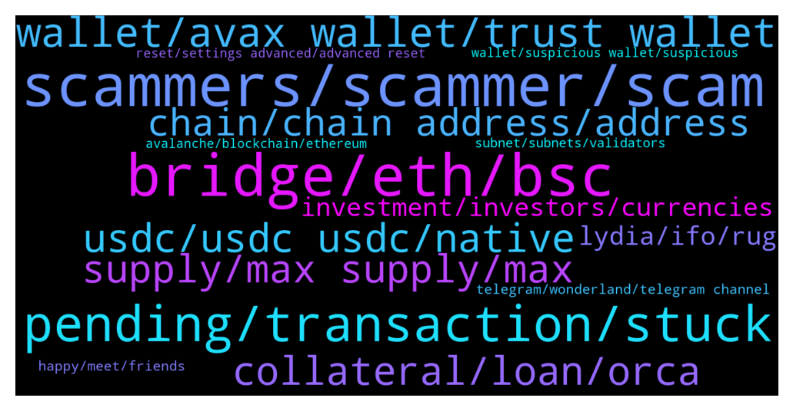

# **@avalancheavax**
 ## Analysis for **2021-12-19** - **2021-12-26**.

---

## 📊 **Basic Stats**

**n_messages_sent**: 2114

---

---

## 🔝 **Top keywords and related messages**

1. **scammers, scammer, scam**

    @frysport --- *So many scammers privately contacting me* **--->** [TG Discussion](https://t.me/avalancheavax/314896)

    @Ellie_Larsson --- *Admitted yes there are scammers everywhere and we are sorry he feel into the wrong hands but you don’t have to call everyone scammers real and legit ones exist ok here* **--->** [TG Discussion](https://t.me/avalancheavax/314642)

    @W --- *no that must be a scammer* **--->** [TG Discussion](https://t.me/avalancheavax/313287)

    @gtkcrypto --- *Guys watch out for scammers 🙂* **--->** [TG Discussion](https://t.me/avalancheavax/315274)

    @Thiago --- *Holy shit, about 10 scammers texting me now 😂😂* **--->** [TG Discussion](https://t.me/avalancheavax/312674)

    @MoeS999 --- *man I haven't seen as many scammers hit me up at once ever* **--->** [TG Discussion](https://t.me/avalancheavax/315143)

2. **bridge, eth, bsc**

    @Sea_Trader66 --- *Hey there, I'm trying to bridge an asset from ETH to Avax thats not listed on the Avalanche Bridge, is anyone aware of a bridge that will let you bridge ANY eth asset to Avax?* **--->** [TG Discussion](https://t.me/avalancheavax/314861)

    @Pedro --- *BSC-Fantom and Fantom-Avalanche bridges are almost free (less than $1)* **--->** [TG Discussion](https://t.me/avalancheavax/315181)

    @FreeSpeech7 --- *It wont let me go from avax to eth though* **--->** [TG Discussion](https://t.me/avalancheavax/312644)

    @Joris --- *Because i want to swap my avax for bnb* **--->** [TG Discussion](https://t.me/avalancheavax/313389)

    @W --- *but ya agree, a direct bridge Avax-Near or Aurora would be much nicer* **--->** [TG Discussion](https://t.me/avalancheavax/316983)

    @euroog --- *Why not just directly from Eth to AVAX lol* **--->** [TG Discussion](https://t.me/avalancheavax/313478)

3. **pending, transaction, stuck**

    @TheSEOdude --- *Are transactions going through right now ? Anyone who has just did one ?* **--->** [TG Discussion](https://t.me/avalancheavax/316436)

    @algomator --- *Tx is still stuck as "pending" in metamask and not showing on explorer. When I go to cancel or "speed up" it says insufficient funds even though there is plenty.* **--->** [TG Discussion](https://t.me/avalancheavax/315916)

    @GeeSee77 --- *transaction finally went through but it took several minutes* **--->** [TG Discussion](https://t.me/avalancheavax/312907)

    @Nicolas_A --- *A few seconds if it’s still pending it means either you have to reset Metamask or the gas price is too low* **--->** [TG Discussion](https://t.me/avalancheavax/316608)

    @cryptojack6317 --- *anyone have any guide to stop/complete a transaction. My transaction is stuck and wont even speed up or cancel after increasing the gas several times.* **--->** [TG Discussion](https://t.me/avalancheavax/316586)

    @schultzjl88 --- *Is the network slow right now? I've been trying to approve a traderjoe contract for the last 20 minutes.* **--->** [TG Discussion](https://t.me/avalancheavax/316542)

4. **wallet, avax wallet, trust wallet**

    @frysport --- *If anyone is downloading an Avax wallet be careful it's the correct one! there is a scam wallet that is at the top of the Google list, it's a hackers wallet and it will take your money once you put money into your account.* **--->** [TG Discussion](https://t.me/avalancheavax/315304)

    @Tyranny5000 --- *theres an old version i think everyone waiting on new avax wallet* **--->** [TG Discussion](https://t.me/avalancheavax/313859)

    @PatrickSutton --- *Mastercard Start Path x Ava Labs also in the last 7 days 🙂* **--->** [TG Discussion](https://t.me/avalancheavax/314052)

    @Viro --- *You know if the new avax wallet will have 12, 16 or 24 word security? I would prefer 24 words @Nicolas_A* **--->** [TG Discussion](https://t.me/avalancheavax/313968)

    @tradingisfunbro --- *Can i buy avax in trust wallet  ?* **--->** [TG Discussion](https://t.me/avalancheavax/313626)

    @luxevinco --- *There is no avax wallet app yet right, this might be a scam @admin* **--->** [TG Discussion](https://t.me/avalancheavax/313858)

5. **collateral, loan, orca**

    @euroog --- *There's no interest, only the payback fee, as far as I understand. If you use AAVE or BenQi you GAIN interest on your asset, ie. it increase in value, and you can use that as collateral in Orca. So you can loan against it at zero interest in Orca, while the underlying asset has yield and increases in value* **--->** [TG Discussion](https://t.me/avalancheavax/313227)

    @euroog --- *Might I suggest you jump into the Orca telegram and ask these questions? You can borrow to the limit of the LTV. If your borrow percent increase above the LTV because of decrease in price of your collateral you get partially liquidated. You can borrow as little as you want. The only restriction is that you can max borrow up to the percentage specified by the LTV, eg. 70%. Each vault states the LTV so you can see what you maximally can borrow.  YieldYak is the only platform whose interestbearing token receipts can be deposited into Orca. Here's a video on it, but they've added more vaults since it was published: https://youtu.be/zft6CenpjAU* **--->** [TG Discussion](https://t.me/avalancheavax/313477)

    @A --- *It's incredibly important for any borrower to know specifics about interest charges. But I'm not finding clear answers about this. Just that you can have a stable rate, or a variable rate. If you choose stable, is there a way to see what the interest rate WOULD be if you borrowed? It could be possible to get wiped out by accumulating interest, and if you can't plan for a locked-in amount, seems to me you're going in blindly, and the risk is too high.* **--->** [TG Discussion](https://t.me/avalancheavax/313136)

    @A --- *It's starting to make sense. Thank you. I don't think I've read anything about periodic (eg monthly) loan repayments. Is that because this over-collateralization-with-crypto system doesn't require it? I've read that with some DAOs/systems/projects, you can hold on to the loan as long as you want as long as the amount borrowed in the loan-to-collateral ratio doesn't go higher than allowed percentage of collateral. So if this is the case, then you can pay back in portions, on a regular or random periodic basis, or all at once, when you choose to?* **--->** [TG Discussion](https://t.me/avalancheavax/313135)

    @euroog --- *So you'll automatically get interest on your collateral while being able to loan against it. And no probs, anytime* **--->** [TG Discussion](https://t.me/avalancheavax/312793)

    @A --- *Did anyone ever answer this? And to add to it, if the 1:1 ratio of deposit to collateral doesn't earn anything, does the collateral that exceeds the loan amount earn?* **--->** [TG Discussion](https://t.me/avalancheavax/312773)

6. **usdc, usdc usdc, native**

    @Andy_oi1 --- *Does the launch of native USDC effect USDC.e in any way?? Do we have to convert our USDC.e to USDC?* **--->** [TG Discussion](https://t.me/avalancheavax/313743)

    @vm_machina --- *whats means native usdc. menas that usdc.e is going to be usdc ?* **--->** [TG Discussion](https://t.me/avalancheavax/313259)

    @aco1731 --- *Usdc.e is controlled by what entity?* **--->** [TG Discussion](https://t.me/avalancheavax/314366)

    @InThisNowMoment --- *How will this affect usdc.e esp in things like aave.* **--->** [TG Discussion](https://t.me/avalancheavax/313318)

    @JimWelder --- *Hahaha good thing Americans can't trade that thanks SEC* **--->** [TG Discussion](https://t.me/avalancheavax/315057)

    @APExCaesar --- *There is not a ton of native usdc yet, this will change over time* **--->** [TG Discussion](https://t.me/avalancheavax/315313)

7. **supply, max supply, max**

    @Nicolas_A --- *Look if you can’t sleep because you think 3ac is gonna wake up one day and market sell all their holdings I would just recommend getting rid of your avax* **--->** [TG Discussion](https://t.me/avalancheavax/317432)

    @diov0 --- *in 1 year we might touch 5000$ so that 2,5 avax will be worth 15000$ xD* **--->** [TG Discussion](https://t.me/avalancheavax/313910)

    @Desmond --- *Avax to 240 dollars end by December* **--->** [TG Discussion](https://t.me/avalancheavax/314547)

    @S1001001001001 --- *Why avax growing even market is dump.* **--->** [TG Discussion](https://t.me/avalancheavax/314581)

    @beiabei --- *What is the price prediction for avax today?* **--->** [TG Discussion](https://t.me/avalancheavax/315183)

    @algomator --- *kk, will troubleshoot elsewhere. How are average Avalaunch returns? Good?* **--->** [TG Discussion](https://t.me/avalancheavax/315898)

8. **chain, chain address, address**

    @A01010100 --- *Yes, it seems not working at all.. not sure if is metamask .. but seems to be working fine with other chains.. that’s why i’m asking* **--->** [TG Discussion](https://t.me/avalancheavax/317661)

    @diov0 --- *if a cex accepts c-chain then ypu just send from your metamask and done* **--->** [TG Discussion](https://t.me/avalancheavax/313936)

    @Kyani7 --- *Quick question how do you get x chain address* **--->** [TG Discussion](https://t.me/avalancheavax/315153)

    @Nicolas_A --- *well you deposit. Its via C chain* **--->** [TG Discussion](https://t.me/avalancheavax/313627)

    @Nicolas_A --- *Be sure to use a C chain address (0x...)* **--->** [TG Discussion](https://t.me/avalancheavax/316569)

    @li --- *Can I exchange the C-chain address?* **--->** [TG Discussion](https://t.me/avalancheavax/317082)

9. **investment, investors, currencies**

    @Alex --- *Not only is it disingenuous to your early investors, it has become borderline a pnd* **--->** [TG Discussion](https://t.me/avalancheavax/317399)

    @Albert --- *Is that an investment advice? 😂* **--->** [TG Discussion](https://t.me/avalancheavax/316077)

    @Aileen198801 --- *It’s not, but I only have this portfolio at the moment* **--->** [TG Discussion](https://t.me/avalancheavax/316078)

    @A --- *Are people using funds they get from borrowing crypto (with crypto as collateral) for anything other than investing in more crypto? Seems a little pyramid-ish, if nothing is cycling into goods/services of any kind.* **--->** [TG Discussion](https://t.me/avalancheavax/313168)

    @Michael --- *but not the crypto assets or crypto prices* **--->** [TG Discussion](https://t.me/avalancheavax/314458)

    @Alex --- *Jules 🔺 just to prove my point, the entire cult group has plenty of ico investors and none will know the vested schedule from 3ac and polychain.* **--->** [TG Discussion](https://t.me/avalancheavax/317419)

10. **lydia, ifo, rug**

    @RealRager --- *‼️ Lydia Finance Red Flag. ‼️  Red flags in the following projects.  A few days ago I already reported that Everst was a scam and they were making a soft rug. Today they have been hacked they say, coincidence.  I also warn about AvaoFinance, ridiculous project without foundations and without product and that from the first moment they receive a liquidity that they keep and the price of the token from the first moment sinks.   But who is behind all this is Lydia Finance, which sooner or later will do the same. Make no mistake, every IFO is an opportunity for soft rug. They thought they found the goose that laid the golden egg, but they have really dug their grave. Run away from Avax Lions.  Run away from Lydia while you still can.* **--->** [TG Discussion](https://t.me/avalancheavax/314414)

    @Yoopez --- *their man is still dumping to play on fOHM lmao. They wanted so much their cashgrab on EVRT they did no research on the guy and his skills lmao    https://snowtrace.io/tx/0x5bd2eb0c1e3940ee45090719db8bbf9641ea8a2be30e363c2934fd3a8da17e0b* **--->** [TG Discussion](https://t.me/avalancheavax/314544)

    @Yoopez --- *As I see how is managed EVRT, 80% chance it’s him. Shame on lydia who hace pushed him* **--->** [TG Discussion](https://t.me/avalancheavax/314499)

    @metad3pt --- *right idk how much LYD had to do with  it aside frrom hosting his IFO, but  the polar bear dude is def a shit head and skammed all his investors.* **--->** [TG Discussion](https://t.me/avalancheavax/314502)

    @Yoopez --- *The guy didn’t know how to do real options bro, it was a fucking joke. Just a cashgrab from lyd. These guys are doing IFO without any research on the team lmao. They just want their 200k$ cut* **--->** [TG Discussion](https://t.me/avalancheavax/314493)

    @Yoopez --- *Lyd team is pushing ruggers as Polarbear on EVRT and took their 200k cut on the IFO. Don’t care at all for the current rug cause they are slow ruggers as well. Just look how they manage : EVRT, Avao with inside trading & the strange TVL decreasing from 25M to 13M and dumped their lyd during the Maxi IFO. Avoid these slow ruggers* **--->** [TG Discussion](https://t.me/avalancheavax/314422)

11. **telegram, wonderland, telegram channel**

    @Benspi222 --- *I little be sacred  to open link in Telegram group. Every time i ask a question here i become 25 DM for people who said the are admin 😏* **--->** [TG Discussion](https://t.me/avalancheavax/313553)

    @Oui69 --- *Does Telegram have a report button?* **--->** [TG Discussion](https://t.me/avalancheavax/312813)

    @tradingisfunbro --- *I dont have discord can i dm somebody on telegram for this* **--->** [TG Discussion](https://t.me/avalancheavax/312715)

    @oathtobarbatos --- *I joined them on Discord, not Telegram hehe* **--->** [TG Discussion](https://t.me/avalancheavax/316129)

    @oathtobarbatos --- *No, this is the only official telegram channel* **--->** [TG Discussion](https://t.me/avalancheavax/316105)

    @alleycatdev --- *asking questions on telegram is painful.. the scammers are thick.. one question gets you 20 dm's* **--->** [TG Discussion](https://t.me/avalancheavax/313798)

12. **happy, meet, friends**

    @Aileen198801 --- *What kind of person is a good person* **--->** [TG Discussion](https://t.me/avalancheavax/315580)

    @Salome --- *Hello, do you have good news* **--->** [TG Discussion](https://t.me/avalancheavax/315848)

    @lotus_in_mist --- *you guys are so friendly, love you all* **--->** [TG Discussion](https://t.me/avalancheavax/312762)

    @DanielTKilleen --- *Hope you have been well my dude* **--->** [TG Discussion](https://t.me/avalancheavax/313366)

    @Rohit0318 --- *Hello there I am here nobody there 😂😂😂😂😂😂* **--->** [TG Discussion](https://t.me/avalancheavax/313459)

    @maChina77 --- *Roll down pls a lot to 20:10 dec 15. post* **--->** [TG Discussion](https://t.me/avalancheavax/313894)

13. **subnet, subnets, validators**

    @Basje01 --- *next step will be finality and subnets.* **--->** [TG Discussion](https://t.me/avalancheavax/313360)

    @elik7302 --- *Love subnets. Can we transfer from P to C chain?* **--->** [TG Discussion](https://t.me/avalancheavax/314246)

    @MeansofExchange --- *It's not a technical question, more of a business development question concerning subnets* **--->** [TG Discussion](https://t.me/avalancheavax/314313)

    @Talux --- *I think we need a fun subnet* **--->** [TG Discussion](https://t.me/avalancheavax/314043)

    @Nicolas_A --- *Yeah sure let’s forget about the difference in decentralization, finality, capacity and subnets capabilities among others* **--->** [TG Discussion](https://t.me/avalancheavax/313355)

    @MountainButWithK --- *Any information about subnets, which were scheduled for Q4? I mean its almost 2022* **--->** [TG Discussion](https://t.me/avalancheavax/312599)

14. **avalanche, blockchain, ethereum**

    @Albert --- *Oh so Avalanche is using the Ethereum network? Now it makes sense.* **--->** [TG Discussion](https://t.me/avalancheavax/313510)

    @Nicolas_A --- *Avalanche is a blockchain. Not an exchange* **--->** [TG Discussion](https://t.me/avalancheavax/315705)

    @modulor_stf --- *Would I just create a new Ethereum account and treat is as an Avalanche?* **--->** [TG Discussion](https://t.me/avalancheavax/315417)

    @APExCaesar --- *Welcome to the official Avalanche Announcements Telegram!  Avalanche is an open-source platform for launching decentralized applications and enterprise blockchain deployments in one interoperable, highly scalable ecosystem. https://t.me/avalanche_announcements* **--->** [TG Discussion](https://t.me/avalancheavax/314948)

    @Nicolas_A --- *“Avalanche was recently recognized as a net-zero carbon output blockchain at the United Nations (UN) COP26 conference, heralding a radical new era of eco-friendly, sustainable, net-zero digital transactions.” From https://link.medium.com/DLcQZlHr0lb* **--->** [TG Discussion](https://t.me/avalancheavax/313621)

    @Kado --- *Used to think Avalanche has a different network that's why its gonna be ethereum killer. Seems ETH will be here a while* **--->** [TG Discussion](https://t.me/avalancheavax/315633)

15. **reset, settings advanced, advanced reset**

    @Nicolas_A --- *Try to reset Metamask perhaps. Try another token* **--->** [TG Discussion](https://t.me/avalancheavax/316842)

    @wildinvestor --- *You're doing it wrong. Read my above message ser and reset your metamask.* **--->** [TG Discussion](https://t.me/avalancheavax/312929)

    @polpol99 --- *https://metamask.zendesk.com/hc/en-us/articles/360058961911-How-do-I-send-receive-or-cash-out-an-NFT-   "Currently, this functionality should only be attempted in MetaMask Mobile"* **--->** [TG Discussion](https://t.me/avalancheavax/316327)

    @Nicolas_A --- *First reset Metamask: Settings > Advanced > Reset* **--->** [TG Discussion](https://t.me/avalancheavax/312660)

    @Nicolas_A --- *Reset Metamask : settings > Advanced > Reset* **--->** [TG Discussion](https://t.me/avalancheavax/316588)

    @Tyranny5000 --- *consider this .in metamask settings... advanced... reset account* **--->** [TG Discussion](https://t.me/avalancheavax/313071)

