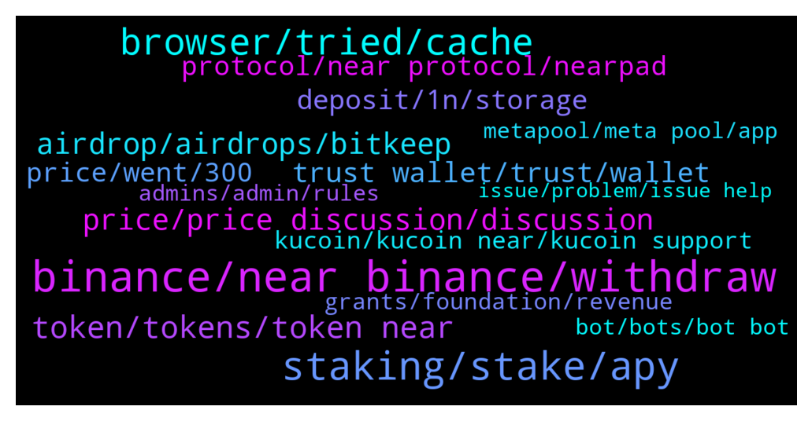

# **@cryptonear**
 ## Analysis for **2021-12-19** - **2021-12-26**.

---

## 📊 **Basic Stats**

**n_messages_sent**: 5168

---

---

## 🔝 **Top keywords and related messages**

1. **binance, near binance, withdraw**

    @why --- *so, just to be sure. I go to Binance, buy on spot near for BNB, i get native token on my binance wallet. I create a Near wallet and send coins to my Near wallet. i get native Near tokens on Near wallet ? am i correct ?* **--->** [TG Discussion](https://t.me/cryptonear/234738)

    @de0ne --- *Please guys, how do I transfer $near from binance to near wallet?  There is no deposit address* **--->** [TG Discussion](https://t.me/cryptonear/244426)

    @TJ --- *Is there any way I can deposit NEAR to my NEAR wallet for now? I usually use Binance but now the network is suspended* **--->** [TG Discussion](https://t.me/cryptonear/251345)

    @Aflatoon123 --- *Yes they will. Just ask them politely.  They charge some fees of 50 dollars approx in case of eth but they do help.  Try to ask in live chat in binance app* **--->** [TG Discussion](https://t.me/cryptonear/245258)

    @bekzody --- *Can Binance help me in this situation?* **--->** [TG Discussion](https://t.me/cryptonear/245232)

    @vipoodecrut --- *hi guys, anyone know how to send my near from near wallet back to binance?* **--->** [TG Discussion](https://t.me/cryptonear/240683)

2. **staking, stake, apy**

    @vlhai --- *yes, buy near on near wallet and stake it there, convenient for you. https://wallet.near.org/staking* **--->** [TG Discussion](https://t.me/cryptonear/235203)

    @Almighty860 --- *How long is staking for is there a minimum or u can pull out* **--->** [TG Discussion](https://t.me/cryptonear/235232)

    @JOJOUPUP --- *Dear Near Team,  anything wrong happening to Near wallet,  why the balance and staking amount all appears 0 while there is some $near in wallet and staked ?* **--->** [TG Discussion](https://t.me/cryptonear/238701)

    @Xantilo --- *The Near we staking on testnet, is it going to be ours? I don't understand how this works* **--->** [TG Discussion](https://t.me/cryptonear/238997)

    @Kripto_Raptor --- *it's non custodial brilliant staking solution* **--->** [TG Discussion](https://t.me/cryptonear/246489)

    @enevve --- *Hey fam quick noob question, how much should I stake on DAI/wNEAR to get a decent income and still be secure of not falling into permanent loss? haha* **--->** [TG Discussion](https://t.me/cryptonear/251040)

3. **browser, tried, cache**

    @near_guru --- *tried on firefox and safari, not working as well* **--->** [TG Discussion](https://t.me/cryptonear/236168)

    @memoriesadrift --- *that's how i did it when I got my account yes* **--->** [TG Discussion](https://t.me/cryptonear/234839)

    @kv9990 --- *That's odd 👀 Try this and let me know https://nearhelp.zendesk.com/hc/en-us/articles/1500009602081-Accidentally-sent-NEAR-to-funding-initial-address-Can-I-recover-it-* **--->** [TG Discussion](https://t.me/cryptonear/234812)

    @larry_lang --- *oh i know why the max button doesnt work* **--->** [TG Discussion](https://t.me/cryptonear/241357)

    @kv9990 --- *Or another browser :) that'll create a new access key and should help u doing txrns without any error* **--->** [TG Discussion](https://t.me/cryptonear/247024)

    @israel_igboze --- *It still works for now. You could change as the message displays* **--->** [TG Discussion](https://t.me/cryptonear/237496)

4. **token, tokens, token near**

    @why --- *will it be native near tokens, or BEP20 pegget tokens. if near it is new blockain it shoul have native token, am i corect?* **--->** [TG Discussion](https://t.me/cryptonear/234439)

    @why --- *ah so i cant use native tokens on MM ?* **--->** [TG Discussion](https://t.me/cryptonear/234471)

    @DiscoTrooper --- *I've meant the use case of the NEAR token* **--->** [TG Discussion](https://t.me/cryptonear/248811)

    @thanano46 --- *Near token to all the near community 😊* **--->** [TG Discussion](https://t.me/cryptonear/241229)

    @why --- *for price checking. price of tokens. for example i want to check Meta token price, where can i do it* **--->** [TG Discussion](https://t.me/cryptonear/240367)

    @ClaudioAC --- *You are always in control of your tokens* **--->** [TG Discussion](https://t.me/cryptonear/245772)

5. **airdrop, airdrops, bitkeep**

    @Badis --- *Did anyone try the near airdrop where u learn about the project and then u answer some questions, how do I get my reward (token)?* **--->** [TG Discussion](https://t.me/cryptonear/250673)

    @nipper1234 --- *Can we stake near somewhere?Any airdrops on near?* **--->** [TG Discussion](https://t.me/cryptonear/248891)

    @kv9990 --- *Okcoin used it to distribute airdrop when $NEAR was $2 xD* **--->** [TG Discussion](https://t.me/cryptonear/243833)

    @larry_lang --- *=))) im just messing with him, but sure here's some potential airdrop i found=)) https://twitter.com/Nearians_/status/1463733147669991426* **--->** [TG Discussion](https://t.me/cryptonear/236978)

    @israel_igboze --- *NEAR? AIRDROP?  Not the NEAR I know. Just be careful bro...scammers out there* **--->** [TG Discussion](https://t.me/cryptonear/236448)

    @Kripto_Raptor --- *what airdrop? careful not to get scammed* **--->** [TG Discussion](https://t.me/cryptonear/236447)

6. **price, price discussion, discussion**

    @kv9990 --- *We all are a bit excited but Price discussion here 😻 https://t.me/merchantsofnear* **--->** [TG Discussion](https://t.me/cryptonear/238676)

    @zubairansari07 --- *For price conversation, please come here >> https://t.me/merchantsofnear* **--->** [TG Discussion](https://t.me/cryptonear/237891)

    @rahulgoel007 --- *We don't do price discussion here  Please join https://t.me/merchantsofnear* **--->** [TG Discussion](https://t.me/cryptonear/247966)

    @larry_lang --- *i think  u would have to go to the price discussion channel to ask about it : https://t.me/merchantsofnear* **--->** [TG Discussion](https://t.me/cryptonear/241469)

    @Kripto_Raptor --- *if you want to discuss it we have no objection, just we request you to use Unofficial Price Chats: https://t.me/merchantsofnear https://t.me/nearforce* **--->** [TG Discussion](https://t.me/cryptonear/240266)

    @iamkemoo --- *Here is our unofficial price chat https://t.me/merchantsofnear* **--->** [TG Discussion](https://t.me/cryptonear/241633)

7. **trust wallet, trust, wallet**

    @Timmy --- *forget it, i'll do my own research. thanks for the help for those who helped me navigate the wallet* **--->** [TG Discussion](https://t.me/cryptonear/240798)

    @larry_lang --- *That would be NEAR wallet sir: https://wallet.near.org/, pls make sure that u click on this right link* **--->** [TG Discussion](https://t.me/cryptonear/244349)

    @BinhCAO --- *I created my account on web wallet, then import it to trust wallet.  I fund NEAR to trust wallet via address showed in there. But web wallet isn’t.  Then I transfer NEAR from trust to web wallet. Web shows the transaction but my account isn’t get updated* **--->** [TG Discussion](https://t.me/cryptonear/237038)

    @bennychang --- *I now have a verified wallet but no near tokens😕* **--->** [TG Discussion](https://t.me/cryptonear/234307)

    @why --- *ok, thats why i need separated wallet. nice. i like it. will dive in in research. i am watching interview of ceo right now* **--->** [TG Discussion](https://t.me/cryptonear/234480)

    @kv9990 --- *Lol it's an actual wallet :3 things got super weird now* **--->** [TG Discussion](https://t.me/cryptonear/251392)

8. **deposit, 1n, storage**

    @NEARverse_xd --- *Actually you need little bit of amount to reserve the storage fee and other option is create a account with email. It wont ask you for initial deposit* **--->** [TG Discussion](https://t.me/cryptonear/243714)

    @de0ne --- *It has been deposited.  I received 0.1near but my balance is showing 0.05near, why is that?* **--->** [TG Discussion](https://t.me/cryptonear/244461)

    @vlhai --- *If the 1st time you fund the wallet, it takes 0.05N for storage and fee. Check the account section bro!* **--->** [TG Discussion](https://t.me/cryptonear/244466)

    @Kripto_Raptor --- *please make a small deposit and try again like 0.1N* **--->** [TG Discussion](https://t.me/cryptonear/235968)

    @kv9990 --- *Out of that 0.1NEAR , it'll cover storage fees and rest would be there in your wallet to approve transactions costing small fees like 0.01N 👀✌️* **--->** [TG Discussion](https://t.me/cryptonear/235243)

    @NEARverse_xd --- *Yes thats what i'm saying, its not fee. Your 0.1N will remain in your wallet after deposit. You can transfer it anytime* **--->** [TG Discussion](https://t.me/cryptonear/235225)

9. **protocol, near protocol, nearpad**

    @Kripto_Raptor --- *Near Protocol Official yes. confirm that on near.org* **--->** [TG Discussion](https://t.me/cryptonear/235974)

    @ItsMeJo2021 --- *Near protocol already have smartcontracts ?* **--->** [TG Discussion](https://t.me/cryptonear/246961)

    @iforbusiness2 --- *NEAR protocl is a application platform that created to empower devs/users. NEAR protocol secure enough to manage high value assets like money or identity and performant enough to make them useful for everyday people, putting the power of the Open Web in their hands.* **--->** [TG Discussion](https://t.me/cryptonear/246176)

    @Kripto_Raptor --- *https://gov.near.org/t/protocol-development-roadmap/2903 there you have it, the protocol development roadmap* **--->** [TG Discussion](https://t.me/cryptonear/236356)

    @Kripto_Raptor --- *Near (near.org) is a Layer 1 protocol see our dApps here awesomenear.com* **--->** [TG Discussion](https://t.me/cryptonear/248808)

    @memanghoki --- *There is someone on behalf of the State Protocol Official, is this from your team, sir?  He gave this link* **--->** [TG Discussion](https://t.me/cryptonear/235973)

10. **price, went, 300**

    @kv9990 --- *Btw it went $36 on huobi 🌝🐋* **--->** [TG Discussion](https://t.me/cryptonear/239775)

    @DeeCryptoGalaxy --- *On gate.io, price of Near was at 10k.... What's up with that?* **--->** [TG Discussion](https://t.me/cryptonear/249762)

    @Abbanyazeed --- *Why price of near drop down from 17 in just hours last week $8,9??* **--->** [TG Discussion](https://t.me/cryptonear/245109)

    @Cryptogeekk --- *What happend to the price it gone up to around 22 and then come back😱* **--->** [TG Discussion](https://t.me/cryptonear/239765)

    @Adam --- *Almost back down? Went from $9 to almost $18 now back down to almost below $11* **--->** [TG Discussion](https://t.me/cryptonear/238613)

    @IISureShotII --- *Do we expect 18$ again haha* **--->** [TG Discussion](https://t.me/cryptonear/243034)

11. **kucoin, kucoin near, kucoin support**

    @kv9990 --- *Same ;) contact Kucoin Support,they forwarded my issue to their technical team ✌️* **--->** [TG Discussion](https://t.me/cryptonear/242030)

    @givemegarments --- *Hi there! I withdraw some near, but it didn't got at kucoin (* **--->** [TG Discussion](https://t.me/cryptonear/241847)

    @btan89 --- *Like the Near admins/mods here have been fantastic but KuCoin has been horrible* **--->** [TG Discussion](https://t.me/cryptonear/248285)

    @geopius1 --- *I sent near to Kucoin since yesterday yesterday and uptil now have not received it. What's the problem plz?* **--->** [TG Discussion](https://t.me/cryptonear/242189)

    @Bern --- *Surprise it’s taking so long.  Perhaps due to Kucoin* **--->** [TG Discussion](https://t.me/cryptonear/239166)

    @Kripto_Raptor --- *please contact them again, seems kucoin needs an internal server upgrade many users had same problem but eventually they got it in a few hours or...days at most* **--->** [TG Discussion](https://t.me/cryptonear/242204)

12. **grants, foundation, revenue**

    @kv9990 --- *Have you applied for grants? If not, apply then team shall contact u 👀 https://near.org/grants/* **--->** [TG Discussion](https://t.me/cryptonear/246836)

    @web0x --- *operations grants,11.4%=114,000,000 foundation endowment 10.0%=100,000,000 early ecosystem 11.7%=117,000,000 community grants,program… 17.2%=172,000,000* **--->** [TG Discussion](https://t.me/cryptonear/243497)

    @FritzWagner --- *There should be a list to confirm if a Project has indeed received a grant just to follow up the near foundation funds 👀* **--->** [TG Discussion](https://t.me/cryptonear/234874)

    @Adex2456 --- *Near mod pls give me contact of person who is incharge of grant* **--->** [TG Discussion](https://t.me/cryptonear/246833)

    @cattuongvyy --- *Near Foundation- Where do they raise funds from?* **--->** [TG Discussion](https://t.me/cryptonear/240556)

    @cattuongvyy --- *The main purpose of a project is profit. Profit comes from revenue-expenses. Grants from the parties for the project are considered support only and do not count as revenue. I'm looking to dig deep into what the project can actually do. No investor pours money into a project that is not profitable. I am not considering token appreciation here. You misunderstood what I meant. :(* **--->** [TG Discussion](https://t.me/cryptonear/240530)

13. **bot, bots, bot bot**

    @cengizhantekin --- *can you kindly check please, he says bot captca doesnt work through* **--->** [TG Discussion](https://t.me/cryptonear/242003)

    @thanano46 --- *Hii ... Am fine and I'm not a bot. What about u?* **--->** [TG Discussion](https://t.me/cryptonear/234726)

    @SteveBarns --- *No sanket is not a bot lol* **--->** [TG Discussion](https://t.me/cryptonear/248485)

    @thanano46 --- *Why you bot always set profile pictures of ladies??* **--->** [TG Discussion](https://t.me/cryptonear/247632)

    @Kripto_Raptor --- *are you practicing bot phrases ?* **--->** [TG Discussion](https://t.me/cryptonear/239796)

    @pavelgordok --- *I can't work with this bot lol* **--->** [TG Discussion](https://t.me/cryptonear/252230)

14. **metapool, meta pool, app**

    @bailey_12 --- *U can do more things with metapool. Both are just staking your near* **--->** [TG Discussion](https://t.me/cryptonear/237938)

    @why --- *thats what i mean. i decided try metapool* **--->** [TG Discussion](https://t.me/cryptonear/238201)

    @FritzWagner --- *Metapool.app is the best choice from my point of view* **--->** [TG Discussion](https://t.me/cryptonear/250644)

    @FritzWagner --- *Thats right ! Thanks Vikash ! Metapool is awesome 🤩* **--->** [TG Discussion](https://t.me/cryptonear/250663)

    @why --- *Metapool is already working. What do you mean* **--->** [TG Discussion](https://t.me/cryptonear/246302)

    @nidrah_khan --- *Just new.. used metapool and skyward as well* **--->** [TG Discussion](https://t.me/cryptonear/237107)

15. **admins, admin, rules**

    @Gg --- *I need an admin, not incomprehensible hints from people. I asked a direct question. why do I get hints from kindergarten?* **--->** [TG Discussion](https://t.me/cryptonear/238137)

    @NEARverse_xd --- *Admins are mentioned in the pinned message (at the last line)😜* **--->** [TG Discussion](https://t.me/cryptonear/249790)

    @r33pich33p --- *can the admins say something in here about it? 13k users in there..* **--->** [TG Discussion](https://t.me/cryptonear/251084)

    @Aflatoon123 --- *Oh ok.  Admin came online. 😁* **--->** [TG Discussion](https://t.me/cryptonear/244902)

    @hoangca6789 --- *Hi admin I have some question* **--->** [TG Discussion](https://t.me/cryptonear/235773)

    @Aflatoon123 --- *All admins are offline on trisolaris i suppose🥶* **--->** [TG Discussion](https://t.me/cryptonear/244899)

