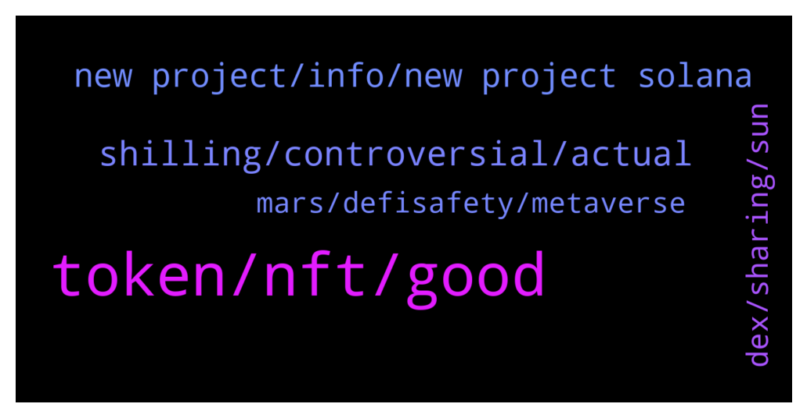

# **@de_fi**
 ## Analysis for **2021-12-19** - **2021-12-26**.

---

## 📊 **Basic Stats**

**n_messages_sent**: 193

---

---

## 🔝 **Top keywords and related messages**

1. **token, nft, good**

    @Tomy1919 --- *I'm using all these platforms.  Hodlnaut > Higher rates Nexo > 0 interest loan Celsius > more assets.* **--->** [TG Discussion](https://t.me/de_fi/231108)

    @dereksilva --- *I imagine many of this group’s members are on the whitelist. Much to my surprise and delight, I am!   https://twitter.com/agora/status/1471875072239546380?s=21* **--->** [TG Discussion](https://t.me/de_fi/232010)

    @WhoCareBaby1 --- *What do you guys think about market direction??* **--->** [TG Discussion](https://t.me/de_fi/231088)

    @xnatasx --- *Are they messing up their airdrop or something with those fees? https://etherscan.io/tx/0x9681bcf8d00169c9eeb61f025cf4a59de2cef8995462db8a4bb70fe84af94507  Edit: No, expected very high gas to claim.* **--->** [TG Discussion](https://t.me/de_fi/231503)

    @Partickk29 --- *Long term is green. Just zoom out the chart man and buy every dip* **--->** [TG Discussion](https://t.me/de_fi/231089)

    @Camila_burgos1 --- *I hope it hasn’t been hacked* **--->** [TG Discussion](https://t.me/de_fi/231253)

2. **shilling, controversial, actual**

    @dereksilva --- *No shilling allowed. Information and news only.* **--->** [TG Discussion](https://t.me/de_fi/232132)

    @Ayesha --- *Does anyone have actual conversations here or just shill?* **--->** [TG Discussion](https://t.me/de_fi/232124)

    @dereksilva --- *You already shared this once @Sarah450962. That’s enough.* **--->** [TG Discussion](https://t.me/de_fi/232428)

    @dereksilva --- *If only this were true… LOL* **--->** [TG Discussion](https://t.me/de_fi/232258)

    @Crypto_Christopher --- *Yeah but people do that lol* **--->** [TG Discussion](https://t.me/de_fi/232142)

    @Mill_007 --- *Sometimes we just share our bags but you can tell the difference mosty* **--->** [TG Discussion](https://t.me/de_fi/232141)

3. **new project, info, new project solana**

    @dcaeverything --- *I would like to discuss this project. Can I PM you?* **--->** [TG Discussion](https://t.me/de_fi/231851)

    @Tonnie --- *I'm really interested in this too. I think it will be huge* **--->** [TG Discussion](https://t.me/de_fi/231482)

    @Niber100 --- *Am trying to know more about this community* **--->** [TG Discussion](https://t.me/de_fi/232446)

    @JustQueenThings --- *Sounds interesting  You seem to make more about this project* **--->** [TG Discussion](https://t.me/de_fi/232461)

    @Ayesha --- *😂😂😂 i guess not, as long as one specific project isn't being spoken about* **--->** [TG Discussion](https://t.me/de_fi/232129)

    @cryptokittyy --- *if you want to know more about the project you can read their white papers and get more info* **--->** [TG Discussion](https://t.me/de_fi/231845)

4. **dex, sharing, sun**

    @cryptokittyy --- *Few days ago Solanax team on their Twitter page announced approximate date in February* **--->** [TG Discussion](https://t.me/de_fi/231848)

    @leegongg --- *Yes it's unique! onisquad . gg  Just remove the space* **--->** [TG Discussion](https://t.me/de_fi/231763)

    @Ayesha --- *The AVAX DEX? No, I don't think so* **--->** [TG Discussion](https://t.me/de_fi/232148)

    @mtronfi --- *At 16 commits, Solarbeam's development history appears to be found in the same place where the sun don't shine. Although it is the leading DEX on the Moonriver chain, we would like to see a Formal Verification completed, along with a bug bounty program. There is much potential in Solar, but one must transpires it in public data and not gaze at the sun.   https://docs.defisafety.com/master/solarbeam-process-quality-review* **--->** [TG Discussion](https://t.me/de_fi/231687)

    @ansteadm --- *Yeah! Awesome to see more teams building around zkSync and L2 :)* **--->** [TG Discussion](https://t.me/de_fi/232005)

    @dcaeverything --- *Thanks for sharing! I will do that! DEX based on fastest blockchain sound like a great idea.* **--->** [TG Discussion](https://t.me/de_fi/231846)

5. **mars, defisafety, metaverse**

    @realpeter --- *Don’t miss out on our job openings on DeFi Prime! https://defiprime.pallet.xyz/jobs* **--->** [TG Discussion](https://t.me/de_fi/231612)

    @mtronfi --- *DeFiSafety’s winter 2021 reading, listening and watching list.   🎅🏻🎄⬇️ https://medium.com/@nick_defisafety/2995e1c45782* **--->** [TG Discussion](https://t.me/de_fi/231550)

    @mtronfi --- *At over 1000 daily transactions, Mars has done well in convincing people to use their protocol. Nevertheless, some more preparations in terms of a public development history, software function documentation would make their extra terrestrial venture more secure. At DeFiSafety we'd prefer to die on Mars, not on impact.  https://docs.defisafety.com/master/mars-ecosystem-process-quality-review* **--->** [TG Discussion](https://t.me/de_fi/232294)

    @David --- *Please can anyone teach me defi* **--->** [TG Discussion](https://t.me/de_fi/231806)

    @Chief_judge --- *after defi will be about Metaverse* **--->** [TG Discussion](https://t.me/de_fi/231085)

    @Niber100 --- *Defi members what is the next moon mission guys?* **--->** [TG Discussion](https://t.me/de_fi/232453)

