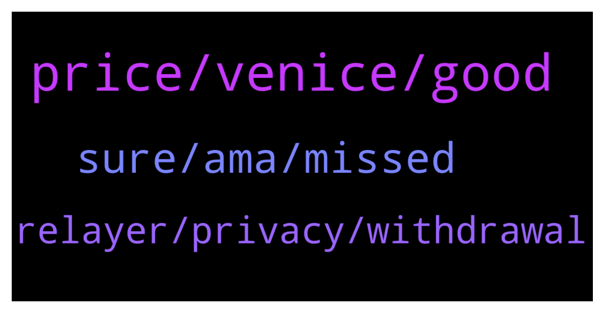

# **@defisearchpublic**
 ## Analysis for **2021-12-19** - **2021-12-26**.

---

## 📊 **Basic Stats**

**n_messages_sent**: 69

---

---

## 🔝 **Top keywords and related messages**

1. **price, venice, good**

    @Taylor --- *Hi guys, is bitcoin worth holding right now, what do you think?* **--->** [TG Discussion](https://t.me/defisearchpublic/240212)

    @jaelquin01 --- *This amount is a non-inflationary fixed supply set at launch. 10% of the $VENI supply was distributed at the genesis event to Venice liquidity providers and stakers. The remaining 90% is distributed over the course of four years.* **--->** [TG Discussion](https://t.me/defisearchpublic/240694)

    @CasperDeFi --- *We are live!  https://twitter.com/aag_ventures/status/1470000579460145155?s=20  --  A reminder of our pricing work for TLA:  TLA Pricing Mechanism  When an individual completes a purchase, the transaction will cause the AAG token’s price to increase. In contrast, when no purchases are initiated, prices will gradually decrease with the weight increasing.  Starting at $4.14, the price of AAG tokens will gradually decrease when no purchases occur. However, if at one point, for instance, at $3, there are large orders that have been successfully transacted, the price of the AAG token may also increase quickly. That means the price could also go above $4.14 and advance even higher if there are investors continuously buying.  In conclusion, an individual can freely purchase AAG tokens at any price they see fit, and that is the price they get. Eventually, the price will settle at a price the market as a whole finds most suitable.* **--->** [TG Discussion](https://t.me/defisearchpublic/240171)

    @bondss1 --- *Tell the guys what's a good investment right now in the red market.* **--->** [TG Discussion](https://t.me/defisearchpublic/240563)

    @carajulierey01 --- *Are you seeing that as for long term?* **--->** [TG Discussion](https://t.me/defisearchpublic/240688)

    @jenicaannbin01 --- *Oh. You really invest you time. Good. You'll become millionaire of you know the process of the project and how it works. You'll know how to pla the game* **--->** [TG Discussion](https://t.me/defisearchpublic/240704)

2. **sure, ama, missed**

    @ViCious25 --- *will ape in big! won't miss that for sure* **--->** [TG Discussion](https://t.me/defisearchpublic/240263)

    @jj528977 --- *Make sure you won't missed it! It’s going to be 🔥* **--->** [TG Discussion](https://t.me/defisearchpublic/240262)

    @Victor1111 --- *No bro i missed it but I'm definitely buying at launch tomorrow* **--->** [TG Discussion](https://t.me/defisearchpublic/240261)

    @jaelquin01 --- *Hehe. Thanks but not really. I just attended those previous AMA that's why* **--->** [TG Discussion](https://t.me/defisearchpublic/240703)

    @Venedixt0 --- *Right, buddy. You know it too?* **--->** [TG Discussion](https://t.me/defisearchpublic/240657)

    @jenicaannbin01 --- *I just saw this on one of the AMA group* **--->** [TG Discussion](https://t.me/defisearchpublic/240685)

3. **relayer, privacy, withdrawal**

    @Venedixt0 --- *Monsoon improves transaction privacy by breaking the on chain links between sources and destination.* **--->** [TG Discussion](https://t.me/defisearchpublic/240662)

    @Fred©orpuz --- *This will make all your transaction private, bro.* **--->** [TG Discussion](https://t.me/defisearchpublic/240656)

    @Fred©orpuz --- *Is there a chance to compromise the protocol and leak some info of the depositors, bro?* **--->** [TG Discussion](https://t.me/defisearchpublic/240671)

    @Regor --- *Is it safe to use a relayer?* **--->** [TG Discussion](https://t.me/defisearchpublic/240669)

    @Venedixt0 --- *This relayer sends a withdrawal transaction and take a part of the deposit as compensation.* **--->** [TG Discussion](https://t.me/defisearchpublic/240668)

    @Venedixt0 --- *But a relayer can be used too to better preserve privacy* **--->** [TG Discussion](https://t.me/defisearchpublic/240664)

