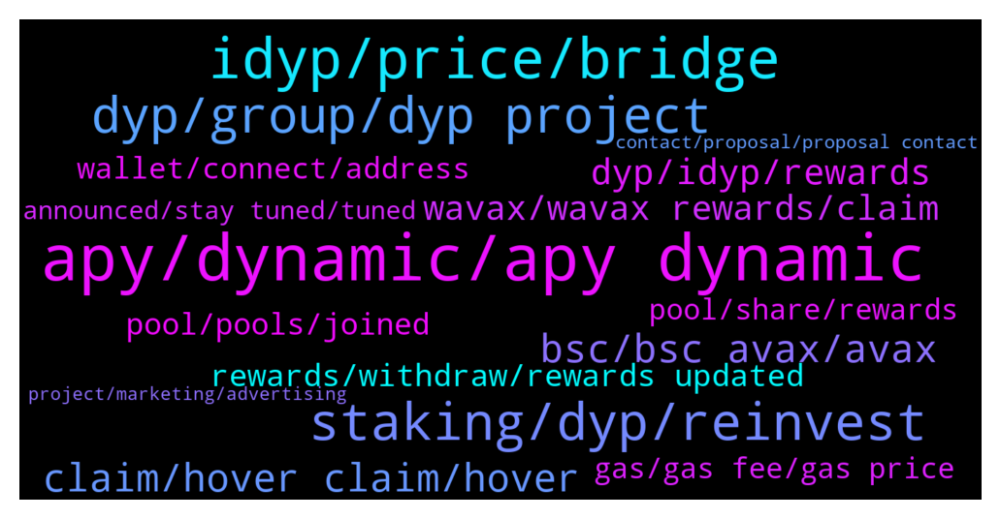

# **@dypfinance**
 ## Analysis for **2021-12-19** - **2021-12-26**.

---

## 📊 **Basic Stats**

**n_messages_sent**: 1874

---

---

## 🔝 **Top keywords and related messages**

1. **apy, dynamic, apy dynamic**

    @Og_of_Satoshi --- *Firstly if yourself the maintainer of the project does know about how his project works, that gives a zero ground to attack me of having zero knowledge, you are using the same jargons it looks like u have rote learned it  Secondly I am mathematian and let me teach how a simple direct proportion   works. if the Apy is based on price as you say and not on the total deposit dyp. If price fell bay 50% the apy should fell by 50% making it 110% not 67* **--->** [TG Discussion](https://t.me/dypfinance/231569)

    @timdyp --- *Julien, please check my previous message scenario number 3: https://t.me/dypfinance/223784 At some point for the old pools the displayed APY was being earned, but these happened after at least 6 months since launch. Also, for the old pools at some point we had 0 IL, but again these happened after 7 months since launch. The yield farming is a long-term game, it is not something that you can flip daily. If you make the mistake to remove your liquidity in a bad moment, you can have losses caused by the IL. https://t.me/dypannouncements/541* **--->** [TG Discussion](https://t.me/dypfinance/229014)

    @Cryptomommi --- *Ok...but the APY is so low..shouldn't any go up if people withdrawing?* **--->** [TG Discussion](https://t.me/dypfinance/232642)

    @ringLeader96 --- *Oh sorry, 30 day lock, I saw that the APY went down which is fine, but the reward I got equated to like 700% APY* **--->** [TG Discussion](https://t.me/dypfinance/230448)

    @JulienRayleigh --- *Okay, thanks for the clarification. So the APY may very well be 5% one week and the next week 20 or 30% right? And I guess it's possible to lose a bit some weeks?* **--->** [TG Discussion](https://t.me/dypfinance/229011)

    @DhoniMSD516 --- *We didn't PROMISE an APY mate please get your statements correct you are saying this from day 1 you joined here, everyone aware that APY is dynamic and includes burns, we also explained how this works in  medium and also being shown under calculator>  Isn't there a way that it can be modified for example every minute automatically according to the real performance - No because we never know if the tokens will be burned or not because this was decided by governance proposal and this will be voted by investors and not from team* **--->** [TG Discussion](https://t.me/dypfinance/229009)

2. **idyp, price, bridge**

    @Firas --- *I think the main difference is that idyp has been recently listed and that some people bought it at the initial spike. Pretty sure people who bought it close to listing price aren't complaining 😅* **--->** [TG Discussion](https://t.me/dypfinance/229152)

    @Chris_Cryp --- *The main difference is that the traded tokens in other farms have utility and are linked to the project and are actually traded which produces fees. Who is trading iDYP? Only initial trading because of the launch of the token, apart from that no one even knows about it.* **--->** [TG Discussion](https://t.me/dypfinance/229136)

    @thechesirecat --- *In my personal view (not financial advice), the difference in iDYP price between chains is probably because they were launched as "separate" tokens and at different times on different chains.   You can't bridge between the chains so what we saw earlier with iDYP on BSC is being repeated on ETH. No arbitrage opportunities here.   It will drop just like iDYP on BSC.   I am speculating but this is a probable reason why it is not registered on CG and CMC yet as the price difference is too large and demand-supply is volatile.   Once the dust settles, we will (hopefully) see closer price equilibrium. As long as you cannot bridge it, you can't do arbitrage. And as supply and demand for iDYP on different chains varies, there will be a notable price difference.   The only provisional way to solve this is if the DYP Team releases or withdraw iDYP from various chains with the intention to find price equilibrium. But its a slippery slope with price setting.* **--->** [TG Discussion](https://t.me/dypfinance/231398)

    @hemanrock --- *please check this to know more about iDYP https://link.medium.com/QZD2POunskb  more users are into DYP and also knowing about iDYP gradually.  iDYP is being used for deposit in in FARMS for now and more benefits from it can be in future.* **--->** [TG Discussion](https://t.me/dypfinance/233420)

    @Sir_Crys_alot --- *Can someone explain like I am five why iDYP is bleeding so hard? Do we have to find a base, because like I see it it's only a background token so if many people use the protocol it should be stable at some point. Or not?* **--->** [TG Discussion](https://t.me/dypfinance/232630)

    @DhoniMSD516 --- *You can read about iDYP here and why we introduced it https://link.medium.com/QZD2POunskb* **--->** [TG Discussion](https://t.me/dypfinance/229083)

3. **staking, dyp, reinvest**

    @Life_is_love_La_la_la_la_la --- *Hello again Dhoni.  With regard to my previously mentioned imagining of the auto-compounding of DYP rewards, I now see that this was a feature of the V1 Staking contract in which I invested. The following still stands in the V1 preamble:-  "DYP Staking Deposit your DYP tokens to earn DYP rewards. To start earning DYP rewards, you must deposit your DYP tokens into the corresponding list of pools. The pool will have four different staking options, with rewards starting from 20% APR up to 35% APR, depending on the lock time from a minimum of thirty days up to 120 days. The staking pools have the REINVEST function integrated, it means you are able to automatically add your daily rewards to the staking pool."  May I ask why this feature was discontinued in V2? This would seem to drive investors through the doors of platforms such as Beefy and Yield Yak which DO employ strategies to maximise rewards by multiple daily reinvestment (autocompounding if you like)?  Further, could you point me to where DeFi sets out in the investor stats the date on which the initial deposit was made and the end of the lock-in period? I cannot see it anywhere whiteout having to scour Snowtrace/BSCscan etc.   Finally, would you kindly make it clear without my needing to take an evening course in Proof of Stake/Authority/Delegated Authority/Pudding, what are the penalties for withdrawing one's investment before the end of the lock period.   I am much obliged for your indulgence.   Sandy  P. S. I hope this is adequately parsed for everyone to comprehend.* **--->** [TG Discussion](https://t.me/dypfinance/232524)

    @SunilSPawar --- *Is it normal for rewards to drop in bsc staking. I had 567 dyp available to be claimed as of yesterday but now 528. Admins can you please shed some light on this. This Bsc V2 staking* **--->** [TG Discussion](https://t.me/dypfinance/229934)

    @Cimmy_revenger --- *anybody can help me for staking dyp ?* **--->** [TG Discussion](https://t.me/dypfinance/229101)

    @LovelySuman86 --- *Then V1 staking was more beneficial* **--->** [TG Discussion](https://t.me/dypfinance/232913)

    @Life_is_love_La_la_la_la_la --- *Admins: I'm sorry to ask a question about DYP staking (V2) which must have been answered a thousand times but I will temper it by first saying that I have staked 665 DYP in the 90 day contract today and from what I have seen tick-up in claimable DYP rewards it appears to be incredibly "rewarding" simply on the basis of what I have been awarded today. I think i  remember reading that the the rewards are auto-compounding but I cannot see the mechanism by which this happens. From what I see on screen I can click on "Reinvest" whenever I wish but this is a manual process. Am I misunderstanding something? The other thing is would beg your patience to explain is how are the DYP rewards calculated/derived? Are they derived from a proportion of fees generated within the platform or do some of the Avalanche fees feed back into the reward pot? I hope this is not too tiresome a question and that others may benefit from your clarification of the position. Many thanks* **--->** [TG Discussion](https://t.me/dypfinance/232513)

    @DhoniMSD516 --- *Hello it is perfectly ok to ask questions no issues but please use paragraphs 😅  Coming to the first answer the rewards are NOT auto compounded and no where mentioned by us that there is auto compounding , may be you misread it. Yes if you want to add more you can use reinvest and this doesn't reset timer.  Second question: The staking works under POS(Proof of stake concept) there are many explanation regarding this already available on Google and Youtube so please check out them* **--->** [TG Discussion](https://t.me/dypfinance/232514)

4. **dyp, group, dyp project**

    @DhoniMSD516 --- *Hey mate our token DYP has launched in Dec 2020, you can buy on multiple CEX and DEX here We are available in ETH, BSC and AVAX chains You can start reading about DYP and the products we introduced here https://t.me/dypfinance/229271* **--->** [TG Discussion](https://t.me/dypfinance/229370)

    @uBrown --- *When will dyp hire workers, I want to apply* **--->** [TG Discussion](https://t.me/dypfinance/229379)

    @DhoniMSD516 --- *Hey welcome you can start reading about DYP here :)  https://t.me/dypfinance/229271* **--->** [TG Discussion](https://t.me/dypfinance/233060)

    @DhoniMSD516 --- *Hey welcome you can start reading about DYP here https://t.me/dypfinance/229271* **--->** [TG Discussion](https://t.me/dypfinance/229814)

    @Dr Augusto --- *Dyp have some new project for new ways for use dyp?* **--->** [TG Discussion](https://t.me/dypfinance/228650)

    @hemanrock --- *Please check this to know more about DYP and its products https://t.me/dypfinance/229271* **--->** [TG Discussion](https://t.me/dypfinance/233409)

5. **bsc, bsc avax, avax**

    @SenorChito --- *I use trustwallet and mostly the bsc chain* **--->** [TG Discussion](https://t.me/dypfinance/228642)

    @DhoniMSD516 --- *Hey you need to follow this route BSC-ETH-AVAX because there is no direct bsc to avax bridge* **--->** [TG Discussion](https://t.me/dypfinance/233296)

    @DhoniMSD516 --- *For ERC and BSC you can check on Dextools, for AVAX you can check only on Pangolin* **--->** [TG Discussion](https://t.me/dypfinance/230830)

    @hemanrock --- *May I know which network you are looking for ETH/BSC/AVAX ?* **--->** [TG Discussion](https://t.me/dypfinance/231358)

    @hemanrock --- *please check from here. https://dyp.finance/farmv2 but, on ETH Network gas fees will be high compared to BSC and AVAX* **--->** [TG Discussion](https://t.me/dypfinance/230469)

    @Cj --- *Question: is it possible to bridge 25k to bsc and avax in 1 day (thus total 50k)?* **--->** [TG Discussion](https://t.me/dypfinance/230198)

6. **claim, hover claim, hover**

    @JulienRayleigh --- *Nah when i said claim, I doesnt mean take your profit out but accumulate interest mate* **--->** [TG Discussion](https://t.me/dypfinance/229193)

    @hemanrock --- *You can see rewards only if you claim or you need to wait for someone to click claim* **--->** [TG Discussion](https://t.me/dypfinance/231003)

    @sb3ee --- *That’s correct, i can let them populate* **--->** [TG Discussion](https://t.me/dypfinance/230344)

    @j24th --- *Nope. Im waiting Coz i want to see how much can claim today.* **--->** [TG Discussion](https://t.me/dypfinance/230922)

    @shinigamikami --- *Yeah that’s the plan and the good thing is even if nobody claims once someone does you get all previous rewards* **--->** [TG Discussion](https://t.me/dypfinance/230345)

    @shinigamikami --- *Don’t worry about claim if you don’t plan to spend your rewards* **--->** [TG Discussion](https://t.me/dypfinance/230343)

7. **dyp, idyp, rewards**

    @timdyp --- *No, you did not. It was clearly stated in all the articles regarding the new pools, plus discussed a couple of times here. DYP is no longer used for rewards, DYP is just a type of rewards like ETH, BNB, AVAX. What does it mean? It means you get the rewards in iDYP and the price of iDYP is converted to DYP based on market value. So based on iDYP and DYP price, you can see 100 DYP today and 150 or 50 DYP tomorrow. If the rewards are not claimed, they can go up or down.* **--->** [TG Discussion](https://t.me/dypfinance/231546)

    @Nubarv --- *Tim but if idyp dips, your rewards will get less, right?* **--->** [TG Discussion](https://t.me/dypfinance/230610)

    @memiamang --- *If i get reward by dyp then number of dyp must be increased day by day* **--->** [TG Discussion](https://t.me/dypfinance/233133)

    @DhoniMSD516 --- *You are still getting reward in DYP and not iDYP* **--->** [TG Discussion](https://t.me/dypfinance/233131)

    @MilanKollarcik --- *hey there, I have a question. Why does the amount of my DYP in Rewards get lower? One day it was 190, now it's 140 and I didn't claim* **--->** [TG Discussion](https://t.me/dypfinance/230953)

    @shinigamikami --- *I can’t really wrap my head when you said the previous farm barely had IL, is this when you include the rewards? Cause DYP went lower than eth the past year* **--->** [TG Discussion](https://t.me/dypfinance/229904)

8. **wavax, wavax rewards, claim**

    @Juan --- *Guys two Q. 1st.. why does the wavax farm (60 days) doesnt show my stake or rewards? 2nd.. whats iDyp?* **--->** [TG Discussion](https://t.me/dypfinance/230613)

    @Stormhaven8472 --- *If I stake with Wavax i get wavax as well? Love hearing that* **--->** [TG Discussion](https://t.me/dypfinance/233489)

    @DhoniMSD516 --- *Hey when you add new deposits the pending rewards are sent to wallet, the rewards are in WAVAX so add it as custom token* **--->** [TG Discussion](https://t.me/dypfinance/233170)

    @uBrown --- *Why is my wavax not increasing anymore* **--->** [TG Discussion](https://t.me/dypfinance/229204)

    @DhoniMSD516 --- *When claim trigger is happened iDYP is swapped to WAVAX/WBNB/WETH* **--->** [TG Discussion](https://t.me/dypfinance/230813)

    @DhoniMSD516 --- *Hey DYP rewards are updated real time. WAVAX/WBNB rewards are updated every 24H and a claim trigger should be happened  You can hover on Claim in desktop to see time for next rewards and claim when it says Feel free to execute or you can wait and if someone from pool trigger claim rewards are shown* **--->** [TG Discussion](https://t.me/dypfinance/229324)

9. **rewards, withdraw, rewards updated**

    @timdyp --- *Personally, I will keep all the rewards for one year before the contracts expire and will swap them after I withdraw all my funds.* **--->** [TG Discussion](https://t.me/dypfinance/230593)

    @shinigamikami --- *You can leave your interest/rewards it will accumulate automatically* **--->** [TG Discussion](https://t.me/dypfinance/229198)

    @hemanrock --- *FOR THE FARMING REWARDS ARE UPDATED EVERY 24 HOURS. you will be able to see at Rewards section.* **--->** [TG Discussion](https://t.me/dypfinance/230045)

    @DhoniMSD516 --- *Hey if you don't withdraw after 30 days you still keep getting rewards untill you withdraw* **--->** [TG Discussion](https://t.me/dypfinance/230424)

    @Arslan_Farrukh --- *U can only recover through rewards* **--->** [TG Discussion](https://t.me/dypfinance/233010)

    @Nubarv --- *So is it better to keep the rewards in pools or to withdraw it occasionally* **--->** [TG Discussion](https://t.me/dypfinance/230590)

10. **pool, pools, joined**

    @chunshern90 --- *link for the Pool that you mention.* **--->** [TG Discussion](https://t.me/dypfinance/230837)

    @DhoniMSD516 --- *Hey which pools? We recently launched all the pools* **--->** [TG Discussion](https://t.me/dypfinance/230325)

    @chunshern90 --- *Where can i see the pools?* **--->** [TG Discussion](https://t.me/dypfinance/230821)

    @JulienRayleigh --- *And how to know which pool will keep an interest rate this high longer than the others?* **--->** [TG Discussion](https://t.me/dypfinance/229994)

    @JulienRayleigh --- *I just invest 100€ how can i see my pool and topup please?* **--->** [TG Discussion](https://t.me/dypfinance/229426)

    @uBrown --- *When can we see New pool on avalanche* **--->** [TG Discussion](https://t.me/dypfinance/230323)

11. **wallet, connect, address**

    @iamJubi --- *Hello. are you sure you are connected with the right wallet address? https://dyp.finance/farmv2/avax* **--->** [TG Discussion](https://t.me/dypfinance/228895)

    @Dsin420 --- *When I goto connect my wallet it says error no web3 detected* **--->** [TG Discussion](https://t.me/dypfinance/231286)

    @Dsin420 --- *Address so I can connect my wallet. I always get it wrong.* **--->** [TG Discussion](https://t.me/dypfinance/230689)

    @Paul --- *ok found that....got a tg from a Jubi Lee also asking if i was able to connect my external wallet but blocked that.* **--->** [TG Discussion](https://t.me/dypfinance/232067)

    @hemanrock --- *can you please check in etherscan with your wallet address.* **--->** [TG Discussion](https://t.me/dypfinance/231044)

    @Dsin420 --- *Yea it keeps telling me no web3 detected* **--->** [TG Discussion](https://t.me/dypfinance/231944)

12. **pool, share, rewards**

    @DhoniMSD516 --- *The rewards you get depends on your share % of the pools* **--->** [TG Discussion](https://t.me/dypfinance/230820)

    @ringLeader96 --- *My share is 0.15% of ETH pool, did not claim rewards* **--->** [TG Discussion](https://t.me/dypfinance/230481)

    @sb3ee --- *What time is pool reward today i forget, 11, 10, or 9 EST* **--->** [TG Discussion](https://t.me/dypfinance/230347)

    @JulienRayleigh --- *So for example if I put 100$, I earn +10% in 1 day, will they be automatically added to the pool or should I do it manually? So the next day it won't be 10% of 100$ but 10% of 110$, you know what I mean?* **--->** [TG Discussion](https://t.me/dypfinance/229201)

    @DhoniMSD516 --- *If you deposit more the rewards will be more because the share % will be more, everyone will not earn only 1.16% per day* **--->** [TG Discussion](https://t.me/dypfinance/228998)

    @DhoniMSD516 --- *The rewards you get depends on the APY and share % of the pools in above screen you can see so far earned rewards are ~2$ so in ~ 6 Days on 30$ deposit user earned 2$ multiple it to 10, 100, 1000 of deposited value so you got the math :)* **--->** [TG Discussion](https://t.me/dypfinance/228981)

13. **gas, gas fee, gas price**

    @hemanrock --- *please check this and this was about few hours ago https://t.me/dypfinance/229925  But now the gas price might be high or low* **--->** [TG Discussion](https://t.me/dypfinance/230070)

    @Hustler --- *Gas fee is still way High* **--->** [TG Discussion](https://t.me/dypfinance/230005)

    @iamJubi --- *Though the higher the gas limit, the success rate is higher.* **--->** [TG Discussion](https://t.me/dypfinance/230123)

    @Hustler --- *Is it worth buying on high gas fee as well ?* **--->** [TG Discussion](https://t.me/dypfinance/230015)

    @hemanrock --- *When you click on wiithdraw, Please put it 600000 as Gas limit, It shows the Maximum amount to be charged but actual gas fees will be less that what is shown.* **--->** [TG Discussion](https://t.me/dypfinance/231015)

    @hemanrock --- *Sometimes there might be a network congestion. due to that gas price is high 😄* **--->** [TG Discussion](https://t.me/dypfinance/231964)

14. **announced, stay tuned, tuned**

    @DhoniMSD516 --- *Please stay tuned for upcoming listings :)* **--->** [TG Discussion](https://t.me/dypfinance/233350)

    @j2021000 --- *Thanks dude...is there anything in roadmap about listing in 2022?* **--->** [TG Discussion](https://t.me/dypfinance/231446)

    @ERUS94 --- *Any announcements this week guys ?* **--->** [TG Discussion](https://t.me/dypfinance/229269)

    @Onur --- *It is listed in the quarter of 2021, do you think it will come this year?* **--->** [TG Discussion](https://t.me/dypfinance/228664)

    @DhoniMSD516 --- *Hey as per roadmap it should be this month, please stay tuned for further updates in this regard :)* **--->** [TG Discussion](https://t.me/dypfinance/233160)

    @NewCryptoWorldTrader --- *Hey still no news For new Listing as mentioned in Roadmap  In 2021  or Good news on the way :)😁* **--->** [TG Discussion](https://t.me/dypfinance/232117)

15. **contact, proposal, proposal contact**

    @DhoniMSD516 --- *Hello please send your proposal to contact@dyp.finance* **--->** [TG Discussion](https://t.me/dypfinance/232377)

    @DhoniMSD516 --- *Hey please send your proposal to contact@dyp.finance :)* **--->** [TG Discussion](https://t.me/dypfinance/231417)

    @DhoniMSD516 --- *Hey please email your proposal to contact@dyp.finance* **--->** [TG Discussion](https://t.me/dypfinance/232475)

    @DhoniMSD516 --- *Hey please send your proposal to contact@dyp.finance so that our corresponding team will look into this and get back* **--->** [TG Discussion](https://t.me/dypfinance/231808)

    @peezebit --- *Hi, I am senior solidity/rust developer and looking for new jobs.  Could you forward me to the right person on your team?* **--->** [TG Discussion](https://t.me/dypfinance/231897)

    @Toomas --- *Who is admin i have big proposal* **--->** [TG Discussion](https://t.me/dypfinance/232375)

