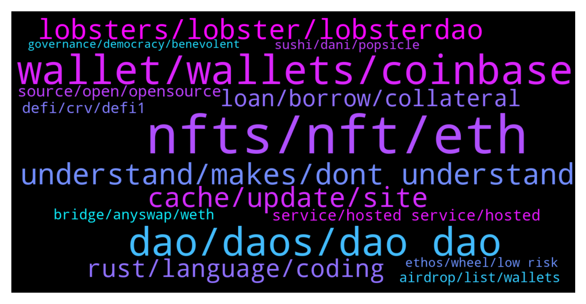

# **@lobsters_chat**
 ## Analysis for **2021-12-19** - **2021-12-26**.

---

## 📊 **Basic Stats**

**n_messages_sent**: 2126

---


---


## 🔝 **Top keywords and related messages**

1. **nfts, nft, eth**

    @andrecronje --- *Launching gaming NFT projects is a minefield though, been spending a lot of time talking to established gaming companies and vendors, and wow, do they hate us* **--->** [TG Discussion](https://t.me/lobsters_chat/308456)

    @sir_integra_hellsing --- *I think another experience I have had is many artists see these 10k pfp series as nothing more than doodles and some of these artists who has dabbled into NFT space with their own digital works have been shunned for the newest dog/ape combo pack. So that leads to a lot of the friction.* **--->** [TG Discussion](https://t.me/lobsters_chat/308514)

    @RobAnon --- *The prime offering of NFTs in vidya is microtransactions* **--->** [TG Discussion](https://t.me/lobsters_chat/308501)

    @michaelams --- *So you mean they waited on purpose with the NFTs to get extra ETH out? Sick* **--->** [TG Discussion](https://t.me/lobsters_chat/308919)

    @sir_integra_hellsing --- *I honestly think music will be the bridge that will help people understand how NFTs could be usefull. The community aspect of visual NFTs will always be at odds with more 'traditional' arts.* **--->** [TG Discussion](https://t.me/lobsters_chat/308521)

    @RobAnon --- *Yeah, I know it is. The advantages of NFTs are interoperability, but you'll never get AAA boards to get onboard with that, because they don't want you reselling your skins. They want you to buy more* **--->** [TG Discussion](https://t.me/lobsters_chat/308507)

2. **wallet, wallets, coinbase**

    @Dave2Diamond --- *mining is via MM only... I have an eligible account via a DAO, for gearbox mining, but since it's tied to a coinbase wallet, i can't connect it...therefore asking if any chance to substitute this coinbase wallet (eligible, but not due to MM) for a MM address that I have...* **--->** [TG Discussion](https://t.me/lobsters_chat/308271)

    @gonzogirl --- *connecting mining pool isn't silly. Just today we got request to find our miner whos wallet is at the risk* **--->** [TG Discussion](https://t.me/lobsters_chat/307480)

    @tufuntu --- *if we keep all in ledger, then all safe?* **--->** [TG Discussion](https://t.me/lobsters_chat/309114)

    @gonzogirl --- *Check what? Are they at risk or whom they belong to?* **--->** [TG Discussion](https://t.me/lobsters_chat/307467)

    @freshaspect --- *hey guys - we have a list of at risk wallets, like this one https://etherscan.io/address/0xdc87397165b4f0f6d586f1bf60fa37494a362a6a that we just need these folk to look at their etherscan pages... any smart ideas on how we could make this happen?* **--->** [TG Discussion](https://t.me/lobsters_chat/307465)

    @coine_r --- *Unless I'm missing something, you have to collect their wallets somehow, whether that's through a tg bot or a form or something else.* **--->** [TG Discussion](https://t.me/lobsters_chat/307840)

3. **dao, daos, dao dao**

    @andrecronje --- *Personally, I've changed my mind on this one, I no longer think DAO's in a broad spectrum can work, I think DAO's based on an incredibly niche goal work well, but then its a coordination tool at best, and should be dissolved after achieving said goal. Benevolent dictatorship is the way to go.* **--->** [TG Discussion](https://t.me/lobsters_chat/307282)

    @groot_telegram --- *DAO in a DAO ? tokens with restrictions of different voting rights ? Like different classes kinda Shares ?* **--->** [TG Discussion](https://t.me/lobsters_chat/307294)

    @eboado --- *I would recommend to take a look at the forum discussion about the topic, at least in my opinion pretty useful for people involved in DAOs https://governance.aave.com/t/aave-v3-launch-strategy-code-licensing/6316* **--->** [TG Discussion](https://t.me/lobsters_chat/307303)

    @DeadMeatHK --- *Eventually the DAO model will change from direct democracy to something that works. Meanwhile DAOs are infighting and stalled due to gov token apathy,   VCs and later money managers and funds will step in and take over and make stuff progress — albeit not in directions we'd necessarily like/want.* **--->** [TG Discussion](https://t.me/lobsters_chat/307228)

    @DeadMeatHK --- *I'd also suggest that if you have the misfortune of being familiar with MiFID II/MiFIR you'll see the challenges that face DAOs when it comes to being compliant with the regs.* **--->** [TG Discussion](https://t.me/lobsters_chat/307284)

    @ivangbi --- *Only after a DAO vote though ** **--->** [TG Discussion](https://t.me/lobsters_chat/309267)

4. **understand, makes, dont understand**

    @freshaspect --- *That doesn't matter in this instance.* **--->** [TG Discussion](https://t.me/lobsters_chat/307496)

    @PmRiviere --- *@TSxxxxxxxx please ennunciate an actual question, someone with knowledge might take it if worthy* **--->** [TG Discussion](https://t.me/lobsters_chat/307675)

    @PeterMm --- *Good question, which someone smarter then me will answer you* **--->** [TG Discussion](https://t.me/lobsters_chat/309155)

    @sir_integra_hellsing --- *Do they hate the idea or the fact that they are not the first movers?* **--->** [TG Discussion](https://t.me/lobsters_chat/308463)

    @Daemon_Hell --- *And when you have imagination - you start to imagine* **--->** [TG Discussion](https://t.me/lobsters_chat/307374)

    @gonzogirl --- *I may explain my thoughts. but don't think @ivangbi will let me do so* **--->** [TG Discussion](https://t.me/lobsters_chat/308018)

5. **lobsters, lobster, lobsterdao**

    @FiveBoroughs --- *Basically Lobsters is a community or real DeFi knowledgeable people that will actually test beta products and not just farm airdrop, and it turns out that is valuable to other projects* **--->** [TG Discussion](https://t.me/lobsters_chat/308455)

    @alejoamiras --- *Sup guys ! Lobster’s NFTs owners get once a again special treatment ! Open BETA to holders 🎉   We are a decentralized cost averaging protocol. Just pay for deposit and withdraw, even if you want to execute 100 swaps :)  https://twitter.com/mean_fi/status/1470427779854442502?s=21* **--->** [TG Discussion](https://t.me/lobsters_chat/307138)

    @goeth121 --- *How's the process look like to open an AMA with Lobster DAO? We have made a proposal here https://github.com/lobster-dao/overview/issues/50* **--->** [TG Discussion](https://t.me/lobsters_chat/309961)

    @Autismvisky --- *Gm lads I've surfing here for a while and remember a logo discussion over the past months but i was busy back then‚ and i would like to contribute with a branding design regarding the lobster logo and the lobster nft‚ if that subject still up i would like to get a few answers regarding the direction of the branding matter to start working on the task* **--->** [TG Discussion](https://t.me/lobsters_chat/307625)

    @Chris_hodl --- *It’s been a very tough month but proud to say Badger is back to fully operational for anyone that is interested. Nothing can kill a honey badger my lobster friends* **--->** [TG Discussion](https://t.me/lobsters_chat/309273)

    @danngng --- *hey frens new here, how is this chat different to the lobsterdaokingdom chat* **--->** [TG Discussion](https://t.me/lobsters_chat/308238)

6. **cache, update, site**

    @ivangbi --- *No need to repost, it’s linked around everywhere. Just caching issue, sorry for that. In a few hours the situation will resolve itself. Sorry for the dumb shit (f5 to fix) sers.* **--->** [TG Discussion](https://t.me/lobsters_chat/307771)

    @ivangbi --- *It does, just ur browser slow probably ser* **--->** [TG Discussion](https://t.me/lobsters_chat/307735)

    @isidorosp --- *fixed for me sir…  actually it loads, then it goes back to the “come back soon”* **--->** [TG Discussion](https://t.me/lobsters_chat/307788)

    @obaidoteth --- *@ivangbi you have to update the link's card* **--->** [TG Discussion](https://t.me/lobsters_chat/307758)

    @lavayeya --- *Also on chrome desktop, it trys to load then switches to come back message* **--->** [TG Discussion](https://t.me/lobsters_chat/307765)

    @FiveBoroughs --- *Try the usual restart browser, reboot computer, disable re-enable /update extension before* **--->** [TG Discussion](https://t.me/lobsters_chat/310019)

7. **rust, language, coding**

    @marcuszeto --- *Hi friends, I’ve decided to learn coding from scratch, any recommendations on which coding language I should start with first?* **--->** [TG Discussion](https://t.me/lobsters_chat/307997)

    @coine_r --- *Might as well learn C and Haskell just because* **--->** [TG Discussion](https://t.me/lobsters_chat/308029)

    @zhongfu --- *seems very peculiar to suggest that rust and go are the "top needed languages" to "actually build the web"* **--->** [TG Discussion](https://t.me/lobsters_chat/308017)

    @sir_integra_hellsing --- *Well backend doesn't mean you have to always code in Rust or Go.* **--->** [TG Discussion](https://t.me/lobsters_chat/308025)

    @michael_p3711 --- *afiak the Marlowe language on ADA is focused on stuff like this (but ada )* **--->** [TG Discussion](https://t.me/lobsters_chat/310410)

    @ncerovac --- *I think he really just wanted to talk about rust and rust is good. Was more jk about solana part but it would be fun, twitter would be on fire 😂* **--->** [TG Discussion](https://t.me/lobsters_chat/310398)

8. **loan, borrow, collateral**

    @lesterenzo --- *I know it's a general question - but what platforms (including centralized) provide liquidation free loans on crypto / or with liqudations, but close to 100% LTV? I know Alchemix provide 25% LTV, liqudation free loan on eth. Also Ruler, but Ruler doesn't seem to be working.* **--->** [TG Discussion](https://t.me/lobsters_chat/310331)

    @lesterenzo --- *Why won't someone just create a loan marketplace. Where people could choose lending/borrowing terms, like annual rate, liquidation levels (or no liquidation), what assets they want to lend/borrow, other variables, etc. This could eliminate a need in multitude of similar defi platforms, and will let people "negotiate" loan terms with each other.* **--->** [TG Discussion](https://t.me/lobsters_chat/310403)

    @k06aa --- *Lending protocol with smart contract based accounts, where borrowed asset automatically became part of your collateral. This allows you to borrow even more than you deposited. Example: deposit $1k worth of ETH, borrow $1k worth of ETH and $2k worth of USDC and then provide $4k as liquidity to Uniswap V2. You will have $4k collateral and $3k debt, so position is pretty healthy.* **--->** [TG Discussion](https://t.me/lobsters_chat/308128)

    @ChiTimesChi --- *I believe Myso is building something like Ruler used to have. You might want to check some other products offering options - as getting liquidation free loan is basically buying a call option.* **--->** [TG Discussion](https://t.me/lobsters_chat/310334)

    @satoshi_onamoto --- *You don’t pay to borrow, so it’s an interest free loan, it uses the yearn pool for underlying so yield apy is currently 4.26% on eth only thing is you borrow a maximum of 25% of your collateral amount in eth and you borrow in synthetic eth* **--->** [TG Discussion](https://t.me/lobsters_chat/310368)

    @ChiTimesChi --- *Abracadabra doesn't do this (to my knowledge), as your collateral is subject to liquidation there.* **--->** [TG Discussion](https://t.me/lobsters_chat/310335)

9. **source, open, opensource**

    @elie55 --- *Hey, want to get peoples thought on opensource. You have a split in crypto where half the tools are open and half are closed. Eg opensea could be opensource but isn’t. And uniswap is.  We’re considering open sourcing ourselves and would love to hear some of the pitfalls of taking that approach and giving away our “ip”* **--->** [TG Discussion](https://t.me/lobsters_chat/309210)

    @FiveBoroughs --- *Generally speaking opensource backends, close source UIs/frontends will satisfy most of the community and make you composable while protecting from low effort clones* **--->** [TG Discussion](https://t.me/lobsters_chat/309284)

    @elie55 --- *"You can and should likely be open-source, but can restrict non-anonymous forks (or at least try)." - any suggestions for a license like this to look at?* **--->** [TG Discussion](https://t.me/lobsters_chat/309229)

    @ivangbi --- *I can’t wait for fud on that point lol (or maybe the industry standards already accepted it actually). Anyway, licenses are not the same for every piece of the protocol (in general in most cases) because those modules built w the use of others’ code need to remain according to their initial standards. The license is “we can build together, integrate, but you can’t start your own protocol based off it” (ofc this does not help against anonymous forks, but non-anonymous - does a little bit)* **--->** [TG Discussion](https://t.me/lobsters_chat/309230)

    @bensams0 --- *if you stay closed source, the biggest way you retain value is by hoping nobody implements something better. if you go open source, your only way to retain value is bizdev/partnerships.  one of these things might be more sustainable than the other for your product* **--->** [TG Discussion](https://t.me/lobsters_chat/309219)

    @lefterisjp --- *oh I am with you. My entire being is in opensource as evidenced by the project I founded and work on. Just trying to not alienate people who may not agree with my view but who are also in our field* **--->** [TG Discussion](https://t.me/lobsters_chat/309315)

10. **service, hosted service, hosted**

    @syed_jafri --- *Not so simple, MIM<>UST have big collab for example* **--->** [TG Discussion](https://t.me/lobsters_chat/309803)

    @farm42 --- *Other services like www.ethtective.com be like:  «H…hhey we exist»* **--->** [TG Discussion](https://t.me/lobsters_chat/308180)

    @ncerovac --- *everything that I wanted! i just need glasses and I can 16h a day be always aware of markets. would be great if elon and neuralink can help with other 8h while i sleep, so basically I become the market* **--->** [TG Discussion](https://t.me/lobsters_chat/306872)

    @s0183 --- *What node providers do people here recommend? I tried both alchemy and infura and for a simple eth_call the latency is like 500ms-1s and for more complex stuff its multiple seconds. Is that normal?* **--->** [TG Discussion](https://t.me/lobsters_chat/306864)

    @fallingdi --- *Any body know if opensea.io would now definitely has no token, because if IPO they choose? Or there steel decent chances?* **--->** [TG Discussion](https://t.me/lobsters_chat/308384)

    @Alphamint --- *noob q: how does open sea know a token's uri if a contract is closed sourced, how can it call the getURI function? is it event based?* **--->** [TG Discussion](https://t.me/lobsters_chat/307349)

11. **defi, crv, defi1**

    @Henry_Elder --- *I see curve and the curve wars as all being part of DeFi 1.5. Protocol owned liquidity is the differentiator for DeFi 2.0, and I've only seen defi 2.0 dapps joining the curve wars within the last month* **--->** [TG Discussion](https://t.me/lobsters_chat/309366)

    @hendrikJ --- *ser DeFi 1.5 was a joke* **--->** [TG Discussion](https://t.me/lobsters_chat/309407)

    @muppetbalcony --- *I think that some of DEFI1 is already back/never left. There are some situations like CRV where i don't really consider token price reflective of the protocols strenght/performance given that actual MCAP is high as ever and CRV is going strong.* **--->** [TG Discussion](https://t.me/lobsters_chat/309483)

    @sneg55 --- *I don't think low risk investors even touched defi.* **--->** [TG Discussion](https://t.me/lobsters_chat/308970)

    @eth2enthusiast --- *Well you’re both stablecoins and not everyone thinks defi is a cooperative game and not 0 sum* **--->** [TG Discussion](https://t.me/lobsters_chat/309802)

    @loksaha --- *“I think that some of DEFI1 is already back/never left” Such as? (Note: I’m pointing towards token prices)* **--->** [TG Discussion](https://t.me/lobsters_chat/309485)

12. **bridge, anyswap, weth**

    @Cuter0x --- *Also, do You know what's the "bridge" section difference compared to the "router" one?* **--->** [TG Discussion](https://t.me/lobsters_chat/310613)

    @sneg55 --- *Hey, I wonder what's the business model in aggregating bridges?   You don't incentivize integrators who brings trading volume to you via SDK, right?* **--->** [TG Discussion](https://t.me/lobsters_chat/307180)

    @zhongfu --- *have you tried stable.anyswap.exchange instead, or their new site (I think) http://app.multichain.org* **--->** [TG Discussion](https://t.me/lobsters_chat/310611)

    @mogglet --- *Router is a bridge with innovate function, allow token bridges multi-directional.* **--->** [TG Discussion](https://t.me/lobsters_chat/310615)

    @CroPurger --- *Does anyone know a list of bridges compatible with Avax, that are not Bridge . avax . network?* **--->** [TG Discussion](https://t.me/lobsters_chat/308388)

    @lebed2045 --- *guys, what’s solutions do you know to tranfer 150k DAI from BSC to polygon? Seems anySwap doesn’t support this direction (apart of all other many risks they have), xpollinate.io doesn’t have enough liquidty for dai, debridge.finance isn’t on mainnet yet* **--->** [TG Discussion](https://t.me/lobsters_chat/310066)

13. **airdrop, list, wallets**

    @wosmongton --- *https://twitter.com/EvmosOrg/status/1471253595253321731  Never been more proud to get rekt. Anyone have better airdrop examples?* **--->** [TG Discussion](https://t.me/lobsters_chat/308349)

    @jrFFFFFF --- *``` Hey @everyone !  We've noticed an uptick in bots gaming the Polygon questing experience and we wanted to give out some transparency / reassurance.  Addressing the "elephant in the room" - many of you are hopeful that the questing experience will result in an airdrop. While I can't say we will or will not do one, I can say with 100% certainty that if we ever did an airdrop, any bots that game the system WILL NOT get any rewards. ``` zapper discord* **--->** [TG Discussion](https://t.me/lobsters_chat/307042)

    @admiralape --- *Onchain mints are wildly inefficient. They could've made most of it offchain and then make a claimable airdrop, but then the headlines and the spectacle wouldn't be so flashy.* **--->** [TG Discussion](https://t.me/lobsters_chat/308594)

    @freshaspect --- *We did think about this but we've done airdrops to their wallet and that snagged a few.* **--->** [TG Discussion](https://t.me/lobsters_chat/307493)

    @xmons --- *Astrodrop using merkle trees is the most gas efficient because recipient has to claim themselves* **--->** [TG Discussion](https://t.me/lobsters_chat/310228)

    @banteg --- *is there any project behind sos or is it just an airdrop?* **--->** [TG Discussion](https://t.me/lobsters_chat/310500)

14. **sushi, dani, popsicle**

    @zegdathetkan --- *Is anyone seeing the fact that if dani sets sushi up for something like uni v3 pools, than popsicle would get more use cases. considering how multichain sushi already is, this would achieve the goal of multi-chain optimized farming on popsicle.   Can we expect something like this? Univ3 pools cannot be forked yet right?* **--->** [TG Discussion](https://t.me/lobsters_chat/307414)

    @eth2enthusiast --- *Smsp 0 is basically Dani of abra becoming the owner of sushi under the guise of “visionary /strategist”. If I were him I’d try to get the biggest sushi holders on board such as past contributors and amass a large amount of sushi tokens to vote myself in. Of the 200k votes on it, 162k is a single account. I think we’re seeing a semi hostile takeover in progress* **--->** [TG Discussion](https://t.me/lobsters_chat/309789)

    @samkazemian --- *Ya, we’re gonna have to entirely pull out of sushi across all chains if this passes :/ it’s a shame because we used sushi a lot in our multi chain deployments* **--->** [TG Discussion](https://t.me/lobsters_chat/309796)

    @StrategicReserve --- *I just don't understand  a) how are they planning on managing sushi's LP when they yank stables 10 days after they appear? Do they really not have a stables strategy? b) no announcement of this move, but happy to announce more TVL c) no indication of where the funds went and for what purpose, or who made the call to remove them* **--->** [TG Discussion](https://t.me/lobsters_chat/307413)

    @SpikeSpiege1 --- *I'm saying SUSHI took everything private. That was the issue* **--->** [TG Discussion](https://t.me/lobsters_chat/307176)

    @zegdathetkan --- *Yes, i noticed that. And abracadabra already uses bentoboxes. Sushi glues dani’s platforms together* **--->** [TG Discussion](https://t.me/lobsters_chat/307423)

15. **ethos, wheel, low risk**

    @Figu3 --- *Yeah, I agree with the current conclusions. Still think crossing a line after a year of experimentation is too quick. The goal of crypto is to scale trust by replacing it with algorithmic control, right ? So if we can't scale governance this way, what good is the tech ?* **--->** [TG Discussion](https://t.me/lobsters_chat/307287)

    @Swader --- *Solid video of Shapiro being bullish on crypto and particularly DeFi: https://www.youtube.com/watch?v=sUFsV8V2-5w* **--->** [TG Discussion](https://t.me/lobsters_chat/309489)

    @LilMoonLamboX3 --- *crypto has a goldfish brain bro* **--->** [TG Discussion](https://t.me/lobsters_chat/309892)

    @fct_cristiano --- *Hey everyone. Exploring ways to get better crypto regulations in the US. Assembling a group of interested founders. DM if interested.* **--->** [TG Discussion](https://t.me/lobsters_chat/309713)

    @lefterisjp --- *The "Crypto ethos" is a bit of a too loaded phrase. Whose ethos? Who is crypto? etc.* **--->** [TG Discussion](https://t.me/lobsters_chat/309304)

    @alphago --- *has anyone come across articles/links that layout the blockchain ecosystem … fundamentals from a technical standpoint (i.e., walk-through of the layers)?  resources for experienced non-crypto tech/product guys to review to get up-to-speed on the crypto side of things  something more up-to-date than nakamoto.com   appreciate any suggestions 🙏* **--->** [TG Discussion](https://t.me/lobsters_chat/308998)

