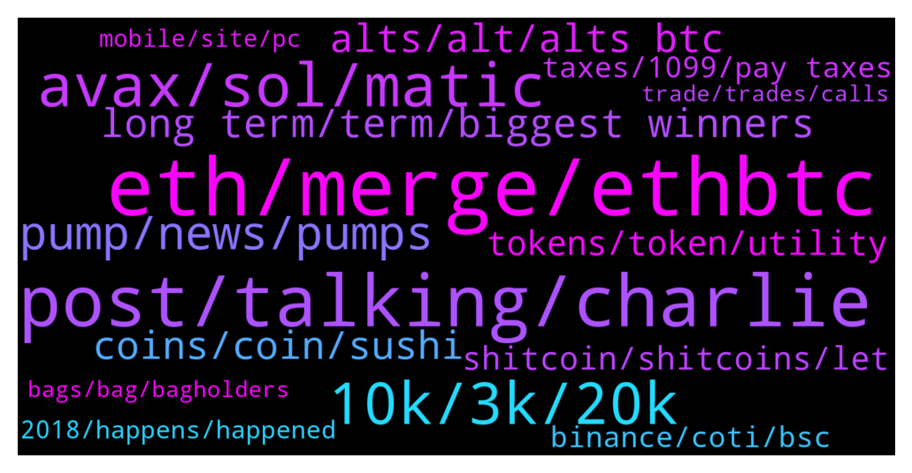

# **@shitpool**
 ## Analysis for **2021-12-19** - **2021-12-26**.

---

## 📊 **Basic Stats**

**n_messages_sent**: 1979

---

---

## 🔝 **Top keywords and related messages**

1. **eth, merge, ethbtc**

    @<UNK> --- *Usually the weakest. ETH has been one of the stronger ones* **--->** [TG Discussion](https://t.me/shitpool/707436)

    @yesbutalsono --- *just found 10 eth in a cold wallet* **--->** [TG Discussion](https://t.me/shitpool/707936)

    @onchainjoe --- *Can be used as a collateral on ETH network* **--->** [TG Discussion](https://t.me/shitpool/708614)

    @ziconet --- *https://www.tradingview.com/x/9XrTOguW/ last chance for cheap eth* **--->** [TG Discussion](https://t.me/shitpool/708367)

    @ziconet --- *nothign has changed we are still going to 0.15 ethbtc minimum.* **--->** [TG Discussion](https://t.me/shitpool/708652)

    @AsianFever --- *oh yeah, right, i think King Nick helped me with this trick a while ago, on eth* **--->** [TG Discussion](https://t.me/shitpool/706956)

2. **post, talking, charlie**

    @kekurikekukaka --- *Sorry guys, I just can't stop myself.* **--->** [TG Discussion](https://t.me/shitpool/709946)

    @CharliePolite --- *Dude, just please shut the fuck up.* **--->** [TG Discussion](https://t.me/shitpool/709665)

    @goldencatpat --- *How much do you hate yourself, honestly* **--->** [TG Discussion](https://t.me/shitpool/710326)

    @EmotionLotion --- *Jeez why they make gifs so ugly* **--->** [TG Discussion](https://t.me/shitpool/709424)

    @R0mster --- *It honestly doesn’t sound like shit.* **--->** [TG Discussion](https://t.me/shitpool/710788)

    @wojackdegreate --- *We all learned the hard lessons here 😂* **--->** [TG Discussion](https://t.me/shitpool/709379)

3. **avax, sol, matic**

    @wonderwarraior --- *AVAX and SOL are doing great, how can it be over?* **--->** [TG Discussion](https://t.me/shitpool/709438)

    @sumtemm --- *avax ecosystem shitcoins doin pretty well too yea* **--->** [TG Discussion](https://t.me/shitpool/709684)

    @yesbutalsono --- *wish they would open up the time avax lp and wavax bonds already* **--->** [TG Discussion](https://t.me/shitpool/709042)

    @BeAMightyKing --- *I'd only feel comfortable for now with largecaps showing strength, like AVAX, MATIC, LUNA, and FTM (maybe), until Bitcoin breaks out of this current range in either direction:  https://www.tradingview.com/x/7VCdB00F/* **--->** [TG Discussion](https://t.me/shitpool/709895)

    @Jc --- *i was gona throw the whole stack in avax at 80 bucks but pussied out, feels bad bra* **--->** [TG Discussion](https://t.me/shitpool/710816)

    @AsianFever --- *AVAX ath vs btc, what a chad* **--->** [TG Discussion](https://t.me/shitpool/710812)

4. **10k, 3k, 20k**

    @yesbutalsono --- *Damn someone got $400k in sos* **--->** [TG Discussion](https://t.me/shitpool/711624)

    @pizza_dog --- *I’m starting to see what they’re talking about with the downward pressure on price though. Almost back to 3 billion market cap and well below the 8k price it was at when it was at the 3 billion mktcap last* **--->** [TG Discussion](https://t.me/shitpool/711325)

    @wojackdegreate --- *Yea 38k maybe, who knows. I'm not gonna ape in right away.* **--->** [TG Discussion](https://t.me/shitpool/709109)

    @BlockChainUp --- *This would mimic 1932, that the lows was in, not in 1929* **--->** [TG Discussion](https://t.me/shitpool/707463)

    @BlockChainUp --- *I was watching... futures went to 3k* **--->** [TG Discussion](https://t.me/shitpool/707148)

    @AsianFever --- *and 1k sats in sight, perfect end of the cycle for renny* **--->** [TG Discussion](https://t.me/shitpool/707284)

5. **pump, news, pumps**

    @illbatik --- *Geez Coti. What caused the pump today?* **--->** [TG Discussion](https://t.me/shitpool/711154)

    @onchainjoe --- *yeah let's buy the news driven pump* **--->** [TG Discussion](https://t.me/shitpool/709302)

    @monkey993 --- *I have a hard time believing that it will be off to the races again so soon after that giga pump* **--->** [TG Discussion](https://t.me/shitpool/709869)

    @Antonioalcantara --- *ens, movr, dydx will have a good pump when the accumulation ends* **--->** [TG Discussion](https://t.me/shitpool/710759)

    @ziconet --- *ADA will never have another violent market cycle pump* **--->** [TG Discussion](https://t.me/shitpool/708736)

    @Horselorde --- *Assuming we even get pumps in 2022* **--->** [TG Discussion](https://t.me/shitpool/710028)

6. **long term, term, biggest winners**

    @nuckingfutzzzz --- *its the missing link between the social aspect of crypto. i think its gonna by hype hot shit next year.* **--->** [TG Discussion](https://t.me/shitpool/710720)

    @Gregoranus --- *Why not do both, raise while roadmap, that’s the crypto way, pump on news.* **--->** [TG Discussion](https://t.me/shitpool/710236)

    @MasterOfCoin90 --- *Crypto is becoming less decentralized and more manipulate in time span. Is like bigger fish gets the most and if they are not happy and want more, they also eat the small fishes too.  The crypto game is simple, you will never be a whale when there are pre-made whales since the beginning* **--->** [TG Discussion](https://t.me/shitpool/709703)

    @wonderwarraior --- *I thought you guys would be more optimistic about crypto* **--->** [TG Discussion](https://t.me/shitpool/709479)

    @grammi --- *Be real. Crypto isn’t saving poor people and any suggestion otherwise is a false narrative designed to simply pump bags* **--->** [TG Discussion](https://t.me/shitpool/708629)

    @kekurikekukaka --- *In fact, crypto has created more scammers than ever before in any industry.* **--->** [TG Discussion](https://t.me/shitpool/708633)

7. **alts, alt, alts btc**

    @<UNK> --- *this time bitcoin go 0, all the money goes into alts* **--->** [TG Discussion](https://t.me/shitpool/709349)

    @<UNK> --- *at some point alts stop having big pumps and become peercoin, feathercoin, EOS* **--->** [TG Discussion](https://t.me/shitpool/708725)

    @kekurikekukaka --- *Actually, ETH flippenning BTC will trigger an imminent super bull run for alts.* **--->** [TG Discussion](https://t.me/shitpool/708664)

    @THEGANGSTEROFLOVE --- *the amount of people balls deep into shit alts or illiquid jpegs and with zero hedges* **--->** [TG Discussion](https://t.me/shitpool/709128)

    @BeAMightyKing --- *a good chunk of majors & midcap alts are moving as leveraged BTC plays, which is usually when I sit on the sidelines* **--->** [TG Discussion](https://t.me/shitpool/709112)

    @BeAMightyKing --- *I wouldn't feel comfy shorting any alts while BTC shows strength here* **--->** [TG Discussion](https://t.me/shitpool/711199)

8. **coins, coin, sushi**

    @AsianFever --- *https://www.youtube.com/watch?v=He_-ETdTRXg&ab_channel=Polkadot sure is a party when every DOT coin is mega rekt* **--->** [TG Discussion](https://t.me/shitpool/710446)

    @pizza_dog --- *Fun read, pervy. Especially that part about putting 15k across every dog coin and turning it into multiple millions* **--->** [TG Discussion](https://t.me/shitpool/711785)

    @wojackdegreate --- *Annoying people, that'll get them to buy your coin* **--->** [TG Discussion](https://t.me/shitpool/708869)

    @BeAMightyKing --- *apparently there are still 2017 coins on there with almost 4 year downtrends  https://www.tradingview.com/x/eZLXxBCS/* **--->** [TG Discussion](https://t.me/shitpool/709893)

    @dogemaxxii --- *why are coins going down ?* **--->** [TG Discussion](https://t.me/shitpool/710357)

    @sumtemm --- *Ngl boomer coin is lookin stronk* **--->** [TG Discussion](https://t.me/shitpool/707827)

9. **tokens, token, utility**

    @wojackdegreate --- *If the token is any good you wouldn't have to do that for marketing* **--->** [TG Discussion](https://t.me/shitpool/708849)

    @BlockChainUp --- *What do you call the utility tokens that elites are accumulating?* **--->** [TG Discussion](https://t.me/shitpool/707420)

    @R0mster --- *I’m just happy it’s not a zombie Inu Shib token.* **--->** [TG Discussion](https://t.me/shitpool/710795)

    @BeAMightyKing --- *this and all valueless governance tokens need the obvious: trading fee dividends. Anything short is meaningless* **--->** [TG Discussion](https://t.me/shitpool/707021)

    @Daniel --- *utility tokens?  you mean like LINK and BLZ* **--->** [TG Discussion](https://t.me/shitpool/707505)

    @alpenair --- *Doesn't matter which entity holds it* **--->** [TG Discussion](https://t.me/shitpool/707574)

10. **shitcoin, shitcoins, let**

    @CharliePolite --- *Shitcoins showing some strength vs btc being limp dicked* **--->** [TG Discussion](https://t.me/shitpool/709878)

    @Lomokopo --- *Hmm just a question in a shitcoin telegram🤣* **--->** [TG Discussion](https://t.me/shitpool/707091)

    @Mario --- *So what shitcoins you buying atm* **--->** [TG Discussion](https://t.me/shitpool/710650)

    @iamslow --- *stick to shitcoins we can all still make tendies together* **--->** [TG Discussion](https://t.me/shitpool/711071)

    @gonubie --- *yea keep it shitcoins in here* **--->** [TG Discussion](https://t.me/shitpool/711060)

    @BlockChainUp --- *Someone is tired of shitcoins.... let it burn* **--->** [TG Discussion](https://t.me/shitpool/707241)

11. **taxes, 1099, pay taxes**

    @MoneroPal --- *lol taxes on when not selling to fiat on a CEX? ser…* **--->** [TG Discussion](https://t.me/shitpool/710985)

    @wojackdegreate --- *If ur in us and did more than 700 trades you can get the tts trader deductions* **--->** [TG Discussion](https://t.me/shitpool/707969)

    @MoneroPal --- *Has nothing to do with feeling better. It has to do with the absolute retardation of reporting defi transactions to the IRS. There is absolutely no purpose whatsoever to doing so. If you’re converting crypto (asset) to fiat (USD) you will be presented wth a 1099-misc from whichever CEX. You owe taxes then.* **--->** [TG Discussion](https://t.me/shitpool/711018)

    @MoneroPal --- *Doesn’t matter what they are, what matters is enforcement, for which there is currently ZERO. The IRS is chronically underfunded and has so far not gone after any on-chain transactions. They’ve been doing the same old, go after under reporters that were issued 1099’s and did not pay their taxes. I doubt this will change in the near future, likely another 3-5 years minimum.* **--->** [TG Discussion](https://t.me/shitpool/711024)

    @MoneroPal --- *Coinbase does not report, unless it is sold into fiat and you’re issued a 1099-misc if you’re an Americuck. No reason to use Coinbase for anything except on and off ramping.* **--->** [TG Discussion](https://t.me/shitpool/710994)

    @yesbutalsono --- *eh i dont wanna pay taxes on that yet* **--->** [TG Discussion](https://t.me/shitpool/710984)

12. **binance, coti, bsc**

    @BlockChainUp --- *🚨 🚨 🚨  10,269 #ETH (38,542,765 USD) transferred from unknown wallet to #Binance Details* **--->** [TG Discussion](https://t.me/shitpool/707257)

    @trollkotze --- *hello. can anyone here using binance explain to me what this here means, while generating transation history: What is "hide transfer record"? What is transfer record? Why would I want to hide it? It is checked by default. I generated one with and one without the checkbox checked for different periods. Don't know what might be missing in one of them now.* **--->** [TG Discussion](https://t.me/shitpool/708152)

    @NotTheGodfather --- *Rbn going to list on binance* **--->** [TG Discussion](https://t.me/shitpool/711250)

    @BeAMightyKing --- *I'm looking across Binance alts for the 1st time in a long time... good Lord* **--->** [TG Discussion](https://t.me/shitpool/709884)

    @onchainjoe --- *BINANCE SINGAPORE WITHDRAWS ITS APPLICATION FOR A LOCAL CRYPTOCURRENCY BOURSE. (FJ)* **--->** [TG Discussion](https://t.me/shitpool/707006)

    @IndianTonic --- *Remember that phonecall from your bank asking for debit card number and cvv , came from india .* **--->** [TG Discussion](https://t.me/shitpool/711148)

13. **2018, happens, happened**

    @Michealbuble1 --- *im actually on the team we have big things coming too im excited for what the future holds 👍👌* **--->** [TG Discussion](https://t.me/shitpool/711259)

    @yesbutalsono --- *Yee, will be interesting to see how it all plays out* **--->** [TG Discussion](https://t.me/shitpool/710192)

    @pizza_dog --- *At least it’ll all be over.* **--->** [TG Discussion](https://t.me/shitpool/710681)

    @wojackdegreate --- *Not right now, but eventually it will* **--->** [TG Discussion](https://t.me/shitpool/709347)

    @wanker007 --- *So I'm sure that will go well* **--->** [TG Discussion](https://t.me/shitpool/710608)

    @sumtemm --- *Hasnt happened so itll never happen* **--->** [TG Discussion](https://t.me/shitpool/709614)

14. **mobile, site, pc**

    @Horselorde --- *Finally worked for me, not eligible lol* **--->** [TG Discussion](https://t.me/shitpool/711703)

    @nomadi_c --- *Metamask mobile? Is it actually good? So many bad reviews* **--->** [TG Discussion](https://t.me/shitpool/706957)

    @ThxBeToWA --- *Anyone that gets stuff like this, try changing your DNS on your device to google 8.8.8.8 or cloudflare 1.1.1.1, or turning off wifi on mobile to force it to use mobile network instead of wifi* **--->** [TG Discussion](https://t.me/shitpool/711769)

    @sumtemm --- *will try next yr. ty for info* **--->** [TG Discussion](https://t.me/shitpool/707996)

    @Horselorde --- *opendao site still down for me* **--->** [TG Discussion](https://t.me/shitpool/711677)

    @sumtemm --- *Site might just be overloaded rn. When i first checked it said i didnt qualify but i checked again few hours later and was able to claim* **--->** [TG Discussion](https://t.me/shitpool/711676)

15. **bags, bag, bagholders**

    @gonubie --- *I bought a bag a couple of months ago after seeing an interview with Do Kwon, guy seemed really smart and I based the acquisition on that.* **--->** [TG Discussion](https://t.me/shitpool/709840)

    @onchainjoe --- *these eth bags must feel heavy af lmao* **--->** [TG Discussion](https://t.me/shitpool/710302)

    @nuckingfutzzzz --- *Lol some things never change like Dan fudding his own bags 🤣* **--->** [TG Discussion](https://t.me/shitpool/711176)

    @wojackdegreate --- *You are talking yourself into holding 100x+ bags lol* **--->** [TG Discussion](https://t.me/shitpool/709525)

    @BeAMightyKing --- *Too many bagholders. It already went up a bajillion X* **--->** [TG Discussion](https://t.me/shitpool/711441)

    @monkey993 --- *Wish I didn't reduce my bag by so much* **--->** [TG Discussion](https://t.me/shitpool/711263)

