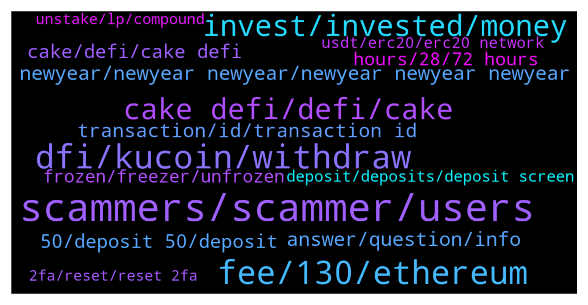

# **@CakeDeFi_EN**
 ## Analysis for **2021-12-26** - **2022-01-02**.

---

## 📊 **Basic Stats**

**n_messages_sent**: 1093

---

---

## 🔝 **Top keywords and related messages**

1. **scammers, scammer, users**

    @enalettin --- *Anyone dm you and offer help is dangerous one hundred percent a thief make no mistake* **--->** [TG Discussion](https://t.me/CakeDeFi_EN/156753)

    @DmgBautista --- *Be carefull, asking such questions here will get you flooded by scammers DM you. Do not answer to any DM or call, even if it looks a mod. No mod will ever DM you and is also against the rule to any other user to DM you. Refer your communications only to this official chat and take care!* **--->** [TG Discussion](https://t.me/CakeDeFi_EN/158620)

    @Cosmic88 --- *many scammers messaged me as well* **--->** [TG Discussion](https://t.me/CakeDeFi_EN/156910)

    @BerndMack --- *after this message you will be contacted by scammers. take care!* **--->** [TG Discussion](https://t.me/CakeDeFi_EN/157190)

    @Thomas --- *Got dmed by a scammer named Lisa* **--->** [TG Discussion](https://t.me/CakeDeFi_EN/157251)

    @Eugene --- *Had a good time answering the scammers though haha* **--->** [TG Discussion](https://t.me/CakeDeFi_EN/156897)

2. **dfi, kucoin, withdraw**

    @D --- *I've tried kucoin but I could not deposit dfi* **--->** [TG Discussion](https://t.me/CakeDeFi_EN/155262)

    @sgabade --- *I deposited dfi from kucoin i didn't pay that, when did that 130 started* **--->** [TG Discussion](https://t.me/CakeDeFi_EN/158874)

    @kirkburni --- *Hi. What option should I choose to withdraw to kucoin? Defi Network? Eth network? Please* **--->** [TG Discussion](https://t.me/CakeDeFi_EN/156962)

    @James --- *I've only withdrew once to kucoin. IS bittrex an easier option?* **--->** [TG Discussion](https://t.me/CakeDeFi_EN/155348)

    @Kassius84 --- *You need to withdraw your DFI via Ethereum Network as ERC20 Token. You need to define the DFI AS Custom token in your MM. Here you will find the needed contract adress and some further informations. But be aware of the high Ethereum gas fees 👍  https://blog.cakedefi.com/another-sweet-transfer-option-erc-20-version-of-the-dfi-coin/* **--->** [TG Discussion](https://t.me/CakeDeFi_EN/158544)

    @JonD26 --- *Thanks. So the way to withdraw BTC would be to swap to DFI and send to Kucoin?* **--->** [TG Discussion](https://t.me/CakeDeFi_EN/158011)

3. **fee, 130, ethereum**

    @falconheavy --- *is there a $130 address creation fees for USDT?* **--->** [TG Discussion](https://t.me/CakeDeFi_EN/157665)

    @Kassius84 --- *There is a one time deposit fee for Ethereum. It's caused by the high fees for creating a smart contract address in the Ethereum Network. Further deposits based on the Ethereum Network are free of charge on Cake side 😃* **--->** [TG Discussion](https://t.me/CakeDeFi_EN/157937)

    @Michael_Schredl --- *Yes, that is a one time fee* **--->** [TG Discussion](https://t.me/CakeDeFi_EN/157666)

    @falconheavy --- *damn! so I can't swap doge to usdt! But I don't understand how does creating a address cost you money? I created addresses all the time in everywhere and never cost me money except xrp* **--->** [TG Discussion](https://t.me/CakeDeFi_EN/157672)

    @007 --- *Has anyone ever had problems with minor fees here? They take 50% of your original deposit in some cases. This charge is from Ethereum for using their net work to mine. Wow* **--->** [TG Discussion](https://t.me/CakeDeFi_EN/157933)

    @falconheavy --- *ok boss!! your house your rules. No worries but I am not in a position to pay $130 for a address creation. I just sent eth to one of my other wallet and paid only $40 i think in gas fees so how come it is static at $130. I request this to be dynamic so that it can be more affordable atleast at time.* **--->** [TG Discussion](https://t.me/CakeDeFi_EN/157679)

4. **invest, invested, money**

    @007 --- *But not with the Ethereum each investment is a different contract* **--->** [TG Discussion](https://t.me/CakeDeFi_EN/157940)

    @Itsnasysoomro --- *Mean I invested 1000 dolllars then they will make daily profit from apr* **--->** [TG Discussion](https://t.me/CakeDeFi_EN/155114)

    @aldair_henriquez --- *how does this platform work before i invest* **--->** [TG Discussion](https://t.me/CakeDeFi_EN/157798)

    @Diana --- *The market will continue to mark red, and it will bottom out after a while, get ready to buy in bulk! ! ! ! 🚀🚀🚀🚀🚀* **--->** [TG Discussion](https://t.me/CakeDeFi_EN/155343)

    @moneydelics --- *It'll keep going down in December and starting to go up again in January according to Raoul Pal 🤷‍♂️* **--->** [TG Discussion](https://t.me/CakeDeFi_EN/155346)

    @Michael_Schredl --- *Depends on the amount of money you invest* **--->** [TG Discussion](https://t.me/CakeDeFi_EN/158051)

5. **cake defi, defi, cake**

    @Bettie10no --- *Hello, please can someone help introduce me to cake Defi. Am just new to it* **--->** [TG Discussion](https://t.me/CakeDeFi_EN/155044)

    @kasimkwok --- *Why cannot dind cake defi in cmc* **--->** [TG Discussion](https://t.me/CakeDeFi_EN/156158)

    @ThereIsGoodAlways --- *Aww okay, so only in the cake defi app.* **--->** [TG Discussion](https://t.me/CakeDeFi_EN/155911)

    @moneydelics --- *If you like video content, I create YouTube video review and tutorial about Cake DeFi and I have a playlist about it:  What is Cake DeFi?  https://www.youtube.com/playlist?list=PLleJzcLaifSqFHO-2QihxEh26Mwq5TAag* **--->** [TG Discussion](https://t.me/CakeDeFi_EN/155050)

    @Michael_Schredl --- *That has nothing to do with Cake DeFi - check out Cake DeFi :) https://www.cakedefi.com/* **--->** [TG Discussion](https://t.me/CakeDeFi_EN/158144)

    @JonD26 --- *Do you think Cake-defi is actual defi?* **--->** [TG Discussion](https://t.me/CakeDeFi_EN/155402)

6. **newyear, newyear newyear, newyear newyear newyear**

    @Businesspunk1 --- *@fabioandreatta thank u very much and have a merry christmas 🙂* **--->** [TG Discussion](https://t.me/CakeDeFi_EN/156540)

    @moonman73 --- *Vacation?😳 at this time.what am I doing wrong...* **--->** [TG Discussion](https://t.me/CakeDeFi_EN/155933)

    @A --- *I totally understand. Thank you for the response. And have a happy holiday!* **--->** [TG Discussion](https://t.me/CakeDeFi_EN/156573)

    @enalettin --- *Daniel merry Christmas to you and to all members 😀* **--->** [TG Discussion](https://t.me/CakeDeFi_EN/156760)

    @Kassius84 --- *Merry Christmas to you too and good returns with the LM freezer 😀* **--->** [TG Discussion](https://t.me/CakeDeFi_EN/155433)

    @Lydbank --- *Merry Christmas to you all 🙏🙏* **--->** [TG Discussion](https://t.me/CakeDeFi_EN/156546)

7. **answer, question, info**

    @Kassius84 --- *Maybe this will help you 👍 https://blog.cakedefi.com/decentralized-assets/* **--->** [TG Discussion](https://t.me/CakeDeFi_EN/155631)

    @iamout2 --- *https://blog.cakedefi.com/decentralized-assets/  Found this don’t know if can help you* **--->** [TG Discussion](https://t.me/CakeDeFi_EN/155366)

    @ABIOLA SYLVESTER --- *Thank you but I am always asked a question which does not seems to not have a right answer but I appreciate this* **--->** [TG Discussion](https://t.me/CakeDeFi_EN/158555)

    @mikkelseg --- *Alright... I will google to get more* **--->** [TG Discussion](https://t.me/CakeDeFi_EN/156936)

    @frank0308 --- *great, thank you. Where can I find this info?* **--->** [TG Discussion](https://t.me/CakeDeFi_EN/158428)

    @Kassius84 --- *Which details are you looking for?* **--->** [TG Discussion](https://t.me/CakeDeFi_EN/155477)

8. **transaction, id, transaction id**

    @Kassius84 --- *Can you check the transaction id on defiscan.live?* **--->** [TG Discussion](https://t.me/CakeDeFi_EN/156243)

    @Frank --- *Hi all, question about withdrawal from cake to light wallet. - Cake display “withdrawal completed” However I can’t find the transaction id on Defi scan, nor see the withdrawal in the light wallet.  Is this normal and it just takes some time, even so the withdrawal is completed on cake side?  Thank you* **--->** [TG Discussion](https://t.me/CakeDeFi_EN/156247)

    @Arne --- *Weird. Got the withdrawal transaction ID from Cake about two hours ago but still didn’t arrive in the wallet.* **--->** [TG Discussion](https://t.me/CakeDeFi_EN/155573)

    @jollyboat --- *Same happened with me too. Waiting for Three hours and it shows completed in cake but transaction id not in defiscan* **--->** [TG Discussion](https://t.me/CakeDeFi_EN/156204)

    @mikkelseg --- *I have made a deposit for to my btc on cake defi account but it is still pending for over 5 hours* **--->** [TG Discussion](https://t.me/CakeDeFi_EN/156602)

    @Kassius84 --- *The transaction status on Cake DeFi is "complete"? Did you got an transaction id and can you find them defiscan.live? If not, you should contact Support.* **--->** [TG Discussion](https://t.me/CakeDeFi_EN/156226)

9. **cake, defi, cake defi**

    @moneydelics --- *Hey, Bakers! I made a quick and easy tutorial for beginners on how to calculate and plan Cake DeFi earnings using the calculator on Cake home page 💸  https://m.youtube.com/watch?v=DnH176R8aKc&feature=youtu.be* **--->** [TG Discussion](https://t.me/CakeDeFi_EN/155038)

    @BerndMack --- *you can not buy cake here, it is a company. If you mean DFI, that's a separate blockchain with a Coin, you can buy them through bittrex, latoken, hotbit, bitrue or kucoin* **--->** [TG Discussion](https://t.me/CakeDeFi_EN/155912)

    @Carl --- *Hi , can I send btc from my cake defi wallet to any wallet ?* **--->** [TG Discussion](https://t.me/CakeDeFi_EN/156183)

    @Radioaxtive --- *Hi everyone Can I ask how cake DeFi is able to provide such high yields on BTC?* **--->** [TG Discussion](https://t.me/CakeDeFi_EN/157449)

    @YyeapY --- *if withdraw frm cake to other platform for fiat without go through defi wallet....is that acceptable?* **--->** [TG Discussion](https://t.me/CakeDeFi_EN/156854)

    @riserspec24 --- *For anyone who are new here. You can watch this video on how to reinvest and compound your earnings in Cake Defi.   https://youtu.be/dVsrAeZOUXM* **--->** [TG Discussion](https://t.me/CakeDeFi_EN/155618)

10. **50, deposit 50, deposit**

    @Michael_Schredl --- *Sign up and deposit at least 50 USD* **--->** [TG Discussion](https://t.me/CakeDeFi_EN/157697)

    @andreasisaak --- *$30 if you deposit at least 50$* **--->** [TG Discussion](https://t.me/CakeDeFi_EN/157866)

    @Michael_Schredl --- *Did you already deposit 50 USD?* **--->** [TG Discussion](https://t.me/CakeDeFi_EN/157821)

    @B1cY2 --- *hi theres a promo when i deposit 30$* **--->** [TG Discussion](https://t.me/CakeDeFi_EN/157422)

    @Levent --- *Is 30 dollars for spot transactions?* **--->** [TG Discussion](https://t.me/CakeDeFi_EN/157873)

    @İsa --- *How much will I earn if I deposit 50 usd?* **--->** [TG Discussion](https://t.me/CakeDeFi_EN/158053)

11. **hours, 28, 72 hours**

    @Michael_Schredl --- *It can take up to 3 business days* **--->** [TG Discussion](https://t.me/CakeDeFi_EN/156572)

    @Rogue --- *The how much time will it take ?* **--->** [TG Discussion](https://t.me/CakeDeFi_EN/158341)

    @Michael_Schredl --- *https://t.me/CakeDeFi_EN_announcements/344 It can take up to 72 hours* **--->** [TG Discussion](https://t.me/CakeDeFi_EN/157559)

    @Michael_Schredl --- *It can take up to 72 hours* **--->** [TG Discussion](https://t.me/CakeDeFi_EN/155080)

    @Thomas --- *You can check in the blockexplorer of Ltc, how fast the last blocks were created, so you have an estimated time* **--->** [TG Discussion](https://t.me/CakeDeFi_EN/158345)

    @James --- *Like 20 min give or take* **--->** [TG Discussion](https://t.me/CakeDeFi_EN/158342)

12. **frozen, freezer, unfrozen**

    @Samet_Aslan --- *no money showing in frozen wallet* **--->** [TG Discussion](https://t.me/CakeDeFi_EN/158091)

    @zxcvz3 --- *how do i get my coins out of freeze? Coins awarded in January 2021, 6 months have passed, but I don't know how to shoot, freeze appears* **--->** [TG Discussion](https://t.me/CakeDeFi_EN/157273)

    @justintew --- *Hello! I have a question, my assets were recently unfrozen after the frozen duration, is there a way to see the details for that?* **--->** [TG Discussion](https://t.me/CakeDeFi_EN/155470)

    @Arno --- *Question about freezing  How can I check if I auto-compound or not?* **--->** [TG Discussion](https://t.me/CakeDeFi_EN/156104)

    @emirch4n --- *Hello, the $5 reward I received was automatically frozen.  It was taken out of the freezer today.  However, I still cannot use my reward.  It still appears to be frozen.  Can you help me?* **--->** [TG Discussion](https://t.me/CakeDeFi_EN/156127)

    @Michael_Schredl --- *Take a look at the freezer page, there it shows you how long they will be frozen* **--->** [TG Discussion](https://t.me/CakeDeFi_EN/157274)

13. **deposit, deposits, deposit screen**

    @ABIOLA SYLVESTER --- *I have made multiple deposits afterwards it cleared before only for me to keep seeing it again and it’s frustrating already if I am to be honest . I am sure I sent more that that because it cleared when I made my second deposit but now it keeps coming back and keeps going up* **--->** [TG Discussion](https://t.me/CakeDeFi_EN/155930)

    @Thomas --- *Check your wallet if you have any dfi already, they should be in the freezer. Since you verified your account and enabled the deposit. It should be there already or in the next few hours* **--->** [TG Discussion](https://t.me/CakeDeFi_EN/158089)

    @George --- *is the deposit of DOGE currently not working?* **--->** [TG Discussion](https://t.me/CakeDeFi_EN/155068)

    @mm_phoenix --- *have a look under your wallet https://app.cakedefi.com/wallets  "Deposits and withdrawals" here you see your Deposits and the status* **--->** [TG Discussion](https://t.me/CakeDeFi_EN/158374)

    @savingsmantra4u_support --- *I deposited Dfi but its not showing on my app block transaction shows succesfull* **--->** [TG Discussion](https://t.me/CakeDeFi_EN/155994)

    @RdxCrypto --- *And when it will be received after deposit? Instant or time period?* **--->** [TG Discussion](https://t.me/CakeDeFi_EN/158005)

14. **usdt, erc20, erc20 network**

    @Michael_Schredl --- *You can only send USDT via the ERC20 network* **--->** [TG Discussion](https://t.me/CakeDeFi_EN/157579)

    @Diana🌹 --- *I didn't use the erc20 network to trade ETH today and lost my coins* **--->** [TG Discussion](https://t.me/CakeDeFi_EN/155868)

    @zforelle --- *I have the option to convert it before transfer . But it also gives the option to transfer token. I guess I can test these with small transactions 🙌* **--->** [TG Discussion](https://t.me/CakeDeFi_EN/155425)

    @Teo L. T. --- *Any exchange that can send USDT using DeFi Network instead of Ether? Address creation fee USD130 for Ether is too expensive.* **--->** [TG Discussion](https://t.me/CakeDeFi_EN/156224)

    @Kassius84 --- *No unfortunately not. You have to use the Ethereum Network for USDT. You could only use DeFiChain DEX to send USDT via DeFiChain Network.* **--->** [TG Discussion](https://t.me/CakeDeFi_EN/156225)

    @falconheavy --- *hey guys, I have USDT on BSC chain, is it possible to bring that to my Defi account and then convert 50% in to DFI and do the LP or i have to bring both separately from Kucoin or a exchange?* **--->** [TG Discussion](https://t.me/CakeDeFi_EN/157571)

15. **2fa, reset, reset 2fa**

    @mtvblackdad --- *I don’t have access to my 2FA* **--->** [TG Discussion](https://t.me/CakeDeFi_EN/154965)

    @kokdokuzyuzaltmisbir --- *oh yes i forgot. I entered my 2FA code wrong 10 times. locked.* **--->** [TG Discussion](https://t.me/CakeDeFi_EN/157189)

    @Michael_Schredl --- *The support can reset your 2FA at any time. Or can use an app like Authy and create a backup* **--->** [TG Discussion](https://t.me/CakeDeFi_EN/155664)

    @KlRlKOK --- *2fa resetlemek için gerekli belgeler nelerdir?* **--->** [TG Discussion](https://t.me/CakeDeFi_EN/157941)

    @Hdnro --- *How do I reset my 2FA? Does anybody know?* **--->** [TG Discussion](https://t.me/CakeDeFi_EN/156944)

    @Michael_Schredl --- *!2fa Please try again with the support then* **--->** [TG Discussion](https://t.me/CakeDeFi_EN/156313)

