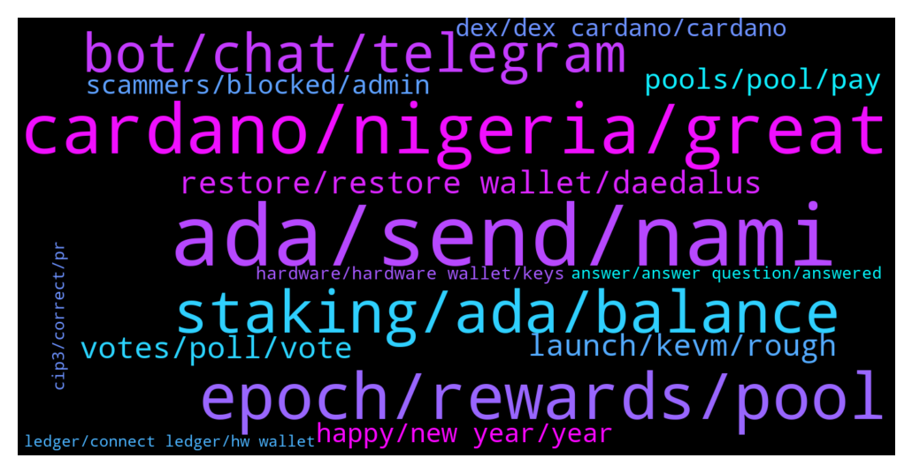

# **@Cardano**
 ## Analysis for **2021-12-26** - **2022-01-02**.

---

## 📊 **Basic Stats**

**n_messages_sent**: 527

---

---

## 🔝 **Top keywords and related messages**

1. **ada, send, nami**

    @Fowsi88 --- *i want to add ADA contract to my NAMI wallet* **--->** [TG Discussion](https://t.me/Cardano/761443)

    @sul4x --- *Is there a calculator which shows how much ADA you would get by delegating to a specific validator?* **--->** [TG Discussion](https://t.me/Cardano/764769)

    @sul4x --- *I delegated to it but I think I got fairly few ADA.* **--->** [TG Discussion](https://t.me/Cardano/764779)

    @Ongo_Gablogian69 --- *Does anyone use Nami Wallet? I’m trying to send my ADA to a different wallet but Nami wallet says I have no assets, whilst at the same time showing my balance* **--->** [TG Discussion](https://t.me/Cardano/761962)

    @Crypto_minister --- *Nami is a web wallet? I found a nami exchange on play store* **--->** [TG Discussion](https://t.me/Cardano/763751)

    @Antho --- *Hey I buy my first Ada <3 I’m joining the fam* **--->** [TG Discussion](https://t.me/Cardano/763874)

2. **cardano, nigeria, great**

    @thomas --- *[Forwarded from Cardano Announcements] Hey all! Want to help get more adoption and grow #Cardano? 👀  Please take a moment to vote and potentially get Ada added to bitpay app! ✨  Thanks for all the support! 💪  https://twitter.com/bitpay/status/1458977852230180868?s=21  Direct link to poll: https://gleam.io/1a0mE/bitpay-coin-poll (FYI: You can vote every day!😉)  Would you rather request a feature via the website and ask them for Cardano support? Please visit here and let your voices be heard: https://bitpay.canny.io/feature-request?sort=top* **--->** [TG Discussion](https://t.me/Cardano/763791)

    @ExInfernis --- *Can someone explain please how exactly are used the altcoins of the cardano ecosystem for example. Because I see a lot ot projects developed using cardano ecosystem, but they have their own coins/tokens. So, in this case are they continue to use ada for blockchain operations or they are using only their new tokens. And what is the need to have different token when some new system is created on the cardano blockchain. Not sure that I formulated clearly my question 😉* **--->** [TG Discussion](https://t.me/Cardano/760941)

    @atc1235 --- *Guys what do you think about people that says Cardano isn't good because it doesn't attract "institutional investors"? Is this that important? Why? Or why not?* **--->** [TG Discussion](https://t.me/Cardano/761055)

    @georgelovegrove --- *Final video before the new year on Cardano Contributors League -https://www.youtube.com/watch?v=_wo8yXrX9oM  Discusses how funding contributors directly that have a simple objective to maximise impact could help core parts of the ecosystem like Project Catalyst thrive in 2022.  Have a great new year everyone 😄🎉* **--->** [TG Discussion](https://t.me/Cardano/764177)

    @mensrea --- *For real? As architect of Cardano's main implementation it's a bit weird to not hear anything from the guy at all, even by proxy, especially in this time when we're talking about scaling limitations* **--->** [TG Discussion](https://t.me/Cardano/764788)

    @ThomNk --- *Hello. Cardano community. I was just wondering if Cardano can, could or will be used for a Metaverse Project?* **--->** [TG Discussion](https://t.me/Cardano/761712)

3. **epoch, rewards, pool**

    @apex_pool_spo --- *yes, because rewards for Epoch 311 will be payed when Epoch 313 starts.* **--->** [TG Discussion](https://t.me/Cardano/764403)

    @apex_pool_spo --- *if you delegated during Epoch 309, you start earning rewards from the Epoch 311.* **--->** [TG Discussion](https://t.me/Cardano/764405)

    @aKnTN --- *Why it takes 3 epochs to start earning rewards ?* **--->** [TG Discussion](https://t.me/Cardano/761170)

    @Lgbeano --- *Your wallet is staked, not the ₳ inside, so you can use your ₳ whenever you want.   Simply select a pool to delegate to, which registers your wallets staking key.   When staking, your ₳ is never locked up, it's pretty much like not delegating, you are free to do what you want with your ₳. Any ₳ added to the wallet is auto staked, including your rewards. Your ₳ never leaves your wallet.   When you initially delegate to a pool it costs a transaction fee which is 0.17 ₳ and takes 2 ₳ as a deposit. That 2 ₳ you get back (minus the transaction fee) if you ever un delegate.   When delegating to a pool it takes 15 - 20 days for you to start seeing rewards, then it's every 5 days. Epochs are 5 days.   The reason it takes 15 - 20 days to get your first reward is because the first epoch doesn't count, it doesn't matter where you delegate within that epoch (5 days). Once the epoch finishes, snapshots are taken of ₳ within pools.   - 1st epoch, your ₳ is not included   - 2nd epoch your ₳ is ready to be included  - 3rd epoch your ₳ is included and earning rewards.   - End of 4th epoch you receive rewards for 3rd epoch.   When you receive rewards they are an epoch behind.  If you remove all your ₳ but keep your wallet delegated (do not de register), you will continue receiving rewards for three epochs before the rewards drop to match the ₳ in your wallet.   Same as if you add more ₳, it will take 3 epochs before you notice a difference in rewards.   If you want to move pools, you do not need to un delegate first, just select the pool you want to move to. You will continue to receive rewards from your old pool for three epochs (as long as it creates blocks) before you start receiving rewards from your new pool.   Your ₳ is never at risk, nor does it leave the wallet, you can not lose any ₳. If the pool you delegate to is shut down or doesn't get any blocks for what ever reason, the worst that happens is you wont receive any rewards. But you never lose your ₳.   This video is really good at explaining what staking is  https://youtu.be/Cs_stEnEvpg* **--->** [TG Discussion](https://t.me/Cardano/764564)

    @dmitry_stas --- *you'll get rewards if you staked 2 epochs before pool makes a block. the rewards will be distributed to you 2 epochs after pool makes the block* **--->** [TG Discussion](https://t.me/Cardano/763681)

    @rdalio321 --- *Ok I see, and then E311 rewards are not paid until E313 so have to wait 2 more epochs to see them...think I got it* **--->** [TG Discussion](https://t.me/Cardano/764408)

4. **staking, ada, balance**

    @Angel --- *If I have a wallet already delegating to a stake pool  and I have another wallet with y amount of ada sitting there without being stake and I send the funds from that wallet to the wallet that my ada is being stake  Would my transfered ada be automatically staking? If so, how long would it take to see this increment in staking rewards?* **--->** [TG Discussion](https://t.me/Cardano/760959)

    @Rabbitholepools --- *Ok, it might be worth pointing Antho to one such non-branded staking guide then. Could you please help with that?* **--->** [TG Discussion](https://t.me/Cardano/764015)

    @Stevo1010 --- *Hi. Just a quick one regarding staking ADA in yoroi. I've been doing this for a while using one of the staking pools and getting ADA in return.  Recently I changed my stake pool onto a Genius Yield Pool inorder to receive free  GENS tokens.   I've noticed I'm still getting free ADA. Not that this is a bad thing but I'm curious....does this mean I get both ADA and GENS or has it not worked properly? It definitely shows that I'm delegating to a new 'genius yield' pool.  Thanks* **--->** [TG Discussion](https://t.me/Cardano/762500)

    @glitch04 --- *They offer returns based on their own system not the networks native option. Is that a good platform? Sure for many that find it useful but they have different functions. Staking on the network is done with out releasing control of your wallet balance or having lock periods, where as with a platform like Nexo or Celsius you release custody of your assets to them in exchange for interest paid out while they loan your balance (assets) out.* **--->** [TG Discussion](https://t.me/Cardano/764079)

    @ExInfernis --- *I see some rewards (which are part of my total amount of ada in the wallet) with option withdraw, but in daedalus there is no such thing. Do I need to click Withdraw on them or it is ok not to touch this* **--->** [TG Discussion](https://t.me/Cardano/761296)

    @Snowden29 --- *Hallo, is Nexo trusted for staking ur cardano?* **--->** [TG Discussion](https://t.me/Cardano/764076)

5. **bot, chat, telegram**

    @apex_pool_spo --- *I tried to write its name, but the message was deleted by the bot.* **--->** [TG Discussion](https://t.me/Cardano/764754)

    @glitch04 --- *Could've not been posted as some are off on holiday, that doesn't mean it's not important.* **--->** [TG Discussion](https://t.me/Cardano/760761)

    @Sephire420 --- *@joseph_bohm (Joseph Böhm)  Thx for the quick support!* **--->** [TG Discussion](https://t.me/Cardano/764156)

    @glitch04 --- *what is your twitter id? I will forward the information* **--->** [TG Discussion](https://t.me/Cardano/764154)

    @dominatingSlash --- *@RickMcCracken just confirming you have done your due diligence on the dripdropz team? I haven't had a chance to yet* **--->** [TG Discussion](https://t.me/Cardano/763594)

    @glitch04 --- *Not everyone has access to the announcement channels* **--->** [TG Discussion](https://t.me/Cardano/760762)

6. **restore, restore wallet, daedalus**

    @RVarel --- *Hi George, nope its not like that I tried your method but its not restoring my wallet on yoroi* **--->** [TG Discussion](https://t.me/Cardano/763604)

    @Giovanni --- *I have a question about wallets in general but in particular Yoroi. What would happen if Chrome no longer exists in 10 years? How will I retrieve my wallet? Ok, it's absurd that it happens, but what if it happens?* **--->** [TG Discussion](https://t.me/Cardano/764509)

    @apex_pool_spo --- *if you are using the same recovery words and select the "restore" option, it will work.* **--->** [TG Discussion](https://t.me/Cardano/763605)

    @TJSP2024 --- *Ok thanks. And once restored in yoroi, the wallet will still be accessible in both daedalus and yoroi right? I want to restore the wallet in yoroi extension , switch some pools and then delete it after . Ive always used daedalus , i like its security and interface, i just wish it could load like 1000x faster* **--->** [TG Discussion](https://t.me/Cardano/761560)

    @apex_pool_spo --- *if it down not work, you should create a new wallet and transfer all your funds to the new wallet.* **--->** [TG Discussion](https://t.me/Cardano/763625)

    @RVarel --- *I just verified my recovery phrase and its correct inthat Daedalus wallet* **--->** [TG Discussion](https://t.me/Cardano/763623)

7. **votes, poll, vote**

    @ExInfernis --- *47 hours left. I have voted 37 times. If just everyone here votes at least once until the end we can take the lead.* **--->** [TG Discussion](https://t.me/Cardano/763502)

    @jaypatelEarthling --- *I think votes have reduced probably due to Charle's dissatisfaction with their listing Shibainu* **--->** [TG Discussion](https://t.me/Cardano/760775)

    @ExInfernis --- *I think we can do better. Just a reminder to help with the voting 😉* **--->** [TG Discussion](https://t.me/Cardano/760773)

    @ChrisSTR8 --- *Final 24 hours in this poll, currently Tron is leading by a small margin, every vote counts* **--->** [TG Discussion](https://t.me/Cardano/763859)

    @ExInfernis --- *tron is leading with around 26000 votes. So if half of the group here votes at least once we will be with similar percents* **--->** [TG Discussion](https://t.me/Cardano/760781)

    @thomas --- *Not bad I am not far away I have voted 36 times* **--->** [TG Discussion](https://t.me/Cardano/763509)

8. **launch, kevm, rough**

    @glitch04 --- *As stated previously above there has not been a date given, so there is no rough estimate to give you either. I have forwarded the question unfortunately that's the best I can do.* **--->** [TG Discussion](https://t.me/Cardano/760784)

    @Muneeb1988 --- *Watched the video but there are some dapps being released this month I know about meld that will launch 31 Jan* **--->** [TG Discussion](https://t.me/Cardano/764541)

    @cryptojack6317 --- *any update on the defi? last I heard its coming sooner than expected* **--->** [TG Discussion](https://t.me/Cardano/764436)

    @Iluvgermany --- *Please dear admins at least tell us a rough date when KEVM on mainnet launches (e. g. Q1/Q2 2022).* **--->** [TG Discussion](https://t.me/Cardano/760782)

    @Greg --- *I also know about vyfi going live in about two weeks maybe sooner.* **--->** [TG Discussion](https://t.me/Cardano/764542)

    @Iluvgermany --- *Any updates regarding a rough launch date (e. g. Q1/Q2 2022) of KEVM to mainnet today? Thank you in advance.* **--->** [TG Discussion](https://t.me/Cardano/761445)

9. **pools, pool, pay**

    @Snowden29 --- *Thanks i see, i dont need select pool project in nexo.. ive been send my Ada in yoroi into nexo, cause  nexo can earn up to 8% in one mounth.. whats better if you Investor?* **--->** [TG Discussion](https://t.me/Cardano/764093)

    @glitch04 --- *While that is a nice guide this will be the one and only time we ask that you not use it as you advertise the pool within the guide* **--->** [TG Discussion](https://t.me/Cardano/764001)

    @... --- *I already switched pools you see* **--->** [TG Discussion](https://t.me/Cardano/762091)

    @Rabbitholepools --- *Try to avoid oversaturated pools. ATM there is a pretty strong debate in favour of small pools, as a means to further decentralize the network. Another argument is posed against entities running multiple pools (often unsuturated pools).   You can use adapools.org and pooltool.io to have a look at current metrics.  Also consider pools in the Cardano Single Pool Alliance, all devoted to decentralization of the network.  If you need further info on pool choice ping us here.   Happy staking 👍* **--->** [TG Discussion](https://t.me/Cardano/764745)

    @sniemeyer --- *In general every pool pays around 5%. Depends on pool metrics and saturation. A big pool could pay out more than a little. But the most big pools take a fee.  Bigger pools pay more regular because they get more regular blocks. Small pools may pay out a long time nothing and then a bigger amount* **--->** [TG Discussion](https://t.me/Cardano/763452)

    @glitch04 --- *Right they don't have pools they offer lending products* **--->** [TG Discussion](https://t.me/Cardano/764095)

10. **scammers, blocked, admin**

    @dmitry_stas --- *and you definitely shouldn't claim your rewards or validate your wallet on any sites :) I'm pretty sure scammers DMs to you right now, so be careful...* **--->** [TG Discussion](https://t.me/Cardano/761314)

    @Sephire420 --- *Hey guys, greetings from Germany  I just found out I am blocked by @CardanoStiftung (Cardano Foundation) on Twitter, don’t have any Idea why, didn’t ever do anything bad like spaming or trolling on Twitter.  Anyone in here experienced smth similar? Is there a way to get unblocked?* **--->** [TG Discussion](https://t.me/Cardano/764151)

    @RickMcCracken --- *Yes. I have meetings with them once a week. Thanks for asking 🙏* **--->** [TG Discussion](https://t.me/Cardano/763595)

    @Zyroxa --- *Sure but dont react to any incoming DMs.* **--->** [TG Discussion](https://t.me/Cardano/763872)

    @glitch04 --- *Also if anyone dm's you acting as support block and report them as they are scammers.* **--->** [TG Discussion](https://t.me/Cardano/763396)

    @glitch04 --- *Also be aware anyone that sends direct private messages acting as support or admins are not to be trusted, most are scammers and should be reported & blocked.  No support will dm you directly first on any of the official channels.* **--->** [TG Discussion](https://t.me/Cardano/762505)

11. **happy, new year, year**

    @Dontlookatmeairlines --- *wen pab? wen cip's? happy new year!* **--->** [TG Discussion](https://t.me/Cardano/764635)

    @final6j --- *Happy new year to all!!!  2022🚀🚀🚀🪙🪙🪙* **--->** [TG Discussion](https://t.me/Cardano/764357)

    @Yudroid --- *good morning everyone! wish everyone a happy new year!! that Santa is filling our Crypto bag nicely!🥳😎🍋🎄🍾🍸💶💵* **--->** [TG Discussion](https://t.me/Cardano/764113)

    @matt_artano --- *Merry Christmas to the best community in the world! 🥰* **--->** [TG Discussion](https://t.me/Cardano/762286)

    @Headelf --- *Happy holidays to all. Christmas Eve morning here EST. May you all receive what you wish for!* **--->** [TG Discussion](https://t.me/Cardano/762063)

    @Vo Huu --- *Hi everyone, happy new year 🎆* **--->** [TG Discussion](https://t.me/Cardano/764656)

12. **dex, dex cardano, cardano**

    @ExInfernis --- *What is the difference between three dex that are on cardano exosystem. I dont want to name them, because maybe this reply will be deleted. And I was asking because I really dont have so much deep knowledge about crypto. I wanted to know how to choose which of the three to use for example* **--->** [TG Discussion](https://t.me/Cardano/760642)

    @Juanlot --- *You must think about what you intend to do on the dex, see if they serve your needs, and if you have liquidity* **--->** [TG Discussion](https://t.me/Cardano/760645)

    @fr3dyui --- *i invested the project via Bluezilla, just wondering why it takes so long that the DEX still not online, is it a scam….* **--->** [TG Discussion](https://t.me/Cardano/761361)

    @ExInfernis --- *Yes, but is the purpose of all dex on one ecosystem the same or they can have different functionality. If you have 10 dex on the ecosystem how to decide which is the best 😉* **--->** [TG Discussion](https://t.me/Cardano/760648)

    @apex_pool_spo --- *there is no DEX yet on Cardano allowing you to swap against a stable coin* **--->** [TG Discussion](https://t.me/Cardano/764740)

    @tumpalin --- *Are we expecting maybe a surprise dex launch with today’s end of year cardano report? 😂* **--->** [TG Discussion](https://t.me/Cardano/763803)

13. **hardware, hardware wallet, keys**

    @StammeRama --- *Does a hardware wallet basically store your encrypted seed phrase? I am ashamed to say I am still not 100% on how it works. Also, it would surely protect from things like keyloggers, right? Since nothing has to be manually typed to complete a transaction or access a wallet, presumably.* **--->** [TG Discussion](https://t.me/Cardano/760972)

    @apex_pool_spo --- *you use a 24 words seed phrase to generate the keys. the keys are stored in the wallet, never leaving it. to do transactions, you connect the hardware wallet to the wallet (Daedalus, Yoroi, ccvault.io, typhonwallet.io, nami or whatever you want to use) and you will have to confirm the transactions with the hardware wallet. you will never type the recovery seed on a computer. the hardware wallet also has a pin to lock it.* **--->** [TG Discussion](https://t.me/Cardano/760975)

    @haevaristo --- *a keylogger by itself wont do much .. but if someone managed to install a keylogger on your machine, chances are .. they are able to do more than just that .. in which case it doesnt matter much having a hardware wallet* **--->** [TG Discussion](https://t.me/Cardano/760977)

    @apex_pool_spo --- *security is provided by the hardware wallet.* **--->** [TG Discussion](https://t.me/Cardano/764425)

    @apex_pool_spo --- *you can have all the keyloggers, it won't help the hackers. you have to confirm the transaction by pressing the buttons on the hardware wallet, and you see on its screen what and where you transfer.* **--->** [TG Discussion](https://t.me/Cardano/760980)

    @haevaristo --- *my guess is that it has a 2 part password ... your hardware wallet has a part of the password, while your seed is your other part* **--->** [TG Discussion](https://t.me/Cardano/760974)

14. **answer, answer question, answered**

    @apex_pool_spo --- *ok, so I see you don't trust my answers...  I already answered you. https://t.me/Cardano/763523  Rick can only confirm what I answered you.* **--->** [TG Discussion](https://t.me/Cardano/763601)

    @glitch04 --- *I don't know the answer or I would tell you* **--->** [TG Discussion](https://t.me/Cardano/760768)

    @Dmsy2 --- *Atleast u can give me a hint* **--->** [TG Discussion](https://t.me/Cardano/760771)

    @Dmsy2 --- *Did you get any answer bro?* **--->** [TG Discussion](https://t.me/Cardano/761157)

    @Rowdy1219 --- *Ok perfect. Thank you. You don’t know how long it’s taken me to get an answer to that question lol* **--->** [TG Discussion](https://t.me/Cardano/763682)

    @Anasheku_CryptoBuzz --- *someone should help me answer this question before I made mistake* **--->** [TG Discussion](https://t.me/Cardano/763120)

15. **cip3, correct, pr**

    @ObiWanDani --- *Hey the links to CIP3 and CIP11 on https://cips.cardano.org/cips/cip1852/ are not working/correct. Is the website updated or where is this maintained? If needed I can open a PR to correct it.* **--->** [TG Discussion](https://t.me/Cardano/762309)

    @Chillig. --- *and the old addresses are still supported?* **--->** [TG Discussion](https://t.me/Cardano/762912)

    @pool0AAAA --- *Hi! Seems it is here: https://github.com/cardano-foundation/CIPs/blob/master/CIP-1852/README.md  It doesn't work because link are like this "[CIP3](../CIP-0003)", so probably it should be change as "[CIP3](https://github.com/cardano-foundation/CIPs/tree/master/CIP-0003)", so full link should be there and then it should work. Probably you can make PR, if not let me know and I will create one.* **--->** [TG Discussion](https://t.me/Cardano/762322)

    @JohnGoldberg --- *The Catalyst registration and voting guide Official - IOHK Support link is broken. https://cardanocataly.st/en/voters/“https://iohk.zendesk.com/hc/en-us/articles/900005679386-Catalyst-registration-and-voting-guide” Is there an updated guide somewhere to find?* **--->** [TG Discussion](https://t.me/Cardano/762563)

    @glitch04 --- *From their site it says only browsers* **--->** [TG Discussion](https://t.me/Cardano/763745)

    @icantremember --- *It has been working for years now* **--->** [TG Discussion](https://t.me/Cardano/762670)

