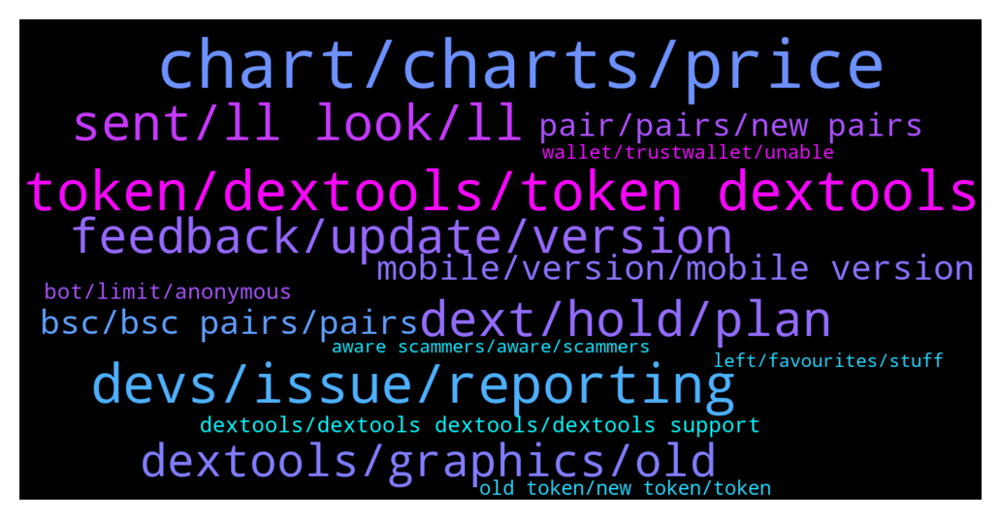

# **@DEXToolsCommunity**
 ## Analysis for **2021-12-26** - **2022-01-02**.

---

## 📊 **Basic Stats**

**n_messages_sent**: 1592

---

---

## 🔝 **Top keywords and related messages**

1. **chart, charts, price**

    @Flashbang665 --- *Hi, is there any issues with charts now?, the history of this chart is gone: https://www.dextools.io/app/bsc/pair-explorer/0x486697ae24469cb1122f537924aa46e705b142aa* **--->** [TG Discussion](https://t.me/DEXToolsCommunity/316191)

    @napascual --- *Nothing to fix there. A candle normalization has already been done, those candles just cannot be avoided. That's just blockchain data. You can still stretch the candles to display the chart dates you're interested in.* **--->** [TG Discussion](https://t.me/DEXToolsCommunity/320928)

    @Mojomagick --- *Please can you fix or tell me what the issue is:  The chart for AVT a few times wicks have been removed after a few days. This has happened on several different occassions for a few weeks.  For example yesterday  Price went to $1.82 But today that price was removed from the chart. Even though 2 transactions at that price are still on the transaction log under the chart.  https://www.dextools.io/app/ether/pair-explorer/0xcdff6ddfc9e4807c9927fd58708c2ef3484cc305  @napascual* **--->** [TG Discussion](https://t.me/DEXToolsCommunity/321028)

    @Reza --- *Please look at the full chart... There is a big red candle that occurred prior to launching. It's inaccurate and misleading. Please take appropriate action, as this can be detrimental.* **--->** [TG Discussion](https://t.me/DEXToolsCommunity/321044)

    @wealthyhobo --- *If you zoom out of the chart you will see a massive red candle way before that current chart. The first green candle you see is the actual day the project was launched* **--->** [TG Discussion](https://t.me/DEXToolsCommunity/320931)

    @Dom1234 --- *i mean if you fix the chart to when we officially launched, this will be resolved* **--->** [TG Discussion](https://t.me/DEXToolsCommunity/321071)

2. **token, dextools, token dextools**

    @moondriver1 --- *Hey! what do I need to list my token on DexTools?* **--->** [TG Discussion](https://t.me/DEXToolsCommunity/315836)

    @haoranhong --- *Hey! what do I need to list my token on DexTools?* **--->** [TG Discussion](https://t.me/DEXToolsCommunity/315851)

    @<UNK> --- *How can i treda my token on dextools?* **--->** [TG Discussion](https://t.me/DEXToolsCommunity/316960)

    @gumbercules --- *DeXTools doesn't list tokens but I will forward to @napascual* **--->** [TG Discussion](https://t.me/DEXToolsCommunity/321030)

    @wwsalpha --- *Hi, how can i list my token in Dextools, and is it possible to list if its still in presale mode?* **--->** [TG Discussion](https://t.me/DEXToolsCommunity/318909)

    @stanes --- *Your token is on Dextools and tradable so what is your issue sir?* **--->** [TG Discussion](https://t.me/DEXToolsCommunity/316986)

3. **devs, issue, reporting**

    @gumbercules --- *Not going to say it again sir. Devs have answered you* **--->** [TG Discussion](https://t.me/DEXToolsCommunity/321100)

    @stanes --- *The issue has been forwarded to the devs. They will check and fix it asap.   Thanks for reporting 🙏* **--->** [TG Discussion](https://t.me/DEXToolsCommunity/316823)

    @stanes --- *The issue has been forwarded to the devs. They will check and fix it asap.  Thanks for reporting 🙏* **--->** [TG Discussion](https://t.me/DEXToolsCommunity/320779)

    @FredericDEXT --- *We can fix that thanks for reporting* **--->** [TG Discussion](https://t.me/DEXToolsCommunity/318650)

    @FredericDEXT --- *All feedback is noted , we will deliver fixes for all reported issues in the next days.* **--->** [TG Discussion](https://t.me/DEXToolsCommunity/319630)

    @napascual --- *Hey, we've fixed that yesterday already, added several checks and security. It won't happen again* **--->** [TG Discussion](https://t.me/DEXToolsCommunity/319566)

4. **sent, ll look, ll**

    @FredericDEXT --- *Dm me the link and I'll check* **--->** [TG Discussion](https://t.me/DEXToolsCommunity/319621)

    @moondriver1 --- *thanks 👌🏼yep already someone DM me first 😳* **--->** [TG Discussion](https://t.me/DEXToolsCommunity/315841)

    @lex_44 --- *Hey nive profile pic.. Rob zombie* **--->** [TG Discussion](https://t.me/DEXToolsCommunity/315773)

    @napascual --- *Dm me the trx I'll take a look* **--->** [TG Discussion](https://t.me/DEXToolsCommunity/319256)

    @genialcronyTAMC6 --- *Thanks can I DM you now?* **--->** [TG Discussion](https://t.me/DEXToolsCommunity/319688)

    @ContentsMayVary --- *Are you comfortable with me pming you or do you wanna share the tx here so I can also investigate* **--->** [TG Discussion](https://t.me/DEXToolsCommunity/316416)

5. **dext, hold, plan**

    @stanes --- *I mean, you have to be a standard member. So yes, standard sub or by holding 1k DEXT.* **--->** [TG Discussion](https://t.me/DEXToolsCommunity/320502)

    @rpoole69 --- *Thanks, do I just need to hold 1000 DEXT in my wallet to have a subscription or do I need to do what the user account page states "Transfer 224 DEXT from your current account to the following account" ? Because the main website says one thing, user configuration in the dAPP says another* **--->** [TG Discussion](https://t.me/DEXToolsCommunity/316547)

    @FredericDEXT --- *Yes, hold 1000 dext and that's all* **--->** [TG Discussion](https://t.me/DEXToolsCommunity/318094)

    @napascual --- *Your could send more and the remaining will be linked to your account, but the DEXT need is calculated at the moment in renewing it (DEXT price at that moment)* **--->** [TG Discussion](https://t.me/DEXToolsCommunity/317360)

    @stanes --- *We have one reserved for people holding at least 1k DEXT https://dextools.medium.com/dext-force-is-now-open-a6dc966966b5  For support, only TG.* **--->** [TG Discussion](https://t.me/DEXToolsCommunity/316928)

    @scottcrypto11 --- *hi guys have we received our monthly allocation in numbers yet it is overdue now* **--->** [TG Discussion](https://t.me/DEXToolsCommunity/316715)

6. **feedback, update, version**

    @stanes --- *Every feedback will be considered. This version is only few hours old so we need to adapt and see in the coming days/weeks what we should modify.* **--->** [TG Discussion](https://t.me/DEXToolsCommunity/317726)

    @stanes --- *No. But team is currently working on improving the new version with all the feedbacks received.* **--->** [TG Discussion](https://t.me/DEXToolsCommunity/318794)

    @chupapimunyenyo60 --- *What is this latest update about?* **--->** [TG Discussion](https://t.me/DEXToolsCommunity/319242)

    @Dr456789 --- *Hey I know you guys in support didn't make a decision to push a new update during the holiday while your likely low staff, but pass on to the bosses -Not cool. Also bring back being able too see my favorites and trades in the same view. On mobile for reference.* **--->** [TG Discussion](https://t.me/DEXToolsCommunity/317314)

    @FredericDEXT --- *It will be included in next version* **--->** [TG Discussion](https://t.me/DEXToolsCommunity/318086)

    @GarrettGG --- *Give it a chance guys.  It’s a nice update.  No need to get upset about an update.* **--->** [TG Discussion](https://t.me/DEXToolsCommunity/318166)

7. **dextools, graphics, old**

    @FredericDEXT --- *This is the first step to make a more complete and modern UI, but many things are still in progress, and the community feedback is the best way to improve and the guide we always followed at dextools since the beginning.* **--->** [TG Discussion](https://t.me/DEXToolsCommunity/317317)

    @Chris --- *Any way to revert to the old DexTools?* **--->** [TG Discussion](https://t.me/DEXToolsCommunity/317101)

    @Monolithof --- *I'll have to agree with this user. Im a fan of dextools, dont get me wrong. But the UI before the current one was better* **--->** [TG Discussion](https://t.me/DEXToolsCommunity/318839)

    @Sloth34 --- *saying "design is fine" lol, that's every user's individual opinion, a lot of people would like to be able to just revert back to the normal "old" dextools, you should make it so people can switch to that in 1 button, just some advice* **--->** [TG Discussion](https://t.me/DEXToolsCommunity/318814)

    @GromitW --- *Hello, I really don’t like at all the new graphics of dextools. The old graphics were PERFECT and original, and had all the informations I needed. These graphics are lame, please consider to return to old graphics or at least give us the ability to choose between new and old graphics…* **--->** [TG Discussion](https://t.me/DEXToolsCommunity/318666)

    @FredericDEXT --- *Happy New Year to all DEXTools community. 🎊🎉* **--->** [TG Discussion](https://t.me/DEXToolsCommunity/320683)

8. **mobile, version, mobile version**

    @hmk18990 --- *it's not a downloadable app. it's a web app. https://www.dextools.io/app/ether/pair-explorer/0xa29fe6ef9592b5d408cca961d0fb9b1faf497d6d* **--->** [TG Discussion](https://t.me/DEXToolsCommunity/319308)

    @Kian_hashemi --- *Almost everyone who trades on BSC and Pancake uses a mobile phone because it is fast because of the volume and speed of their wallets.  I myself trade in binance and kucoin, but on the system, but for pancakes for convenience and speed in mobile.  And thank you again for your feedback and for sending it to the developers.  Thankful* **--->** [TG Discussion](https://t.me/DEXToolsCommunity/317759)

    @Qboybm --- *no, I still use the mobiphone version* **--->** [TG Discussion](https://t.me/DEXToolsCommunity/317217)

    @唐老哥在囤币 --- *Guys,is there an app for IOS？* **--->** [TG Discussion](https://t.me/DEXToolsCommunity/315065)

    @Simon --- *This is iPad however none of these point were problems on previous version* **--->** [TG Discussion](https://t.me/DEXToolsCommunity/317552)

    @FredericDEXT --- *Our app is always thought for desktop, for mobile we will have a dedicated one soon.* **--->** [TG Discussion](https://t.me/DEXToolsCommunity/317494)

9. **bsc, bsc pairs, pairs**

    @bastardganpunk --- *this is the bsc link to the tokenpair https://www.dextools.io/app/bsc/pair-explorer/0x4b729d5d871057f3a9c424792729217cde72410d* **--->** [TG Discussion](https://t.me/DEXToolsCommunity/320893)

    @napascual --- *It should be almost immediate at the time the trx is confirmed, but on bsc there are sometimes delays* **--->** [TG Discussion](https://t.me/DEXToolsCommunity/319232)

    @TheFlash_11 --- *We are on bsc....so we just have to get all our links in order?* **--->** [TG Discussion](https://t.me/DEXToolsCommunity/319617)

    @AbdoMelody --- *In Bsc alerts dont work for me* **--->** [TG Discussion](https://t.me/DEXToolsCommunity/315618)

    @OMOONXT1 --- *Hi, why I have to switch to ETH chain to see my other fav tokens that are not on BSC ?  Why don't you enable seeing all fav tokens from different chains?* **--->** [TG Discussion](https://t.me/DEXToolsCommunity/319842)

    @SillySmiles21 --- *I don't have any ETH, but I bought on BSC and want to use the premium features.* **--->** [TG Discussion](https://t.me/DEXToolsCommunity/317399)

10. **pair, pairs, new pairs**

    @stanes --- *But if you want we can show a message on the old pair page with a link to the new pair.* **--->** [TG Discussion](https://t.me/DEXToolsCommunity/316915)

    @sirsirmoon --- *We have an issue with our smart contract on your website where the pair shows [no symbol]* **--->** [TG Discussion](https://t.me/DEXToolsCommunity/320119)

    @mtac79 --- *i get 4 new pairs , then the 3 went to 0, 100% down . and no more moves at the pairs* **--->** [TG Discussion](https://t.me/DEXToolsCommunity/316858)

    @TK1337 --- *i need to see the last 5 pairs for a second* **--->** [TG Discussion](https://t.me/DEXToolsCommunity/317853)

    @mtac79 --- *i get 3 new pairs , went to 0* **--->** [TG Discussion](https://t.me/DEXToolsCommunity/316775)

    @Wilsonv8 --- *Where do i find pair addresses?* **--->** [TG Discussion](https://t.me/DEXToolsCommunity/318133)

11. **dextools, dextools dextools, dextools support**

    @<UNK> --- *Yes i don't no i want you guys to show me how to list it on dextools* **--->** [TG Discussion](https://t.me/DEXToolsCommunity/316985)

    @Gideon649 --- *What do I need to list on Dextool ?* **--->** [TG Discussion](https://t.me/DEXToolsCommunity/319755)

    @hmk18990 --- *Guys this is dextools support. please try to keep conversation about "dextools support". for other talks you can use: https://t.me/DEXTtraderslounge* **--->** [TG Discussion](https://t.me/DEXToolsCommunity/319965)

    @JoeyDieleman --- *You can see the tx on dextools* **--->** [TG Discussion](https://t.me/DEXToolsCommunity/316417)

    @matt_000110 --- *i'd love to see kcc chain added to dextools* **--->** [TG Discussion](https://t.me/DEXToolsCommunity/320932)

    @rpoole69 --- *does dextools have an actual smartphone app?* **--->** [TG Discussion](https://t.me/DEXToolsCommunity/319423)

12. **bot, limit, anonymous**

    @Blackbird_vlad --- *So yes the problem come from anonymous setting, the bot don't recognize anonymous admin 😭* **--->** [TG Discussion](https://t.me/DEXToolsCommunity/319838)

    @Vallcha --- *I’m sorry MK above has explained to me, that this is 3d party bot.* **--->** [TG Discussion](https://t.me/DEXToolsCommunity/315349)

    @fiesta_0604 --- *Could I ask something relate to the BOTS? How can I stop users using BOT to call for a chart? There are no helps command show me that.* **--->** [TG Discussion](https://t.me/DEXToolsCommunity/316592)

    @JoeyDieleman --- *Indeed because its anonimous, the bot api doesn't show admin permissions so can't know its an admin* **--->** [TG Discussion](https://t.me/DEXToolsCommunity/319869)

    @FredericDEXT --- *Maybe, you need to set the bot as admin too* **--->** [TG Discussion](https://t.me/DEXToolsCommunity/319832)

    @JosefMarino --- *Before everything worked perfect, please put watchlist on left side, and graphic on left side you could quit, it has no importance, we want to focus on the important things, swapp and limit bot should appear there, please change that* **--->** [TG Discussion](https://t.me/DEXToolsCommunity/318868)

13. **old token, new token, token**

    @FredericDEXT --- *Same as before , at token info tab* **--->** [TG Discussion](https://t.me/DEXToolsCommunity/318154)

    @D --- *nice work making the old token available after making a new one* **--->** [TG Discussion](https://t.me/DEXToolsCommunity/317036)

    @gumbercules --- *As stated...no action can be taken. That's the data that's been picked up from when the token was launched* **--->** [TG Discussion](https://t.me/DEXToolsCommunity/321045)

    @D --- *how do i convert my old token to new token?* **--->** [TG Discussion](https://t.me/DEXToolsCommunity/317002)

    @justdhu --- *I cannot use the new one it’s just another bogged version bring back the score on tokens lol you guys used to bait out the scammers etc* **--->** [TG Discussion](https://t.me/DEXToolsCommunity/318047)

    @FredericDEXT --- *It's there in the token info section* **--->** [TG Discussion](https://t.me/DEXToolsCommunity/317614)

14. **wallet, trustwallet, unable**

    @napascual --- *There's never been a problem connecting your wallet* **--->** [TG Discussion](https://t.me/DEXToolsCommunity/320603)

    @stanes --- *We pull from CG and Trustwallet.* **--->** [TG Discussion](https://t.me/DEXToolsCommunity/318860)

    @amorris11 --- *https://www.dextools.io/#choose your plan you can also see it here. Please note no admin will dm you asking to connect wallet to verify* **--->** [TG Discussion](https://t.me/DEXToolsCommunity/320749)

    @stanes --- *Update it on CoinGecko or Trustwallet.* **--->** [TG Discussion](https://t.me/DEXToolsCommunity/319438)

    @onebaldegg --- *ADMINS, what is the APE BOARD link that shows up next to the wallet address on the wallet info tab? is this a safe site you have linked?* **--->** [TG Discussion](https://t.me/DEXToolsCommunity/320517)

    @KarimBenzma771 --- *How can I recover my lost safemoon from trustwallet to Mex exchange* **--->** [TG Discussion](https://t.me/DEXToolsCommunity/320817)

15. **aware scammers, aware, scammers**

    @napascual --- *Marketing to @guillermorodriguez78. Be aware of scammers, remember he'll never dm first* **--->** [TG Discussion](https://t.me/DEXToolsCommunity/315630)

    @stanes --- *Please DM @guillermorodriguez78 he is the person-in-charge.  Be aware of scammers, HE WILL NEVER DM YOU FIRST.* **--->** [TG Discussion](https://t.me/DEXToolsCommunity/320548)

    @MarkusLangebraun --- *and few scammer/impersonators are DM/in when i joined @pablojan + customer supports. Maybe smart to check your userslist, but mostikely using luring accounts* **--->** [TG Discussion](https://t.me/DEXToolsCommunity/321221)

    @napascual --- *Ask here, admins will answer you. We never DM first, be aware of scammers* **--->** [TG Discussion](https://t.me/DEXToolsCommunity/319893)

    @napascual --- *Got your dm. Be aware of scammers, admins never dm first* **--->** [TG Discussion](https://t.me/DEXToolsCommunity/315728)

    @FredericDEXT --- *If someone DM you first it's a scammer* **--->** [TG Discussion](https://t.me/DEXToolsCommunity/315842)

