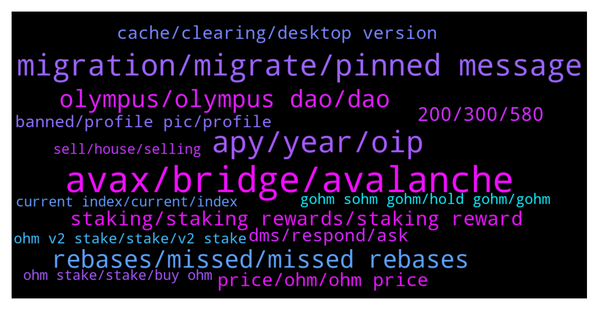

# **@OlympusTG**
 ## Analysis for **2021-12-26** - **2022-01-02**.

---

## 📊 **Basic Stats**

**n_messages_sent**: 5567

---

---

## 🔝 **Top keywords and related messages**

1. **avax, bridge, avalanche**

    @Ap0l1o --- *easiest way would be via traderjoe on avalanche I suppose* **--->** [TG Discussion](https://t.me/OlympusTG/137317)

    @Z --- *Ok I understand this part but now numbers on dashboard are wrong as I should have like near $1k more and if I bridge over to avax network shows I will get even less..so is this right that we lose some funds moving around? Or is there a issue somewhere or am I doing it wrong 😑  Sorry for all questions just want to understand what’s happening* **--->** [TG Discussion](https://t.me/OlympusTG/134998)

    @a320_ali --- *When I try to bridge, it doesn’t let me to switch from AVAX to ETH, its just stuck in “From Eth to Avax”* **--->** [TG Discussion](https://t.me/OlympusTG/137272)

    @Jonno --- *Question then I’ve check that thanks say I now move this to avax and decide to unstake how will that work does it transfer back into standard ohm on avax in my wallet and at same ratio ie I’ll receive more because 0.04 ohm would mean it’s worth less than before migration ?* **--->** [TG Discussion](https://t.me/OlympusTG/131984)

    @Pallas1111 --- *Does it cost much in gas fees to bridge from Eth to Avax?* **--->** [TG Discussion](https://t.me/OlympusTG/137261)

    @H --- *I need to do unstake When I want to convert from Ethereum to avax ?* **--->** [TG Discussion](https://t.me/OlympusTG/133798)

2. **migration, migrate, pinned message**

    @jrobertshaw --- *What is the migration date? thanks* **--->** [TG Discussion](https://t.me/OlympusTG/130993)

    @SMNFT7 --- *Btw anyone here knows on which stage of migration we are currently at?* **--->** [TG Discussion](https://t.me/OlympusTG/129475)

    @mandingo_0 --- *has the migration finished? i heard it hasnt yet* **--->** [TG Discussion](https://t.me/OlympusTG/140077)

    @Keegan --- *When is the migration officially over* **--->** [TG Discussion](https://t.me/OlympusTG/132455)

    @nfwaple --- *yes one transaction to approve and one to migrate, see pinned message* **--->** [TG Discussion](https://t.me/OlympusTG/136245)

    @amkuo --- *where can i see document related this migration? whats is the purpose for this migration* **--->** [TG Discussion](https://t.me/OlympusTG/136120)

3. **apy, year, oip**

    @nfwaple --- *assuming 5280% APY for the entire year and you don't withdraw any of them for an entire year, your total OHM would be 3 OHM x 52.80, but it doesn't make sense to be assuming that APY does not change for one whole year* **--->** [TG Discussion](https://t.me/OlympusTG/140275)

    @vampyren --- *Maybe we should not have done all of it at the same time? like reducing and even talking about apy reduction when price is fast going down and other factors you mention :/* **--->** [TG Discussion](https://t.me/OlympusTG/139812)

    @AllochkaMeow --- *Hello, can anyone suggest high yield APY projects?🙏* **--->** [TG Discussion](https://t.me/OlympusTG/138118)

    @CBMallorca --- *Whats going on …? Its falling más falling … apy Isnt Changing …* **--->** [TG Discussion](https://t.me/OlympusTG/136715)

    @amkuo --- *can you explain halving the APY please, not so familair about it* **--->** [TG Discussion](https://t.me/OlympusTG/136399)

    @Love3425436367564 --- *Knew youd say this. 7000% has been solid for almost a year now. Would be happy with that or even 5000%  More marketing & bonds = this can continue.  Bear market will rebound soon.  Dropping the apy too low is stupid and defeats the point of the project.* **--->** [TG Discussion](https://t.me/OlympusTG/133889)

4. **rebases, missed, missed rebases**

    @Talal107 --- *Guys is it normal to not receive the correct amount from rebase?* **--->** [TG Discussion](https://t.me/OlympusTG/131852)

    @K. --- *Alright, sounds good. thanks for the help. When should we start seeing the rewards? It's accumulating the rebases right?* **--->** [TG Discussion](https://t.me/OlympusTG/130552)

    @onehundredsh0tz --- *Anyone else not receiving their rebase* **--->** [TG Discussion](https://t.me/OlympusTG/128664)

    @nfwaple --- *I am not too sure if you can still get your missed rebases after unstaking...* **--->** [TG Discussion](https://t.me/OlympusTG/137113)

    @cdp279 --- *when you migrate you'll get all rebases that you missed* **--->** [TG Discussion](https://t.me/OlympusTG/130336)

    @nfwaple --- *correct, when you migrate it will be givne back to you, the missed rebases* **--->** [TG Discussion](https://t.me/OlympusTG/130479)

5. **olympus, olympus dao, dao**

    @Wartull --- *Lobis is connected to Olympus yes* **--->** [TG Discussion](https://t.me/OlympusTG/133667)

    @Ap0l1o --- *The difference between Olympus and the other DAOs is that Olympus put it’s money to work, always building something more and improving* **--->** [TG Discussion](https://t.me/OlympusTG/138831)

    @Ap0l1o --- *If the math behind Olympus was not good, there wouldn’t be so many forks behind it* **--->** [TG Discussion](https://t.me/OlympusTG/138961)

    @Al_S1919 --- *what can you say about the LOBIS project? Is it connected somehow to Olympus and why APY is so insane there?* **--->** [TG Discussion](https://t.me/OlympusTG/133652)

    @Ap0l1o --- *multi chain presence of Olympus, lower fees, governance... overall, better access and more possibilities are open* **--->** [TG Discussion](https://t.me/OlympusTG/137273)

    @Ap0l1o --- *the entire market is like that, not just Olympus* **--->** [TG Discussion](https://t.me/OlympusTG/136702)

6. **staking, staking rewards, staking reward**

    @jken123456 --- *Gas fee for staking is 500$... wtf* **--->** [TG Discussion](https://t.me/OlympusTG/136755)

    @DeFiMaximalist --- *not for me but the staking does https://app.olympusdao.finance/#/stake* **--->** [TG Discussion](https://t.me/OlympusTG/131658)

    @crypfern --- *Is there a guide for beginners to enter staking?* **--->** [TG Discussion](https://t.me/OlympusTG/136784)

    @vampyren --- *i know but i like the staking and seeing my holding increase...that's what i mean.* **--->** [TG Discussion](https://t.me/OlympusTG/128614)

    @digitalpallab352 --- *Which on is best for small amount staking* **--->** [TG Discussion](https://t.me/OlympusTG/138658)

    @H --- *When I go to the bridge my coins in staking do not appear* **--->** [TG Discussion](https://t.me/OlympusTG/134085)

7. **200, 300, 580**

    @Cali_millionaire --- *Hey buddy It’s under $300 not $200 Which ain’t gonna happen* **--->** [TG Discussion](https://t.me/OlympusTG/139493)

    @Pewpew91 --- *Then u will love $200 which is coming.* **--->** [TG Discussion](https://t.me/OlympusTG/138966)

    @stacyd82d --- *I bought in Oct at $800. I’m still ahead by a little* **--->** [TG Discussion](https://t.me/OlympusTG/136719)

    @The_Headmaster --- *Well when I was told about it, it was approx $250* **--->** [TG Discussion](https://t.me/OlympusTG/140321)

    @Lasquale --- *It looks like the price will continue to fall. Soon under 300$ 😪* **--->** [TG Discussion](https://t.me/OlympusTG/136671)

    @nfwaple --- *you think I'm not serious? lmfao I did actually 9,9 at $1,000+ might not be $1,200* **--->** [TG Discussion](https://t.me/OlympusTG/128916)

8. **price, ohm, ohm price**

    @A3C10A7FFF97E216C437E8E305F881B7 --- *I wish the price was down so I can buy more ohms* **--->** [TG Discussion](https://t.me/OlympusTG/129909)

    @MW2140 --- *What can the ohmies do to help get the price to increas?* **--->** [TG Discussion](https://t.me/OlympusTG/134740)

    @RichR7 --- *You are missing OHM's price is going down.* **--->** [TG Discussion](https://t.me/OlympusTG/136099)

    @Prince --- *what is your plan everyone? , the price of OHM keep droping* **--->** [TG Discussion](https://t.me/OlympusTG/137661)

    @Zeeshan --- *Me worried about ohm may b price 100 ya zero* **--->** [TG Discussion](https://t.me/OlympusTG/137840)

    @J --- *Price will break 600$ tonight ? Should i buy more ohm in gate.io?* **--->** [TG Discussion](https://t.me/OlympusTG/131354)

9. **dms, respond, ask**

    @Kev --- *Just landed here and I’m getting dms* **--->** [TG Discussion](https://t.me/OlympusTG/132447)

    @clarks76 --- *3 DM’s one helpful two fishing.. 😂* **--->** [TG Discussion](https://t.me/OlympusTG/131325)

    @don0bb --- *I’ve dyord bro dw bout that so what’s your point then* **--->** [TG Discussion](https://t.me/OlympusTG/131377)

    @BongoBoing --- *each message deploys an average of 3 dm’s* **--->** [TG Discussion](https://t.me/OlympusTG/132374)

    @nfwaple --- *no dm in my name didn't you see* **--->** [TG Discussion](https://t.me/OlympusTG/132157)

    @Ap0l1o --- *No, we were awoken by DM-ers.* **--->** [TG Discussion](https://t.me/OlympusTG/134236)

10. **cache, clearing, desktop version**

    @nfwaple --- *clear cache + use desktop version, then try again* **--->** [TG Discussion](https://t.me/OlympusTG/134092)

    @nfwaple --- *clear cache, disconnect reconnect and try again, if you're using mobile try desktop version* **--->** [TG Discussion](https://t.me/OlympusTG/137641)

    @Pulsianhex --- *Clear cache if that is same as blear browser history , i have don done and restarted* **--->** [TG Discussion](https://t.me/OlympusTG/135217)

    @nfwaple --- *then I think it is just the website issue, try clear cache and use desktop version* **--->** [TG Discussion](https://t.me/OlympusTG/133229)

    @Dada --- *I checjed not showing on the Web* **--->** [TG Discussion](https://t.me/OlympusTG/131805)

    @Daniel --- *Cool, let me know the result$* **--->** [TG Discussion](https://t.me/OlympusTG/128809)

11. **banned, profile pic, profile**

    @Ap0l1o --- *If your name and or photo were suspicious you were banned by me.* **--->** [TG Discussion](https://t.me/OlympusTG/134416)

    @layonsan --- *@shogunfx1 could you review mine too, perhaps im autobanned. My username is layonsan* **--->** [TG Discussion](https://t.me/OlympusTG/138391)

    @Ap0l1o --- *Just a fair warning: If it happens again, both of your accounts will be banned.* **--->** [TG Discussion](https://t.me/OlympusTG/134437)

    @nfwaple --- *you're using a default profile pic? it might get autobanned, try using a different one* **--->** [TG Discussion](https://t.me/OlympusTG/138355)

    @yasir --- *So I'm here and not being rude right, is that enough for you to unban me? This is over something dubious and subjective* **--->** [TG Discussion](https://t.me/OlympusTG/134436)

    @Ap0l1o --- *You were banned about a week ago* **--->** [TG Discussion](https://t.me/OlympusTG/134432)

12. **gohm sohm gohm, hold gohm, gohm**

    @Ap0l1o --- *^^ this one is for all of them, not just gOhm* **--->** [TG Discussion](https://t.me/OlympusTG/131475)

    @fpietrosanti --- *I do not fully understood what’s the difference in having gOHM vs. sOHM* **--->** [TG Discussion](https://t.me/OlympusTG/138544)

    @ccryii --- *Because they even read the announcements . gOHm is far better* **--->** [TG Discussion](https://t.me/OlympusTG/138497)

    @Ap0l1o --- *yes, that is the idea behind gOhm* **--->** [TG Discussion](https://t.me/OlympusTG/137940)

    @Ap0l1o --- *If you hold both sOhm and gOhm, then yes.* **--->** [TG Discussion](https://t.me/OlympusTG/139781)

    @Ap0l1o --- *So if you have gOhm, you don’t have to do anything* **--->** [TG Discussion](https://t.me/OlympusTG/136381)

13. **ohm v2 stake, stake, v2 stake**

    @nfwaple --- *buy gOHM and do nothing, or buy OHM v2 and stake them, they both have the same outcome* **--->** [TG Discussion](https://t.me/OlympusTG/132805)

    @currency516 --- *Just seeing all this chat about gOHM and sOHm making sure that buying regular OHM is stakeable* **--->** [TG Discussion](https://t.me/OlympusTG/131800)

    @scardanelli --- *Hey Ohmies, I'm new to OHM (better late than never right?)....Anyway I'm still learning, but I had a few questions: 1) from what I gather it is better to buy gOHM instead of OHM, because you don't have to actually stake gOHM, but it 'stakes' itself just by holding it in your wallet right?* **--->** [TG Discussion](https://t.me/OlympusTG/139929)

    @nfwaple --- *Ohm v2 and stake on the website, or gohm and chill* **--->** [TG Discussion](https://t.me/OlympusTG/131052)

    @nfwaple --- *at the moment, please buy OHM v2 and stake, or buy gOHM directly* **--->** [TG Discussion](https://t.me/OlympusTG/136054)

    @nfwaple --- *why not OHM v2? Not too sure if you can stake OHM v1 and what version of sOHM you get, best to ask in the Discord* **--->** [TG Discussion](https://t.me/OlympusTG/134697)

14. **sell, house, selling**

    @ClickonDefi1 --- *Wanted to sell fast and rekt on there ☹️* **--->** [TG Discussion](https://t.me/OlympusTG/129938)

    @hugothehomeless --- *ok i will sell the house tomorrow* **--->** [TG Discussion](https://t.me/OlympusTG/137297)

    @chittyusername --- *Exactly. Thank you for this. I feel like I'm going to beat the living shit out of the next seller I see on the street.* **--->** [TG Discussion](https://t.me/OlympusTG/139334)

    @CryptoCrazy_TR3 --- *Just sell man we don't mind :)* **--->** [TG Discussion](https://t.me/OlympusTG/139061)

    @JoacoTT --- *I am confused on how to sell (wont now but just wanted to know)* **--->** [TG Discussion](https://t.me/OlympusTG/130573)

    @hugothehomeless --- *yes ser i want to sell house and girlfriend and ape* **--->** [TG Discussion](https://t.me/OlympusTG/137293)

15. **current index, current, index**

    @nfwaple --- *https://twitter.com/dopex_intern/status/1473439395999068162/photo/1  gohm does not increase, number of gohm x current index = number of sohm, current index increases every rebase, you can find current index on the dashboard of the olympus dapp, you can see your equivalent Staked balance in sOHM in the Stake page holding gOHM* **--->** [TG Discussion](https://t.me/OlympusTG/132476)

    @nfwaple --- *you're on the ETH mainnet? you can still see the equivalent amount in the Stake page. gohm does not increase, number of gohm x current index = number of sohm, current index increases every rebase, you can find current index on the dashboard of the olympus dapp, you can see your equivalent Staked balance in sOHM in the Stake page holding gOHM* **--->** [TG Discussion](https://t.me/OlympusTG/129720)

    @nfwaple --- *you can unwrap to more sOHM or understand how gOHM works.   Second pic: https://twitter.com/dopex_intern/status/1473439395999068162/photo/1  gohm does not increase, number of gohm x current index = number of sohm, current index increases every rebase, you can find current index on the dashboard of the olympus dapp, you can see your equivalent Staked balance in sOHM in the Stake page holding gOHM* **--->** [TG Discussion](https://t.me/OlympusTG/133373)

    @nfwaple --- *correct, Second pic: https://twitter.com/dopex_intern/status/1473439395999068162/photo/1  gohm does not increase, number of gohm x current index = number of sohm, gOHM price = OHM price x current index, current index increases every rebase, you can find current index on the dashboard of the olympus dapp, you can see your equivalent Staked balance in sOHM in the Stake page holding gOHM* **--->** [TG Discussion](https://t.me/OlympusTG/137887)

    @nfwaple --- *Second pic: https://twitter.com/dopex_intern/status/1473439395999068162/photo/1  gohm does not increase, number of gohm x current index = number of sohm, gOHM price = OHM price x current index, current index increases every rebase, you can find current index on the dashboard of the olympus dapp, you can see your equivalent Staked balance in sOHM in the Stake page holding gOHM* **--->** [TG Discussion](https://t.me/OlympusTG/138295)

    @nfwaple --- *See second pic bro: https://twitter.com/dopex_intern/status/1473439395999068162/photo/1  gohm or wsohm does not increase, number of gohm x current index = number of sohm, current index increases every rebase, you can find current index on the dashboard of the olympus dapp, you can see your equivalent Staked balance in sOHM in the Stake page holding gOHM* **--->** [TG Discussion](https://t.me/OlympusTG/134150)

